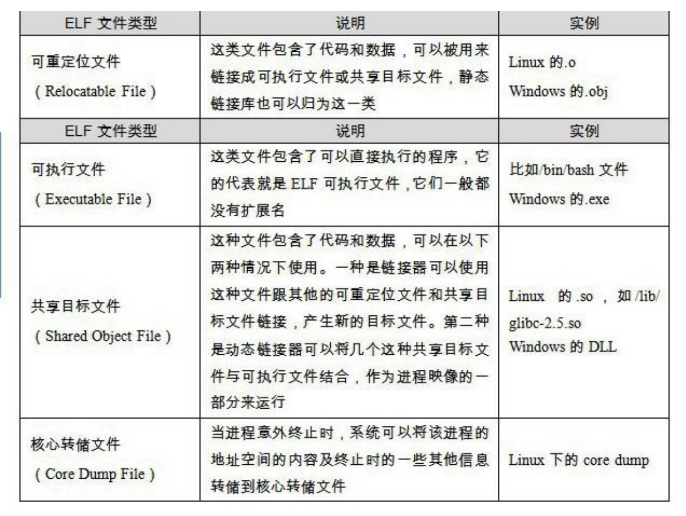
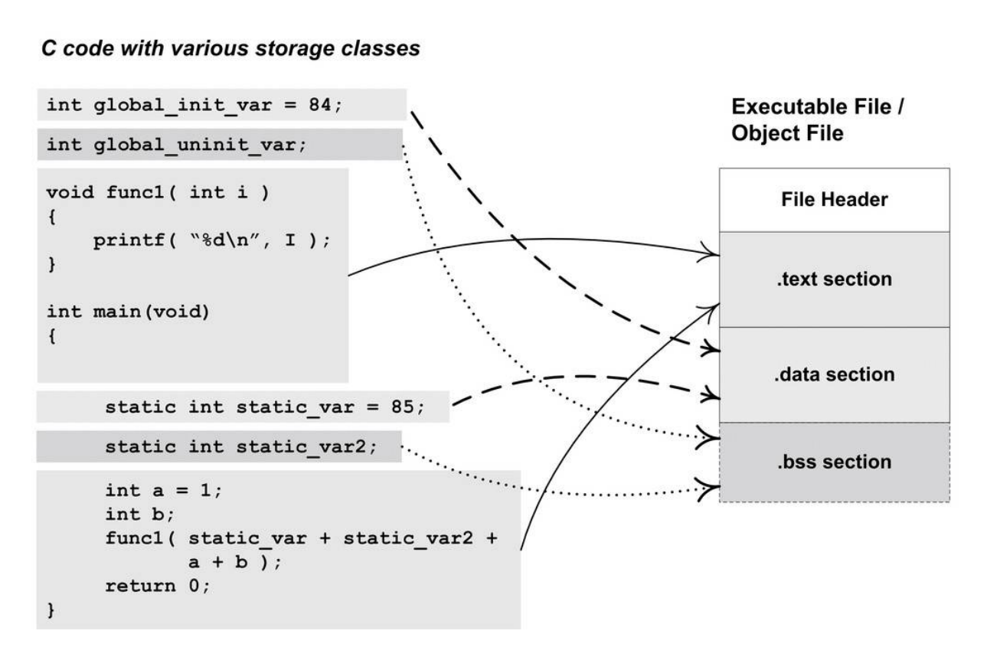
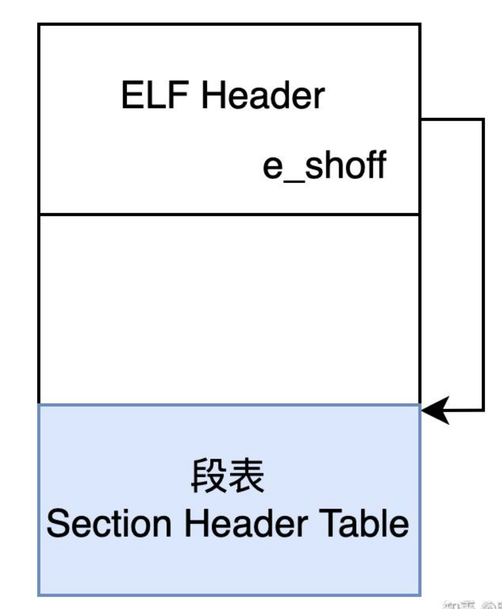
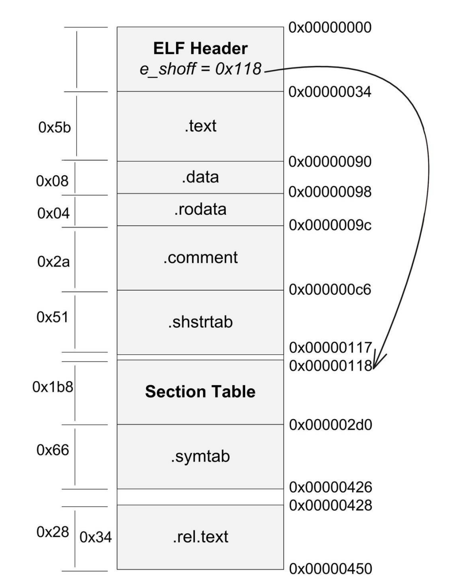
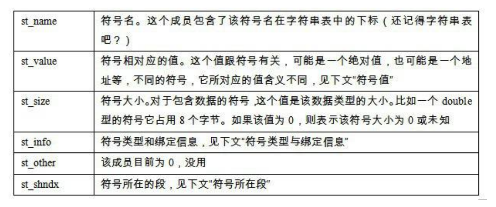
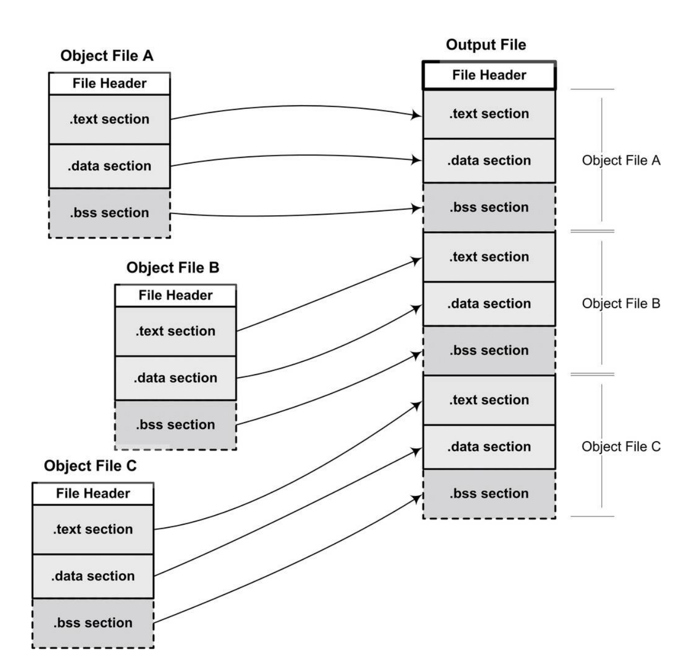
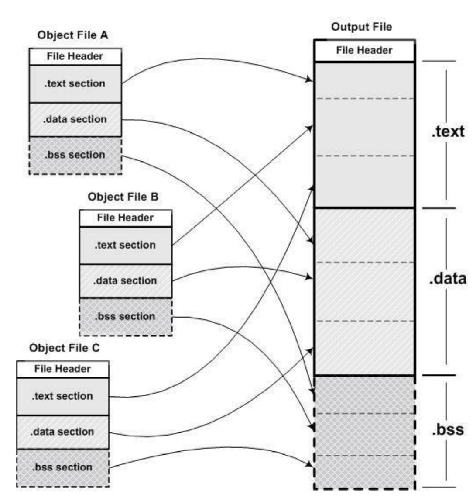
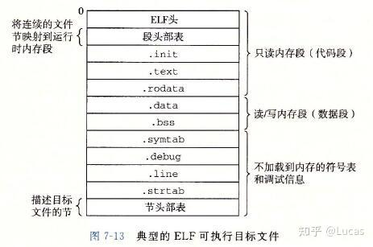
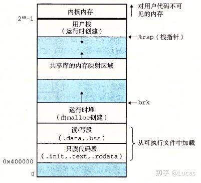
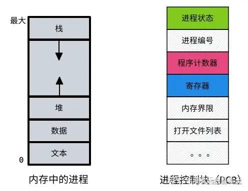

- [OOP三大特性](#oop三大特性)
- [C++编译过程](#c编译过程)
  - [编译单元](#编译单元)
- [目标文件的格式（Linux中的ELF）文件](#目标文件的格式linux中的elf文件)
  - [目标文件是什么样的](#目标文件是什么样的)
  - [链接的接口——符号](#链接的接口符号)
- [静态链接](#静态链接)
  - [空间与地址分配](#空间与地址分配)
- [C++内存分区](#c内存分区)
  - [栈帧](#栈帧)
- [虚拟内存](#虚拟内存)
- [进程，线程，协程](#进程线程协程)
  - [进程](#进程)
  - [线程](#线程)
  - [协程](#协程)
- [线程安全](#线程安全)
- [计网](#计网)
  - [三次握手四次挥手](#三次握手四次挥手)
    - [为什么建立连接需要三次握手而不是两次](#为什么建立连接需要三次握手而不是两次)
    - [为什么断开连接需要四次挥手而不是三次](#为什么断开连接需要四次挥手而不是三次)
  - [TIME\_WAIT](#time_wait)
  - [CLOSE\_WAIT](#close_wait)
  - [TCP和UDP的区别](#tcp和udp的区别)
  - [输入url到看到界面的过程](#输入url到看到界面的过程)
  - [HTTP](#http)
    - [基础概念](#基础概念)
    - [HTTP请求与响应结构](#http请求与响应结构)
    - [HTTP方法](#http方法)
    - [常见的状态码](#常见的状态码)
    - [HTTP版本](#http版本)
    - [HTTP和HTTPS](#http和https)
  - [select, poll, epoll](#select-poll-epoll)
    - [三者区别](#三者区别)
  - [epoll具体过程](#epoll具体过程)
- [数据库](#数据库)
  - [三大范式](#三大范式)
  - [事务](#事务)
    - [事务的四大特性（ACID）](#事务的四大特性acid)
    - [事务的隔离级别](#事务的隔离级别)
  - [索引](#索引)
- [Linux](#linux)
  - [Linux常见命令](#linux常见命令)
- [C++杂项](#c杂项)
  - [sizeof](#sizeof)
    - [为什么要字节对齐](#为什么要字节对齐)
  - [const关键字](#const关键字)
  - [static关键字](#static关键字)
  - [字节序：大端序，小端序和网络字节序](#字节序大端序小端序和网络字节序)
  - [define和inline和typedef](#define和inline和typedef)
  - [explicit](#explicit)
  - [extern](#extern)
  - [extern "C"](#extern-c)
  - [四种强制类型转换](#四种强制类型转换)
    - [static\_cast(expr) 静态类型转换](#static_castexpr-静态类型转换)
    - [dynamic\_cast(expr) – 动态类型转换（运行时检查）](#dynamic_castexpr--动态类型转换运行时检查)
  - [nullptr和NULL的区别](#nullptr和null的区别)
  - [constexpr](#constexpr)
  - [string类](#string类)
  - [指针和引用的区别](#指针和引用的区别)
  - [functional](#functional)
  - [lambda表达式](#lambda表达式)
- [智能指针](#智能指针)
  - [`unique_ptr`](#unique_ptr)
  - [`shared_ptr`](#shared_ptr)
    - [make\_shared](#make_shared)
- [C++ OOP](#c-oop)
  - [虚函数，虚表，虚指针](#虚函数虚表虚指针)
  - [RTTI(Run-Time Type Information, 运行时类型信息)](#rttirun-time-type-information-运行时类型信息)
  - [虚继承](#虚继承)
  - [C++类对象的初始化和析构顺序](#c类对象的初始化和析构顺序)
  - [构造函数析构函数中调用虚函数](#构造函数析构函数中调用虚函数)
  - [构造函数不能是虚函数](#构造函数不能是虚函数)
- [C++模板编程](#c模板编程)
  - [类型模板参数](#类型模板参数)
  - [非类型模板参数](#非类型模板参数)
  - [模板编译](#模板编译)
  - [依赖类型](#依赖类型)
  - [部分特化（偏特化）（Partial Specialization）](#部分特化偏特化partial-specialization)
  - [SFINAE机制（Substitution Failure Is Not An Error）](#sfinae机制substitution-failure-is-not-an-error)
  - [CRTP](#crtp)
- [C++并发编程](#c并发编程)
  - [原子操作（atomic operation）](#原子操作atomic-operation)
  - [CAS(Compare-And-Swap / Compare-And-Set)](#cascompare-and-swap--compare-and-set)
  - [互斥量`std::mutex`](#互斥量stdmutex)
  - [条件变量（`std::condition_variable`）](#条件变量stdcondition_variable)
  - [自旋锁和互斥锁](#自旋锁和互斥锁)
- [SQL](#sql)
  - [数据查询（`SELECT`）](#数据查询select)
  - [数据插入（`INSERT`）更新（`UPDATE`）删除（`DELETE`）](#数据插入insert更新update删除delete)
  - [子查询与连接](#子查询与连接)
- [C++ 哈希表实现](#c-哈希表实现)
  - [插入节点](#插入节点)
  - [删除节点](#删除节点)
  - [常见哈希函数](#常见哈希函数)
    - [字符串哈希函数](#字符串哈希函数)
  - [哈希表和红黑树的比较](#哈希表和红黑树的比较)

# OOP三大特性
封装，继承，多态
1. 多态  
多态（polymorphism）指为不同 **数据类型** 的实体提供统一的 **接口**，或使用一个单一的符号来表示多个不同的类型。

# C++编译过程

C++的编译过程可以分为四步：预处理，编译，汇编和链接

1. 预处理（.ii）  
    ⾸先是源代码⽂件hello.c和相关的头⽂件，如stdio.h等被预编译器cpp预编译成⼀个.i⽂件。对于C++程序来说，它的源代码⽂件的扩展名可能是.cpp或.cxx，头⽂件的扩展名可能是.hpp，⽽预编译后的⽂件扩展名是.ii。

    预处理做的工作如下：
    - 将所有`#define`删除，并展开所有的宏定义。
    - 处理所有条件预编译指令，如`#if, #ifdef, #elif, #else, #endif`
    - 处理`#include`预编译指令，将被包含的文件插入到该预编译指令的位置。注意，这个过程是递归进行的，因为被包含的文件可能还包含其他文件
    - 删除所有注释
    - 添加行号和文件名标识，便于编译时编译器产生调试用的行号信息以及编译时产生错误或警告的行号
    - 保留所有`#pragma`编译器指令，因为编译器需要使用他们
2. 编译（.s）  
    编译过程就是把预处理完的文件进行⼀系列词法分析、语法分析、语义分析及优化后⽣产相应的汇编代码⽂件
3. 汇编（.o）  
    汇编器是将汇编代码转变成机器可以执行的指令，每一个汇编语句都对应一条机器指令
4. 链接  

## 编译单元
C++ 编译单元是每个 `.cpp` 文件连同它 `#include` 的所有头文件展开后形成的完整源文件，是被编译器独立编译的最小单位。

# 目标文件的格式（Linux中的ELF）文件
⽬标⽂件就是源代码编译后但未进⾏链接的那些中间⽂件（Windows的.obj和Linux下的.o），它跟可执⾏⽂件的内容与结构很相似，所以⼀般跟可执⾏⽂件格式⼀起采⽤⼀种格式存储。从⼴义上看，⽬标⽂件与可执⾏⽂件的格式其实⼏乎是⼀样的，所以我们可以⼴义地将⽬标⽂件与可执⾏⽂件看成是⼀种类型的⽂件，在Windows下，我们可以统称它们为PE-COFF⽂件格式。在Linux下，我们可以将它们统称为ELF⽂件。

不光是可执⾏⽂件（Windows的.exe和Linux下的ELF可执⾏⽂件）按照可执⾏⽂件格式存储。动态链接库（DLL，Dynamic LinkingLibrary）（Windows的.dll和Linux的.so）及静态链接库（StaticLinking Library）（Windows的.lib和Linux的.a）⽂件都按照可执⾏⽂件格式存储。它们在Windows下都按照PE-COFF格式存储，Linux下按照ELF格式存储。静态链接库稍有不同，它是把很多⽬标⽂件捆绑在⼀起形成⼀个⽂件，再加上⼀些索引，你可以简单地把它理解为⼀个包含有很多⽬标⽂件的⽂件包。ELF⽂件标准⾥⾯把系统中采⽤ELF格式的⽂件归为如表3-1所列举的4类。

 

## 目标文件是什么样的

 

ELF文件开头是一个“文件头”，描述了整个文件的文件属性，包括文件是否可执行，是静态连接还是动态链接及入口地址，目标硬件，目标操作系统等信息。文件头还包括段表在文件中偏移的字段。段表描述了文件中各个段在文件中的偏移位置以及段的属性等，从段表里面可以得到每个段的所有信息。
 

文件头后面就是每个段的内容。⽐如代码段保存的就是程序的指令，数据段保存的就是程序的静态变量等。

⼀般C语⾔的编译后执⾏语句都编译成机器代码，保存在.text段；已初始化的全局变量和局部静态变量都保存在. data段；未初始化的全局变量和局部静态变量⼀般放在⼀个叫.“bss”的段⾥。我们知道未初始化的全局变量和局部静态变量默认值都为0，本来它们也可以被放在.data段的，但是因为它们都是0，所以为它们在.data段分配空间并且存放数据0是没有必要的。程序运⾏的时候它们的确是要占内存空间的，并且可执⾏⽂件必须记录所有未初始化的全局变量和局部静态变量的⼤⼩总和，记为.bss段。所以.bss段只是为未初始化的全局变量和局部静态变量预留位置⽽已，它并没有内容，所以它在⽂件中也不占据空间。

根据编译器不同可能会有一个只读数据段（.rodata）,用于存储只读数据，如字符串常量"%d/n"，而有些编译器会直接把这个数据放在.data段里面而不做单独的区分。

 

## 链接的接口——符号

在链接中，⽬标⽂件之间相互拼合实际上是⽬标⽂件之间对地址的引⽤，即对函数和变量的地址的引⽤。

⽐如⽬标⽂件B要⽤到了⽬标⽂件A中的函数“foo”，那么我们就称⽬标⽂件A定义（Define）了函数“foo”，称⽬标⽂件B引⽤（Reference）了⽬标⽂件A中的函数“foo”。这两个概念也同样适⽤于变量。每个函数或变量都有⾃⼰独特的名字，才能避免链接过程中不同变量和函数之间的混淆。

在链接中，我们将函数和变量统称为符号（Symbol），函数名或变量名就是符号名（Symbol Name）。

我们可以将符号看作是链接中的粘合剂，整个链接过程正是基于符号才能够正确完成。链接过程中很关键的⼀部分就是符号的管理，每⼀个⽬标⽂件都会有⼀个相应的符号表（Symbol Table），这个表⾥⾯记录了⽬标⽂件中所⽤到的所有符号。每个定义的符号有⼀个对应的值，叫做符号值（Symbol Value），对于变量和函数来说，符号值就是它们的地址。

```cpp
/*
 * SimpleSection.c
 *
 * Linux:
 * gcc -c SimpleSection.c
 *
 * Windows:
 * cl SimpleSection.c /c /Za
 */
int printf( const char* format, ... );
int global_init_var = 84;
int global_uninit_var;
void func1( int i )
{
 printf( "%d\n", i );
}
int main(void)
{
 static int static_var = 85;
 static int static_var2;
 int a = 1;
 int b;
 func1( static_var + static_var2 + a + b );
 return a;
}

```

我们将符号表中所有的符号进行分类，它们可能是下面类型的一种：

- 定义在本目标文件的全局符号,可以被其他目标文件引用。比如SimpleSection.o里面的"func1","main"和"global_init_val"。
- 在本目标文件中引用的全局符号，却没有定义在本目标文件，这一般叫做外部符号（External Symbol），也就是符号引用，也就是SimpleSection.c中的"printf"。
- 段名，这种符号往往由编译器产生，它的值就是该段的起始地址，⽐如SimpleSection.o⾥⾯的“.text”、“.data”等。
- 局部符号，这类符号只在编译单元内可见。比如⽐如SimpleSection.o⾥⾯的“static_var”和“static_var2”。调试器可以使⽤这些符号来分析程序或崩溃时的核⼼转储⽂件。这些局部符号对于链接过程没有作⽤，链接器往往也忽略它们。
- 行号信息，即目标文件指令与源代码中代码行的对应关系。

对于我们来说，最值得关注的就是全局符号，即上面分类中的第一类和第二类。

ELF⽂件中的符号表往往是⽂件中的⼀个段，段名⼀般叫“.symtab”。符号表的结构很简单，它是⼀个Elf32_Sym结构（32位ELF⽂件）的数组，每个Elf32_Sym结构对应⼀个符号。这个数组的第⼀个元素，也就是下标0的元素为⽆效的“未定义”符号。Elf32_Sym的结构定义如下：

```cpp
typedef struct {
    Elf32_Word st_name;
    Elf32_Addr st_value;
    Elf32_Word st_size;
    unsigned char st_info;
    unsigned char st_other;
    Elf32_Half st_shndx;
} Elf32_Sym;
```

 

# 静态链接

当我们有两个⽬标⽂件时，如何将它们链接起来形成⼀个可执⾏⽂件？这个过程中发⽣了什么？这基本上就是链接的核⼼内容：静态链接。在这⼀节⾥，我们将使⽤下⾯这两个源代码⽂件“a.c”和“b.c”作为例⼦展开分析：
```cpp
/*a.c*/
extern int shared;

int main(){
    int a = 100;
    swap(&a, &shared);
}
```

```cpp
/*b.c*/
int shared = 1;

void swap(int *a, int *b){
    *a ^= *b ^= *a ^= *b;
}
```

假设我们程序只有这两个模块"a.c"和"b.c"。首先我们使用gcc将这两个文件分别编译成目标文件"a.o"和"b.o"

经过编译以后我们就得到了“a.o”和“b.o”这两个⽬标⽂件。从代码中可以看到，“b.c”总共定义了两个全局符号，⼀个是变量“shared”，另外⼀个是函数“swap”；“a.c”⾥⾯定义了⼀个全局符号就是“main”。模块“a.c”⾥⾯引⽤到了“b.c”⾥⾯的“swap”和“shared”。我们接下来要做的就是把“a.o”和“b.o”这两个⽬标⽂件链接在⼀起并最终形成⼀个可执⾏⽂件“ab”。

## 空间与地址分配

对于链接器来说，整个链接过程中，它就是将⼏个输⼊⽬标⽂件加⼯后合并成⼀个输出⽂件。那么在这个例⼦⾥，我们的输⼊就是⽬标⽂件“a.o”和“b.o”，输出就是可执⾏⽂件“ab”。我们在前⾯详细分析了ELF⽂件的格式，我们知道，可执⾏⽂件中的代码段和数据段都是由输⼊的⽬标⽂件中合并⽽来的。那么我们链接过程就很明显产⽣了第⼀个问题：对于多个输⼊⽬标⽂件，链接器如何将它们的各个段合并到输出⽂件？或者说，输出⽂件中的空间如何分配给输⼊⽂件？

1. 按序叠加

    一种简单的方案就是将输入的目标文件按次序叠加起来

     

2. 相似段合并
   
    ⼀个更实际的⽅法是将相同性质的段合并到⼀起，⽐如将所有输⼊⽂件的“.text”合并到输出⽂件的“.text”段，接着是“.data”段、“.bss”段等。

     

现在的连接器空间分配的策略基本上都采用上述方案的第二种，使用这种方法的链接器一般都采用一种叫两步链接的方法，也就是说整个链接过程分两步：

1. 第一步：空间与地址分配

    扫描所有的输⼊⽬标⽂件，并且获得它们的各个段的⻓度、属性和位置，并且将输⼊⽬标⽂件中的符号表中所有的符号定义和符号引⽤收集起来，统一放到一个全局符号表。这一步中，链接器将能够获得所有输入目标文件的段长度，并将它们合并，计算出输出文件中各个段合并后的长度和位置，并建立映射关系。

2. 第二步：符号解析与重定位

    使用上面一步中收集到的所有信息，读取输入文件中段的数据，重定位信息，并且进行符号解析与重定位，调整代码中的地址等


# C++内存分区

C++程序运行的过程中大致分为了以下几个区域：代码区，全局/静态存储区，堆区和栈区（地址从低到高）

1. 代码区：  
    代码区 (Code Segment) 也被称为文本段(Text Segment) 或者只读区，主要包括可以执行的文件 ELF (Executable and Linkable Format) 和常量(.rodata)
2. 全局/静态存储区：  
    全局变量和静态变量都存储在全局/静态存储区   
    整个区域可读可写   
    包含以下两个部分：
    - 数据段（.data）  
    用于存放初始化了的全局变量和静态变量  
    存放在此段的数据在程序运行前分配，运行结束后释放  
    有初始化值得全局变量和静态变量存放在这里
    - BSS段（Block Started）
    用于存放未初始化得全局变量和静态变量  
    不占用实际的磁盘空间，只在编译时预留内存空间  
    程序启动时会自动初始化为默认值
3. 堆区（地址从低到高增长）  
    堆区是用于动态内存分配的区域，当使用new（C++）或者malloc（C）分配内存时，分配的内存块就位于堆区  
    堆区内存可以在线程之间共享，多个线程可以访问和使用堆区的相同内存
4. 栈区（地址从高到低增长）  
    栈区是用于实现函数调用和局部变量存储的一种内存区域。在C++中，每当调用一个函数时，系统就会自动在栈区为该函数分配一块内存，称为栈帧。栈帧用于存储函数参数，局部变量以及返回地址  
    在多线程编程中，每个线程都有自己的栈区，栈区的内存是线程私有的，不同线程之间的栈区不共享

可执行文件（ELF）布局:  
 

可执行文件加载到内存后：  
 

## 栈帧

整个栈空间的内存是由操作系统分配的，在此基础上，单个函数调用的栈帧空间是由汇编代码决定的，也就是编译器决定的。

操作系统分配栈是进程层面的，编译器分配栈帧是函数调用层面的。

# 虚拟内存

虚拟内存是一种操作系统技术，让程序看起来有一块连续完整的大内存可用，即使实际物理内存没有这么大，甚至被分成了碎片或被其他进程占用

虚拟内存将程序使用的地址与实际物理内存分离，通过分页等机制进行动态映射和管理

基础机制：地址映射
- 程序使用的是虚拟地址（VA）

- 实际访问的是物理地址（PA）

- 中间通过**页表(Page Table)**进行映射
  - 页表由操作系统内核管理和维护，存放在内核的物理内存中
  - 只有出现缺页异常的时候，才会通过系统调用陷入内核态处理

分页机制（Paging）
- 内存和虚拟内存都被划分为固定大小的页（page），常见是 4KB。

- 虚拟页 -> 物理页，通过页表记录。

- 每个进程有一张自己的页表，操作系统和 CPU 协同管理。

TLB（Translation Lookaside Buffer）
- 一个缓存页表映射的硬件加速器，用来提高地址转换速度。

# 进程，线程，协程

## 进程

进程是程序资源管理的最小单位

通常包括内存资源，IO资源，信号处理等部分

进程的组成有：PCB，程序段，代码段
- PCB（进程控制块，process control block）： 保存进程运行期间相关的数据，是进程存在的唯一标志。
- 程序段： 能被进程调度程序调度到 CPU 运行的程序的代码段。
- 数据段： 存储程序运行期间的相关数据，可以是原始数据也可以是相关结果。

 

操作系统通过虚拟内存技术，把进程空间虚拟空间划分为用户空间和内核空间

将 CPU 切换到另一个进程需要保存当前进程的状态并恢复另一个进程的状态，这一任务称为上下文切换  
上下文是一个进程运行所需的全部状态，包括：  
| 类别         | 说明                                      |
| ---------- | --------------------------------------- |
| CPU 寄存器    | 包括程序计数器（PC）、栈指针（SP）、通用寄存器（eax, ebx...）等 |
| 程序状态字（PSW） | 比如中断标志、条件码                              |
| 内核栈        | 系统调用或中断时保存信息                            |
| 内存映射信息     | 页表、地址空间等                                |
| 文件描述符表     | 进程打开的文件状态                               |
| 信号、调度信息    | 优先级、时间片等                                |

切换进程需要：
- 保存当前进程的PCB（进程控制块）
- 更新页表（切换虚拟内存空间）
- 清空或刷新TLB
- 切换内核栈，用户栈
- 切换文件描述符，信号处理表等进程级资源
- 加载目标进程的上下文

## 线程

线程是CPU使用的基本单元，由线程ID，程序计数器，寄存器集合和栈组成

同一个进程中的多个线程共享该进程中的全部系统资源，如虚拟地址空间，文件描述符和信号处理等。  
但同一个进程中的多个线程有各自的调用栈，寄存器环境，线程本地存储等  

- 调度切换：线程上下文切换比进程上下文切换快
- 进程线程创建
  - 创建进程：需要为进程划分出一块完成的内存空间，有大量的初始操作，比如要把内存分段（堆栈，代码区等）
  - 创建线程：只需要确定PC指针和寄存器的值，并且给线程分配一个栈用于执行程序，同一个进程的多个线程间可以复用栈

```
进程虚拟地址空间
──────────────────────────────
主线程栈（stack）         ← 主线程独立栈
线程1栈                  ← 线程1独立栈（pthread）
线程2栈                  ← 线程2独立栈
共享堆区（heap）
共享数据段、BSS、text段等
──────────────────────────────
```

线程切换时：
- 保存当前线程的上下文（PC，寄存器，栈指针）
- 更新当前线程的TCB（线程控制块）
- 加载目标线程的上下文
- 可能触发用户态到内核态的切换  

不需要：
- 不切换虚拟内存空间（页表不变）

## 协程

协程是一种用户态的轻量级线程，一个线程可以拥有多个协程  
由程序员控制调度（用户态调度），可以在运行中主动“挂起”和“恢复”，无需操作系统介入

你可以把协程想象成“一种更聪明的函数”：

- 普通函数：一进到底，不能暂停。

- 协程函数：可以执行一半，暂停下来，让出 CPU，稍后再从暂停点继续执行。

协程切换时：
- 保存当前协程的寄存器（PC,SP,BP等）
- 恢复目标协程的寄存器
- 切换栈指针（每个协程有自己的独立栈）
- 更新调度器中的当前协程指针  

不需要：
- 不涉及内核调度
- 不切换虚拟地址空间
- 不切换线程/进程资源

# 线程安全

当多个线程同时访问某段代码或数据时，不会产生竞态条件，无论线程如何切换，何时执行，该段代码都能正确地完成操作，数据保持一致，程序行为可以预测

| 方法                                      | 说明                     |
| --------------------------------------- | ---------------------- |
| 互斥锁（mutex）                              | 限制同一时间只有一个线程访问资源       |
| 原子操作（atomic）                            | 无需锁，用 CPU 原子指令实现       |
| 条件变量 / 信号量                              | 控制线程协作或同步              |
| 不共享数据                                   | 使用线程局部存储（Thread Local） |
| 并发容器（如 TBB、C++17 的 `std::shared_mutex`） | 封装了线程安全机制              |

# 计网

## 三次握手四次挥手

1. 三次握手 ---- 连接建立

为了确认双方的接收与发送能力是否正常

| 步骤      | 发起方       | 标志位       | 说明                                                                                 |
| ------- | --------- | --------- | ---------------------------------------------------------------------------------- |
| ① 第一次握手 | 客户端 → 服务端 | SYN       | 客户端发送 SYN 报文，表示希望建立连接，并发送初始序列号 `seq = x`。                                          |
| ② 第二次握手 | 服务端 → 客户端 | SYN + ACK | 服务端收到后回应一个 SYN+ACK 报文，表示同意连接，同时发送服务端初始序列号 `seq = y`，并对客户端 `x` 进行确认（`ack = x + 1`）。 |
| ③ 第三次握手 | 客户端 → 服务端 | ACK       | 客户端收到后，发送 ACK 报文，确认服务端的序列号（`ack = y + 1`）。此时连接建立。                                  |

1. 四次挥手 ---- 连接断开

    目的：TCP是全双工通信，断开连接需要双方都关闭各自的连接方向

| 步骤      | 发起方       | 标志位 | 说明                                            |
| ------- | --------- | --- | --------------------------------------------- |
| ① 第一次挥手 | 客户端 → 服务端 | FIN | 客户端发送 FIN 报文，请求关闭连接（我发完了）。                    |
| ② 第二次挥手 | 服务端 → 客户端 | ACK | 服务端收到后发送 ACK 报文，表示“我知道你要断了”。（这时客户端到服务端的方向已关闭） |
| ③ 第三次挥手 | 服务端 → 客户端 | FIN | 服务端处理完剩余事务后，也发送 FIN 报文，表示“我也发完了”              |
| ④ 第四次挥手 | 客户端 → 服务端 | ACK | 客户端发送 ACK 报文确认，连接彻底断开。                        |

### 为什么建立连接需要三次握手而不是两次

最重要的一点，三次握手保证全双工的通信：
- client发送SYN：我有发送数据的能力
- server发送SYN,ACK：我有接收数据的能力，我也有发送数据的能力
- client发送ACK：我有接收数据的能力

假设只用两次握手：
- 客户端发送 SYN。
- 服务端收到后回复 SYN+ACK，然后认为连接已经建立。

❗问题：客户端可能“无感知”
- 如果客户端此时突然宕机或网络断开，就永远不会发出第三次 ACK。
- 但服务端已经“认为连接建立”，并开始等待客户端发送数据；
- 客户端其实并不知道连接已经建立；
- 服务端资源白白浪费，可能被攻击者利用（称为半连接攻击）。

### 为什么断开连接需要四次挥手而不是三次

因为TCP是全双工通信，断开连接要双方各自关闭自己一侧的连接，每一侧关闭都需要一次`FIN`和一次'ACK'，所以一共需要四步

## TIME_WAIT

TIME_WAIT的两个核心目的：

1. 保证被关闭的一方能被正常关闭从而可靠地终止TCP连接

    如果客户端最后一次ACK报文在网络中丢失了，那么按照TCP可靠性原则，服务端会重发FIN报文  
    如果客户端立刻关闭连接，那就无法再处理这个重发的FIN，将以复位报文段来回应服务器，服务器则认为这是一个错误

2. 保证让迟来的TCP报文段有足够的时间
   
   假设一个连接刚刚关闭，如果我们使用相同的端口号立刻建立一个连接  
   网络上如果还有老连接未送达的旧包，它可能被误认为是新连接的一部分最后导致数据错乱

`TIME_WAIT`状态会占用端口一段时间（通常是2*MSL, MSL=最大报文生存时间），确保旧连接残留的数据都从网络中消失了

## CLOSE_WAIT

CLOSE_WAIT是TCP连接的被动关闭方收到FIN报文之后发送FIN报文之前的状态

表示对方已经关闭连接，但本方还没有关闭

服务端收到FIN报文后还没有调用close()关闭socket时，TCP层就处于CLOSE_WAIT，等待应用处理完再主动关闭

```
       A (主动关闭)                    B (被动关闭)
   -------------------           ---------------------
   ESTABLISHED                  ESTABLISHED
        |                            |
      FIN  -----------------------> |
        |                            |
        |                       (收到FIN，进入CLOSE_WAIT)
        |                            |
        | <--------------------  ACK|
        |                            |
        |                     应用层调用 close()
        |                            |
        | <--------------------  FIN|
        |                            |
      ACK  -----------------------> |
        |                            |
   TIME_WAIT                      CLOSED

```

## TCP和UDP的区别

1. TCP

   - TCP是面向连接的传输，需要通信双方完成三次握手成功后，才能正常通信，四次挥手断开
   - TCP服务是基于流的
     - 基于流的数据没有边界限制，它源源不断地从通信地一端流入另一端。
     - 发送端可以逐个字节地向数据流中写入数据，接收端也可以逐个字节地将它们读出
       - 通过缓冲区管理实现数据流式读取
         - 内核中维护发送缓冲区和接收缓冲区
         - 数据先写入缓冲区，由TCP慢慢分段发送
         - 接收方读socket时，从接收缓冲区按需提取指定长度的数据
   - TCP传输是可靠的
     - 首先，TCP采用发送应答机制，即发送端发送的每个TCP报文都必须得到接收方的应答，才认为这个TCP报文段传输成功
     - 其次，TCP采用超时重传机制，发送端在发送出一个TCP报文段之后启动定时器，如果在定时时间内未收到应答，它将会重发该报文段
     - 最后，因为TCP报文段最终是以IP数据宝发送的，而IP数据报到达接收端可能乱序，重复，所以TCP还会对接收到的报文段重排，整理，再交付给应用层

2. UDP
   
   - UDP时面向无连接的，不需要握手，通信双方不保持一个长久的联系，因此应用程序每次发送数据都要明确指定接收端的地址
   - UDP是基于数据报的， 每个UDP数据报都有一个长度，接收端必须以该长度为最小单位将其所有内容一次性读出，否则数据将被截断
   - UDP是不可靠的传输，不保证数据从发送端正确地传送到目的端，丢包后不会再做重发等弥补操作

## 输入url到看到界面的过程

```
[用户输入] → [URL解析] → [DNS解析] → [TCP连接 + TLS握手] → [发送HTTP请求]
→ [服务器响应] → [浏览器接收响应] → [HTML解析 + 资源加载] → [渲染页面] → [展示给用户]
```

1. URL解析
```
协议:     https
主机名:   www.example.com
端口:     443 (默认)
路径:     /
参数:     ?id=1
片段:     #section1
```

2. DNS解析

    DNS域名系统将主机名转换为服务器的IP地址

    由浏览器发起一个DNS解析请求  
    首先会在本地缓存（比如浏览器缓存，操作系统缓存，hosts文件）中查找结果  
    如果没有找到则递归解析（例如：访问根服务器->访问.cn权威服务器->访问zdns.cn服务器->得到IP地址）

3. 建立TCP连接  
4. 发送HTTP请求  
    请求头构造：
    ```http
    GET / HTTP/1.1
    Host: www.example.com
    User-Agent: Mozilla/5.0 ...
    Accept: text/html,...
    Cookie: session_id=xxx
    ...
    ```
    第一行：  
    - 方法：GET/POST/PUT/DELETE等  
    - 请求路径  
    - 协议版本(HTTP/1.1)
    
    HTTP是应用层协议，将HTTP消息送入传输层，添加TCP头部（可能会根据MSS对数据分片），接着送入网络层，添加IP头部，根据MTU再次对数据分片。接着根据目的IP和路由表规则选择网卡进行数据包的转发，数据包在数据链路层进行传输时需要使用ARP协议获得目的设备MAC地址

5. 服务器处理请求

   服务器收到HTTP请求报文之后处理请求逻辑  
   生成响应内容:
    ```http
    HTTP/1.1 200 OK
    Content-Type: text/html; charset=UTF-8
    Content-Encoding: gzip
    Cache-Control: no-cache
    Set-Cookie: token=abc; HttpOnly
    ...
    <body>...</body>
    ```

6. 浏览器接收响应
   
   根据状态码决定后续处理（200/301/404/500）

7. 渲染引擎渲染界面

## HTTP

HTTP是Hyper Text Transfer Protocol（超文本传输协议）的缩写。  
用于从服务器传输超文本到本地浏览器的传输协议

---

### 基础概念
   - HTTP是应用层协议，底层依赖TCP
   - 客户端发起请求，服务器返回响应
   - 通过URL唯一标识资源

---

### HTTP请求与响应结构  
    请求结构：
    ```http
    GET /index.html HTTP/1.1
    Host: www.example.com
    User-Agent: Mozilla/5.0
    Accept: text/html
    ...
    ```
    - 请求行：方法，路径，HTTP版本
    - 请求头：描述客户端信息，传输偏好，身份验证等
    - 空行：分隔请求头和请求体
    - 请求体：POST/PUT请求中可携带数据（JSON，表单，文件等）

    响应结构：  
    ```http
    HTTP/1.1 200 OK
    Content-Type: text/html
    Content-Length: 1234
    Set-Cookie: token=abc; HttpOnly
    ...

    <html>...</html>
    ```
    - 状态行：协议版本，状态码，状态文本
    - 响应头：类型，长度，cookie等信息
    - 空行
    - 响应体：HTML页面，JSON，图片等

----

### HTTP方法

| 方法      | 描述                   |
| ------- | -------------------- |
| GET     | 获取资源（幂等）             |
| POST    | 提交数据（表单/JSON），可能改变状态 |
| PUT     | 更新资源（幂等）             |
| DELETE  | 删除资源（幂等）             |
| HEAD    | 类似 GET，但无响应体         |
| OPTIONS | 查询支持的请求方法            |
| PATCH   | 局部更新                 |

   - Get: 向指定的资源发出显示请求。使用GET方法应该只用在读取数据
   - HEAD：和GET方法一样，都是向服务器发出指定资源的请求，只不过服务器不传回资源的文本部分（无响应体），在不获取实际资源内容的前提下，向服务器请求该资源的“元信息”（响应头）。用于 探测资源是否存在、获取其元信息，而不需要下载整个资源内容。
   - POST: 向指定资源提交数据，请求服务器进行处理。数据被包含在请求文本中。这个请求可能会创建新的资源或修改现有资源（不幂等）
   - PUT：向指定资源位置上传其最新内容，只更新内容而不创建内容（幂等）
    
| 方法   | 请求       | 最终状态  | 幂等性 |
| ---- | -------- | ----- | --- |
| PUT  | 把资源设成 X  | 永远是 X | ✅   |
| POST | 加一个新资源 X | 每次多一个 | ❌   |

   - DELETE：请求服务器删除Request-URI所标识的资源。
   - TRACE: 回显服务器收到的请求，主要用于测试或诊断
   - OPTIONS： 这个方法可使服务器传回该资源所支持的所有HTTP请求方法。用"*"来代替资源名称，向Web服务器发送OPTIONS请求，可以测试服务器功能是否正常运作。

----

### 常见的状态码

| 状态码     | 含义    | 描述                                          |
| ------- | ----- | ------------------------------------------- |
| **1xx** | 信息状态码    | 接收中，继续处理                                    |
| **2xx** | 成功状态码    | 200 OK：成功；201 Created：已创建                   |
| **3xx** | 重定向状态码   | 301 永久重定向，302 临时重定向                         |
| **4xx** | 客户端错误状态码 | 400 Bad Request，404 Not Found，403 Forbidden |
| **5xx** | 服务器错误状态码 | 500 Internal Server Error，502 Bad Gateway   |

1. 1xx信息状态码

| 状态码                         | 含义          | 说明                             |
| --------------------------- | ----------- | ------------------------------ |
| **100 Continue**            | 继续          | 客户端应继续请求，服务器已收到请求头             |
| **101 Switching Protocols** | 协议切换        | 服务器同意客户端协议转换请求（如升级到 WebSocket） |
| **102 Processing**          | 处理中（WebDAV） | 表示服务器正在处理，不是最终响应               |

2. 2xx成功状态码

| 状态码                                   | 含义    | 说明                           |
| ------------------------------------- | ----- | ---------------------------- |
| **200 OK**                            | 成功    | 请求成功并返回响应                    |
| **201 Created**                       | 已创建   | 请求成功，服务器新建了资源（常用于 POST/PUT）  |
| **202 Accepted**                      | 已接受   | 请求已接收但未处理完成（异步操作）            |
| **203 Non-Authoritative Information** | 非授权信息 | 返回的信息来自第三方而非原始服务器            |
| **204 No Content**                    | 无内容   | 请求成功但响应体为空（常用于 PUT 或 DELETE） |
| **205 Reset Content**                 | 重置内容  | 告诉客户端重置视图（如清空表单）             |
| **206 Partial Content**               | 部分内容  | 处理了范围请求（如用于视频分段加载）           |

3. 3xx重定向状态码

重定向是指服务器接收到请求后，告诉客户端到另一个URL获取资源，即资源已搬家。客户端浏览器收到重定向状态码和`Location`头后，会自动向新地址再次发起请求

例如：
- 客户端请求：
```http
GET /old-page HTTP/1.1
Host: example.com
```

- 服务器响应：
```http
HTTP/1.1 301 Moved Permanently
Location: https://example.com/new-page
```

- 客户端自动重定向到新地址：
```http
GET /new-page HTTP/1.1
Host: example.com
```

| 状态码                        | 含义            | 说明                             |
| -------------------------- | ------------- | ------------------------------ |
| **300 Multiple Choices**   | 多种选择          | 返回多个资源（很少用）                    |
| **301 Moved Permanently**  | 永久重定向         | 资源已永久移动，Location 头指向新地址（SEO友好） |
| **302 Found**              | 临时重定向         | 资源临时移动，客户端应继续使用原地址（最常用）        |
| **303 See Other**          | 查看其它地址        | 用于 POST 后重定向到 GET              |
| **304 Not Modified**       | 未修改           | 客户端缓存有效，使用本地副本                 |
| **307 Temporary Redirect** | 临时重定向（保留请求方法） | 和 302 类似，但方法不变                 |
| **308 Permanent Redirect** | 永久重定向（保留请求方法） | 和 301 类似，但方法不变                 |

- 301 永久重定向：
  - 表示资源已经永久移动到新的地址，旧地址不再有效
  - 客户端应将未来所有请求定向到新地址
  - 常用于：
    - 网站改版
    - 更换域名
    - 页面结构重组


- 302 临时重定向：
  - 表示资源临时移动，以后可能还会用回原地址
  - 浏览器会继续访问新地址，但搜索引擎仍保留旧地址索引
  - 通常用于：
    - 用户未登录时跳转到登录页
    - A/B测试（将部分用户临时定向到不同版本）
    - 临时维护重定向

**注：** 大部分浏览器的301和302重定向会把`POST`请求变成`GET`请求再重定向，如果要保留原方法应该用：
  - 307 Temporary Redirect（临时，方法不变）
  - 308 Permanent Redirect（永久，方法不变）

4. 4xx客户端错误状态码

| 状态码                                   | 含义       | 说明                             |
| ------------------------------------- | -------- | ------------------------------ |
| **400 Bad Request**                   | 错误请求     | 请求格式错误，服务器无法处理                 |
| **401 Unauthorized**                  | 未授权      | 需要认证（常配合 `WWW-Authenticate` 头） |
| **403 Forbidden**                     | 禁止访问     | 请求合法但服务器拒绝响应（权限不足）             |
| **404 Not Found**                     | 未找到      | 请求的资源不存在                       |
| **405 Method Not Allowed**            | 方法不被允许   | 请求方法对该资源无效                     |
| **406 Not Acceptable**                | 不可接受     | 服务器无法提供符合客户端 Accept 条件的响应      |
| **407 Proxy Authentication Required** | 需要代理认证   | 客户端需经代理认证                      |
| **408 Request Timeout**               | 请求超时     | 客户端请求超时未发完                     |
| **409 Conflict**                      | 冲突       | 请求与资源当前状态冲突（如并发写冲突）            |
| **410 Gone**                          | 永久删除     | 资源被永久删除（比 404 更明确）             |
| **411 Length Required**               | 需要长度     | 必须提供 `Content-Length` 头        |
| **413 Payload Too Large**             | 请求体过大    | 请求体超过服务器限制                     |
| **414 URI Too Long**                  | URL 太长   | URI 超过服务器可处理的长度                |
| **415 Unsupported Media Type**        | 不支持的媒体类型 | 服务器无法解析请求体格式                   |
| **429 Too Many Requests**             | 请求太多     | 触发限流机制（如爬虫、攻击）                 |


5. 5xx服务端错误状态码

| 状态码                                | 含义           | 说明                |
| ---------------------------------- | ------------ | ----------------- |
| **500 Internal Server Error**      | 服务器错误        | 服务器内部错误，无法完成请求    |
| **501 Not Implemented**            | 未实现          | 服务器不支持请求方法        |
| **502 Bad Gateway**                | 网关错误         | 作为网关/代理的服务器接收无效响应 |
| **503 Service Unavailable**        | 服务不可用        | 服务器暂时过载或维护        |
| **504 Gateway Timeout**            | 网关超时         | 上游服务器未及时响应        |
| **505 HTTP Version Not Supported** | 不支持的 HTTP 版本 | 不支持请求中使用的 HTTP 版本 |


常见状态码：

| 状态码     | 含义       |
| ------- | -------- |
| **200** | 成功       |
| **301** | 永久重定向    |
| **302** | 临时重定向    |
| **304** | 使用缓存     |
| **400** | 错误请求     |
| **401** | 未授权（需登录） |
| **403** | 禁止访问     |
| **404** | 页面不存在    |
| **500** | 服务器错误    |
| **502** | 网关错误     |
| **503** | 服务器维护中   |

### HTTP版本

1. HTTP/0.9  
    最简单的HTTP，只支持GET请求

    | 特点   | 内容                   |
    | ---- | -------------------- |
    | 支持方法 | 仅 `GET`              |
    | 报文格式 | 没有请求头、响应头            |
    | 响应体  | 只返回 HTML（纯文本）        |
    | 缺点   | 无法传递元数据，不能处理多媒体或复杂交互 |


2. HTTP/1.0  
   引入了请求头和响应头，可以传输多种类型的数据

    | 特点    | 内容                     |
    | ----- | ---------------------- |
    | 支持方法  | `GET`、`POST`、`HEAD`    |
    | 请求/响应 | 支持头部字段（如 Content-Type） |
    | 连接管理  | 每个请求都需要重新建立 TCP 连接     |
    | 缺点    | 无法复用连接，延迟高，带宽利用率低      |

3. HTTP/1.1  
   对于HTTP/1.0，每个HTTP请求都会建立新的TCP连接，开销大  
   为了解决这个问题，HTTP/1.1引入了`Connection:keep-alive`，连接可以复用，大幅提高性能

    | 特点              | 内容                                       |
    | --------------- | ---------------------------------------- |
    | 连接复用            | 默认开启 `Connection: keep-alive`，复用 TCP 连接  |
    | 分块传输编码          | `Transfer-Encoding: chunked`，边传边生成（如流媒体） |
    | 管线化（pipelining） | 支持多个请求同时发送（但响应仍需按顺序返回）                   |
    | 新方法             | 增加 `PUT`、`DELETE`、`OPTIONS` 等            |
    | Host 头          | 支持虚拟主机，多个域名共享一个 IP                       |

4. HTTP/2.0  
   HTTP/1.1是基于文本的协议  
   而HTTP/2是基于帧的二进制协议，整个消息会被拆分为多个帧：
   - Headers Frame: 包含头部
   - Data Frame: 包含实际数据
   - 所有帧通过流编号被组织成多个逻辑“流”（stream）

    | 特性     | HTTP/1.1      | **HTTP/2**        |
    | ------ | ------------- | ----------------- |
    | 协议格式   | 文本            | ✅ 二进制             |
    | 多路复用   | ❌ 无（队头阻塞）     | ✅ 有（并发无阻塞）        |
    | 请求顺序要求 | 串行            | 并行（任意顺序）          |
    | 头部压缩   | ❌ 每次重复发送      | ✅ 使用 HPACK 压缩     |
    | 服务器推送  | ❌ 不支持         | ✅ 可以主动推送资源        |
    | 连接使用   | 每个域名多个 TCP 连接 | 一个 TCP 连接多流并发     |
    | 加密要求   | 可明文（HTTP）     | 通常使用 TLS（虽然协议不强制） |

5. HTTP/3.0
    使用QUIC协议（基于UDP）

    | 特点     | 内容                                    |
    | ------ | ------------------------------------- |
    | 传输层    | 改为基于 UDP 的 QUIC 协议                    |
    | 多路复用   | 彻底避免阻塞：每个请求都有独立流                      |
    | 建立连接快  | 使用 0-RTT 或 1-RTT 握手，TLS 加密内建，**握手更快** |
    | 内建 TLS | 不再分层进行加密，QUIC 本身就是加密传输                |

---

### HTTP和HTTPS

HTTP是明文传输，所有数据直接暴露在网络上

HTTPS在HTTP上加入了SSL/TLS协议，实现数据加密传输  
HTTPS在建立连接前会多一层SSL/TLS握手过程
- 服务器提供数字证书
- 客户端验证证书合法性
- 双方协商加密算法与密钥

---

## select, poll, epoll

### 三者区别

1. `select`
   
   - 使用一个固定长度的数组（位图）来保存fd
   - 每次调用时都需要把fd集合从用户态拷贝到内核态
   - 支持的最大文件描述符数量有限（通常为1024）
   - 查找fd的过程是线性遍历O(n)

2. `poll`

    - 用一个结构体数组`pollfd[]`保存所有的fd，不再受fd数量限制
    - 每次调用仍需将整个数组从用户态拷贝到内核态
    - 每次遍历所有fd，需要O(n)

3. `epoll`

    - 事件驱动机制，不是遍历所有fd
    - 无拷贝损耗，fd注册时就已经在内核态保存

## epoll具体过程

1. 使用`epoll_create`创建epoll对象

    ```c
    int epfd = epoll_create(0); // 创建一个 epoll 实例，返回 epoll 文件描述符
    ```

    - 创建一个内核对象`struct eventpoll`
    - 返回一个fd，本质是这个对象的引用

2. 使用`epoll_ctr`向内核对象epoll注册/修改/删除对应的事件

    ```c
    epoll_ctl(epfd, EPOLL_CTL_ADD, sockfd, &event);
    ```

    - 将`sockfd`注册到`epfd`中监听
    - 具体的内核处理过程：将`sockfd`加入到`eventpoll`的红黑树中（用于快速查找）

3. 使用`epoll_wait`等待就绪事件发生

    ```c
    int n = epoll_wait(epfd, events, maxevents, timeout);
    ```

    - 检查是否有事件到达
    - 如果没有就睡眠等待
    - 如果有，从就绪链表中将就绪的事件信息拷贝到`events`数组中

在内核的`struct eventpoll`结构中，有两个关键成员
```c
struct eventpoll {
    struct rb_root rbr;     // 红黑树：注册的所有 fd
    struct list_head rdlist; // 链表：就绪的 fd
    ...
};
```

| 名称       | 作用   | 说明                                 |
| -------- | ---- | ---------------------------------- |
| `rbr`    | 红黑树  | 所有注册过的 fd 和其监听事件信息（用于 `epoll_ctl`） |
| `rdlist` | 就绪链表 | 所有当前已就绪的 fd（用于 `epoll_wait` 直接返回）  |

# 数据库

## 三大范式

1. 第一范式：列原子性  
   
   每个字段只能有一个值，不可拆分，表中所有列都必须是原子属性

2. 第二范式：消除部分依赖

    表中所有非主属性完全依赖于主键，不能只依赖主键的一部分

3. 第三范式：消除传递依赖

    非主属性之间不能相互依赖


## 事务

事务是数据库管理系统中的一个基本单位，用于保证多个数据库操作要么全部执行成功，要么全部不执行，从而保证数据的一致性和完整性

事务是指一组操作序列，这些操作要么全部成功提交，要么出错时全部回滚，目的是保证数据库的数据处于一致正确的状态

### 事务的四大特性（ACID）

1. 原子性（Atomicity）
   - 一个事务中的所有操作要么全部完成，要么全部不完成
   - 如果在执行过程中发生错误，事务必须回滚，恢复到初始状态

2. 一致性（Consistency）
   - 事务执行前后，数据库必须从一个一致性状态变换到另一个一致性状态

3. 隔离性（Isolation）
   - 多个事务并发执行时，彼此之间不应相互干扰

4. 持久性(Durability)
   - 一旦事务提交，数据就应该被永久保存在数据库中，即使系统崩溃也不丢失

### 事务的隔离级别

为什么需要隔离级别

多个事务同时对数据库操作时，可能会产生并发问题，主要包括：

| 异常类型                           | 描述                                    |
| ------------------------------ | ------------------------------------- |
| **脏读（Dirty Read）**             | 一个事务读取了另一个事务**尚未提交**的数据               |
| **不可重复读（Non-Repeatable Read）** | 一个事务中两次读到同一行数据的值不一致（因为被其他事务修改并提交）     |
| **幻读（Phantom Read）**           | 一个事务中两次相同条件的查询返回的结果集行数不同（因为其他事务插入了新行） |


隔离级别：

| 隔离级别             | 能否脏读 | 能否不可重复读 | 能否幻读 |
| ---------------- | ---- | ------- | ---- |
| Read Uncommitted（读未提交） | ✅可能  | ✅可能     | ✅可能  |
| Read Committed（读已提交）   | ❌避免  | ✅可能     | ✅可能  |
| Repeatable Read（可重复读）  | ❌避免  | ❌避免     | ✅可能  |
| Serializable（串行化）    | ❌避免  | ❌避免     | ❌避免  |

## 索引

数据库中的索引（Index），就像书的目录一样，是为了加快查询速度而建立的一种辅助数据结构。

没有索引：查找数据时只能全表扫描（效率低）  
有了索引：可以像查字典一样快速定位数据（效率高）

索引的底层结构是B+树
- 所有数据都存在叶子节点中，按主键顺序排列
- 非叶子节点只存储索引（key），不存储实际数据
- 支持范围查找

# Linux

## Linux常见命令

- lscpu：用于查询CPU的配置，比如：
  - CPU(s): 总的逻辑核心数
  - Core(s) per socket): 每个物理 CPU 的核心数
  - Socket(s): 物理 CPU 数量
  - Thread(s) per core: 是否启用超线程

---

- top: 实时监控系统运行状态和进程资源占用情况
  - 第一部分：系统总览
    - load average: 最近1，5，15分钟的系统负载平均值（越接近CPU核心数越正常）
    - Task：进程数量
    - %CPU：CPU使用率
      - us：用户态占用
      - sy：内核态占用
      - id：空闲
      - wa：等待IO
    - Mem/Swap：内存和交换分区使用情况
  - 第二部分：进程列表
    - 包含以下列：
      - PID：进程号
      - USER：进程所属用户
      - %CPU：CPU占用率
      - %MEM：内存占用率
      - TIME+：CPU占用的累计时间
      - COMMAND：进程启用的命令

  - 常用快捷键：
    | 键   | 功能               |
    | --- | ---------------- |
    | `P` | 按 CPU 使用率排序（默认）  |
    | `M` | 按内存使用率排序         |
    | `T` | 按运行时间排序          |
    | `k` | 终止一个进程（输入 PID）   |
    | `q` | 退出 `top`         |
    | `1` | 显示每个 CPU 核心的使用情况 |

---

- netstat: 用于显示网络相关的各种信息

    | 命令           | 说明                      |
    | ------------ | ----------------------- |
    | `netstat -a` | 显示所有连接（包括监听 + 已建立连接）    |
    | `netstat -t` | 显示 TCP 连接               |
    | `netstat -u` | 显示 UDP 连接               |
    | `netstat -l` | 显示监听状态的服务               |
    | `netstat -p` | 显示每个连接对应的程序名（需要 root）   |
    | `netstat -n` | 显示 IP 地址和端口号（不解析主机名）    |
    | `netstat -r` | 显示路由表                   |
    | `netstat -i` | 显示网络接口列表和统计信息           |
    | `netstat -s` | 显示协议统计信息（如 TCP、UDP 错误数） |

# C++杂项

## sizeof

1. 指针大小取决于处理器位数，32位的为4 bytes(32 bits), 64位的为8 bytes(64bits).
2. `数组作为函数参数时会退化为指针`，大小要按指针的计算:
```cpp
int func(char array[]) {
    printf("sizeof=%d\n", sizeof(array));
    printf("strlen=%d\n", strlen(array));
}

int main() {
    char array[] = "Hello World";
    printf("sizeof=%d\n", sizeof(array));
    printf("strlen=%d\n", strlen(array));
    func(array);
}
```
结果为：
```
sizeof=12
strlen=11
sizeof=8
strlen=11
```
数组退化：在 C++ 中，数组在作为函数参数时会退化为指向其首元素的指针。

但是，当数组直接作为 sizeof 的参数时，它不会退化，`因为 sizeof 是编译器在编译期间计算的结果`，这个时候编译器是有信息知道数组的大小。

数组引用做参数：
```cpp
#include <iostream>
#include <cstring>
template <typename T, std::size_t N>
void printSizeAndLength(const T (&arr)[N]) {
    std::cout << "Size of arr in function: " << sizeof(arr) << std::endl; // 计算数组的大小
    std::cout << "Length of arr: " << strlen(arr) << std::endl; // 计算字符串的长度
}
int main() {
    char str[] = "Hello, world!";
    std::cout << "Size of str in main: " << sizeof(str) << std::endl; // 计算整个字符数组的大小
    printSizeAndLength(str);
}
```
3. struct 结构体要考虑字节对齐
   
   **注：** 空结构体的大小为1：

    C++规定：空结构体也必须有独一无二的地址，所以它的大小是1字节。
    为了保证每个对象地址不同，C++标准规定：空结构体大小至少是1字节，即使它里面什么成员都没有。

    这1字节其实没啥内容，只是为了占位。

    (byte是最小的内存寻址单元)

    - 结构体对齐  
        1. 每个成员变量的地址必须是它自己类型大小的整数倍
        2. 整个结构体的大小必须是最大对齐要求的整数倍
        
        例如：
        ```cpp
        struct A {
            char a;  // 1字节
            int b;   // 4字节
            char c;  // 1字节
        };
        ```
        地址偏移 | 成员 | 大小 | 说明
        |-|-|-|-|
        0 | a | 1字节 | 正常放置
        1-3 | 填充(padding) | 3字节 | 为了让 b 4字节对齐
        4-7 | b | 4字节 | 正确对齐了
        8 | c | 1字节 | 放置 c
        9-11 | 填充(padding) | 3字节 | 让整体大小是最大对齐（4字节）的倍数

        ```cpp
        struct B {
            char a;  // 1字节
            char b;  // 1字节
            int c;  // 4字节
        };
        ```
        此时这个结构体的大小为8bytes，因为只需要在b后面填充2bytes就能满足条件

        ```cpp
        struct C{
            char a;
            char b;
            int c;
            std::vector<int> d;
        }
        ```
        此时这个结构体大小为32，对于vector d，vector中包含了一个指针，size(unsigned long, 8 bytes)和capacity(unsigned long, 8 bytes)。所以vector总大小为24 bytes，并且要求8字节对齐，在这个例子中不需要填充。所以最后的大小为1 + 1 + 2（填充的字节） + 4 + 24 = 32

        **注：** 编译优化选项（如：`-O1, -O2, -O3`）并不会调整结构体成员的顺序来优化结构体大小。
    - union对齐
        联合体的对齐边界取决于其最大对齐边界的成员。联合体的大小等于其最大大小的成员，因为联合体的所有成员共享相同的内存空间。
    - 对齐属性
        在 C++11 及更高版本中，可以使用 `alignas` 关键字为数据结构或变量指定对齐要求。这个命令是对某个类型或者对象生效的。例如，`alignas(16) int x`; 将确保 x 的地址是 16 的倍数。

### 为什么要字节对齐
1. CPU架构要求：  
   有些平台每次读取都是从偶数地址开始。如果一个 int 类型（假设为 32 位系统）存储在偶数地址开始的位置，那么一个读周期就可以读取这 32 位。但如果存储在奇数地址开始的位置，则需要两个读周期，并将两次读取的结果的高低字节拼凑才能得到这 32 位数据。显然这会显著降低读取效率。

2. 内存访问速度更快：  
   现代CPU访问内存通常是以块（cache line）为单位读取的，比如一次取64字节。如果数据对齐了，那么一个变量的访问可以一次内存读取就拿到。如果未对齐，CPU可能需要访问两次内存（跨cache line取数据），导致访问变慢。

许多计算机系统对基本数据类型的合法地址做出了一些限制，要求某种类型对象的地址必须是某个值 K(通常是2，4或8) 的倍数 这种对齐限制简化了形成处理器和内存系统之间接口的硬件设计例如，假设一个处理器总是从内存中取8个字节节，则地址必须为8的倍数 如果我们能保证将所有的 double 类型数据的地址对齐成8的倍数，那么就可以用一个内存操作来读或者写值了。否则，我们可能需要执行两次内存访问，因为对象可能
被分放在两个8字节内存块中。  

无论数据是否对齐， x86-64 硬件都能正确工作。不过， Intel 还是建议要对齐数据以提高内存系统的性能。对齐原则是任何K字节的基本对象的地址必须是K的倍数。

## const关键字
1. 修饰变量
2. 修饰函数参数  
   **注：** 修饰普通参数并不能表示不同的参数来函数重载。只有const修饰指针或者引用的时候才能表示不同参数用于函数重载  
   例如：
   ```cpp
   int abc(int a){

   }

   int abc(const int a){

   }    //会报错

   int cba(int* a){

   }

   int cba(const int* a){

   }    //不会报错
   ```
   对于传值参数（比如int，char，double），const是无意义的。
   因为：传值参数本来就是拷贝一份，函数体内部怎么改都不影响外面的实参。

    所以编译器认为：int和const int是一样的类型！

    在指针或引用时，const是有语义差异的，编译器允许重载！

3. 修饰函数返回值，表示函数的返回值为只读，不能被修改。
4. 修饰指针或引用
5. 修饰成员函数，表示该函数不会修改对象的状态

## static关键字
存储在静态内存区而不在栈上
1. 在函数内部修饰局部变量：  
    修饰的变量只初始化一次，生命周期从程序开始到结束。
2. 在类中修饰成员变量和成员函数
   - 静态成员变量  
    所有对象共享一份变量  
    内存所在位置在所有对象之外，通常存储在全局/静态存储区  
    程序开始时分配，结束时释放  
    这个变量只能在类外初始化，不能类内初始化  
    在C++17之后支持inline static成员变量在类内初始化
    - 静态成员函数  
        可以在没有对象的情况下调用，不能访问非静态成员变量或者函数（因为没有`this`指针）
3. 在文件作用域中声明全局变量或函数  
   **注：** static 限制变量/函数的作用域只在当前编译单元（.cpp文件）内。外部其他 .cpp 文件 不能链接访问这个变量或函数。

## 字节序：大端序，小端序和网络字节序

- 大端序  
  高位字节存储在低地址处，低位字节存储在高地址处。
  在网络传输中，通常使用大端字节序，所以大端序也称为网络字节序。
- 小端序
  低位字节存储在低地址处，高位字节存储在高地址处。

## define和inline和typedef

1. define  
    一般用于定义宏（macro），主要有两种用途：
    - 定义常量
    - 创建宏函数

    无论哪种都是用于在编译时替换文本，也就是 `define 实际上只是做文本的替换`

2. inline  
    inline只是建议！  
    编译器可以选择忽略你的建议，它可以根据自己的优化决策决定是否真的内联。

    即使不写inline，编译器也可能自动内联小的函数。

    即使写了inline，编译器也可能不内联大的复杂函数。

    所以实际上，`inline更多地是"允许"多处定义函数，而不是强制性能优化。`

    在C++中，inline通常用于在头文件中定义一个简短的函数
    
    通常，C++要求：

    - 函数声明（头文件 .h）

    - 函数定义（源文件 .cpp）

    但是如果函数很小，比如一个简单的getter函数，我们希望直接在头文件里写定义。
    这时，需要加inline，否则会出现多重定义错误（ODR violation：One Definition Rule）。

3. typedef  
    typedef 是一种类型定义关键字，用于为现有类型创建新的名称。  
    与宏定义不同，typedef 是在编译阶段处理的，有更严格的类型检查。（宏定义是在预处理的时候进行文本替换）

## explicit

explicit 是 C++ 里`专门用来防止隐式类型转换`的一种关键字。

C++允许单参数构造函数被用来做隐式类型转换。如果不小心，就会发生意料之外的转换，导致bug。

加了 explicit 的构造函数/转换函数，不能被编译器自动隐式调用。必须显式调用，不能偷偷做隐式转换。

## extern

一般而言，C++全局变量的作用范围仅限于当前的文件。

extern 用于指示变量或函数的定义在另一个源文件中，并在当前源文件中声明。

也就是告诉编译器: 这个符号在别处定义了，你先编译，到时候链接器会去别的地方找这个符号定义的地址。

在编译过程中， extern的作用如下：

1. 在编译期，extern用于告诉编译器某个变量或函数的定义在其他源文件中，编译器会为它生成一个符号表项，并在当前源文件中建立一个对该符号的引用
2. 在链接期，链接器将多个目标文件合并成一个可执行文件，并且在当前源文件中声明的符号，会在其他源文件中找到对应的定义，并将它们链接起来。

## extern "C"

`extern "C"` 是 C++ 提供的一种机制，用来告诉编译器：“这个函数/变量按照 C 的方式来链接（Linkage）。”

为什么需要 `extern "C"`

C++ 支持 函数重载，所以它对函数名会做处理，称为：名称改编（Name Mangling）  
比如写了一个函数void hello();  
- 在C++中， 编译器可能把它编译成一个奇怪的符号（比如 _Z5hellov），`带上参数信息以支持重载`。
- 但在C中，编译器并不会这样干，而是直接叫做hello

## 四种强制类型转换

### static_cast<T>(expr) 静态类型转换

- 基本类型之间的转换（比如 int->float）
- 向上/向下转换类指针
- 转换`void*`
- enum与整数之间转换

编译时检查，不允许无关类型之间的转换

### dynamic_cast<T>(expr) – 动态类型转换（运行时检查）

- 用于类层次结构中的指针或引用之间的转换
- 主要用于多态类型

向下转换时，运行时检查类型是否安全（检查虚表中的RTTI）  
指针转换失败会返回nullptr  
引用转换失败会抛出异常`std::bad_cast`


## nullptr和NULL的区别

在 C++ 中，NULL 的定义实际上是一个整数值 0，而不是一个真正的指针类型。

在函数重载和模板编程中这可能会导致一些问题和歧义。

为了解决这个问题，C++11 引入了一个新的关键字 nullptr，用于表示空指针。

nullptr 是一种特殊类型的字面值，类型为 std::nullptr_t，定义为: typedef decltype(nullptr) nullptr_t，可以隐式转换为任何指针类型。

与 NULL 不同，nullptr 是一个真正的指针类型，因此可以避免一些由于 NULL 是整数类型而引起的问题。

例如：
```cpp
#include <iostream>

void foo(int x) {
    std::cout << "foo() called with an int: " << x << std::endl;
}

void foo(char* x) {
    std::cout << "foo() called with a char*: " << x << std::endl;
}

int main() {
    // foo(NULL); // 编译错误：因为 NULL 会被解析为整数 0，导致二义性
    foo(nullptr); // 无歧义：调用 void foo(char* x)
}
```

但是在上面的例子中，如果我们再实现一个函数：
```cpp
void foo(int* x){
    ...
}
```

此时如果我们再调用这个函数会报错，重载不明确
```
error: call to 'foo' is ambiguous
```

这种情况下必须手动指定类型：
```cpp
foo((char*)nullptr);  // 调用 foo(char*)
foo((int*)nullptr);   // 调用 foo(int*)
```

## constexpr

`constexpr`（constant expression）表示：这个变量、函数、构造器可以在编译期求值

在C++中，很多场景（比如数组大小、模板参数、开关判断）要求必须是编译时常量。

传统的 const 只能保证“值不变”，不能保证编译时可计算。
```cpp
const int x = getInput();     // const：运行时才能赋值
constexpr int y = 1 + 2 + 3;  // constexpr：编译时就能算出来
```

- 作用在变量上时，编译器能在编译时直接替换出值。

- `constexpr`作用在函数上时， 如果传递的参数是编译期常量则函数在编译阶段就会被求值，而如果传的是运行时变量，则只会被当成普通函数被使用。
```cpp
constexpr int square(int x) {
    return x * x;
}

int main() {
    int a = square(10);           // 编译期调用
    int b = square(getInput());   // 运行期调用（也是合法的）
}
```

- `constexpr`作用在构造函数上时，和函数一样，如果是编译期常量则在编译时就可以构造对象。
```cpp
struct Point {
    int x, y;
    constexpr Point(int x_, int y_) : x(x_), y(y_) {}
};

constexpr Point p1(1, 2);  // 编译时构造
```

- C++17 引入了`if constexpr`，这个条件在编译期就会被判断，`不会编译不符合条件的分支`

## string类

常用构造方式：
```cpp
std::string s1;                    // 空字符串
std::string s2("hello");           // 从C字符串构造
std::string s3(5, 'x');            // s3 == "xxxxx"
std::string s4 = s2;               // 拷贝构造
std::string s5 = std::move(s3);    // 移动构造
```

常用函数:
| 方法                                   | 作用                        |
| ------------------------------------ | ------------------------- |
| `size()` / `length()`                | 返回字符串长度                   |
| `empty()`                            | 是否为空                      |
| `clear()`                            | 清空字符串                     |
| `c_str()`                            | 返回 C 风格字符串（`const char*`） |
| `at(i)` / `operator[i]`              | 访问第 `i` 个字符               |
| `append()` / `+=`                    | 添加内容                      |
| `substr(pos, len)`                   | 截取子串                      |
| `find()` / `rfind()`                 | 查找字符或子串                   |
| `replace()` / `insert()` / `erase()` | 修改内容                      |

示例：
```cpp
std::string s = "Hello";
s += ", world!";               // 拼接
std::cout << s[0];             // H
std::cout << s.substr(7, 5);   // world
std::cout << s.find("world"); // 7
s.replace(0, 5, "Hi");         // Hi, world!
```
**注：** string的`size()`不会包括字符串的终止字符`'/0'`

## 指针和引用的区别

1. 指针是一个变量，它保存了另一个变量的内存地址；引用是一个变量的别名，与原变量共享内存地址。
2. 指针可以被重新赋值，指向不同的变量；引用在初始化之后不能更改，始终指向同一个变量。
3. 指针可以为nullptr，表示不指向任何变量；引用必须绑定到一个变量，不能为空。
4. 使用指针需要解引用；引用不需要。

## functional
std::function<void()> 代表无参数且无返回值的函数签名，因此不能直接接受一个有参数的函数指针。但可以通过绑定参数的方式，使其适配 std::function<void()>。

```c
#include <iostream>
#include <functional>

void myFunc(int x) {
    std::cout << "Value: " << x << std::endl;
}

int main() {
    std::function<void()> func = std::bind(myFunc, 42);  // 绑定参数 x=42
    func();  // 输出 "Value: 42"
    return 0;
}
```

## lambda表达式
Lambda 表达式的基本语法如下：
```
[捕获列表](参数列表) -> 返回类型 { 函数体 };
```
其中：
- 捕获列表 [ ]：定义 lambda 如何捕获外部变量（值捕获 =，引用捕获 &）。
- 参数列表 ( )：类似普通函数的参数列表（可以省略）。
- 返回类型 ->（可选）：可以省略，编译器会自动推导。
- 函数体 {}：实际的代码逻辑。

```c
#include <iostream>

int main() {
    auto add = [](int a, int b) { return a + b; };
    std::cout << "3 + 5 = " << add(3, 5) << std::endl; // 输出 8
    return 0;
}
```  

```c
#include <iostream>

int main() {
    auto divide = [](double a, double b) -> double {
        if (b == 0) return 0;
        return a / b;
    };
    std::cout << "10 / 3 = " << divide(10, 3) << std::endl; // 输出 3.33333
    return 0;
}
```

1. 值捕获`[=]`（拷贝）
值捕获会 拷贝 变量，因此在 Lambda 内部修改变量不会影响外部。
```c
#include <iostream>

int main() {
    int x = 10;
    auto lambda = [=]() { std::cout << "x = " << x << std::endl; };
    lambda();
    return 0;
}
```

2. 引用捕获`[&]`（引用）
```c
#include <iostream>

int main() {
    int x = 10;
    auto lambda = [&]() { x += 5; };
    lambda();
    std::cout << "x = " << x << std::endl; // 输出 15
    return 0;
}
```

3. 指定捕获变量
```c
#include <iostream>

int main() {
    int a = 10, b = 20;
    auto lambda = [a, &b]() {
        // a 被值捕获，无法修改
        // b 被引用捕获，可以修改
        // a += 5; // ❌ 编译错误
        b += 5;   // ✅ 可以修改
    };

    lambda();
    std::cout << "a = " << a << ", b = " << b << std::endl; // a = 10, b = 25
    return 0;
}
```

# 智能指针

1. std::unique_ptr<T> ：独占资源所有权的指针。
2. std::shared_ptr<T> ：共享资源所有权的指针。
3. std::weak_ptr<T> ：共享资源的观察者，需要和 std::shared_ptr 一起使用，不影响资源的生命周期

## `unique_ptr`
当我们独占资源的所有权的时候，可以使用 std::unique_ptr 对资源进行管理——离开 unique_ptr 对象的作用域时，会自动释放资源。这是很基本的 RAII 思想。

`unique_ptr`是move_only的

## `shared_ptr`
`shared_ptr`是C++11引入的智能指针类，通过引用计数来管理堆内存资源，多个shared_ptr可以共享同一块资源，在最后一个引用销毁时自动释放内存

### make_shared

std::make_shared<T>(args...) 会一次性分配内存来存储 控制块 + 对象本身，因此它比直接用 new 构造 shared_ptr 更高效、异常安全、简洁。

对比：

传统方式
```cpp
std::shared_ptr<MyClass> sp(new MyClass(args));  // 不推荐
```
在这个例子中，程序进行了两次构造，产生了两次内存分配：   
1. 一次new分配Myclass
2. 一次new分配控制块

make_shared:  
```cpp
auto sp = std::make_shared<MyClass>(args);  // 推荐
```
一次同时分配控制块+对象在同一块内存中

实现方法：

`std::make_shared` 通过内部定义的模板类（如 `_Sp_counted_ptr_inplace`）把控制块和对象一起放进一块内存中，从而一次性分配，避免多次 `new`。
```cpp
...
return shared_ptr<MyClass>(
    new _Sp_counted_ptr_inplace<MyClass, Alloc>(args..., allocator));
```
```cpp
template<typename T, typename Alloc>
class _Sp_counted_ptr_inplace : public _Sp_counted_base {
    alignas(T) unsigned char _storage[sizeof(T)];
    T* _get_ptr() noexcept { return reinterpret_cast<T*>(&_storage); }

public:
    template<typename... Args>
    _Sp_counted_ptr_inplace(Args&&... args) {
        ::new (_get_ptr()) T(std::forward<Args>(args)...);  // 原地构造对象
    }

    virtual void _M_dispose() noexcept override {
        _get_ptr()->~T();  // 调用析构函数
    }

    virtual void* _M_get_deleter(const std::type_info&) noexcept override {
        return nullptr;
    }
};
```
这个类：
- 继承自控制块基类，提供计数功能
- 拥有一块`char[]`的缓冲区(`unsigned char _storage[sizeof(T)]`)
- 用`placement new(::new (_get_ptr()) T(std::forward<Args>(args)...))`在这块内存中原地构造对象

思考题：为什么用`shared_ptr`实现`list`会出现栈溢出的情况  
因为在析构某个节点时（比如头节点），会自动释放next变量，而next在单向链表中是唯一一个对下一个节点的引用，释放next会导致下一个节点对应的智能指针的引用计数减一归零，从而释放下一个节点，以此类推导致整个链表节点全部被析构，而且这个析构是递归进行的，会导致函数调用栈不断增长，如果链表较长就会导致栈溢出。

# C++ OOP

## 虚函数，虚表，虚指针
https://zhuanlan.zhihu.com/p/563418849

虚函数 是 C++ 支持多态（Polymorphism）实现的关键机制。它允许你`通过基类指针或引用调用子类的重写方法`。  
```cpp
class Base {
public:
    virtual void show() { // 虚函数
        std::cout << "Base show" << std::endl;
    }
};

class Derived : public Base {
public:
    void show() override { // 重写
        std::cout << "Derived show" << std::endl;
    }
};

int main() {
    Base* p = new Derived();
    p->show(); // 输出 "Derived show"，不是 "Base show"
}
```

---

当一个类中有虚函数时，编译器会为该类生成一个虚函数表（virtual table，简称 vtable），本质上是一个函数指针数组。

每个含虚函数的类对象中，会有一个隐藏的指针指向该类的 vtable，称为 虚指针（vptr）。

例如：
```cpp
class A{
public:
    virtual void a() { cout << "A a()" << endl; }
    virtual void b() { cout << "A b()" << endl; }
    virtual void c() { cout << "A c()" << endl; }
    int x, y;
}

int main(){
    std::cout << sizeof(A) << std::endl; 
}
```

得到的结果会是A的大小为16（两个int大小为8， 一个函数指针大小为8 bytes(64 bits, 在64位机器上)）

---

虚表是储存在只读数据区(.rodata)的一张全局函数指针表，记录所有虚函数的地址  
虚指针是储存在每个对象实例内存中的一个隐藏成员变量


## RTTI(Run-Time Type Information, 运行时类型信息)

RTTI 让你在运行时知道一个对象真正的类型（而不仅仅是它的基类指针类型）。

用处：
1. `typeid`
- 用于获取对象的类型信息（返回 type_info 对象）

- 语法：typeid(expression)

```cpp
#include <iostream>
#include <typeinfo>
using namespace std;

class Base { virtual void foo() {} };
class Derived : public Base {};

int main() {
    Base* b = new Derived();
    cout << typeid(*b).name() << endl; // 输出 Derived 类型名（编译器特定）
}
```
⚠️ 注意：

- typeid(*b) 会触发 多态行为，返回的是对象实际类型。

- typeid(b) 返回的是指针类型：Base*。

2. `dynamic_cast`  

    dynamic_cast运算符能够将基类的指针或引用安全的转换为派生类的指针或者引用。

    **注：** `dynamic_cast`在转换失败时会返回`nullptr`

    **注：** 类中必须至少有一个虚函数，这样对象才有 vtable（虚函数表），编译器才能嵌入 RTTI 信息。 否则`dynamic_cast` 和 `typeid` 用于指针或引用时会抛异常或行为未定义。
```cpp
class Animal { public: virtual ~Animal() {} };
class Dog : public Animal { public: void bark() {} };

int main() {
    Animal* a = new Dog();
    Dog* d = dynamic_cast<Dog*>(a); // ✅ 成功转换
    if (d) d->bark();

    Animal* a2 = new Animal();
    Dog* d2 = dynamic_cast<Dog*>(a2); // ❌ 转换失败，d2 为 nullptr
}
```

## 虚继承
虚继承是一种特殊的继承方式，主要是为了解决菱形继承问题，`确保多重继承时某个基类只被继承一次`，即使它出现在多个继承路径中。

菱形继承问题：  
```cpp
struct A { int x; };
struct B : public A {};
struct C : public A {};
struct D : public B, public C {};
```
这时D中包含两份A的成员：
```cpp
D d;
d.B::x = 1;
d.C::x = 2;  // ⚠️ 模糊不清！
```
这是菱形继承问题：D 间接继承了两份 A → 重复 → 二义性 → 潜在错误。

这个时候我们就可以使用虚继承来解决这个问题：
```cpp
struct A { int x; };
struct B : virtual public A {};
struct C : virtual public A {};
struct D : public B, public C {};
```
现在：
- D 中只保留一份 A
- B 和 C 不再各自维护独立的 A 子对象
- A 的构造、析构交给最派生类（D）负责

| 特性     | 普通继承               | 虚继承               |
| ------ | ------------------ | ----------------- |
| 多重路径继承 | 每条路径产生一份基类         | 所有路径共享一份基类        |
| 子类成员访问 | 二义性（需要 B::A, C::A） | 只有一份，统一访问         |
| 构造顺序   | 每个子类构造自己的 A        | 最底层派生类构造 A        |
| 内存布局   | 多份 A，占空间多          | 一份 A，需指针跳转访问（更复杂） |

## C++类对象的初始化和析构顺序

在多重继承中，构造函数的执行顺序与它们在继承列表中出现的顺序一致，而不是在派生类构造函数初始化列表中的顺序。

例如
```cpp
#include <iostream>

struct A {
    A() { std::cout << "A\n"; }
};

struct B {
    B() { std::cout << "B\n"; }
};

struct C : public A, public B {
    C() { std::cout << "C\n"; }
};
```
输出顺序是：
```cpp
A
B
C
```

但是在有虚继承和一般继承存在的情况下，优先虚继承:
```cpp
struct A {
    A() { std::cout << "A\n"; }
};

struct B {
    B() { std::cout << "B\n"; }
};

struct C {
    C() { std::cout << "C\n"; }
};

struct D : virtual A, B, virtual C {
    D() { std::cout << "D\n"; }
};
```

结果：
```cpp
A
C
B
D
```

## 构造函数析构函数中调用虚函数

在构造函数和析构函数中调用虚函数不会发生多态调用（即不会调用派生类的版本），而是调用当前类中该函数的版本

原因：  
1. 虚函数实现的本质：通过虚表（vtable）实现多态
   - 当通过基类指针调用虚函数时，实际上通过vptr查表确定具体调用哪个函数版本
2. 析构函数阶段，vptr已被“降级”
   - 当派生类对象被销毁时，会执行派生类析构函数，然后执行基类析构函数
   - 在基类析构函数执行时，vptr已经不在指向派生类的虚表，而是被重置为指向基类虚表
   - 派生类析构函数执行时调用派生类的虚函数，基类析构函数运行时调用基类的虚构函数

```cpp
#include <iostream>
using namespace std;

class Base {
public:
    virtual ~Base() {
        cout << "Base destructor" << endl;
        foo();  // 不会调用派生类的foo
    }
    virtual void foo() {
        cout << "Base::foo()" << endl;
    }
};

class Derived : public Base {
public:
    ~Derived() {
        cout << "Derived destructor" << endl;
        foo() 
    }
    void foo() override {
        cout << "Derived::foo()" << endl;
    }
};

int main() {
    Base* obj = new Derived();
    delete obj;
    return 0;
}
```

在这段代码中，输出会是：
```
Derived destructor
Derived::foo()
Base destructor
Base::foo()
```

## 构造函数不能是虚函数

因为构造函数的本质目的是创建对象本身，而虚函数依赖于已经构造好的对象（特别是虚表 vtable）。

原因：

1. 虚函数需要对象已经存在  
   在构造函数执行时：
   - 对象还没构造完成
   - 虚表指针还没完全设置好
   - 如果构造函数是虚的，就需要提前知道派生类的虚表，而对象还没构建完成，这样就会产生未定义行为或访问无效内存

# C++模板编程

## 类型模板参数
```
template <typename T>
int compare (const T &vl, const T &v2)
{
    if (vl < v2) return -1;
    if (v2 < v1) return 1;
    return 0;
}
```
**实例化函数模板：**  
当我们调用一个函数模板时,编译器(通常)用函数实参来为我们推断模板实参。即,
当我们调用 compare 时,编译器使用实参的类型来确定绑定到模板参数的类型。例如,
在下面的调用中:
```
cout << compare (1, 0) << endl; // T为int
```
实参类型是int。编译器会推断出模板实参为int,并将它绑定到模板参数。
编译器用推断出的模板参数来为我们实例化(instantiate)一个特定版本的函数。当编
译器实例化一个模板时,它使用实际的模板实参代替对应的模板参数来创建出模板的一个
新“实例”。

## 非类型模板参数
```
template<unsigned N, unsigned M>
int compare (const char (&p1) [N], const char (&p2) [M])
{
    return strcmp(p1, p2);
}
```
一个非类型参数可以是一个整型,或者是一个指向对象或函数类型的指针或(左值)引用。  
在模板定义内,模板非类型参数是一个常量值。在需要常量表达式的地方,可以使用非类型参数,例如,指定数组大小。

## 模板编译
当编译器遇到一个模板定义时,它并不生成代码。只有当我们实例化出模板的一个特定版本时,编译器才会生成代码。  
也就是说只有当我们使用(而不是定义)模板时,编译器才生成代码。

## 依赖类型
```
template <typename T>
void func() {
    T a;                       // 不需要`typename`
    typename T::value_type x;  // ✅ 需要 `typename`，因为 `T::value_type` 依赖 `T`
}

```
当编译器无法在模板实例化之前确定它的具体类型（类型还是变量）时，我们称之为依赖类型，需要在前面加上`typename`来告诉编译器这是个类型。  
在这个例子中`T::value_type`只有在模板实例化的时候才能知道这个是变量还是类型，比如下面这两个类的情况。
```
template <typename T>
class Myclass1{
    typedef T value_type;
}

class Myclass2{
    int value_type;
}
```
在这个例子中，如果`T`是`Myclass1<int>`，则`T::value_type`是一个类型。  
而如果`T`是`Myclass2`，则此时`T::value_type`是一个变量。  
所以这种情况我们要用`typename`告诉编译器这是一个类型。  
<br>
在我们的stl实现中，有这样一个例子：
```
template <typename T>
constexpr T&&
forward(typename std::remove_reference<T>::type& t){
    return static_cast<T&&>(t);
}
```
我们可以看到参数列表中的`std::remove_reference<T>::type& t`前面用了`typename`  
是因为`std::remove_reference<T>::type` 是一个 “依赖类型（Dependent Type）”，编译器在解析模板代码时无法确定它是否是一个类型，因此需要 `typename` 来显式指定。

还有一个例子：
```
template <typename T>
constexpr typename mystl::remove_reference<T>::type&& move(T&& t){
    return static_cast<typename mystl::remove_reference<T>::type&&>(t);
}
```
在这个函数的返回类型前需要加上`typename`。因为这个返回类型也是一个依赖类型。

## 部分特化（偏特化）（Partial Specialization）
部分特化（Partial Specialization） 是 C++ 模板的一种高级特性，它允许我们对部分模板参数进行特化，而不是完全特化整个模板。

部分特化的核心思想是：
- 让主模板 处理通用情况。
- 让部分特化版本 优化或定制某些特定情况。
- 部分特化不是全特化（全特化要求所有模板参数都被特化）。
常见用法：
1. 处理指针类型
```
template <typename T>
class TypeTraits {
public:
    static void show() { std::cout << "General type\n"; }
};

// 🎯 仅当 `T` 是指针类型时，使用此特化版本
template <typename T>
class TypeTraits<T*> {
public:
    static void show() { std::cout << "Pointer type\n"; }
};

int main() {
    TypeTraits<int>::show();   // 输出：General type
    TypeTraits<int*>::show();  // 输出：Pointer type
}
```

2. 处理数组类型
```
template <typename T>
class TypeTraits {
public:
    static void show() { std::cout << "General type\n"; }
};

// 🎯 仅当 `T` 是数组类型时，使用此特化版本
template <typename T, size_t N>
class TypeTraits<T[N]> {
public:
    static void show() { std::cout << "Array type\n"; }
};

int main() {
    TypeTraits<int>::show();    // 输出：General type
    TypeTraits<int[5]>::show(); // 输出：Array type
}
```
3. 处理`std::pair`的特定情况
```
template <typename T1, typename T2>
class MyPair {
public:
    static void show() { std::cout << "General MyPair\n"; }
};

// 🎯 当 T1 和 T2 相同时，使用此特化版本
template <typename T>
class MyPair<T, T> {
public:
    static void show() { std::cout << "Specialized MyPair for same type\n"; }
};

int main() {
    MyPair<int, double>::show(); // 输出：General MyPair
    MyPair<int, int>::show();    // 输出：Specialized MyPair for same type
}
```
全特化例子：
```
template <>
class MyClass<int> {  // ✅ 全特化：仅适用于 `int`
public:
    static void show() {
        std::cout << "Full specialization for int\n";
    }
};
```

## SFINAE机制（Substitution Failure Is Not An Error）
SFINAE (Substitution Failure Is Not An Error，替换失败不是错误) 是 C++ 模板元编程中的一个核心机制，它允许编译器在模板参数替换失败时，不会报编译错误，而是会回退到其他可用的模板版本。使模板能够根据类型的特性自动匹配最合适的版本。  
使用例子：  
`std::enable_if`允许在模板元编程中有选择地使用或禁用某些模板：
```cpp
#include <iostream>
#include <type_traits>

// 仅适用于整数类型
template <typename T, typename = std::enable_if_t<std::is_integral_v<T>>>
void func(T) {
    std::cout << "Integral type\n";
}

// 仅适用于浮点类型
template <typename T, typename = std::enable_if_t<std::is_floating_point_v<T>>>
void func(T) {
    std::cout << "Floating point type\n";
}

int main() {
    func(10);     // ✅ 匹配 `is_integral<T>` -> Integral type
    func(3.14);   // ✅ 匹配 `is_floating_point<T>` -> Floating point type
}
```

又比如：
 ```
template <typename iter, 
typename mystl::enable_if<mystl::is_iterator<iter>::value, int>::type = 0,
typename mystl::enable_if<mystl::is_the_same_type<typename mystl::iterator_traits<iter>::value_type, value_type>::value, int>::type = 0>
list(iter first, iter end){
    copy_init(first, end);
}
 ```
其中`enable_if`的实现为：
```
template <bool B, typename = void>
struct enable_if {};

template <typename T>
struct enable_if<true, T>{
    using type = T;
};
```
运用了部分特化的特性，只有当B=true时候，结构体`enable_if`才会有`type`这个属性，所以在模板替换的时候,如果`enable_if`模板的第一个类型不为`true`，则`enable_if`不包含`type`这个属性，从而导致`mystl::enable_if<...>::type`的替换失败，从而使编译器不选择这个模板函数编译。

## CRTP

CRTP是一种让子类作为模板参数传给父类的设计模式，可以用于实现静态多态  
例如：
```cpp
template<typename Derived>
class Base {
public:
    void interface() {
        static_cast<Derived*>(this)->implementation();
    }
};

class Derived : public Base<Derived> {
public:
    void implementation() {
        std::cout << "Derived implementation\n";
    }
};

int main() {
    Derived d;
    d.interface();  // 调用的是 Derived::implementation()
}
```

或者这样写更好体现多态：
```cpp
#include <iostream>
#include <cmath>

template <typename Derived>
class Shape {
public:
    void area() {
        static_cast<Derived*>(this)->computeArea();
    }
};

class Circle : public Shape<Circle> {
public:
    Circle(double radius) : radius(radius) {}

    void computeArea() {
        double area = M_PI * radius * radius;
        std::cout << "Circle area: " << area << std::endl;
    }

private:
    double radius;
};

class Rectangle : public Shape<Rectangle> {
public:
    Rectangle(double width, double height) : width(width), height(height) {}

    void computeArea() {
        double area = width * height;
        std::cout << "Rectangle area: " << area << std::endl;
    }

private:
    double width, height;
};

template <typename T>
static void showArea(Shape<T> &shape) {
    std::cout << "Here's the area:" << std::endl;
    shape.area();
}

int main() {
    Circle circle(5.0);
    showArea(circle);

    Rectangle rectangle(4.0, 6.0);
    showArea(rectangle);

    return 0;
}
```

# C++并发编程

## 原子操作（atomic operation）

原子操作（atomic operation） 是一种 不可被中断的、要么全部执行完，要么完全不执行的操作。在并发环境中，它可以保证数据的正确性而无需加锁。
| 特性        | 说明                         |
| --------- | -------------------------- |
| **不可中断**  | 操作在执行期间不会被线程切换、中断或 CPU 抢占  |
| **可见性一致** | 所有线程看到的是操作前或操作后状态，没有“中间状态” |
| **执行原子性** | 不会被其他线程看到“部分完成”的操作过程       |

举个例子  
假设我们有一个整数变量 x = 0，多个线程对它执行 x += 1：  
这个看起来是“一步”的操作，实际上编译器会翻译成三步：
```asm
load x    // 加载 x 的值
add 1     // 加 1
store x   // 写回 x
```
如果这三步不是原子的，就可能出现 竞态条件（race condition），导致两个线程都看到相同的 x 值，导致 ++ 操作丢失。

原子操作的例子：`x.fetch_add(1)`
```cpp
std::atomic<int> x{0};
x.fetch_add(1);  // 原子地加 1，不可中断
```
这一整步是 由 CPU 的原子指令（如 `lock xadd`）完成，不会出现中间状态。

## CAS(Compare-And-Swap / Compare-And-Set)

CAS是一种**原子操作**，他的作用是：  
**如果内存中的值等于我期望的值，就把他改成新值，否则不改。**  
意味着CAS操作中比较和赋值是一步完成的。

CAS操作是CPU提供的原子指令  
在x86架构下是`lock cmpxchg`指令

## 互斥量`std::mutex`
基础用法：
```cpp
#include <mutex>

std::mutex mtx;

void thread_func() {
    mtx.lock();
    // 临界区代码
    mtx.unlock();
}
```
推荐使用C++的RAII风格上锁：
```cpp
void thread_func() {
    std::lock_guard<std::mutex> lock(mtx);  // 构造时上锁，作用域结束时析构自动释放
    // 临界区
}
```
还有一种`std::unique_lock` 也在构造时上锁、析构时解锁，但还允许手动锁/解锁。

| 方法                 | 说明                 |
| ------------------ | ------------------ |
| `lock()`           | 阻塞直到获得锁            |
| `unlock()`         | 释放锁                |
| `try_lock()`       | 立即尝试加锁，成功返回 `true` |
| `std::lock_guard`  | RAII 风格自动加锁/解锁     |
| `std::unique_lock` | 更灵活的锁（可延迟、释放、移动）   |

C++标准库中的`std::mutex`是对操作系统同步原语的封装：
```cpp
class mutex {
private:
    pthread_mutex_t _M_mutex;
public:
    void lock() { pthread_mutex_lock(&_M_mutex); }
    void unlock() { pthread_mutex_unlock(&_M_mutex); }
    ...
};
```

`pthread_mutex_t`实际是一个结构体，简化后的结构大致如下：
```cpp
typedef struct {
    int __lock;       // 用于快速锁定（原子加锁标志）
    int __count;      // 重入锁计数（如果是 recursive 类型）
    int __owner;      // 当前持有锁的线程 ID
    ...
} pthread_mutex_t;
```
最核心的是`_lock`字段，用原子变量控制“锁是否被持有”

上锁的底层流程（简化）：  
1. 用户态原子枪锁  
快速路径，不需要进入内核态进行系统调用
```cpp
int expected = 0;
if (__atomic_compare_exchange(&mutex->__lock, &expected, 1)) {
    // 成功上锁，无需系统调用
}
```
2. 如果失败了
进入慢路径
- 将当前线程加入等待队列
- 调用内核`futex(mutex_addr, FUTEX_WAIT, ...)`把线程挂起
```cpp
futex(&mutex->__lock, FUTEX_WAIT, expected_value);
```

## 条件变量（`std::condition_variable`）

`std::condition_variable`是一个条件变量，用于让线程挂起等待某个条件成立，当条件满足时由另一个线程通知它继续运行

| 函数             | 说明                  |
| -------------- | ------------------- |
| `wait(lock)`   | 当前线程释放锁，并阻塞等待，直到被通知 |
| `notify_one()` | 唤醒一个正在 `wait` 的线程   |
| `notify_all()` | 唤醒所有等待的线程           |

```cpp
std::mutex mtx;
std::condition_variable cond;
bool ready = false;

void worker() {
    std::unique_lock<std::mutex> lock(mtx);
    cond.wait(lock, []{ return ready; });  // 🔒 自动释放锁 → 阻塞等待 → 被唤醒 → 重新加锁
    std::cout << "Worker activated!" << std::endl;
}

void notifier() {
    std::this_thread::sleep_for(1s);  // 模拟某种延迟
    {
        std::lock_guard<std::mutex> lock(mtx);
        ready = true;
    }
    cond.notify_one();  // 通知等待线程
}
```

## 自旋锁和互斥锁

1. 自旋锁：  
   自旋锁在获取锁时，不会让线程阻塞，而是不断地轮询（自旋锁）状态，直到获取锁
   ```cpp
    std::atomic_flag flag = ATOMIC_FLAG_INIT;

    void lock() {
        while (flag.test_and_set(std::memory_order_acquire)) {
            // busy-wait
        }
    }

    void unlock() {
        flag.clear(std::memory_order_release);
    }
   ```

   优点：
   - 不涉及线程切换，开销小（上下文切换代价高于自旋锁的CPU循环）
   - 适用于临界区很短，锁持有时间非常短的场景

    缺点：
    - 在多核CPU上浪费CPU时间（若临界区长，自旋效率低）
    - 没有抢占让出机制，容易饿死其他线程

2. 互斥锁：  
   互斥锁在无法获取锁时会阻塞当前线程，让出CPU，并进入等待队列

   优点：
   - 不会浪费CPU时间
   - 支持优先级调度

    缺点：
    - 存在系统调用，阻塞/唤醒线程涉及上下文切换，开销大
    - 不适合平凡快速加解锁的操作

    ```cpp
    std::mutex mtx;

    void critical_section(){
        std::lock_gurad<std::mutex> lock(mtx);
        // critical_section
    }
    ```

# SQL

## 数据查询（`SELECT`）

1. 基本查询
    ```SQL
    SELECT name, age FROM users;
    ```
2. 条件查询（`WHERE`）
    ```SQL
    SELECT * FROM users WHERE age > 30 AND gender = 'male';
    ```
3. 模糊查询（`LIKE`）
    ```SQL
    SELECT * FROM user WHERE name LIKE 'A%';  --以A开头
    ```

    通配符：
    | 通配符 | 说明                     | 示例                      |
    | --- | ---------------------- | ----------------------- |
    | `%` | 匹配任意数量的任意字符（可以是 0 个字符） | `'A%'` → 以 A 开头的任意长度字符串 |
    | `_` | 匹配单个任意字符               | `'A_'` → A 开头的两个字符字符串   |

    例如：
    ```SQL
    -- 匹配以 "Jo" 开头的名字
    SELECT * FROM users WHERE name LIKE 'Jo%';

    -- 匹配名字中第2个字符是 "a"，长度是3的名字
    SELECT * FROM users WHERE name LIKE '_a_';
    ```
4. 排序（`ORDER BY`）
    ```SQL
    SELECT * FROM users ORDER BY age DESC; --降序
    SELECT * FROM users ORDER BY age ASC;  --升序
    ```
5. 去重（`DISTINCT`）
    ```SQL
    SELECT DISTINCT city FROM users;
    ```
6. 分页（`LEFT`/`OFFSET`）
    ```SQL
    SELECT * FROM users LIMIT 10 OFFSET 20;
    ```
7. 聚合函数（`COUNT`,`SUM`,`AVG`,`MAX`,`MIN`）
    | 函数        | 含义   | 示例                |
    | --------- | ---- | ----------------- |
    | `COUNT()` | 统计数量 | 统计行数、非 NULL 的字段个数 |
    | `SUM()`   | 求和   | 一列数值的总和           |
    | `AVG()`   | 平均值  | 一列数值的平均值          |
    | `MAX()`   | 最大值  | 某一列中的最大值          |
    | `MIN()`   | 最小值  | 某一列中的最小值          |

   1. `COUNT()`：计数  
        统计所有行（包括NULL）
        ```SQL
        SELECT COUNT(*) FROM users;
        ```

        统计某列的非NULL个数
        ```SQL
        SELECT COUNT(age) FROM users;
        ```

        与GROUP BY联用
        ```SQL
        SELECT city, COUNT(*)
        FROM users
        GROUP BY city;  --按城市分组，统计每个城市的人数
        ```

    2. `SUM()`：求和  
        求某列的总和
        ```SQL
        SELECT SUM(salary) FROM employees;
        ```

        分组求和
        ```SQL
        SELECT department, SUM(salary)
        FROM employees
        GROUP BY department; --每个部门的总工资
        ```
    
    3. `AVG()`：平均值
        ```SQL
        SELECT AVG(score) FROM students;
        ```

        配合分组：
        ```SQL
        SELECT class, AVG(score)
        FROM students
        GROUP BY class;
        ```

    4. `MAX()`和`MIN()`：最大值/最小值
        ```SQL
        SELECT MAX(price) FROM products;
        SELECT MIN(price) FROM products;
        ```

    **注意事项：**  
    1. 聚合函数忽略NULL（除了`COUNT(*)`）
    2. 不能直接在`WHERE`子句中使用聚合函数（应当配合`GROUP BY`和`HAVING`使用）：
    ```SQL
    SELECT department, AVG(salary)
    FROM employees
    GROUP BY department
    HAVING AVG(salary) > 5000;
    ```
    3. 聚合函数和普通字段混用时必须使用`GROUP BY`:
    ```SQL
    SELECT name, COUNT(*) FROM users GROUP BY name;
    ```

8. 分组（`GROUP BY`）+ 过滤（`HAVING`）
   ```SQL
   SELECT city, COUNT(*) 
   FROM users 
   GROUP BY city HAVING COUNT(*) > 10
   ```

## 数据插入（`INSERT`）更新（`UPDATE`）删除（`DELETE`）

1. 插入数据
   ```SQL
   INSERT INTO users (name, age) 
   VALUES ('Alice', 25), ('Bob', 30), ('Charlie', 35);
   ```

2. 数据更新
   ```SQL
   UPDATE users SET age = age + 1 WHERE city = 'Tokyo';
   ```

3. 数据删除
    ```SQL
    DELETE FROM users WHERE age < 18;
    ```

## 子查询与连接

1. 子查询
    ```sql
    SELECT * FROM users WHERE age > (SELECT AVG(age) FROM users);
    ```

2. 内连接（`INNER JOIN`）  
    只返回两个表中匹配的行（即`ON`条件成立的行）
    ```SQL
    SELECT *
    FROM A
    INNER JOIN B ON A.key = B.key;
    ```

3. 左连接（`LEFT JOIN`）
    返回左表中所有的行，即使右表中没有匹配，则右表字段为`NULL`
    ```sql
    SELECT *
    FROM A
    LEFT JOIN B ON A.key = B.key;
    ```

# C++ 哈希表实现

Coomand in libc：
```cpp
/*
*  Each _Hashtable data structure has:
   *
   *  - _Bucket[]       _M_buckets
   *  - _Hash_node_base _M_before_begin
   *  - size_type       _M_bucket_count
   *  - size_type       _M_element_count
   *
   *  with _Bucket being _Hash_node_base* and _Hash_node containing:
   *
   *  - _Hash_node*   _M_next
   *  - Tp            _M_value
   *  - size_t        _M_hash_code if cache_hash_code is true
   *
   *  In terms of Standard containers the hashtable is like the aggregation of:
   *
   *  - std::forward_list<_Node> containing the elements
   *  - std::vector<std::forward_list<_Node>::iterator> representing the buckets
   *
   *  The non-empty buckets contain the node before the first node in the
   *  bucket. This design makes it possible to implement something like a
   *  std::forward_list::insert_after on container insertion and
   *  std::forward_list::erase_after on container erase
   *  calls. _M_before_begin is equivalent to
   *  std::forward_list::before_begin. Empty buckets contain
   *  nullptr.  Note that one of the non-empty buckets contains
   *  &_M_before_begin which is not a dereferenceable node so the
   *  node pointer in a bucket shall never be dereferenced, only its
   *  next node can be.
   *
   *  Walking through a bucket's nodes requires a check on the hash code to
   *  see if each node is still in the bucket. Such a design assumes a
   *  quite efficient hash functor and is one of the reasons it is
   *  highly advisable to set __cache_hash_code to true.
   *
   *  The container iterators are simply built from nodes. This way
   *  incrementing the iterator is perfectly efficient independent of
   *  how many empty buckets there are in the container.
   *
   *  On insert we compute the element's hash code and use it to find the
   *  bucket index. If the element must be inserted in an empty bucket
   *  we add it at the beginning of the singly linked list and make the
   *  bucket point to _M_before_begin. The bucket that used to point to
   *  _M_before_begin, if any, is updated to point to its new before
   *  begin node.
   *
   *  On erase, the simple iterator design requires using the hash
   *  functor to get the index of the bucket to update. For this
   *  reason, when __cache_hash_code is set to false the hash functor must
   *  not throw and this is enforced by a static assertion.
   *
   *  Functionality is implemented by decomposition into base classes,
   *  where the derived _Hashtable class is used in _Map_base,
   *  _Insert, _Rehash_base, and _Equality base classes to access the
   *  "this" pointer. _Hashtable_base is used in the base classes as a
   *  non-recursive, fully-completed-type so that detailed nested type
   *  information, such as iterator type and node type, can be
   *  used. This is similar to the "Curiously Recurring Template
   *  Pattern" (CRTP) technique, but uses a reconstructed, not
   *  explicitly passed, template pattern.
   *
   *  Base class templates are: 
   *    - __detail::_Hashtable_base
   *    - __detail::_Map_base
   *    - __detail::_Insert
   *    - __detail::_Rehash_base
   *    - __detail::_Equality
   */
```

整个哈希表由一个代表所有bucket的数组和一个存储所有真正节点的链表组成  
bucket数组存储该哈希值对应的链表的前驱指针，如果该bucket还没有对应的元素则为nullptr  
链表有一个虚拟的头节点  

```
list:    _M_before_begin-> element0 -> ... -> element_x -> element_y -> ...
                ^                                ^
                |                                |
bucket[]:   bucket0 ... nullptr ...           bucket_y    
```

## 插入节点
```cpp
template<typename _Key, typename _Value, typename _Alloc,
	   typename _ExtractKey, typename _Equal,
	   typename _Hash, typename _RangeHash, typename _Unused,
	   typename _RehashPolicy, typename _Traits>
    void
    _Hashtable<_Key, _Value, _Alloc, _ExtractKey, _Equal,
	       _Hash, _RangeHash, _Unused, _RehashPolicy, _Traits>::
    _M_insert_bucket_begin(size_type __bkt, __node_ptr __node)
    {
      // 如果对应的bucket不为空
      if (_M_buckets[__bkt])
	{
	  // Bucket is not empty, we just need to insert the new node
	  // after the bucket before begin.
	  __node->_M_nxt = _M_buckets[__bkt]->_M_nxt;
	  _M_buckets[__bkt]->_M_nxt = __node;
	}
      // 如果对应的bucket为空
      // 将该bucket的前驱节点设置为链表的头指针_M_before_begin
      else
	{
	  // The bucket is empty, the new node is inserted at the
	  // beginning of the singly-linked list and the bucket will
	  // contain _M_before_begin pointer.
	  __node->_M_nxt = _M_before_begin._M_nxt;
	  _M_before_begin._M_nxt = __node;

      // 如果插入之后node的next不为空说明后面有其他bucket的节点
      // 此时需要更新那个bucket的前驱指针为node
	  if (__node->_M_nxt)
	    // We must update former begin bucket that is pointing to
	    // _M_before_begin.
	    _M_buckets[_M_bucket_index(*__node->_M_next())] = __node;

	  _M_buckets[__bkt] = &_M_before_begin;
	}
    }
```

当我们插入一个值到一个bucket时  
- 如果该bucket不为空，则将该节点插入到bucket中存储的前驱节点的next中
- 如果为空，则将bucket中存储的前驱节点设置为`_M_before_begin`，然后将该节点插入_M_before_begin->next  

## 删除节点
```cpp
template<typename _Key, typename _Value, typename _Alloc,
	   typename _ExtractKey, typename _Equal,
	   typename _Hash, typename _RangeHash, typename _Unused,
	   typename _RehashPolicy, typename _Traits>
    auto
    _Hashtable<_Key, _Value, _Alloc, _ExtractKey, _Equal,
	       _Hash, _RangeHash, _Unused, _RehashPolicy, _Traits>::
    _M_erase(true_type /* __uks */, const key_type& __k)
    -> size_type
    {
      __hash_code __code = this->_M_hash_code(__k);
      std::size_t __bkt = _M_bucket_index(__code);

      // Look for the node before the first matching node.
      __node_base_ptr __prev_n = _M_find_before_node(__bkt, __k, __code);
      if (!__prev_n)
	return 0;

      // We found a matching node, erase it.
      __node_ptr __n = static_cast<__node_ptr>(__prev_n->_M_nxt);
      _M_erase(__bkt, __prev_n, __n);
      return 1;
    }


// __bkt为对应哈希值的bucket的index，__prev_n为被删除节点的前驱节点，__n为被删除的节点

template<typename _Key, typename _Value, typename _Alloc,
	   typename _ExtractKey, typename _Equal,
	   typename _Hash, typename _RangeHash, typename _Unused,
	   typename _RehashPolicy, typename _Traits>
    auto
    _Hashtable<_Key, _Value, _Alloc, _ExtractKey, _Equal,
	       _Hash, _RangeHash, _Unused, _RehashPolicy, _Traits>::
    _M_erase(size_type __bkt, __node_base_ptr __prev_n, __node_ptr __n)
    -> iterator
    {
      // 这个判断条件为真说明该节点为对应bucket的第一个节点
      if (__prev_n == _M_buckets[__bkt])
	_M_remove_bucket_begin(__bkt, __n->_M_next(),
	  __n->_M_nxt ? _M_bucket_index(*__n->_M_next()) : 0);
      // 有后续节点
      else if (__n->_M_nxt)
	{
	  size_type __next_bkt = _M_bucket_index(*__n->_M_next());
	  // 如果next节点不属于同一个bucket则需要更新下一个bucket的前驱节点为__prev_n
      if (__next_bkt != __bkt)
	    _M_buckets[__next_bkt] = __prev_n;
	}

      __prev_n->_M_nxt = __n->_M_nxt;
      iterator __result(__n->_M_next());
      this->_M_deallocate_node(__n);
      --_M_element_count;

      return __result;
    }

  // _M_remove_bucket_begin
  // __bkt为对应bucket的index，__next为被删除节点的next，__next_bkt为next节点所属的bucket的index
  template<typename _Key, typename _Value, typename _Alloc,
	   typename _ExtractKey, typename _Equal,
	   typename _Hash, typename _RangeHash, typename _Unused,
	   typename _RehashPolicy, typename _Traits>
    void
    _Hashtable<_Key, _Value, _Alloc, _ExtractKey, _Equal,
	       _Hash, _RangeHash, _Unused, _RehashPolicy, _Traits>::
    _M_remove_bucket_begin(size_type __bkt, __node_ptr __next,
			   size_type __next_bkt)
    {
      // 如果next节点为空或者next节点不属于同一个bucket
      // 说明此时被删除节点对应的bucket为空
      if (!__next || __next_bkt != __bkt)
	{
	  // Bucket is now empty
	  // First update next bucket if any
      // 此时需要把next节点所属的bucket的前驱节点设置为当前bucket的前驱节点
	  if (__next)
	    _M_buckets[__next_bkt] = _M_buckets[__bkt];

	  // Second update before begin node if necessary
      // 如果该bucket在链表头，则需要更新_M_before_begin._M_nxt为next节点
	  if (&_M_before_begin == _M_buckets[__bkt])
	    _M_before_begin._M_nxt = __next;
    
	  _M_buckets[__bkt] = nullptr;
	}
    }
```

## 常见哈希函数

### 字符串哈希函数

1. 多项式滚动哈希
    ```
    h(s) = (s[0]*p^(n-1) + s[1]*p^(n-2) + ... + s[n-1]) % M
    ```
      常用p = 131 或p = 31， M为大质数

## 哈希表和红黑树的比较

虽然哈希表查找为O(1)而红黑树查找为O(log n)  
但哈希表的常数复杂度的常数可能会很大  

当数据量小，哈希函数开销大或者哈希冲突严重时哈希表查找可能会比红黑树更差

当key值很大的时候  
对于查找而言，哈希表会优于红黑树(O(L + a), O(log n * L))
红黑树会比哈希表更稳定  
因为哈希表可能需要rehash，此时需要处理所有的key值，开销巨大  
