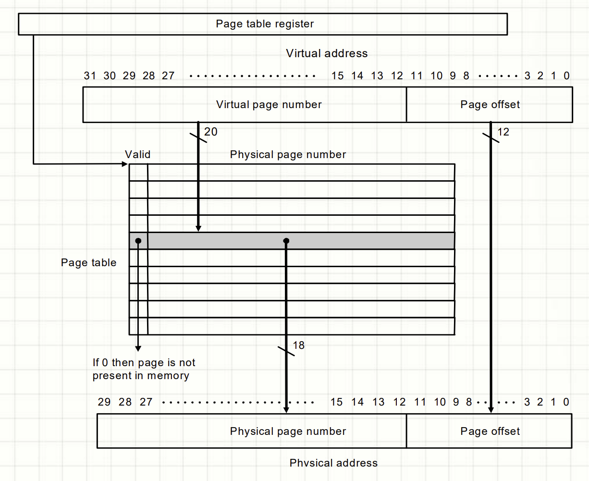

# 进程地址空间

地址空间通常为连续的，大小取决于计算机架构，等于能够寻址的范围，（32位的大小为2^32, 4GB, 64的为2^64）

在32位操作系统中，地址空间被分为1GB的内核空间和3GB的用户空间，在3GB的用户空间中，进程会有一块内存区域（memory area），进程可以通过内核来增加和移除这个内存区域，进程只可以访问有效的内存区域，如果进程访问了其他地址则会出现"Segmentation Fault"(段错误)

内存区域包括了下列内存对象：

- A memory map of the executable file's code, called the text section (代码段: 程序刚开始执行的时候可执行文件(包括代码段，数据段，bss段都还在磁盘中)，当机器开始执行指令时触发缺页中断后才会将可执行文件加载到内存中)
- A memory map of the executable file's initialized global variables, called the data section (数据段)
- A memory map of the zero page (a page consisting of all zeros) containing uninitialized global variables, called the bss section.
- A additional text，data, and bss section for each shared library, such as the C library and dynamic linker, loaded into the process's address space
- Any memory mapped files
- Any shared memory segments
- Any anonymous memory mappings, such as those associated with malloc()

## 页

在操作系统中，内存管理的最小单位不是字节，是页  
一页就是一段固定大小的连续虚拟内存块，操作系统通过它把虚拟内存和物理内存联系起来

页通常大小为4KB


## 内存分配相关

进程的初始状态：

只有ELF文件里声明的内存和一些操作系统分配的内存
- 任何其他指针的访问都是非法的
- 如果我们从输入读取一个size，然后malloc，内存应该从哪来呢

所以一定有一个系统调用可以改变进程的地址空间 

### 虚拟地址空间和物理内存

- 用户程序看到的是虚拟地址空间
- 操作系统和硬件（MMU）通过页表把虚拟内存地址映射到物理内存

 

 

**注：** 
- 在虚拟地址空间上连续的页在物理内存上可能分散在不同的地方
- 只有实际使用的虚拟地址空间才会分配页表

页表在运行过程中存在于内存中，所以通过页表转换地址时需要多一次访存，因此引入TLB（快表）来解决这个问题，TLB存在于CPU内部专门的高速缓存中（专门为页表映射设计的缓存，实现方式类似于cache，独立管理），

现代64位CPU通常并不会用满64bit来做虚拟地址，只会用48bit做虚拟地址：
```
虚拟地址 (48-bit 实际有效):
+----------------+----------------+----------------+----------------+----------------+
| PML4 (9bit)    | PDPT (9bit)   | PD (9bit)     | PT (9bit)      | 页内偏移 (12bit)|
+----------------+----------------+----------------+----------------+----------------+
```
48bit被分为四级页表9+9+9+9和最后的页内偏移12  
每级页表为2^9=512个条目  
页内偏移12bit -> 2^12 = 4096 = 4KB 页大小  
一个页表项为8bytes（64bits） -> 高52位存物理页帧地址，低12位存标志位

为什么要多级页表：  
一页为4KB = 2^12  
虚拟地址空间：48-bit -> 2^48  
2 ^ 48 / 2 ^ 12 = 2 ^ 36  
如果每个页表项为8字节，则单个页表大小为:
2 ^ 36 * 8 = 2 ^ 39 = 512GB  
显然这个页表存不进内存  

所以采用四张包含2^9 = 512项的多级页表  
将虚拟地址分为多个部分，每一部分对应一个页表层级

访问流程（例子）:

假设我们要访问虚拟地址 0x00007fff12345678：

1. 顶层索引 (PML4)：取高 9 位，找到 PML4 表对应的条目 → 指向 PDPT 表。

2. 次级索引 (PDPT)：取下一 9 位，找到 PDPT 表条目 → 指向 PD 表。

3. 再下级索引 (PD)：取下一 9 位，找到 PD 表条目 → 指向 PT 表。

4. 页表索引 (PT)：取下一 9 位，找到 PT 表条目 → 得到物理页帧地址。

5. 页内偏移：最后 12 位加到物理页帧地址上 → 得到最终物理地址。

注意：如果任何一级页表不存在，CPU 会触发缺页异常（Page Fault），操作系统再分配页表或映射页面。

操作系统管理内存时最小单位是页

多层页表访问：  
先从CR3寄存器获取顶层页表PML4的基地址，然后高9位表示偏移量访问下一层页表，以此类推
```
虚拟地址: 0x00007f8a3b5c1040
          │       │       │       │       │
          ▼       ▼       ▼       ▼       ▼
        [符号扩展][PML4=0x100][PDP=0x1e8][PD=0x1d6][PT=0x104][偏移=0x40]

CR3 ──→ PML4 页
          │
          └─索引 0x100 ──→ PML4E ──→ PDP 页
                                   │
                                   └─索引 0x1e8 ──→ PDPE ──→ PD 页
                                                        │
                                                        └─索引 0x1d6 ──→ PDE ──→ PT 页
                                                                             │
                                                                             └─索引 0x104 ──→ PTE ──→ 物理页帧号
                                                                                                 │
                                                                                                 └─ + 偏移 0x40 ──→ 物理地址
```

在页表项中的标志位可以标志该页是否为大页，如果是则对应的地址就是物理页帧的地址，然后剩下的位数就是偏移量

### mmap(), mumap(), mprotect()

在当前状态机状态上增加/删除/修改一段可访问的内存：  
映射：
- mmap()
- munmap()
修改映射权限
- mprotect()

mmap():  
mmap是一种内存映射技术，能把一个文件或者一段匿名内存直接映射到进程的虚拟地址空间中
```cpp
void *mmap(void *addr, size_t length, int prot, int flags, int fd, off_t offset);
```
- addr: 映射的起始地址，通常传NULL让内核自己选择
- length: 映射的长度（字节数），会按页大小对齐
- prot: 内存保护方式，决定映射区的权限
  - PROT_READ：可读
  - PROT_WRITE：可写
  - PROT_EXEC：可执行
  - PROT_NONE：不可访问
- flag: 映射选项，控制共享/私有等
- fd: 被映射文件的文件描述符(不映射文件时为-1)
- offset: 从文件的什么位置开始映射，必须是页大小的整数倍

函数成功时返回映射区域的起始地址，失败时返回'MAP_FAILER'

当调用mmap去分配一段内存时，内核会做：
- 找一段虚拟地址空间中连续的区域
- 然后建立页表项，将这段虚拟地址空间映射到物理内存的多个页框中
- mmap只是保留虚拟地址空间，并不立刻分配物理内存
- 真正的物理页只有在访问时触发缺页异常时才会分配

mmap调用时是以页为单位的

### malloc

malloc底层通过两种方式向操作系统申请内存：  
1. 小块（通常<128KB）
   - 来自heap（由sbrk/brk扩展）
   - 内存管理器维护一个内存池，在其中切分为小块
   - 这些小块并不是直接按页对应申请的，而是从更大的内存块中切出来的
2. 大块（通常>=128KB）
   - 直接用mmap分配整页对齐的内存

### brk
brk() and sbrk() change the location of the program break, which
       defines the end of the process's data segment (i.e., the program
       break is the first location after the end of the uninitialized
       data segment).

官方文档那句话：“program break is the first location after the end of the uninitialized data segment”
→ 翻译就是：程序 break 是 BSS 段后第一个地址，也就是堆的最顶端。

- brk(addr)：把 program break 设置到 addr。
- sbrk(increment)：把 program break 在原有位置上移动 increment 字节，并返回旧的 break 地址。

### realloc

```
void *realloc(void *ptr, size_t new_size);
```
- ptr：之前通过 malloc / calloc / realloc 分配得到的内存指针。
- new_size：要调整成的新内存大小（字节数）。

返回值：
  - 成功 → 返回新内存块的地址（可能和 ptr 一样，也可能不一样）。
  - 失败 → 返回 NULL，原内存块保持不变。

realloc 会拓展或缩小一块已分配的内存，如果需要移动数据，会自动把旧内容拷贝到新内存中