- [Video Memory (VRAM)](#video-memory-vram)
- [Homogeneous coordinates and transforms](#homogeneous-coordinates-and-transforms)
  - [Affine transforms（仿射变换）](#affine-transforms仿射变换)
    - [Identity](#identity)
    - [Translation](#translation)
    - [Scaling](#scaling)
    - [Rotation](#rotation)
    - [Shear（剪切）](#shear剪切)
  - [Matrix transforms](#matrix-transforms)
- [Projections](#projections)

# Video Memory (VRAM)

A part of the VRAM, called the screen buffer or frame buffer, stores an encoding of the colors associated to all the pixel shown on screen.  
帧缓冲（Frame Buffer）会存储屏幕上所有像素对应的颜色编码信息

A special component on the graphics card (which was called the“RAMDAC” when displays were analog) uses the informationstored in the VRAM to send the image to the display.  
图像卡上的一个组件（RAMDAC）会利用这些储存在VRAM中的信息将图像传输到显示器上

The adapter, using the GPU which reads the commands and the datastored in the VRAM, composes the image, and sends it to the display.  
现代图像适配器是通过GPU读取指令以及存储在VRAM中的数据组成图像然后发送到显示器上的

VRAM（Video Random Access Memory） 是 显卡上的专用高速内存，主要用于存储 GPU 计算或渲染时需要的数据。  

VRAM中通常存储以下数据：  
1. 纹理（Textures）  
   游戏或3D应用中的图片贴图

2. 帧缓冲（Frame Buffer）  
    用于存储每一帧图像的数据

3. 几何数据（Geometry）  
   GPU需要存储顶点，网格，模型数据

4. GPU计算数据（Computer）

# Homogeneous coordinates and transforms

The coordinates $x$, $y$ and $z$ represents the position of the point in the 3D space, while coordinate $w$ defines a scale: the units of measure used by the other three coordinates.

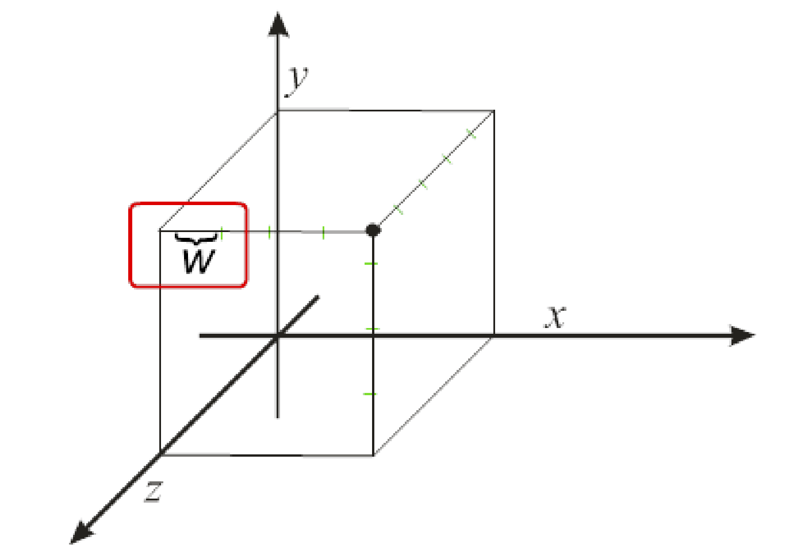

In particular, all tuples of four values that are linearly dependent represent the same point in the 3D space.

The x, y, and z coordinates of the vector with w = 1 identify the “real” position of the point in the 3D space.

将$xyz$的数值除以$w$就可以得到$w=1$的时候的坐标

## Affine transforms（仿射变换）

The affine transforms are usually grouped in four classes:
- Translating
- Scaling
- Rotation
- Shear

To transform an object, the same transform is applied to all of its points.

仿射变换可以看作是一个4*4矩阵作用于齐次坐标系

- $p=(x,y,z,1)$
- $p'=M\times p^T$
- $p'=(x',y',z',1)$

### Identity
$$
I = \begin{bmatrix}
1&0&0&0 \\
0&1&0&0 \\
0&0&1&0 \\
0&0&0&1
\end{bmatrix}
$$

### Translation

- $x'=x+d_x$
- $y'=y+d_y$
- $z'=z+d_z$

$$
T(d_x,d_y,d_z) = \begin{bmatrix}
1&0&0&d_x \\
0&1&0&d_y \\
0&0&1&d_z \\
0&0&0&1
\end{bmatrix}
$$

### Scaling

- $x'=s\times x$
- $y'=s\times y$
- $z'=s\times z$ 

$$
S(s_x,s_y,s_z) = \begin{bmatrix}
s_x&0&0&0 \\
0&s_y&0&0 \\
0&0&s_z&0 \\
0&0&0&1
\end{bmatrix}
$$

Mirroring can be obtained by using negative scaling factors.

In particular, three possible types of mirroring can be done:
- Planar
- Axial
- Central

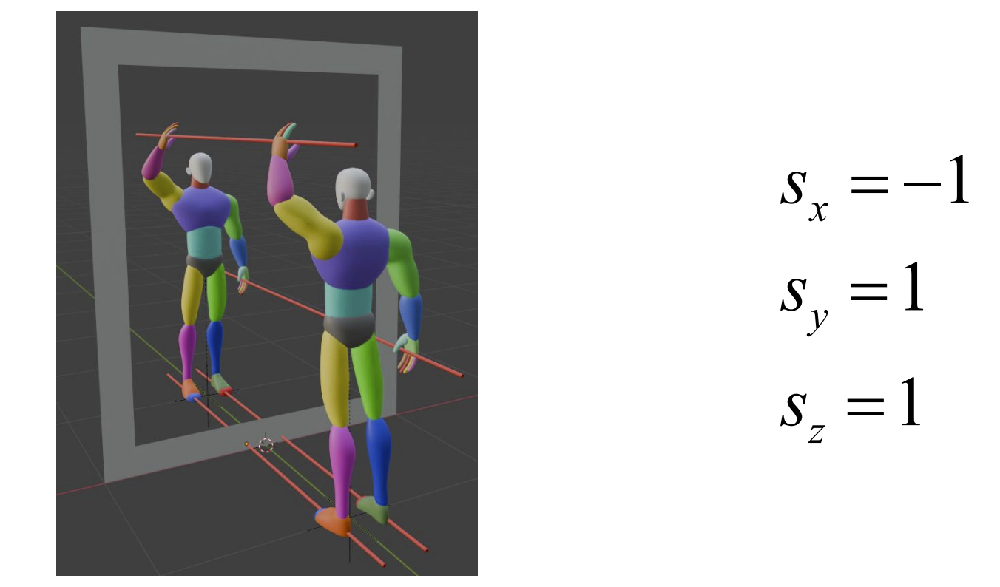

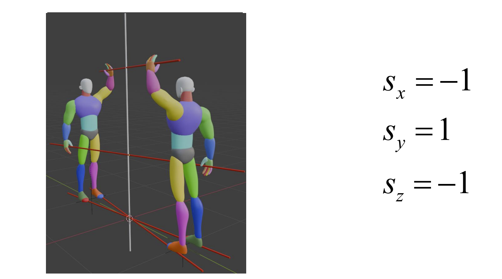

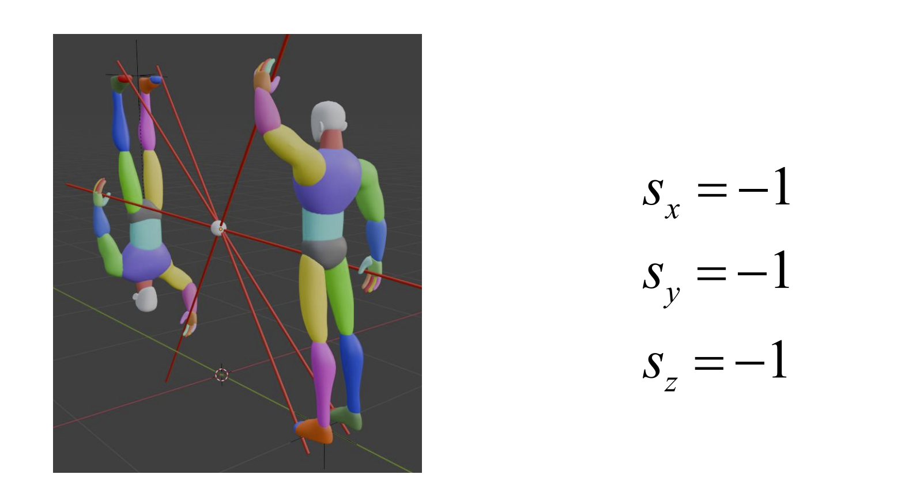

### Rotation

以绕$z$轴旋转$\alpha$度为例  
可以视为先将$x$部分视作一个在$x$轴上的点（$y=0$）绕$z$轴旋转$\alpha$度  
然后再将$y$部分视作一个在$y$轴上的点（$y=0$）绕$z$轴旋转$\alpha$度  
则有：
$$
x'=x \times cos\alpha - y \times sin\alpha \\
y'=x \times sin\alpha + y \times cos\alpha \\
z'=z
$$

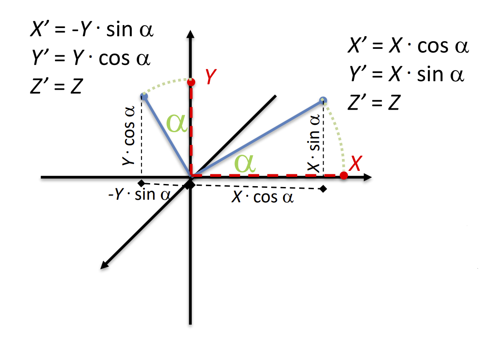

以此类推，我们有：
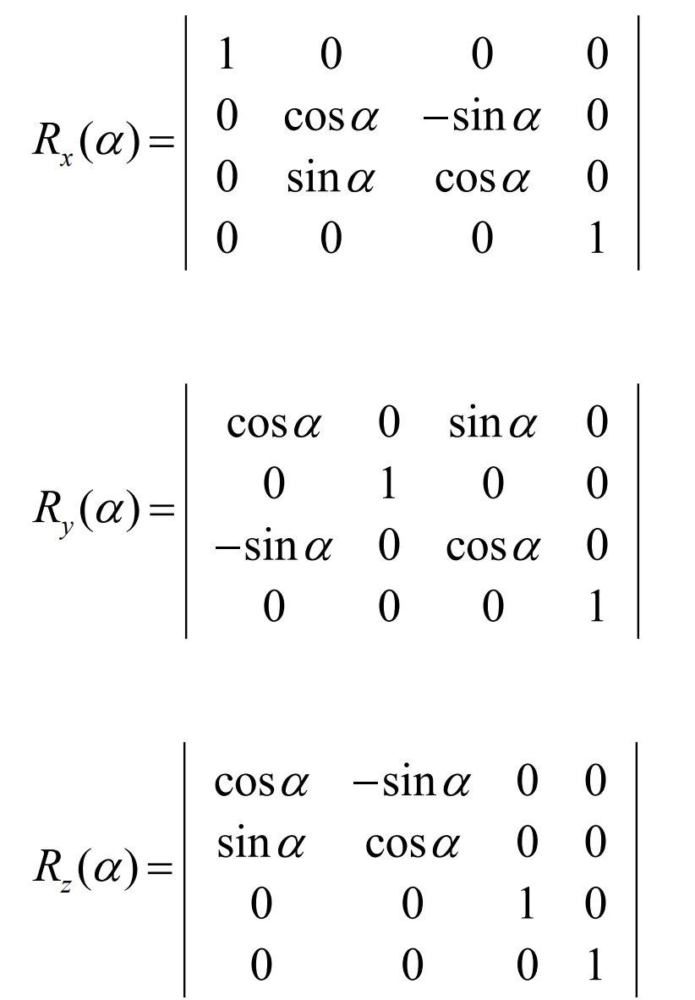

对于绕任意轴旋转，我们可以分解为5步：  
1. 将这个任意轴绕y轴旋转知道与xy平面重合
2. 绕z轴旋转使其与x轴重合
3. 将物体绕x轴旋转
4. 绕z轴旋转到原来的位置
5. 绕y轴旋转到原来的位置

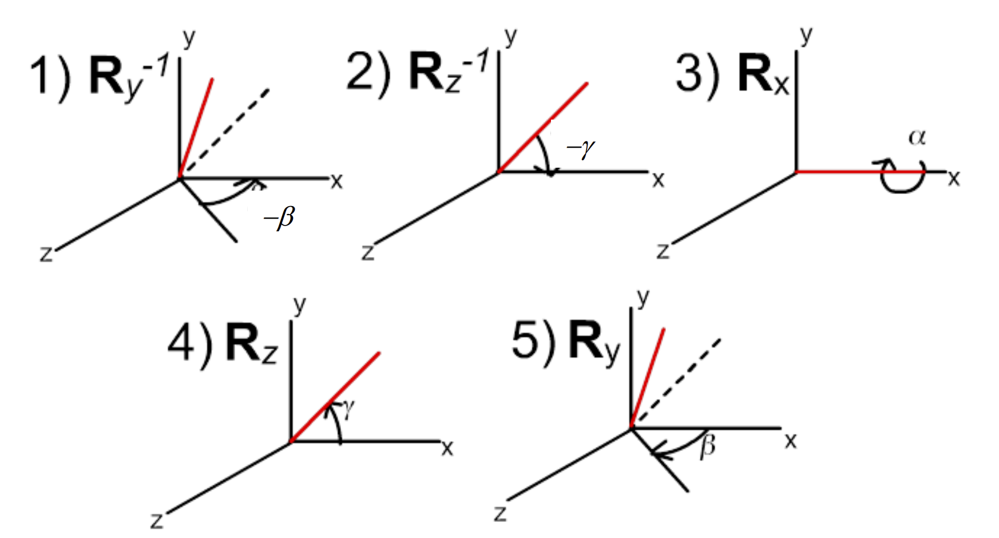

如果这个轴并不通过原点，则应该先将这个轴移动到原点

因此，最终绕任意轴旋转$\alpha$可以写做：
$$
p'=T(p_x,p_y,p_z) \times R_y(\beta) \times R_z(\gamma) \times R_x(\alpha) \times R_z(\gamma)^{-1}
\times R_y(\beta)^{-1} \times T(p_x,p_y,p_z)^{-1} \times p
$$

绕任意轴旋转也可以这样表示:  
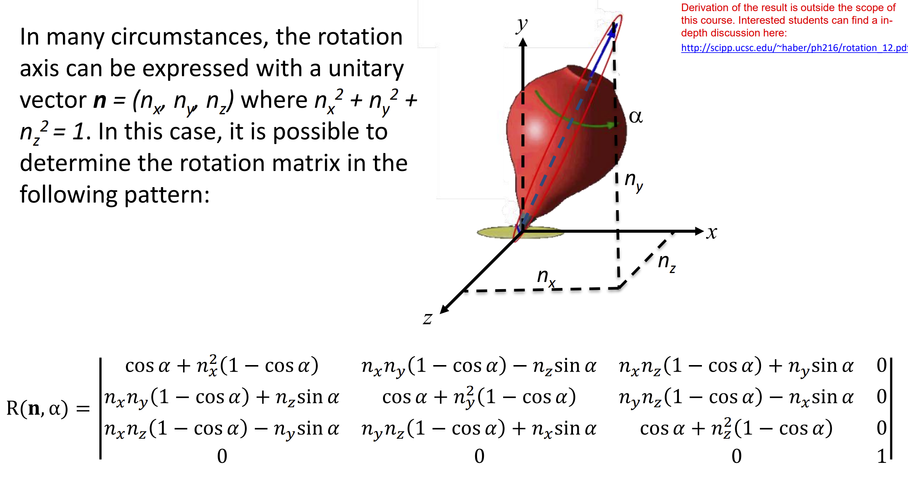

### Shear（剪切）

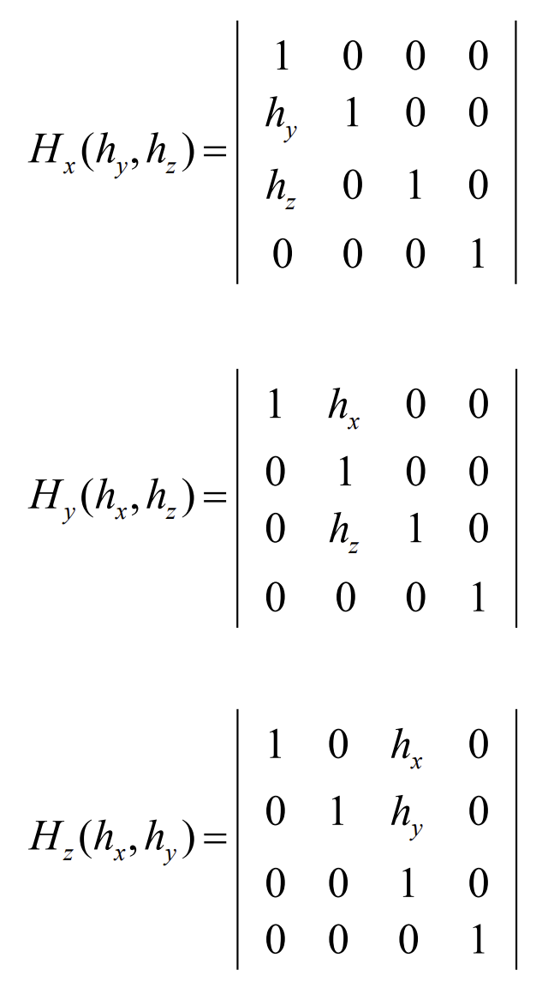

## Matrix transforms

The upper part of a transform matrix, can be divided into a 3x3 sub-matrix $M_R$
that represents the rotation, scaling and shear
factors of the transform, and a column vector $d^T$ that encodes the
translation.

$$
\left(
\begin{array}{ccc|c}
n_{xx} & n_{yx} & n_{zx} & d_x \\
n_{xy} & n_{yy} & n_{zy} & d_y \\
n_{xz} & n_{yz} & n_{zz} & d_z \\
\hline
0 & 0 & 0 & 1
\end{array}
\right) = 
\left(
    \begin{array}{c|c}
        M_R & d^T \\
        \hline
        0 & 1
    \end{array}
\right)
$$

矩阵转换也可以视为改变原来的坐标系  
矩阵$M_R$的每一列代表坐标系的每一个轴相较于原始坐标系的变换

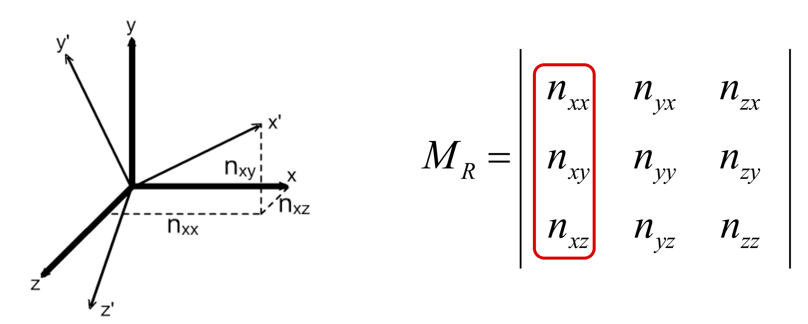

向量$d^T$表示坐标轴原点的移动

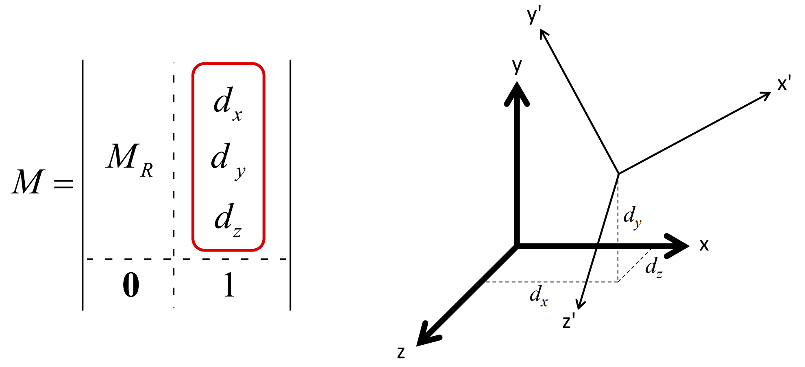

Rotation会保持每个坐标轴的大小和坐标轴之间的角度不变，改变坐标轴的方向  
Scaling会增大或者减小坐标轴的大小，保持方向和角度不变  
Shear会改变坐标轴的方向角度长度

# Projections

The technique used to construct a 2D image from a 3D scene is called projection.  

The 2D representation of the 3D object is defined by the intersection of a set of projection rays with a surface.

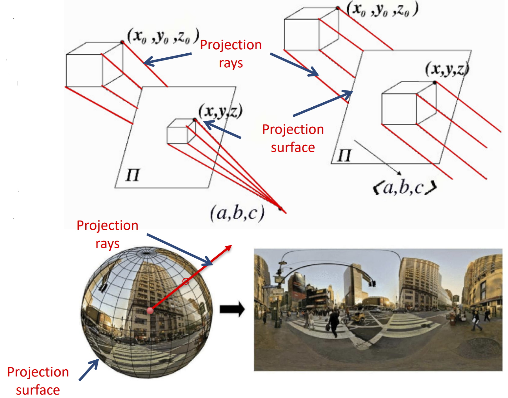

We will consider two type of planar projections:  
- parallel projections
- perspective projections

---
parallel projections

Parallel projections do not change the apparent size of an object
with the distance from the observer.  
平行投影不会因观察者与物体的距离变化而改变大小

---

perspective projections

---