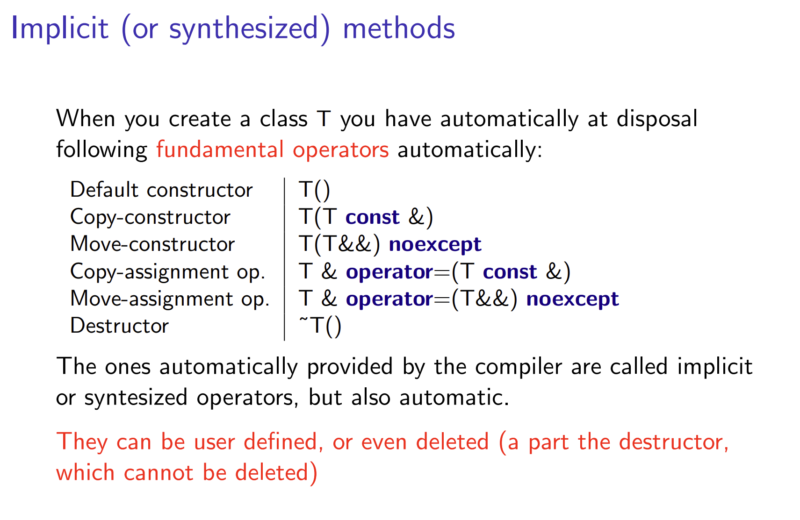
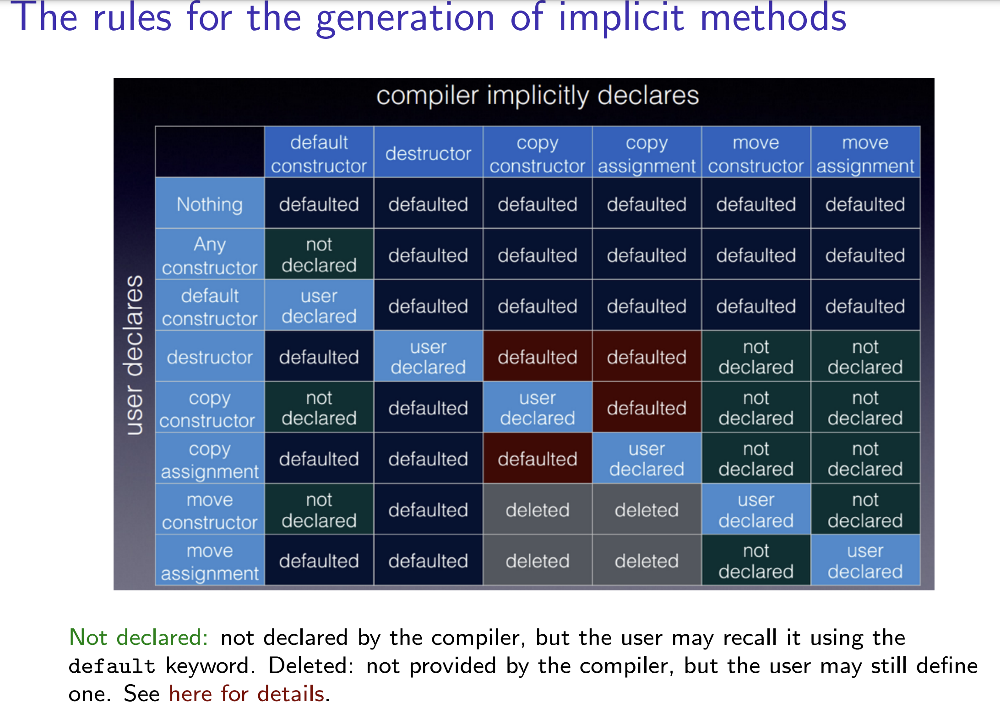

- [收获](#收获)
- [未完成跳过部分](#未完成跳过部分)
- [C++基础](#c基础)
  - [声明，定义，初始化，赋值](#声明定义初始化赋值)
    - [1. 声明（Declaration）](#1-声明declaration)
    - [2. 定义（Definition）](#2-定义definition)
    - [3. 初始化（Initialization）](#3-初始化initialization)
    - [4.赋值（Assignment）](#4赋值assignment)
  - [decltype()](#decltype)
  - [void\* 指针](#void-指针)
  - [`union`](#union)
  - [`restrict`关键字（c语言）](#restrict关键字c语言)
  - [functional](#functional)
  - [lambda表达式](#lambda表达式)
- [智能指针](#智能指针)
  - [`std::shared_ptr`](#stdshared_ptr)
- [class 相关：](#class-相关)
  - [static关键字](#static关键字)
  - [explicit关键字](#explicit关键字)
  - [析构函数](#析构函数)
  - [`::`运算符](#运算符)
  - [`const`修饰成员函数](#const修饰成员函数)
- [C++模板编程](#c模板编程)
  - [类型模板参数](#类型模板参数)
  - [非类型模板参数](#非类型模板参数)
  - [模板编译](#模板编译)
  - [依赖类型](#依赖类型)
  - [部分特化（偏特化）（Partial Specialization）](#部分特化偏特化partial-specialization)
  - [SFINAE机制（Substitution Failure Is Not An Error）](#sfinae机制substitution-failure-is-not-an-error)
- [左值和右值](#左值和右值)
- [C++11的可变模板参数（`typename... Args`）](#c11的可变模板参数typename-args)
- [::operator new和::new和malloc()](#operator-new和new和malloc)
- [new(`new T()`)和placement new(`new(ptr) T()`)](#newnew-t和placement-newnewptr-t)
- [lvalue reference and rvalue reference and universal reference](#lvalue-reference-and-rvalue-reference-and-universal-reference)
- [`std::forward<T>()` 和 `std::move()`](#stdforwardt-和-stdmove)
  - [`std::forward<T>()`](#stdforwardt)
  - [`std::move()`](#stdmove)
- [memcpy](#memcpy)
- [is\_trivially\_copyable](#is_trivially_copyable)
  - [1. 什么是 `is_trivially_copyable`？](#1-什么是-is_trivially_copyable)
  - [2. 为什么`memcpy`只能用于`is_trivially_copyable`?](#2-为什么memcpy只能用于is_trivially_copyable)
- [红黑树](#红黑树)
- [C++多线程编程](#c多线程编程)
  - [C++ 内存序（Memory Order）概述](#c-内存序memory-order概述)
    - [为什么需要内存序？](#为什么需要内存序)
    - [常见的几种内存序](#常见的几种内存序)
    - [如何选择合适的内存序？](#如何选择合适的内存序)
    - [总结](#总结)
  - [`std::mutex`](#stdmutex)
    - [基本使用](#基本使用)
    - [使用RAII方式加锁解锁](#使用raii方式加锁解锁)
  - [`std::condtion_variable`](#stdcondtion_variable)
    - [基本原理](#基本原理)
    - [核心函数](#核心函数)
    - [典型案例：生产者-消费者](#典型案例生产者-消费者)
  - [`std::future`](#stdfuture)

# 收获
1. 使用Address Sanitizer(ASan)检查出内存错误：
   在写vector的时候，调用配置器的allocate和deallocate的时候出现了问题，使用ASan发现删除的内存比分配的内存更多。检测后发现vector的`size()`和`capacity()`有问题。

# 未完成跳过部分
1. （已完成）std::forward()完美转发实现，在`construct.h`和`allocator.h`中调用`std::forward()`
2. （已完成）std::move(), 在`allocator.h`中调用`std::move()`
3.  (已完成) 容器中调用了`<memory>`的相关操作。
   - `relloc_and_insert`中的`std::uninitialized_move`

# C++基础

## 声明，定义，初始化，赋值
### 1. 声明（Declaration）
   声明的作用是告诉编译器某个实体的存在及其类型，但不会分配内存或提供具体的实现。声明通常用于变量、函数、类、模板等。
   - 变量声明：告诉编译器变量的类型和名称，但不分配内存。
  ```
    extern int x;   //声明一个整型变量x，但不定义他也不分配内存。
  ```
  这里的`extern`关键字表示`x`在其他地方定义。
  - 函数声明：告诉编译器函数的名称、返回类型和参数列表，但不提供函数体。
  ```
  int add(int a, int b);    //声明一个函数add。
  ```
  - 类声明： 告诉编译器类的名称和成员，但不提供实现。
  ```
  class Myclass;    //声明一个类Myclass
  ```
### 2. 定义（Definition）
   定义是为声明的实体分配内存或提供具体实现。定义是声明的超集，即定义包含了声明。
-  变量定义：为变量分配内存并可以初始化。
```
int x; // 定义一个整型变量x，分配内存
```
- 函数定义：提供函数的具体实现。
```
int add(int a, int b) {
    return a + b;
}
```
- 类定义：提供类的完整实现，包括成员变量和成员函数。
```
class MyClass {
public:
    int value;
    void print() {
        std::cout << value << std::endl;
    }
};
```

### 3. 初始化（Initialization）
初始化是在定义变量时为其赋予一个初始值。初始化可以发生在定义时，也可以在构造函数中。
- 直接初始化：
```
int x = 10; // 定义并初始化x为10
```
- 列表初始化（C++11引入）：
```
int x{10}; // 使用花括号初始化
```
- 默认初始化：
如果没有显式初始化，变量会被默认初始化。对于内置类型（如 int），默认初始化可能是未定义的（垃圾值）；对于类类型，会调用默认构造函数。
```
int x; // 默认初始化，x的值未定义
```
- 构造函数初始化：
对于类对象，初始化通常通过构造函数完成。
```
class MyClass {
public:
    int value;
    MyClass(int v) : value(v) {} // 构造函数初始化列表
};
```

### 4.赋值（Assignment）
赋值是为已经定义的变量赋予一个新值。

## decltype()
用于获取变量或表达式的类型
```
int x = 10;
decltype(x) y = 20;  // `y` 的类型是 `int`

int a = 10, b = 20;
decltype(a + b) c = 30;  // `c` 的类型是 `int`
```
`decltype((expr))` 与 `decltype(expr)` 的区别
```
int x = 10;
decltype(x) a = x;   // `a` 是 `int`
decltype((x)) b = x; // `b` 是 `int&`
```

## void* 指针
`void*`是 "无类型指针"（void pointer），表示它可以指向任何类型的数据。在 C 和 C++ 语言中，它被广泛用于泛型编程、动态内存管理和与底层 API（如 `malloc()` 和 `free()`）交互。

1. `void*`的特点
   - **不能直接解引用**：由于`void*`没有具体类型，不能直接通过`*ptr`访问值，必须先转换成合适的类型。
   - **可以转换为任何指针**： 任何指针类型都可以转换成`void*`,反之亦然（需要显示转换）。
   - **常用于通用函数**：例如`malloc()`返回`void*`，因为它分配的内存可以存储任何类型的数据。

## `union`
在 C++ 中，`union`（联合体）是一种特殊的 数据结构，它允许 多个变量共用同一块内存。`union` 类似于 `struct`，但所有成员共享同一块内存区域，因此它的大小取决于 最大的成员变量。

```c
#include <iostream>

union Data {
    int i;
    float f;
    char c;
};

int main() {
    Data d;
    d.i = 42;
    std::cout << "整数 i: " << d.i << std::endl;

    d.f = 3.14f;
    std::cout << "浮点数 f: " << d.f << std::endl;

    d.c = 'A';
    std::cout << "字符 c: " << d.c << std::endl;

    std::cout << "再次访问 i: " << d.i << std::endl; // ⚠️ 可能被覆盖
}
```
结果：
```c
整数 i: 42
浮点数 f: 3.14
字符 c: A
再次访问 i: 1094795585  // ⚠️ i 的值被 f 覆盖
```

- `union`的所有成员共享一块内存，修改一个成员，会覆盖其他成员。
- `union` 大小等于最大成员的大小（对齐时可能稍大）。
- `union` 只能存储一个值，因为多个成员共用同一块内存。

## `restrict`关键字（c语言）
restrict 是 C 语言中的类型限定符，用于指针，表示该指针是访问某块内存的唯一方式。它告诉编译器不会通过其他指针访问相同的内存，从而允许编译器优化代码，提高性能。

restrict 关键字是 C99 标准引入的，C++ 没有原生支持（但一些编译器提供扩展，如 \_\_restrict\_\_ 或 __restrict）。

例如：
```c
void copy(int *restrict dest, const int *restrict src, size_t n) {
    for (size_t i = 0; i < n; i++) {
        dest[i] = src[i];  // 编译器可以优化
    }
}
```

`restrict`告诉编译器`dest`和`src`指向的内存区域不会重叠，代码可以安全地优化，比如向量化（SIMD）

## functional
std::function<void()> 代表无参数且无返回值的函数签名，因此不能直接接受一个有参数的函数指针。但可以通过绑定参数的方式，使其适配 std::function<void()>。

```c
#include <iostream>
#include <functional>

void myFunc(int x) {
    std::cout << "Value: " << x << std::endl;
}

int main() {
    std::function<void()> func = std::bind(myFunc, 42);  // 绑定参数 x=42
    func();  // 输出 "Value: 42"
    return 0;
}
```

## lambda表达式
Lambda 表达式的基本语法如下：
```
[捕获列表](参数列表) -> 返回类型 { 函数体 };
```
其中：
- 捕获列表 [ ]：定义 lambda 如何捕获外部变量（值捕获 =，引用捕获 &）。
- 参数列表 ( )：类似普通函数的参数列表（可以省略）。
- 返回类型 ->（可选）：可以省略，编译器会自动推导。
- 函数体 {}：实际的代码逻辑。

```c
#include <iostream>

int main() {
    auto add = [](int a, int b) { return a + b; };
    std::cout << "3 + 5 = " << add(3, 5) << std::endl; // 输出 8
    return 0;
}
```  

```c
#include <iostream>

int main() {
    auto divide = [](double a, double b) -> double {
        if (b == 0) return 0;
        return a / b;
    };
    std::cout << "10 / 3 = " << divide(10, 3) << std::endl; // 输出 3.33333
    return 0;
}
```

1. 值捕获`[=]`（拷贝）
值捕获会 拷贝 变量，因此在 Lambda 内部修改变量不会影响外部。
```c
#include <iostream>

int main() {
    int x = 10;
    auto lambda = [=]() { std::cout << "x = " << x << std::endl; };
    lambda();
    return 0;
}
```

2. 引用捕获`[&]`（引用）
```c
#include <iostream>

int main() {
    int x = 10;
    auto lambda = [&]() { x += 5; };
    lambda();
    std::cout << "x = " << x << std::endl; // 输出 15
    return 0;
}
```

3. 指定捕获变量
```c
#include <iostream>

int main() {
    int a = 10, b = 20;
    auto lambda = [a, &b]() {
        // a 被值捕获，无法修改
        // b 被引用捕获，可以修改
        // a += 5; // ❌ 编译错误
        b += 5;   // ✅ 可以修改
    };

    lambda();
    std::cout << "a = " << a << ", b = " << b << std::endl; // a = 10, b = 25
    return 0;
}
```

# 智能指针

## `std::shared_ptr`
在 C++ 中，`std::shared_ptr` 是一个采用引用计数（Reference Counting）策略的智能指针，其核心思想是“当最后一个指针离开作用域时，才真正释放资源（内存、文件等）”。从源码或实现细节的角度来看，`std::shared_ptr` 大体上可分为以下几个关键点：
1. 控制块（Control Block）
   - 当你用 `std::shared_ptr` 管理一块堆上分配的对象时，运行库（Standard Library Implementation）通常会在堆上额外创建一个“控制块”来管理这块资源的引用计数信息和其他必要的元数据（如自定义删除器、类型擦除用的指针等）。
    - 控制块包含：
       - use_count：共享计数，用于统计有多少个 shared_ptr 在管理同一个对象；
       - weak_count：弱计数，用于统计有多少个 weak_ptr 与这个对象相关联（不影响对象的生命周期）；
       - deleter：自定义删除器，或者默认删除器（调用 delete），当 use_count 归零时调用；
       - 指向实际对象的指针（有时这个指针和 shared_ptr 内部那个指针不是同一个东西，取决于实现）。
   - 当我们调用 make_shared<T>(...) 时，C++ 实现通常会将 T 对象与控制块一起“打包”分配在同一块连续内存里，从而减少一次内存分配。
```cpp
// 简化版的“控制块”结构
struct shared_count
{
    std::atomic<long> use_count;  // 共享计数
    std::atomic<long> weak_count; // 弱计数 (本例子中没完整演示 weak_ptr)

    // 构造时，一般让 use_count=1，weak_count=1（兼容 future weak_ptr）
    shared_count() : use_count(1), weak_count(1) {}

    // 增加共享引用计数
    void add_ref_copy() {
        use_count.fetch_add(1, std::memory_order_relaxed);
    }

    // 释放一个共享引用，返回释放后剩余的共享计数
    long release() {
        // fetch_sub 返回的是“减少前”的值，所以要-1
        return use_count.fetch_sub(1, std::memory_order_acq_rel) - 1;
    }

    // 增加一个弱引用（演示用）
    void weak_add_ref() {
        weak_count.fetch_add(1, std::memory_order_relaxed);
    }

    // 释放一个弱引用，并返回释放后的弱计数
    long weak_release() {
        return weak_count.fetch_sub(1, std::memory_order_acq_rel) - 1;
    }
};
```


2. `shared_ptr`本身的内存结构：
    - `shared_ptr`通常只包括两个指针成员  
       1. px: 指向所管理对象的指针（可能是原始指针，也可能是某种类型擦除过的指针，视具体实现而定）。
       2. pn：指向上述控制块的指针。
    - 每当我们拷贝一个 `shared_ptr` 时，就会把两个指针都拷贝一遍，并把控制块中的 `use_count` 原子地加 1；当销毁一个 `shared_ptr`  时，就会把 `use_count` 原子地减 1，并检查是否归零。
```cpp
// 非常简化的 shared_ptr
template<typename T>
class shared_ptr
{
private:
    T* px;               // 指向实际对象
    shared_count* pn;    // 指向控制块

public:
    // 1. 默认构造：空指针，空控制块
    shared_ptr() : px(nullptr), pn(nullptr) {}

    // 2. 通过原始指针构造
    explicit shared_ptr(T* p) : px(p) {
        // 分配一个新的控制块，use_count = 1，weak_count = 1
        pn = new shared_count();
    }

    // 3. 拷贝构造
    shared_ptr(const shared_ptr& other)
    {
        px = other.px;
        pn = other.pn;
        // 引用计数+1
        if (pn) {
            pn->add_ref_copy();
        }
    }

    // 4. 拷贝赋值
    shared_ptr& operator=(const shared_ptr& other)
    {
        // 自我赋值保护
        if (this != &other) {
            // 先把自己原来的资源释放掉
            if (pn) {
                // release() 返回值是 “减少后的 use_count”
                if (pn->release() == 0) {
                    delete px; // 释放实际对象
                    px = nullptr;
                    // 当 use_count == 0 后，再让 weak_count 也减 1
                    if (pn->weak_release() == 0) {
                        delete pn; // 当 weak_count 也为 0 时，释放控制块
                    }
                }
            }
            // 再接管 new 进来的资源
            px = other.px;
            pn = other.pn;
            // 引用计数+1
            if (pn) {
                pn->add_ref_copy();
            }
        }
        return *this;
    }

    // 5. 析构函数
    ~shared_ptr()
    {
        if (pn) {
            // 减少一个共享引用
            if (pn->release() == 0) {
                // 说明这是最后一个共享指针，释放资源
                delete px;
                px = nullptr;
                // 减少一个弱引用；若弱引用也为 0，则释放控制块
                if (pn->weak_release() == 0) {
                    delete pn;
                }
            }
        }
    }

    // 常用接口
    T* get() const { return px; }

    // 返回当前的 use_count 值
    long use_count() const {
        return pn ? pn->use_count.load(std::memory_order_acquire) : 0;
    }

    // 重载 -> 操作符，方便使用
    T* operator->() const { return px; }

    // 重载 * 操作符，方便使用
    T& operator*()  const { return *px; }
};

```

# class 相关：




## static关键字
static 关键字用于声明静态成员函数。静态成员函数的特点是不依赖于具体的类实例，可以直接通过类名调用。  

静态函数的限制：  
1. 没有 this 指针  
静态成员函数不能访问类的非静态成员变量或函数，因为它们没有 this 指针。

2. 不能被虚函数覆盖
静态成员函数无法声明为虚函数，因为它们不依赖于具体对象。

## explicit关键字
在 C++ 中，`explicit` 关键字用于防止隐式类型转换，主要用于构造函数，防止编译器在不明确的情况下自动执行类型转换。

## 析构函数
析构函数(`~ClassName()`)是C++类中一个特殊成员函数，它在对象的生命周期结束时自动调用，用于释放资源，例如文件，锁，网络连接等。  
注意： 析构函数只负责清理对象的资源，不会负责释放对象本身的内存。  
`delete()`函数先调用类的析构函数，然后再调用`operator delete()`释放对象的内存。

## `::`运算符
| **访问内容**           | **能否用 `::` 访问？** | **示例** |
|-------------------|-----------------|----------------------------|
| **静态成员变量**  | ✅ 可以 | `ClassName::staticVar` |
| **静态成员函数**  | ✅ 可以 | `ClassName::staticFunc()` |
| **类内 `typedef` 或 `using`** | ✅ 可以 | `ClassName::TypeAlias` |
| **枚举成员**      | ✅ 可以 | `ClassName::EnumValue` |
| **非静态成员变量** | ❌ 不能 | `ClassName::memberVar`（错误） |
| **非静态成员函数** | ❌ 不能 | `ClassName::memberFunc()`（错误） |

## `const`修饰成员函数
`const`修饰的成员函数不能修改类的成员变量，除非该变量使用了`mutable`关键字。本质上是作用在指针`this`上。  
`const`对象只能调用`const`函数。  
`const`修饰可以重载函数，`const`成员会调用重载的函数。

# C++模板编程

## 类型模板参数
```
template <typename T>
int compare (const T &vl, const T &v2)
{
    if (vl < v2) return -1;
    if (v2 < v1) return 1;
    return 0;
}
```
**实例化函数模板：**  
当我们调用一个函数模板时,编译器(通常)用函数实参来为我们推断模板实参。即,
当我们调用 compare 时,编译器使用实参的类型来确定绑定到模板参数的类型。例如,
在下面的调用中:
```
cout << compare (1, 0) << endl; // T为int
```
实参类型是int。编译器会推断出模板实参为int,并将它绑定到模板参数。
编译器用推断出的模板参数来为我们实例化(instantiate)一个特定版本的函数。当编
译器实例化一个模板时,它使用实际的模板实参代替对应的模板参数来创建出模板的一个
新“实例”。

## 非类型模板参数
```
template<unsigned N, unsigned M>
int compare (const char (&p1) [N], const char (&p2) [M])
{
    return strcmp(p1, p2);
}
```
一个非类型参数可以是一个整型,或者是一个指向对象或函数类型的指针或(左值)引用。  
在模板定义内,模板非类型参数是一个常量值。在需要常量表达式的地方,可以使用非类型参数,例如,指定数组大小。

## 模板编译
当编译器遇到一个模板定义时,它并不生成代码。只有当我们实例化出模板的一个特定版本时,编译器才会生成代码。  
也就是说只有当我们使用(而不是定义)模板时,编译器才生成代码。

## 依赖类型
```
template <typename T>
void func() {
    T a;                       // 不需要`typename`
    typename T::value_type x;  // ✅ 需要 `typename`，因为 `T::value_type` 依赖 `T`
}

```
当编译器无法在模板实例化之前确定它的具体类型（类型还是变量）时，我们称之为依赖类型，需要在前面加上`typename`来告诉编译器这是个类型。  
在这个例子中`T::value_type`只有在模板实例化的时候才能知道这个是变量还是类型，比如下面这两个类的情况。
```
template <typename T>
class Myclass1{
    typedef T value_type;
}

class Myclass2{
    int value_type;
}
```
在这个例子中，如果`T`是`Myclass1<int>`，则`T::value_type`是一个类型。  
而如果`T`是`Myclass2`，则此时`T::value_type`是一个变量。  
所以这种情况我们要用`typename`告诉编译器这是一个类型。  
<br>
在我们的stl实现中，有这样一个例子：
```
template <typename T>
constexpr T&&
forward(typename std::remove_reference<T>::type& t){
    return static_cast<T&&>(t);
}
```
我们可以看到参数列表中的`std::remove_reference<T>::type& t`前面用了`typename`  
是因为`std::remove_reference<T>::type` 是一个 “依赖类型（Dependent Type）”，编译器在解析模板代码时无法确定它是否是一个类型，因此需要 `typename` 来显式指定。

还有一个例子：
```
template <typename T>
constexpr typename mystl::remove_reference<T>::type&& move(T&& t){
    return static_cast<typename mystl::remove_reference<T>::type&&>(t);
}
```
在这个函数的返回类型前需要加上`typename`。因为这个返回类型也是一个依赖类型。

## 部分特化（偏特化）（Partial Specialization）
部分特化（Partial Specialization） 是 C++ 模板的一种高级特性，它允许我们对部分模板参数进行特化，而不是完全特化整个模板。

部分特化的核心思想是：
- 让主模板 处理通用情况。
- 让部分特化版本 优化或定制某些特定情况。
- 部分特化不是全特化（全特化要求所有模板参数都被特化）。
常见用法：
1. 处理指针类型
```
template <typename T>
class TypeTraits {
public:
    static void show() { std::cout << "General type\n"; }
};

// 🎯 仅当 `T` 是指针类型时，使用此特化版本
template <typename T>
class TypeTraits<T*> {
public:
    static void show() { std::cout << "Pointer type\n"; }
};

int main() {
    TypeTraits<int>::show();   // 输出：General type
    TypeTraits<int*>::show();  // 输出：Pointer type
}
```

2. 处理数组类型
```
template <typename T>
class TypeTraits {
public:
    static void show() { std::cout << "General type\n"; }
};

// 🎯 仅当 `T` 是数组类型时，使用此特化版本
template <typename T, size_t N>
class TypeTraits<T[N]> {
public:
    static void show() { std::cout << "Array type\n"; }
};

int main() {
    TypeTraits<int>::show();    // 输出：General type
    TypeTraits<int[5]>::show(); // 输出：Array type
}
```
3. 处理`std::pair`的特定情况
```
template <typename T1, typename T2>
class MyPair {
public:
    static void show() { std::cout << "General MyPair\n"; }
};

// 🎯 当 T1 和 T2 相同时，使用此特化版本
template <typename T>
class MyPair<T, T> {
public:
    static void show() { std::cout << "Specialized MyPair for same type\n"; }
};

int main() {
    MyPair<int, double>::show(); // 输出：General MyPair
    MyPair<int, int>::show();    // 输出：Specialized MyPair for same type
}
```
全特化例子：
```
template <>
class MyClass<int> {  // ✅ 全特化：仅适用于 `int`
public:
    static void show() {
        std::cout << "Full specialization for int\n";
    }
};
```

## SFINAE机制（Substitution Failure Is Not An Error）
SFINAE (Substitution Failure Is Not An Error，替换失败不是错误) 是 C++ 模板元编程中的一个核心机制，它允许编译器在模板参数替换失败时，不会报编译错误，而是会回退到其他可用的模板版本。使模板能够根据类型的特性自动匹配最合适的版本。  
使用例子：  
`std::enable_if`允许在模板元编程中有选择地使用或禁用某些模板：
```
#include <iostream>
#include <type_traits>

// 仅适用于整数类型
template <typename T, typename = std::enable_if_t<std::is_integral_v<T>>>
void func(T) {
    std::cout << "Integral type\n";
}

// 仅适用于浮点类型
template <typename T, typename = std::enable_if_t<std::is_floating_point_v<T>>>
void func(T) {
    std::cout << "Floating point type\n";
}

int main() {
    func(10);     // ✅ 匹配 `is_integral<T>` -> Integral type
    func(3.14);   // ✅ 匹配 `is_floating_point<T>` -> Floating point type
}
```

又比如：
 ```
template <typename iter, 
typename mystl::enable_if<mystl::is_iterator<iter>::value, int>::type = 0,
typename mystl::enable_if<mystl::is_the_same_type<typename mystl::iterator_traits<iter>::value_type, value_type>::value, int>::type = 0>
list(iter first, iter end){
    copy_init(first, end);
}
 ```
其中`enable_if`的实现为：
```
template <bool B, typename = void>
struct enable_if {};

template <typename T>
struct enable_if<true, T>{
    using type = T;
};
```
运用了部分特化的特性，只有当B=true时候，结构体`enable_if`才会有`type`这个属性，所以在模板替换的时候,如果`enable_if`模板的第一个类型不为`true`，则`enable_if`不包含`type`这个属性，从而导致`mystl::enable_if<...>::type`的替换失败，从而使编译器不选择这个模板函数编译。

# 左值和右值
左值（lvalue）和右值（rvalue）是变量和表达式的一种分类方式，主要与`内存位置` (是否可寻址)和`生命周期`（是否可持久化）有关  

1. 左值
- 定义： 左值是指有名字，可以被引用的对象，它通常表示一个可以取地址，存储在内存中的对象  
- 特点：左值表示可以持续存在的内存位置，可以在赋值表达式的左边，也可以在右边，可以通过`&`操作符获取它的地址  
eg.  
```
int x = 10;     // x 是左值
int* p = &x;    // 左值可以取地址
x = 20;         // 左值可以出现在赋值号左侧
int y = x + 1;  // 左值也可以出现在赋值号右侧
```
- 左值引用：用`&`声明，可以绑定到左值
  
2. 右值
- 定义：右值是指没有名字，只能被读的临时对象，它通常是表达式的结果，无法通过`&`获取地址
- 特点：右值是临时的，在语句结束后会被销毁，只能出现在赋值表达式的右侧，而不能出现在左侧，通常是字面值或表达式的计算结果  
eg.
```
int x = 10;       // 10 是右值
int y = x + 1;    // (x + 1) 是右值
int* p = &(x + 1); // 错误，右值不能取地址
```
- 右值引用：用`&&声明，可以绑定到右值，用于捕获临时对象，延长其生命周期

3. 左值右值的底层区别
- 左值始终表示可以储存在`内存`中的对象  
eg.
```
int x = 10;
int y = x + 1;
```
对应的汇编指令：
```
mov dword ptr [x], 10       ; 将 10 存储到变量 x 的地址
mov eax, dword ptr [x]      ; 将 x 的值加载到寄存器 eax 中
add eax, 1                  ; 将 eax 加 1
mov dword ptr [y], eax      ; 将结果存储到 y 的地址
```
- 右值没有固定的内存地址，通常只在`寄存器`或`栈`上存在。  
- 虽然右值也可能存储在内存的栈上，但不能被寻址。  
eg.
```
int y = 10 + 20;
```
对应的汇编指令：
```
mov eax, 10                 ; 将 10 加载到寄存器 eax
add eax, 20                 ; eax = 10 + 20
mov dword ptr [y], eax      ; 将结果存储到变量 y 的地址
```
- 编译器对右值的优化：  
**寄存器优化**  
右值是表达式的结果，通常是短暂存在的临时值。编译器会尽量将右值存储在寄存器中，而不是内存中，从而减少内存访问，提高性能。  
**返回值优化（ROV）**  
返回值优化（Return Value Optimization, RVO）是一种编译器优化技术，用于在函数返回对象时，避免创建临时对象和多余的拷贝/移动操作  
当函数返回值是右值（临时对象）时，编译器会直接将返回值构造到目标对象的位置，而不是创建临时对象并复制到目标对象

# C++11的可变模板参数（`typename... Args`）

`typename... Args`定义了一个模板参数包，表示可以接受任意数量和类型的模板参数  
`Args&&... args`表示函数参数包，表示可以接受不定数量和类型的参数，并通过完美转发将这些参数传递给另一个参数  
完美转发是指将模板函数接收到的参数原封不动地转发给另一个函数，保留参数的值类别
1. 转发给其它函数
```cpp
#include <iostream>
#include <string>
#include <utility>

// 接收任意数量和类型的参数
template <typename... Args>
void call_function(Args&&... args) {
    // 转发参数包到目标函数
    target_function(std::forward<Args>(args)...);
}

// 示例目标函数
void target_function(int a, double b, const std::string& c) {
    std::cout << "a: " << a << ", b: " << b << ", c: " << c << std::endl;
}

int main() {
    int x = 42;
    double y = 3.14;
    std::string z = "Hello";

    call_function(x, y, z);  // 转发参数
    return 0;
}
```
其中`std::forward<T>`是一个用于条件转发的工具，根据模板参数`T`的类型，判断


# ::operator new和::new和malloc()

首先`::`是作用域解析符，作用是确保调用的是全局作用域下的函数或运算符。在c++中new可以被全局定义，也可以被类重载，如果一个类重载了new，直接调用new就会调用这个类的版本，而如果加上`::`就表明我们要调用全局作用域下的new。  

- `::operator new`: 只分配内存而不调用构造函数。
- `::new`: 分配内存 + 调用构造函数。在底层实现中调用`::operator new`分配内存后再构造对象

```cpp
#include <iostream>

class MyClass {
public:
    MyClass() { std::cout << "Constructor Called\n"; }
    ~MyClass() { std::cout << "Destructor Called\n"; }
};

int main() {
    // 使用 new 关键字（会调用构造函数）
    MyClass* obj1 = new MyClass();  // 输出 "Constructor Called"
    delete obj1;                    // 输出 "Destructor Called"

    // 使用 operator new（仅分配内存，不调用构造函数）
    void* mem = ::operator new(sizeof(MyClass));
    MyClass* obj2 = static_cast<MyClass*>(mem);
    
    // 手动调用构造函数
    new (obj2) MyClass();  // 输出 "Constructor Called"

    // 手动调用析构函数
    obj2->~MyClass();      // 输出 "Destructor Called"

    // 释放内存
    ::operator delete(mem);
    
    return 0;
}

```

注：通过::operator new生成的空间绑定对象后调用析构函数时不会释放内存，要额外调用`::operator delete()`来释放内存。  

| **特性**             | **`::operator new`**         | **`::new`（new 运算符）** | **`malloc()`** |
|----------------------|-----------------------------|---------------------------|----------------|
| **作用**            | **仅分配内存**，不调用构造函数 | **分配内存 + 调用构造函数** | **仅分配内存**，不调用构造函数 |
| **返回类型**        | `void*`，需要转换为对象指针 | `T*`，返回具体类型指针 | `void*`，需要转换为对象指针 |
| **是否调用构造函数** | ❌ 否 | ✅ 是 | ❌ 否 |
| **是否调用析构函数** | ❌ 否 | ✅ 是（`delete` 调用析构） | ❌ 否 |
| **失败时的行为**    | 抛出 `std::bad_alloc` | 抛出 `std::bad_alloc` | 返回 `nullptr` |
| **是否可以重载**    | ✅ 可以 | ❌ 不能重载 | ❌ 不能重载 |
| **适用语言**        | **C++**（运算符函数） | **C++** | **C/C++** |


1. `::new`
- `new T();`会调用：  
  1. `::operator new(sizeof(T));`分配内存。
  2. `T::T();`T的构造函数。
- `delete p;`会调用
  1. `p->~T();`T的析构函数
  2. `::operator delete(p);`释放内存。
2. `::operator new`只负责内存分配，类似于`malloc()`。  
   与`malloc()`的区别在于：`::operator new`会抛出异常，而`malloc()`返回`nullptr`。
3. `malloc()`只分配内存，不知道`T`的构造函数，不会初始化对象。

# new(`new T()`)和placement new(`new(ptr) T()`)
1. 普通的new(`new T()`)会分配内存并构造对象：
```
#include <iostream>

class MyClass {
public:
    MyClass(int x) { std::cout << "Constructor: " << x << "\n"; }
    ~MyClass() { std::cout << "Destructor\n"; }
};

int main() {
    MyClass* obj = new MyClass(42);  // ✅ 申请新内存并构造对象
    delete obj;                      // ✅ 调用析构并释放内存
    return 0;
}
```
2. 而placement new(`new(ptr) T()`)不会分配新内存，只会在`ptr`指向的内存上调用构造函数。
```cpp
#include <iostream>

class MyClass {
public:
    MyClass(int x) { std::cout << "Constructor: " << x << "\n"; }
    ~MyClass() { std::cout << "Destructor\n"; }
};

int main() {
    void* mem = ::operator new(sizeof(MyClass));  // ✅ 仅分配内存（不会构造对象）
    MyClass* obj = new (mem) MyClass(42);  // ✅ 在 `mem` 指向的内存上构造对象

    obj->~MyClass();  // ✅ 显式调用析构函数
    ::operator delete(mem);  // ✅ 释放 `operator new` 申请的内存

    return 0;
}
```
# lvalue reference and rvalue reference and universal reference
```cpp
Widget&& var1 = someWidget;      // here, “&&” means rvalue reference，var1虽然是右值引用，但它作为表达式的时候是左值。
 
auto&& var2 = var1;              // here, “&&” does not mean rvalue reference, 此时var2是左值引用
 
template<typename T>
void f(std::vector<T>&& param);  // here, “&&” means rvalue reference
 
template<typename T>
void f(T&& param);               // here, “&&”does not mean rvalue reference
```
1. 左值引用（lvalue reference）  
用于绑定左值变量，允许通过引用修改变量的值。
```
int a = 10;
int& ref = a;  // ✅ `ref` 绑定 `a`
ref = 20;      // ✅ 修改 `a`
```
`const X&`可以绑定左值或右值  
```
const int& a = 10;  //It's OK.
```
2. 右值引用（rvalue reference）
只能绑定右值
```
int&& rref = 10;  // ✅ `rref` 绑定右值 10
```
右值被右值引用绑定后会一直存在直到对应的右值引用生命周期结束，期间这个对象将会一直被存储在栈上。  
此时这个“右值”可以被寻址：  
```
const int& ref = 10;  // ✅ `10` 绑定到 `ref`，生命周期延长
const int* p = &ref;  // ✅ 现在 `p` 有合法地址
```

3. 万能引用（universal reference）  
If a variable or parameter is declared to have type T&& for some deduced type T, that variable or parameter is a universal reference.
```cpp
// 在模板函数中 T&& 或者在其他地方的 auto&&
template <typename T>
void message2(T&& x){
    process(std::forward<T>(x));
}

int main(){
    int a = 10;
    int& var1 = a;          //lvalue reference
    int&& var2 = 11;        //rvalue reference
    auto&& var3 = 12;       //rvalue reference
    auto&& var4 = var2;     //lvalue reference
    return 0;
}
```
在函数`void message2(T&& x)`中`T&& x`作为一个万能引用使用`std::forward<T>(x)`保留左/右值属性传输对象。  
使用万能引用时，这个引用既可以是左值引用也可以是右值引用，取决于具体情况。

**注：** 只有当参数列表中使用万能引用时类型推导才会是左值推导为T&，右值为T。


# `std::forward<T>()` 和 `std::move()`

| 特性 | `std::move()` | `std::forward<T>()` |
|------|-------------|------------------|
| **主要作用** | 无条件转换为右值（允许移动语义） | 保持传入参数的左值/右值特性（完美转发） |
| **是否改变值类别** | 始终转换为右值 | 仅在 `T` 是右值时转换 |
| **适用于** | 移动构造/移动赋值 | 泛型代码（函数模板参数传递） |
| **返回类型** | `T&&` | `T&&` |
| **用法场景** | 移动对象资源，避免昂贵拷贝 | 在模板中保持原始参数的值类别 |
| **是否影响对象所有权** | ✅ 是（将对象视为右值） | ❌ 否（仅在右值时才转换） |
| **底层实现** | `static_cast<typename std::remove_reference<_Tp>::type&&>(__t)` | `static_cast<T&&>(x);` |

## `std::forward<T>()`
标准库中使用重载来分别处理左值和右值
```cpp
/**
   *  @brief  Forward an lvalue.
   *  @return The parameter cast to the specified type.
   *
   *  This function is used to implement "perfect forwarding".
   */
  template<typename _Tp>
    _GLIBCXX_NODISCARD
    constexpr _Tp&&
    forward(typename std::remove_reference<_Tp>::type& __t) noexcept
    { return static_cast<_Tp&&>(__t); }

  /**
   *  @brief  Forward an rvalue.
   *  @return The parameter cast to the specified type.
   *
   *  This function is used to implement "perfect forwarding".
   */
  template<typename _Tp>
    _GLIBCXX_NODISCARD
    constexpr _Tp&&
    forward(typename std::remove_reference<_Tp>::type&& __t) noexcept
    {
      static_assert(!std::is_lvalue_reference<_Tp>::value, "template argument"
		    " substituting _Tp must not be an lvalue reference type");
      return static_cast<_Tp&&>(__t);
    }
```
其中`typename std::remove_reference<_Tp>::type`用于去除类型_TP的引用  
然后`typename std::remove_reference<_Tp>::type&`为左值引用  
`typename std::remove_reference<_Tp>::type&`为右值引用
以`int`类型为例分析：
- 如果`T = int&`（左值引用）  
  返回类型`T&& = int& &&`,根据引用折叠规则，为`int &`（左值引用）
- 如果`T = int`或`T = int&&`（右值引用）
  返回类型`T&& = int&&`或`T&& = int&& && = int&&`（右值引用）

`std::forward<T>()`常用于：
1. 泛型函数包装（保持左值/右值特性）  
   当编写一个 泛型函数，它接受任何参数并将其传递给另一个函数，如果不使用 std::forward<T>(arg)，右值会被错误地转换为左值。
   例如：
```cpp
#include <iostream>

void process(int& x) { std::cout << "Lvalue reference: " << x << "\n"; }
void process(int&& x) { std::cout << "Rvalue reference: " << x << "\n"; }

template <typename T>
void wrapper(T&& arg) {
    process(std::forward<T>(arg));  // ✅ 保持 `arg` 的左值/右值特性
}

int main() {
    int a = 10;
    wrapper(a);   // ✅ 传递左值引用，调用 `process(int&)`
    wrapper(20);  // ✅ 传递右值，调用 `process(int&&)`
}
```
编译器会推导T的类型  
- 如果传入的值是左值，T会被推导为`int&`, 最后引用折叠返回值为左值引用
- 如果传入的是右值，T会被推导为`int`，最后返回右值引用

2. 变长参数模板（完美转发）
在变长参数模板中（如`std::vector::emplace_back()`），`std::forward<T>()`确保参数按照原始方式传递，而不会引入额外的拷贝。
```
#include <iostream>
#include <vector>

class Widget {
public:
    Widget(int x, double y) { std::cout << "Widget constructed: " << x << ", " << y << "\n"; }
};

template <typename T, typename... Args>
T* createObject(Args&&... args) {
    return new T(std::forward<Args>(args)...);  // ✅ 完美转发
}

int main() {
    Widget* w = createObject<Widget>(42, 3.14);  // ✅ 避免拷贝，直接构造
    delete w;
}
```

## `std::move()`
```
  /**
   *  @brief  Convert a value to an rvalue.
   *  @param  __t  A thing of arbitrary type.
   *  @return The parameter cast to an rvalue-reference to allow moving it.
  */
  template<typename _Tp>
    _GLIBCXX_NODISCARD
    constexpr typename std::remove_reference<_Tp>::type&&
    move(_Tp&& __t) noexcept
    { return static_cast<typename std::remove_reference<_Tp>::type&&>(__t); }
```
`move()`的参数`_TP&& __t`为万能引用，左值右值都可以  
`static_cast<typename std::remove_reference<_Tp>::type&&>`将类型去除引用之后加上`&&`变为右值引用  
故`move()`不论什么值都会被转换成一个右值引用

# memcpy
`memcpy`复制 `n` 字节 的数据，从 源地址 `src` 复制到 目标地址 `dst`，不会 处理数据类型或执行构造/析构函数，仅仅是二进制级别的拷贝。
```cpp
void *memcpy(void *dst, const void *src, size_t n);
```
参数：

- `dst`：目标地址（必须有足够的内存空间）。
- `src`：源地址。
- `n`：需要复制的字节数。  
  
返回值：
- `memcpy` 返回 `dst` 的指针，以便支持链式调用。


# is_trivially_copyable

## 1. 什么是 `is_trivially_copyable`？

**C++ 标准（[basic.types] 6.8.2）规定**：
> **一个类型是 `is_trivially_copyable`，当且仅当它的拷贝/移动构造和拷贝/移动赋值运算符是平凡的，并且它的析构函数是平凡的。**

✅ 这意味着：
- **可以安全地按二进制方式复制（`memcpy`）**
- **不依赖构造函数或析构函数进行特殊初始化或清理**
- **可以存储在 `union` 里**
- **可以通过 `memcpy` 拷贝而不影响程序逻辑**

示例：
```cpp
#include <iostream>
#include <type_traits>

struct Trivial {
    int x, y;
}; // Trivially Copyable ✅

struct NonTrivial {
    std::string s;  // 非平凡成员
}; // Not Trivially Copyable ❌

int main() {
    std::cout << std::boolalpha;
    std::cout << "Trivial: " << std::is_trivially_copyable<Trivial>::value << '\n'; // true
    std::cout << "NonTrivial: " << std::is_trivially_copyable<NonTrivial>::value << '\n'; // false
}
```
## 2. 为什么`memcpy`只能用于`is_trivially_copyable`?
**(1)`memcpy`是裸拷贝**  
`memcpy`按字节复制数据，不执行任何构造，析构或初始化操作。例如：
```
Trivial a = {1, 2};
Trivial b;
std::memcpy(&b, &a, sizeof(Trivial));  // ✅ 合法
std::cout << b.x << ", " << b.y << std::endl; // 1, 2
```
**(2)**
`memcpy` 不能用于非 `Trivially Copyable` 类型  
例如：
如果 `memcpy` 复制 `std::string`，会导致未定义行为（UB）：
```cpp
#include <iostream>
#include <cstring>
#include <string>

struct NonTrivial {
    std::string s;
};

int main() {
    NonTrivial a{"hello"};
    NonTrivial b;
    std::memcpy(&b, &a, sizeof(NonTrivial));  // ❌ UB

    std::cout << b.s << std::endl; // ❓ 未定义行为
}
```
- `std::string`管理一个动态`char*`(堆内存)
- `memcpy`只是复制指针地址，不会复制堆内存。
- 结果导致:  
b.s 仍然指向 a.s 的数据，但 b.s 认为自己拥有这块内存（浅拷贝）。  
当 b.s 析构时，它会释放 a.s 的数据，导致 a.s 变成悬空指针。  
最终导致双重释放（double free），程序崩溃

**(3)`memcpy`和`std::copy`**
- `memcpy`直接复制二进制数据。
- `std::copy`会调用拷贝构造函数。


# 红黑树
https://blog.csdn.net/cy973071263/article/details/122543826

# C++多线程编程

## C++ 内存序（Memory Order）概述

在 C++11 及其之后的标准中，为了更好地支持并发编程，C++ 提供了原子操作（`std::atomic`）以及一套内存模型（Memory Model）。内存模型通过内存序（Memory Order）来规定不同原子操作之间在内存访存顺序上的约束，以确保多线程环境中的正确性和性能之间的平衡。

### 为什么需要内存序？
在多线程环境下，编译器和处理器会对指令进行各种优化和重排。如果没有显式的同步或序列保证，线程间对于共享数据的更新和读取可能出现不可预期的行为。通过指定内存序，开发者可以告诉编译器和硬件：在哪些情况下需要禁止重排、在哪些情况下可以放松重排，从而在保证正确性的同时获取更高的执行效率。

### 常见的几种内存序

C++ 标准定义了六种内存序（`std::memory_order`）枚举值，每种的强约束程度各不相同。

1. **`memory_order_relaxed`**
   - 最弱的内存序，不提供任何同步或者顺序保证。
   - 仅保证对该原子操作的原子性（不可分割），但对其他读写操作的可见性和顺序不作保证。
   - 适用于计数器、统计量等某些对顺序无严格需求的场景。
   - 示例（线程安全计数，但无序保证）：
     ```cpp
     #include <atomic>
     #include <iostream>

     std::atomic<int> counter{0};

     void threadFunc() {
         for (int i = 0; i < 10000; i++) {
             // 仅保证对 counter++ 的原子性，无其他顺序保障
             counter.fetch_add(1, std::memory_order_relaxed);
         }
     }
     ```

2. **`memory_order_consume`**（已被大部分编译器废弃或视为 `memory_order_acquire` 处理）
   - 最初的定义是：保证对依赖于本次加载结果的操作可见性，但编译器在实现中普遍有争议，目前实际意义不大。
   - 因此，大多数情况下可以忽略或视为 `memory_order_acquire`。

3. **`memory_order_acquire`**
   - 在从原子对象进行“读取/加载”时使用，可防止本线程中后续的所有读写操作重排到该加载之前。
   - 即，“获取”语义：在当前线程中，后面的操作不得跑到这个加载之前。
   - 其与 `memory_order_release` 配合，可实现类似“互斥锁”般的同步。
   - 示例：
     ```cpp
     #include <atomic>

     std::atomic<bool> flag{false};
     int sharedData = 0;

     void producer() {
         sharedData = 42; // 准备数据
         flag.store(true, std::memory_order_release); // 发布数据
     }

     void consumer() {
         while (!flag.load(std::memory_order_acquire)) {
             // 等待 flag 变为 true
         }
         // 这里读取 sharedData 一定看到最新值 42
     }
     ```

4. **`memory_order_release`**
   - 在对原子对象进行“写入/存储”时使用，可防止当前线程中之前的所有读写操作被重排到存储操作之后。
   - 即，“释放”语义：在当前线程中，之前的操作不得跑到这个存储之后。
   - 与 `memory_order_acquire` 配合，就可以在线程之间传递数据的可见性。

5. **`memory_order_acq_rel`**
   - 同时具有 `memory_order_acquire` 和 `memory_order_release` 的语义。
   - 适用于原子操作既是读又是写的场景（如 `fetch_add`、`compare_exchange` 等）。
   - 在这样的复合操作中，既需要在读取阶段防止后续重排，也需要在写入阶段防止之前重排。

6. **`memory_order_seq_cst`（Sequential Consistency）**
   - 最严格的一种内存序，所有使用 `memory_order_seq_cst` 的原子操作，会如同**全局顺序一致**地执行。
   - 对所有使用此内存序的操作来说，程序表现得就像所有的这些原子操作都按照全局统一顺序被依次执行一样。
   - 编译器和处理器都必须保证这些操作不会被乱序到其他 `seq_cst` 操作之前或之后。
   - 在保证程序正确性方面最简单直接，但通常性能成本最高。
   - 示例（全局顺序一致性）：
     ```cpp
     #include <atomic>
     #include <iostream>
     #include <thread>

     std::atomic<int> a{0};
     std::atomic<int> b{0};

     void thread1() {
         a.store(1, std::memory_order_seq_cst);
         std::cout << "thread1 sees b = " << b.load(std::memory_order_seq_cst) << std::endl;
     }

     void thread2() {
         b.store(1, std::memory_order_seq_cst);
         std::cout << "thread2 sees a = " << a.load(std::memory_order_seq_cst) << std::endl;
     }

     int main() {
         std::thread t1(thread1);
         std::thread t2(thread2);
         t1.join();
         t2.join();
         return 0;
     }
     ```
   - 理论上，这个程序**不会**出现 `thread1 sees b = 0` 与 `thread2 sees a = 0` 同时发生的情况（在 `seq_cst` 语义下）。

### 如何选择合适的内存序？
- **`memory_order_relaxed`**：若仅需要原子性，不关心顺序保证，例如对计数器的统计或非关键性数据的刷新，选用它可以获得最佳性能。
- **`memory_order_release` / `memory_order_acquire`**：常用于实现典型的生产者-消费者、单向数据依赖场景；写线程释放数据，读线程获取数据。
- **`memory_order_acq_rel`**：既需要获取又需要释放的复合读改写操作（如 `fetch_add`、`compare_exchange_strong` 等）。
- **`memory_order_seq_cst`**：在需要全局顺序一致性、最简单易理解的情形下，或者无法确定其他更松的序时，可以作为安全默认值，但往往性能相对较差。

### 总结
C++ 提供的内存序机制允许我们在保证并发正确性的同时，通过选择不同程度的顺序约束来获得更高的性能。合理地选择内存序，需要结合应用场景对于数据一致性、可见性、并发冲突及可维护性等多方面因素进行权衡。如果对并发编程和内存模型比较陌生，使用默认的 `memory_order_seq_cst` 则能够保证最简单直观的语义；而在高性能场景下，可能需要熟练应用 `release/acquire` 或更弱的内存序以充分挖掘潜能。


## `std::mutex`
互斥量（Mutex）可以将一段代码保护起来，使得在任意时刻只有一个线程可以执行这段被保护的代码（或访问被保护的数据），以此来防止数据竞争（Data Race）。

### 基本使用
C++11 标准库在头文件 `<mutex>` 中提供了 `std::mutex`。使用互斥量的典型步骤为：
1. 创建一个 `std::mutex` 对象（通常作为共享对象）。
2. 在需要保护的临界区（临界资源）前，对互斥量进行上锁（lock）。
3. 执行完临界区操作后，对互斥量解锁（unlock）。

手动加锁解锁:
```cpp
#include <mutex>
#include <thread>
#include <iostream>

std::mutex mtx;          // 互斥量对象
int sharedCounter = 0;   // 共享数据

void increment() {
    for (int i = 0; i < 10000; ++i) {
        mtx.lock();      // 加锁
        ++sharedCounter; // 临界区
        mtx.unlock();    // 解锁
    }
}

int main() {
    std::thread t1(increment);
    std::thread t2(increment);
    t1.join();
    t2.join();
    std::cout << "Result: " << sharedCounter << std::endl;
    return 0;
}
```

### 使用RAII方式加锁解锁
为了避免手动 `lock/unlock` 带来的风险，通常推荐使用 `std::lock_guard` 或 `std::unique_lock` 这类 RAII（Resource Acquisition Is Initialization）类型。

- `std::lock_guard` 在构造函数中获取锁，在析构函数中释放锁，期间不支持手动解锁。
- `std::unique_lock` 也在构造时上锁、析构时解锁，但还允许手动锁/解锁。
```cpp
#include <mutex>
#include <thread>
#include <iostream>

std::mutex mtx;
int sharedCounter = 0;

void increment() {
    for (int i = 0; i < 10000; ++i) {
        // RAII 方式加锁，会在作用域结束时自动解锁
        std::lock_guard<std::mutex> lk(mtx);
        ++sharedCounter;
    }
}

int main() {
    std::thread t1(increment);
    std::thread t2(increment);
    t1.join();
    t2.join();
    std::cout << "Result: " << sharedCounter << std::endl;
    return 0;
}
```

## `std::condtion_variable`
互斥量能确保临界区的互斥访问，但有些场景希望让线程在等待某些条件满足时进入阻塞状态，避免忙等（busy waiting）。一个典型例子是生产者-消费者模式，消费者线程需要等待“队列中有数据可消费”这一条件满足，而生产者线程负责往队列中放数据。

如果只用互斥量加循环来实现，消费者可能需要不断轮询队列是否为空，会浪费 CPU 时间。为此，C++ 提供了 `std::condition_variable` 来进行高效的事件通知和等待机制。

### 基本原理
- 线程 A（等待方）调用 `cv.wait(lk, predicate)` 时，如果 `predicate` 条件不满足，线程 A 就会进入阻塞状态，并且自动释放与其绑定的互斥量 `lk`（这是 condition_variable 做的关键事情）。
- 当线程 B（通知方）完成了改变数据状态后，调用 `cv.notify_one()` 或 `cv.notify_all()` 来唤醒一个或多个等待线程。被唤醒后，线程 A 会重新获取 `lk`，并再次检查 `predicate`，若条件满足则继续执行，否则又回到等待状态。  

### 核心函数

- `wait(std::unique_lock<std::mutex>& lk)`
等待通知，进入阻塞状态前会先解锁 lk。被唤醒后，函数会重新获取 lk 并返回，但不检查任何条件。需自行在外层用循环判断条件是否满足。
- `wait(std::unique_lock<std::mutex>& lk, Predicate pred)`
带谓词版本，内部会循环检查 pred 是否为 true，只有满足才退出 wait；否则继续等待。可以避免额外的手动循环。
- `notify_one()`
唤醒一个正在等待的线程。若无线程等待，则该调用无效果。
- `notify_all()`
唤醒所有正在等待的线程。

### 典型案例：生产者-消费者
```cpp
#include <iostream>
#include <mutex>
#include <condition_variable>
#include <thread>
#include <queue>
#include <chrono>

std::mutex mtx;
std::condition_variable cv;
std::queue<int> goods;         // 共享队列
bool finished = false;         // 标识生产结束

// 消费者线程
void consumer(int id) {
    while (true) {
        std::unique_lock<std::mutex> lk(mtx);
        // 等待条件：当队列为空且未结束生产时，阻塞等待
        cv.wait(lk, [] { return !goods.empty() || finished; });

        if (!goods.empty()) {
            int item = goods.front();
            goods.pop();
            lk.unlock();  // 解锁让其他线程并发地拿数据
            std::cout << "[Consumer " << id << "] consumed item: " << item << "\n";
        } else if (finished) {
            // 生产已经结束，且此时队列为空
            std::cout << "[Consumer " << id << "] finished.\n";
            break;
        }
    }
}

// 生产者线程
void producer(int itemCount) {
    for (int i = 1; i <= itemCount; ++i) {
        {
            std::lock_guard<std::mutex> lk(mtx);
            goods.push(i);
            std::cout << "[Producer] produced item: " << i << "\n";
        }
        cv.notify_one();  // 通知一个等待的消费者
        std::this_thread::sleep_for(std::chrono::milliseconds(50));
    }
    {
        std::lock_guard<std::mutex> lk(mtx);
        finished = true;
    }
    cv.notify_all();  // 通知所有消费者生产结束
}

int main() {
    std::thread c1(consumer, 1);
    std::thread c2(consumer, 2);
    std::thread p1(producer, 10);

    c1.join();
    c2.join();
    p1.join();

    return 0;
}
```

## `std::future`

`std::future` 是 C++11 引入的一个异步结果获取机制。它包装了一个可能会在将来某个时刻才完成计算的结果，你可以通过 `future` 在后续的代码里等待或获取这个结果。

当在代码中开启一个异步操作比如使用 `std::async`、`std::packaged_task` 或线程池提交一个任务），这个异步操作可能还没有立刻计算出结果。
- `std::future` 就是存储这个将来要计算出结果的容器。
- 你可以在需要的时候，通过 `std::future::get()` 来拿到结果。
- 如果异步操作尚未完成，那么 `get()` 会阻塞线程直到结果准备就绪。
- 如果不需要结果或仅仅检查他是否完成，可以使用`future.wait_for()`，`future_wait_until()`等非阻塞或超时等待。
```c
#include <iostream>
#include <future>
#include <thread>

int main() {
    // 启动一个异步任务，返回std::future
    std::future<int> fut = std::async(std::launch::async, [] {
        // 模拟耗时计算
        std::this_thread::sleep_for(std::chrono::seconds(2));
        return 42;  // 计算结果
    });

    std::cout << "Doing something else...\n";

    // 在需要结果时，再调用get()，如果任务还没结束就会在这里阻塞等待
    int result = fut.get();
    std::cout << "Result is: " << result << std::endl;

    return 0;
}
```