- [Branch Prediction Techniques](#branch-prediction-techniques)
  - [Static Branch Prediction Techniques](#static-branch-prediction-techniques)
  - [Dynamic Branch Predictin Techniques](#dynamic-branch-predictin-techniques)
    - [Branch History Table](#branch-history-table)
    - [Branch Target Buffer](#branch-target-buffer)
    - [Correlating Branch Predictors](#correlating-branch-predictors)
- [Cache](#cache)
  - [Temporal Locality（时间局限性） 和 Spatial Locality（空间局限性）](#temporal-locality时间局限性-和-spatial-locality空间局限性)
  - [Cache memory](#cache-memory)
    - [Cache line](#cache-line)
    - [Cache Hit and Cache Miss](#cache-hit-and-cache-miss)
    - [Unified Cache vs. Separate I$ \& D$ (Harvard architecture)](#unified-cache-vs-separate-i--d-harvard-architecture)
    - [Cache Structure](#cache-structure)
    - [Direct Mapped Cache](#direct-mapped-cache)
    - [Fully associative cache](#fully-associative-cache)
    - [n-way Set Associative Cache](#n-way-set-associative-cache)
    - [Write-Through and Write-Back](#write-through-and-write-back)
    - [Write allocate and No write allocate](#write-allocate-and-no-write-allocate)
  - [Classifying cache misses](#classifying-cache-misses)
  - [Improving cache performance](#improving-cache-performance)
    - [Reduce the miss rate](#reduce-the-miss-rate)
    - [Reduce the miss penalty](#reduce-the-miss-penalty)
    - [Reduce the hit time](#reduce-the-hit-time)
- [Virtual memory](#virtual-memory)
  - [Page Table](#page-table)
  - [Translation Lookaside Buffer(TLB)](#translation-lookaside-buffertlb)
- [ILP (Instruction Level Parallelism)](#ilp-instruction-level-parallelism)
  - [Basic (CPI, IPC)](#basic-cpi-ipc)
  - [Dependences](#dependences)
  - [Imprecise execptions](#imprecise-execptions)
  - [Multi-Cycle Pipelining \& Dynamic Scheduling](#multi-cycle-pipelining--dynamic-scheduling)
    - [Multi-cycle In-Order Pipeline](#multi-cycle-in-order-pipeline)
    - [Multi-cycle Out-of-order Pipeline](#multi-cycle-out-of-order-pipeline)
    - [Dynamic Scheduling](#dynamic-scheduling)
  - [Multiple-Issue processors](#multiple-issue-processors)
  - [Static Scheduling](#static-scheduling)
  - [Static vs. Dynamic scheduliing](#static-vs-dynamic-scheduliing)
  - [Scoreboard Dynamic Scheduling Algorithm](#scoreboard-dynamic-scheduling-algorithm)
    - [Basic assumptions](#basic-assumptions)
    - [Basic scheme](#basic-scheme)
    - [Four stages of scoreboard control](#four-stages-of-scoreboard-control)
  - [Tomasulo dynamic scheduling algorithm](#tomasulo-dynamic-scheduling-algorithm)
    - [Basic concepts](#basic-concepts)
    - [Register File and Store Buffers](#register-file-and-store-buffers)
    - [Tomasulo stage](#tomasulo-stage)
  - [VLIW Architectures](#vliw-architectures)
- [Multithreading](#multithreading)
  - [Coarse-grained Multithreading](#coarse-grained-multithreading)
  - [Fine-grained Multithreading](#fine-grained-multithreading)
  - [Simultaneous Multithreading (SMT)](#simultaneous-multithreading-smt)
- [Multiprocessors](#multiprocessors)
  - [How to connect processors](#how-to-connect-processors)
    - [Cost/Performance Tradeoffs](#costperformance-tradeoffs)
    - [Architecture](#architecture)
    - [Memory model](#memory-model)
  - [Distributed Shared Memory (DSM)](#distributed-shared-memory-dsm)
  - [Pros/Cons of shared memory](#proscons-of-shared-memory)
  - [Pros/Cons of message passing](#proscons-of-message-passing)
  - [Cache Coherence](#cache-coherence)
    - [Snooping Protocols](#snooping-protocols)
      - [MSI](#msi)
      - [MESI](#mesi)
    - [Directory-Based Protocols](#directory-based-protocols)
  - [Coherence states in cache](#coherence-states-in-cache)
  - [Local, Home and Remote Nodes](#local-home-and-remote-nodes)
      - [Directory Portocol Messages](#directory-portocol-messages)

# Branch Prediction Techniques

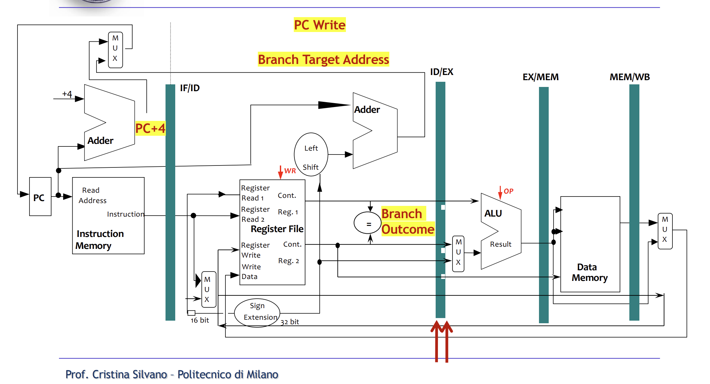 

通过增加硬件使得可以在ID阶段结束时得到分支结果以及跳转地址

1. Static Branch Prediction Techniques:
   The prediction (taken/untaken) for a branch is fixed at compile time for each branch during the entire execution of the program.
2. Dynamic Branch Prediction Techniques:
   The prediction for a branch can change at runtime during the program execution

## Static Branch Prediction Techniques

Effective when the branch behavior for the target appliction is highly predictable at compile time

1. Branch Always Not Taken

    Assume the branch will be always not taken  
    Suitable for **IF-THEN-ELSE** conditional statements (Forwarding-going branches)

   - Predict the branch not taken at the end of IF stage
   - Simple to implement (no need to know the Branch Target Address)
        
    If the prediction was incorrect:  
    - Need to flush the instruction already fetched (it is turned into a nop)
    - Need to fetch the instruction at the branch target address  
    --> One-cycle branch penalty

2. Branch Always Taken

    Suitable for backward branches such as for loops and do-while loops.

    We need to know the branch target address (BTA)  
    -> In the IF stage we need to add a branch target buffer

3. Backward Taken Forward Not Taken (BTFNT)

    - Backward-going branches are predicted as taken.
    - Forward-going branches are predicted as not taken.

4. Profile-Driven Prediction

    Based on profiling information collected during earlier runs about the branch behavior.

5. Delayed Branch Technique

    The compiler statically schedules an independent instruction in the branch delay slot.

    Four ways to schedule:  
    - From befor
    - From target
    - From Fall-Through
    - From after

## Dynamic Branch Predictin Techniques

based on two interacting hardware blocks:

1. Branch Outcome Predictor (BOP)
   To predict the direction of a branck (Taken or Not Taken)
2. Branch Target Buffer (BTB)
   To predict the branch target address in case of taken branch

Placed in the IF stage

### Branch History Table

1-bit branch history table:

Table containing 1 bit for each branch that says whether the branch was recently Taken or Not Taken.

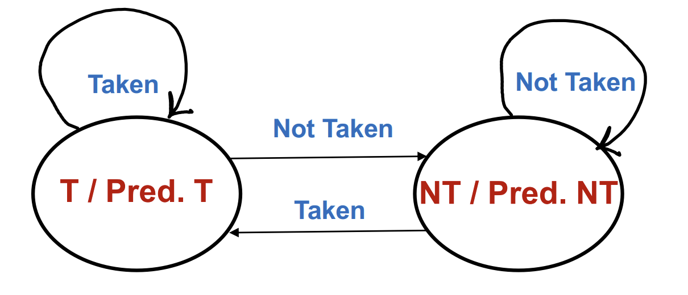 

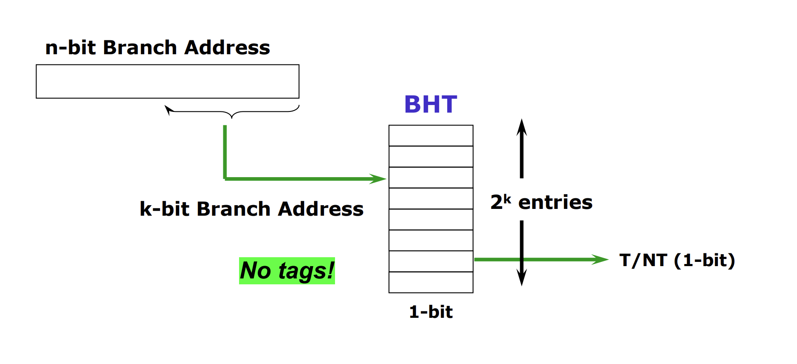 

---

2-bit branch history table:  

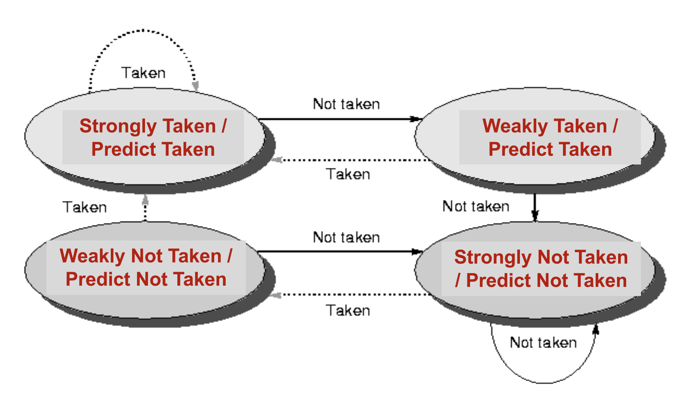 

### Branch Target Buffer

Branch Target Buffer (Branch Target Predictor) is a cache storing the Predicted Target Address (PTA) for the taken-branch instructions.

The BTB is used in combination with the Branch History Table in the IF stage.

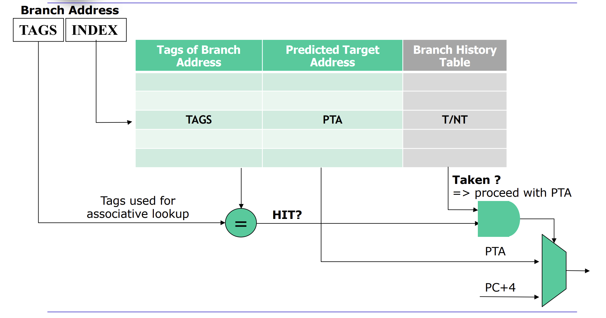 

### Correlating Branch Predictors

The idea is: the behavior of recent branches are correlated, that is the recent behavior of other branches rather than just the current branch can influence the prediction of the current branch.

Branch predictors use the behavior of other branches to make a prediction are called correlating predictors

Example a (1,1) Correlating Predictors means a 1-bit predictor with 1-bit of correlation


# Cache

## Temporal Locality（时间局限性） 和 Spatial Locality（空间局限性）
解決内存訪問的方法是利用訪問的局限性

1. Temporal Locality: 
   
   When there is a reference to one memory element, the trend is to refer again to the same memory element soon.

2. Spatial Locality

    When there is a reference to one memory element, the trend is to refer soon at the other memory elements whose addresses are closed by

缓存利用了这两个特性
- Exploit `temporal locality` by keeping the contents ofrecently accessed memory locations.
- Exploit `spatial locality` by fetching blocks of dataaround recently accessed memory locations.

## Cache memory

### Cache line

- The minimum chunk of data that can be copied in the cache is the `block` or `cache line`.
- To exploit the spatial locality, the `block size` must be a `multiple of the word size` in memory.
- Number of cache blocks = Cache Size / Block Size.

---
### Cache Hit and Cache Miss

1. Cache Hit  

    If the requested data is found in one of the cache blocks -> There is a hit in the cache access

2. Cache Miss

    If the requested data is not found in one of the cache blocks -> miss -> access the lower level of the memory hierarchy

    In this case, we need:
    - To stall the CPU
    - To require to block from the main memory
    - To copy(write) the block in cache
    - To repeat the cache access(hit)

---
**Hit Rate, Miss Rate**

$$Hit\ Rate = \frac{\#\ hits}{\# \ memory\ accesses}$$
$$Miss\ Rate = 1 - Hit\ Rate$$

Hit Time: time to access the data in the upper level of the hierarchy

$$Miss\ Time = Hit\ Time + Miss\ Penalty$$
Miss Penalty: is the time needed to access the lower level and to replace the block in the upper level.

AMAT：Average Memory Access Time
$$AMAT = Hit\ Rate * Hit\ Time + Miss\ Rate * Miss\ Time$$
$$AMAT= Hit\ Time + Miss\ Rate * Miss\ Penalty$$

How to improve cache performance?
1. Reduce the hit time
2. Reduce the miss rate
3. reduce the miss penalty

### Unified Cache vs. Separate I$ & D$ (Harvard architecture)

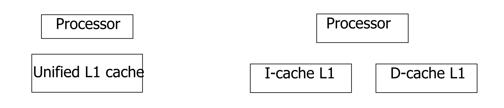 

Harvard 架构（Harvard Architecture）是一种计算机体系结构，它将指令存储器和数据存储器分开，分别使用不同的总线系统来访问。这一点与更常见的冯·诺依曼结构（Von Neumann Architecture）形成对比，后者使用同一个存储器来存储指令和数据。

$$
AMAT_{Harvard} = \%Instr \cdot (Hit\ Time + Miss\ Rate\ I\$ \cdot Miss\ Penalty) + \%Data \cdot (Hit\ Time + Miss\ Rate\$D \cdot Miss\ Penalty)
$$

Usually: Miss Rate I$ << Miss Rate D$ 

### Cache Structure

Each entry(cache line) in the cache includes:  
1. Vaild bit: to indicate if this position contains vaild data or not. At the bootstrap, all the entries in the cache are marked as INVALID.
2. Cache Tag(s): contains the value that identifies the memory address corresponding to the stored data.
3. Cache Data: contains a copy of data(block or cache line)

---
**Block placement**

Given the address of the block in the main memory, where the block can be placed in the cache

The correspondence depends on the cache structure:
- Direct Mapped Cache
- Fully associative Cache
- n-way Set-Associative Cache
---
### Direct Mapped Cache  

Each memory location corresponds to one and only one cache location

$$(Block\ Address)_{cache} = (Block\ Address)_{mem}\mod\ (Num.\ of\ Cache\ Blocks) $$

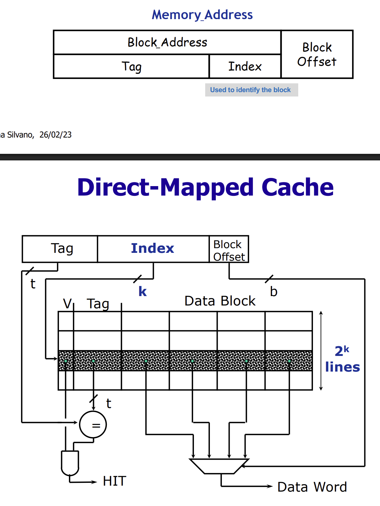 

Index用来判断cache中对应的地址，Tag用来检测是否Cache Hit(检测是否是我们需要的数据)，Block offset用来读取cache line中具体的某个数据

---

### Fully associative cache

In a fully associative cache, the memory block can be placed in any position of the cache

-> All the cache blocks must be checked during the search of the block(每次查找cache line时要遍历所有的cache line来找到对应的那个)

$$Number\ of\ blocks\ = Cache\ Size\  /\ Block\ Size $$

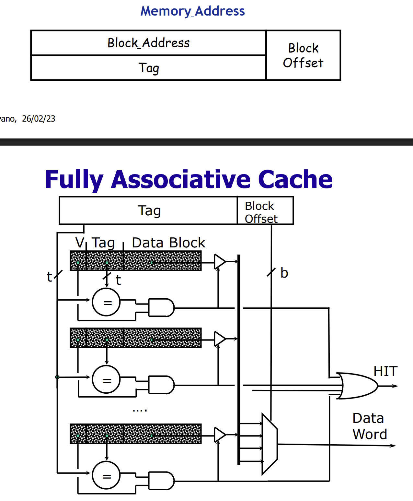 

---

### n-way Set Associative Cache

Cache composed of sets, each set composed of `n` blocks:

$$Number\ of\ blocks = Cache\ Size\ /\ Block\ size$$
$$Number\ of\ sets = Cache\ Size\ /\ (Block\ Size * n)$$

The memory block can be placed in any block of the set 

-> the search must be done on all the blocks of the set.

$$(Set)_{cache} = (Block\ address)_{mem} \mod\ (Num.\ sets\ in\ cache)$$

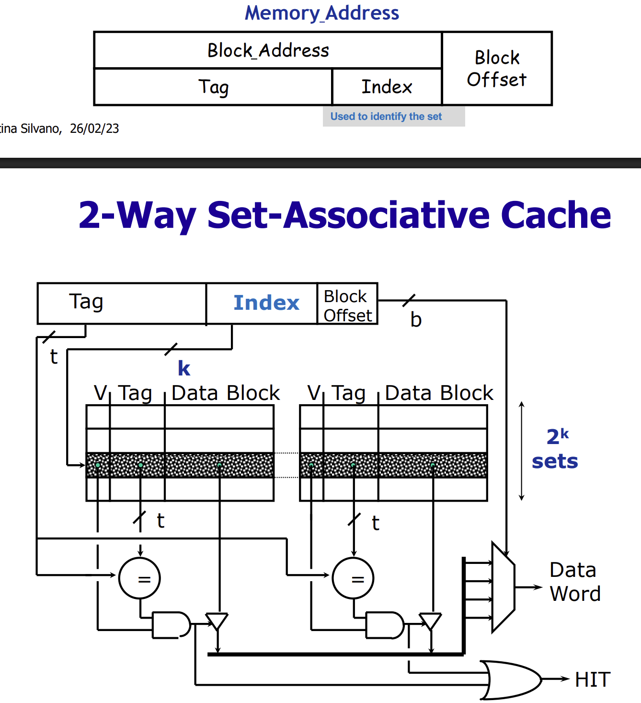 

---

**Increment of associativity**

Advantage:
- Reduction of miss rate

Disadvantage:
- Higher implementation cost
- Increment of hit time

Increasing associativity shrinks index bits, expands tag bits

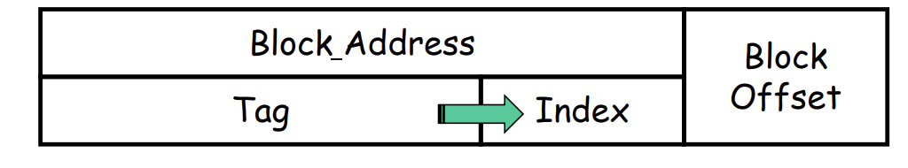 

---

**Replacement strategies**

The problem of block replacement:

Easy choice for direct mapped caches.

For Set associative or fully associative caches:
- Random
- LRU(Least Recently Used)
- FIFO

---

### Write-Through and Write-Back

- Write-Througe:   
    The information is written to both the block in the cache and to the block in the lower-level memory

- Write-Back:  
    The information is written only to the block in cache. The modified cache block is written to the lower-level memory `only` when it is replaced due to a miss.  
    We need a `dirty bit` to recored whether the block is clean or dirty(modified)  
    At the end of write in cache, the cache block becomes dirty(modified) and the main memory will contain a value different with respect to the value in cache —— `main memory and cache are not coherent`

Advantages:

1. Write-Through:
    - Simpler to be implemented, but to be effective it requires a `write buffer` to do not wait for the lower level of the memory hierarchy(to avoid write stall)
    - The read misses are cheaper because they do not require any write to the lower level of memory hierarchy
    - Memory always up to data.

2. Write-Back
    - The block can be written by the processor at the frequency at which the cache, insteal of main memory
    - Multiple writes to the same block require only a single write to the main memory.

---

### Write allocate and No write allocate

- Write allocate  
    Allocate new cache line in cache then write(double write to cache)  
    Means that you have to do a "read miss" to fill in rest of the cache-line  
    First read cache line from memory, then write corresponsed data.

- No write allocate  
    Simply send write data to lower-level memory. Don't allocate new cache line.

Usually:
- Write-Back cache uses the Write Allocate option
- Write-Through cache uses the No Write Allocate

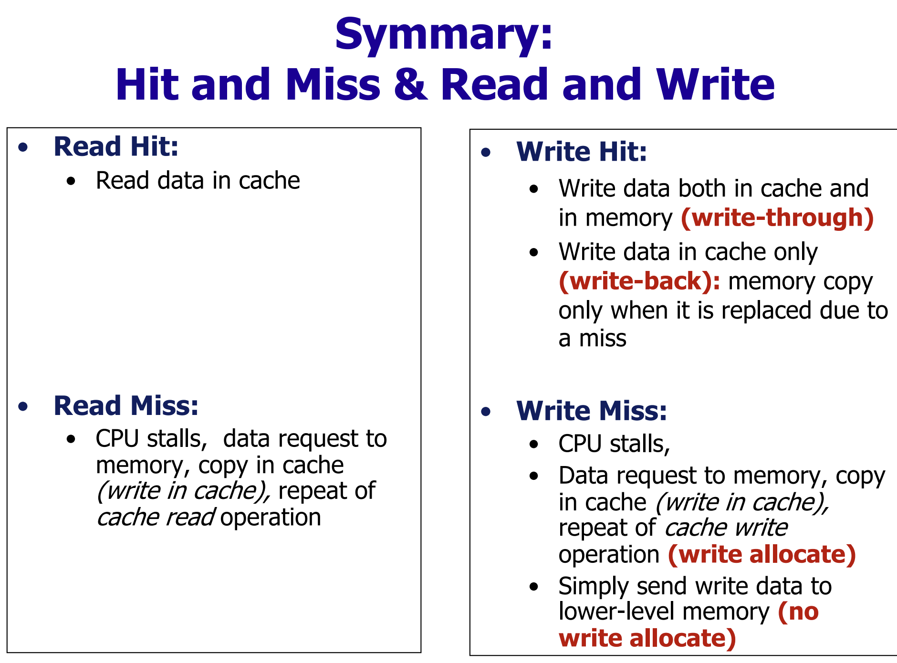 

---

**Local and global miss rate**

- Local miss rate

    misses in this cache divided by the `total numberof memory accesses to this cache`: the Miss rateL1 for L1 and the Miss rateL2 for L2

- Global miss rate

    misses in this cache divided by `the total number of memory accesses generated by the CPU`: 
    - For L1, the global miss rate is still just Miss Rate_L1
    - For L2, it is Miss Rate_L1 * Miss Rate_L2

Global miss rate is what really matters: it indicates what fraction of memory accesses from CPU go all the way to main memory

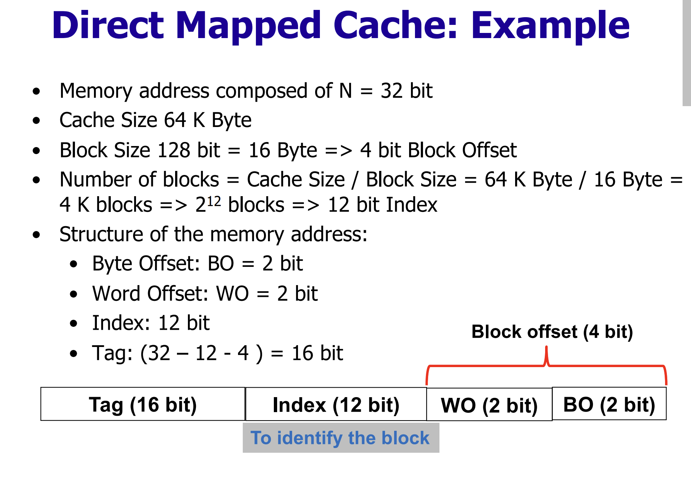 

## Classifying cache misses

Three major categories of cache misses:

- Compulsory Misses
- Capacity Misses
- Conflict Misses

1. Compulsory Misses(clod start misses or first reference misses):  
    - The first access to a block is not in the cache, so the block must be loaded in the cache from main memory.
    - There are compulsory misses even in an infinite cache: they are independent of the cache size.

2. Capacity Misses
    - If the cache cannot contain all the blocks needed during execution of a program, capacity misses will occur due to blocks being replaced and later retrieved.
    - Capacity misses decrease as capacity increases.

3. Conflict Misses
    - If the block-placement strategy is set associative or direct mapped, conflict misses will occur because a block can be replaced and later retrieved `when other blocks map to the same location in the cache`.
    - Conflict misses decrease as associativity increases.

## Improving cache performance

$$AMAT= Hit\ Time + Miss\ Rate * Miss\ Penalty$$

So, the idea is:
- Reduce the miss rate
- Reduce the miss penalty
- Reduce the hit time

 ### Reduce the miss rate

1. Larger cache size  
    Drawback: Increases hit time, area, power consumpution and cost

2. Larger block size  
    Larger block size will `reduce compulsory misses` taking advantage of `spatial locality`.

    Main drawbacks:
    - Larger blocks increase miss penalty
    - Larger blocks reduce the number of blocks so `increase conflict misses` (and even capacity misses) if the cache is small

3. Higher associativity  
    Higher associativity decreases the conflict misses.  
    (Higher associativity means each cache set contains more cache lines)

    The 2:1 cache rule:  
    Miss Rate Cache Size `N` ~= Miss Rate `2-way` Cache Size `N/2`

4. Victim Cache  
    Victim cache is small fully associative cache used as a buffer to place data discarded from cache to better `exploit temporal locality`.  
    It is checked on a miss to see if it has the required data before going to lower-level memory.  
    If the block is found in Victim cache the victim block and the cache block are swapped.

5. ...

### Reduce the miss penalty

### Reduce the hit time

# Virtual memory

- translate virtual addresses to the physical address(memory mapping)
- The virtual address space is much larger than the limits imposed on the physical address space by the limited amount of main memory in DRAMs
- Many process applications on the machine sharing the main memory

虚拟内存就像cache和memory的关系，main memory被视为硬盘的cache，cache中的block在虚拟内存中叫做page

A `page fault` happens when a virtual page has not been allocated in the main memory and it resides on the disk

 

## Page Table

- The translation mechanism between virtual pages to pysical pages is based on a page table associated to each process: ---Each process needs its own page table
- The page table maps virtual page numbers to physical page numbers
- The page table for each process is located in the main memory  
  —— The location of the page table in main memory is given by the page table register that points to the start address of the page table.
- The virtual page number is used as `index` to access the page table.

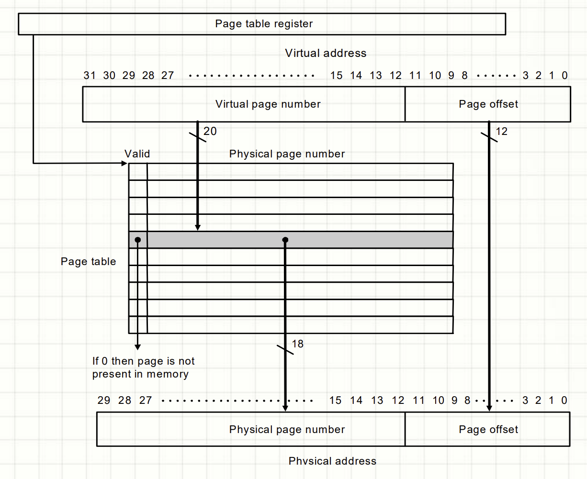 

The page table requires a validity bit to distinguish between pages in memory and pages in disk storage

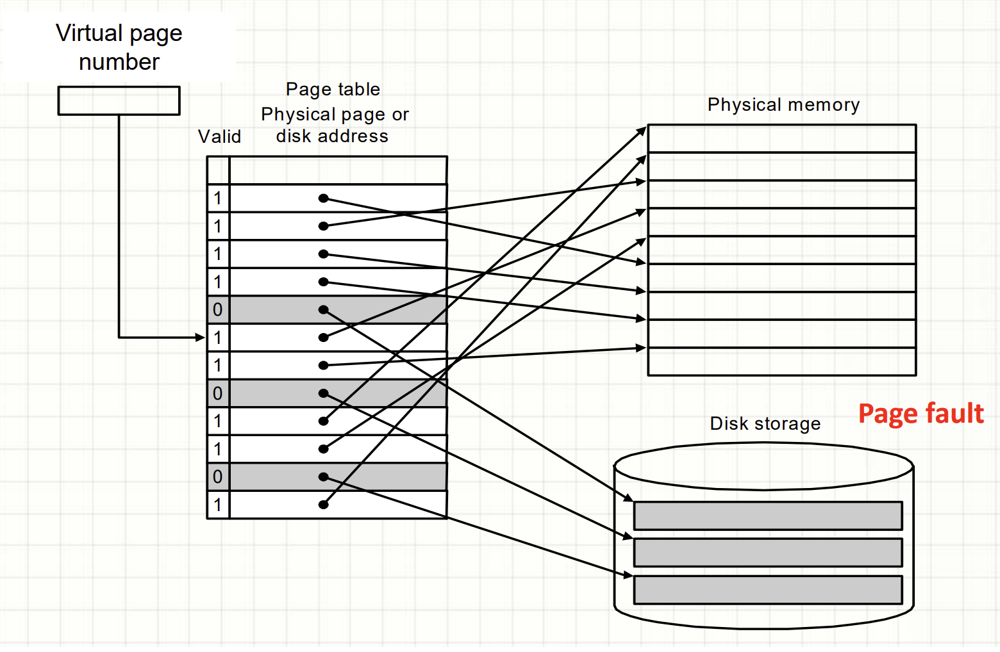 

How to make address translation fast

Since the page table is located in main memory, each memory address generated by the CPU requires 2 memory accesses:
- first access to the page table to get the physical address
- second access to get the data.

So, the idea is add a special cache to keep track of recently used translations

## Translation Lookaside Buffer(TLB)

Add a special cache called TLB to speed up the address translation.

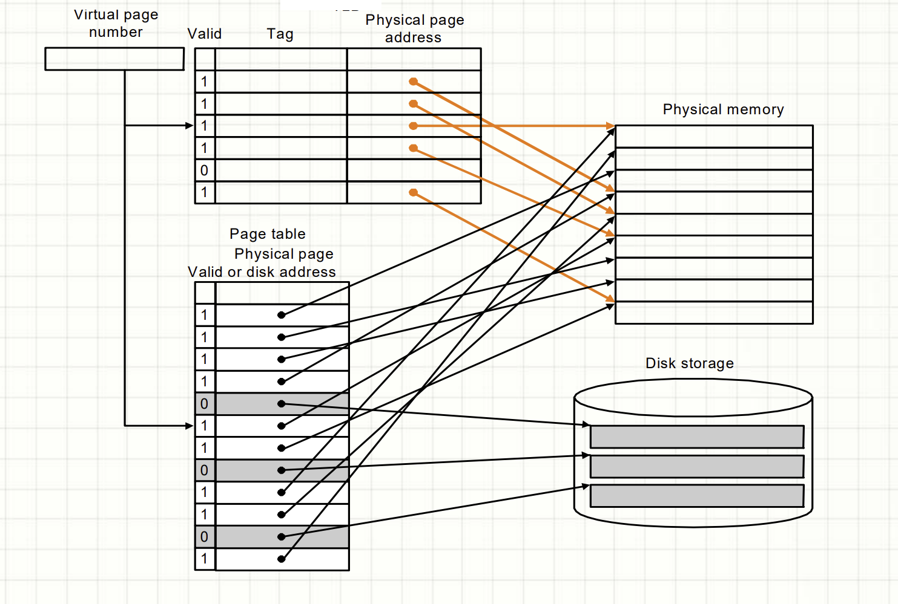 

TLBs are:  
- Small caches: typcially not more than 128 - 256 entries
- Typically, fully associative caches

A TLB miss maybe due to a real TLB miss or to a page fault:
- If it is a real TLB miss: the page exists in main memory and we need to upload in the TLB the page translation from the page table
- If the miss is due to a page fault: the page is not in the main memory and the CPU invokes the OS to activate a Page Fault Handler routine

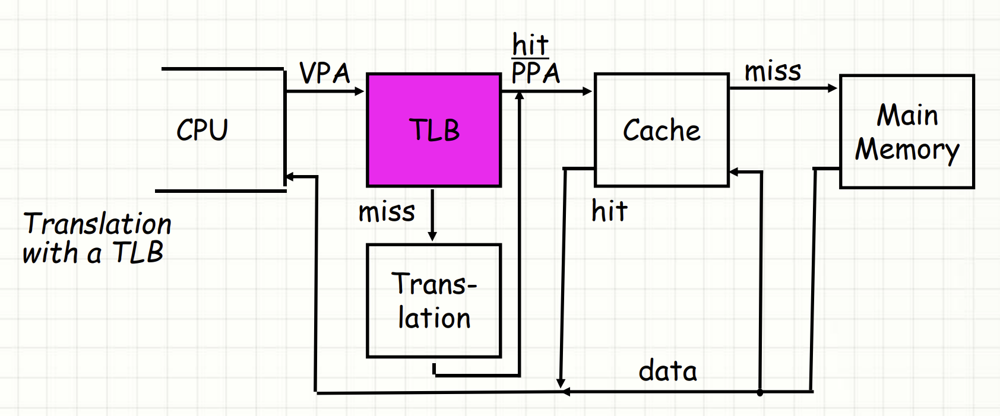 
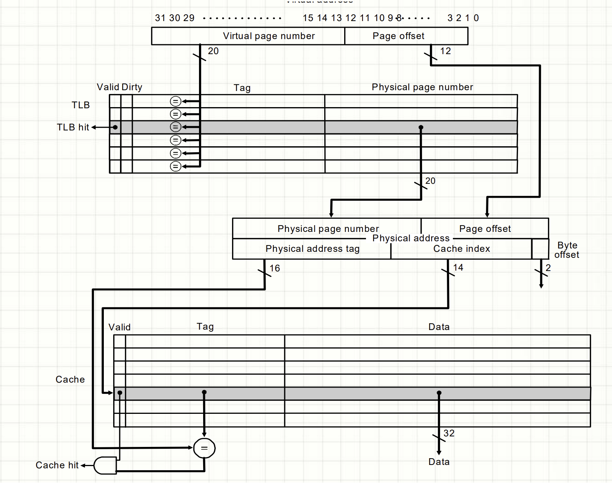 

# ILP (Instruction Level Parallelism)

ILP refers to the parallel execution of independent instruction from a single thread of execution within a processor

## Basic (CPI, IPC)

- IF: Instruction Fetch, 取指
- ID: Instruction Decode, 译指
- EX：Execution, 运行
- ME: Memory Access, 访存，包括读内存和写内存
- WB: Write Back, 写回，将值写回寄存器

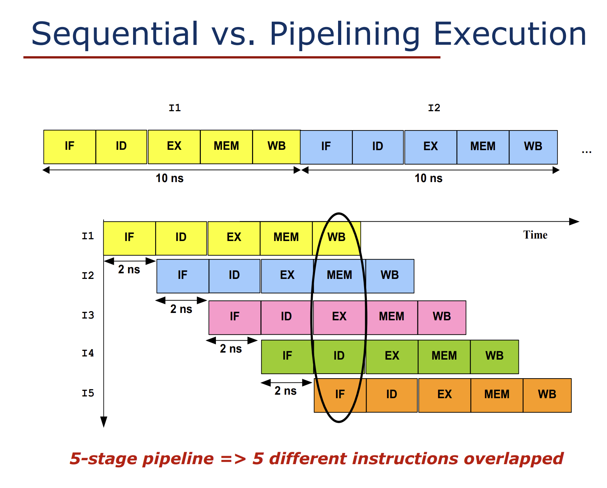 

Pipelining overlaps the execution of instructions -> it exploits the "Instruction Level Parallelism"

IPC: Instructions per cycle (每周期指令数):  
表示CPU每个时钟周期能完成多少条指令

CPI: Cycles per instruction (每指令周期数):  
表示平均每条指令需要多少个时钟周期才能完成

Maximize performance in terms of throughput: `Instructions per clock(IPC)`  
Minimize the `CPI = 1 / IPC`

In ideal situtation, IPC = 1, CPI = 1

## Dependences

There are three different type of dependences in a code:

1. True Data Dependences:  
   An instruction j is dependent on a data produced by a pervious instruction i

2. Name Dependences:  
   Two instructions use the same register or memory location    
   Can be sloved by register renaming.  
   Name dependences include two type:
   - Anti-dependence
   - Output-dependence  

3. Control Dependences:  
   They impose the ordering of instructions

- RAW hazards correspond to true data dependences
- WAR hazards correspond to anti-dependences
- WAW hazards correspond to output dependences

## Imprecise execptions

在发生异常时，处理器无法准确地指出哪个指令引发了异常，或当时系统中哪些指令已经执行、哪些未执行。

精确异常（Precise Exceptions）定义：  
一个异常是精确的，如果在异常被报告时：  

1. 所有在异常指令之前的指令都已完全执行；

2. 异常指令以及其后的所有指令都没有对系统状态产生任何影响（即它们未执行）。

不精确异常（Imprecise Exceptions）定义：  
当异常发生时，如果：

1. 有的后续指令已经部分或全部执行；

2. 或者系统不能准确回溯异常的指令；

## Multi-Cycle Pipelining & Dynamic Scheduling

Assumption:

Previous:  
- Single-issue processors (one instruction issued per clock cycle)
- Instructions are issued in-order

Now:  
- Execution stage might require multiple cyclts latancy (ie. multiple operations are typically longer than add/sub operations)
- Memory stages might require multiple cycles access time due to instruction and data cache misses

### Multi-cycle In-Order Pipeline

每条指令可以在某些阶段占用多个周期，但所有指令必须顺序进入/完成流水线。

Delayed WB -> `all operations have same latency to WB stage` to force in-order commit of instructions.

`One instruction in & one instruction out at every cycle`

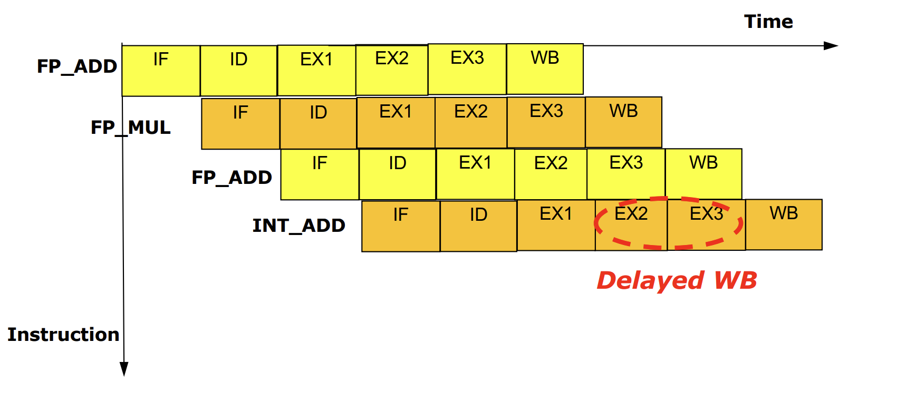 

### Multi-cycle Out-of-order Pipeline

- ID stage split in 2 stages: Instruction Decode(ID) & Register Read(IS)
- Multiple functional units with variable latency
- Long latency multi-cycle floating-point instructions
- Memory system with variable access time
- No commit point -> need to check for WAR & WAW hazaeds and imprecise exception

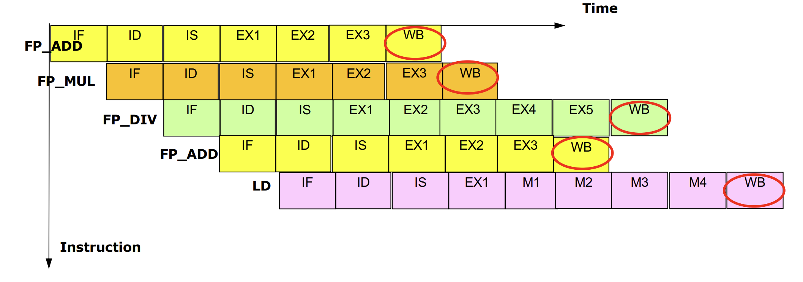 

- In-order issue of instructions
- Out-of-order execution and out-of-order commit of instructions
- Need to check for WAR & WAW hazaeds and imprecise exception

### Dynamic Scheduling

Due to true data dependences that cannot be solve by forwarding, cause stall of the pipeline -> No new instruction are fetched even if they are not data dependent.

Thus, the idea is:  
**Allow data independent instructions behind a stall to proceed.**  
HW manages dynamically the instruction exection to reduce stalls:   
**An instruction execution beings as soon as their operands are available** or  
**Execution beings as soon as RAW hazards are sloved and operands are available**

This generates out-of-order execution and commit

## Multiple-Issue processors

Scalar pipeline limited to CPI = 1
- It can never fetch and execute more than one instruction per clock: single-issue
- It can be even worst due stalls added to solve hazards

Thus, our ideal is multiple-issue, means that we can **fetch and execute more than one instruction per clock**

To achieve it, instruction dependences must be detected and sloved: instructions must be re-oredered (scheduled)

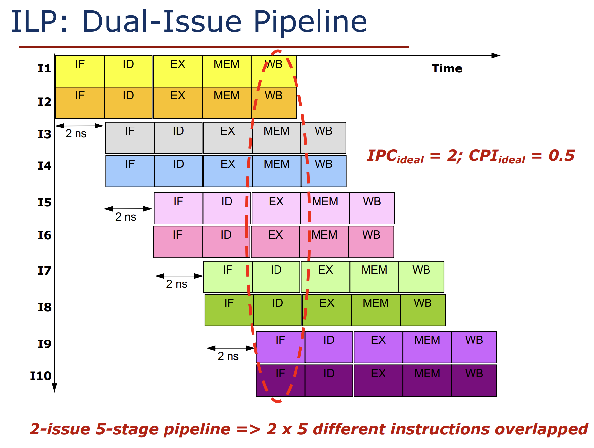 
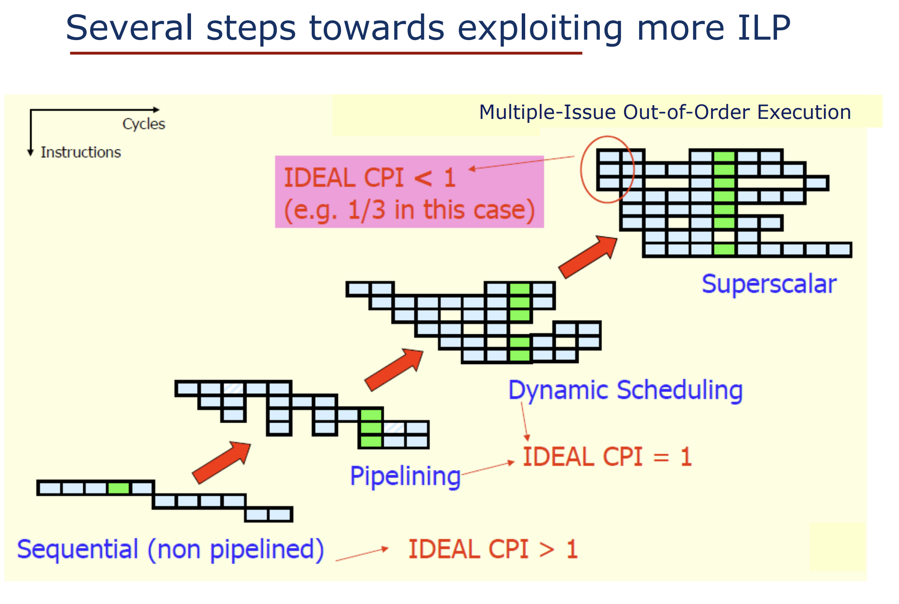 

Superscalar Execution:  
**Multiple-issues and dynamic scheduling**

Pros:  
- very high performance

Cons:  
- Very complex logic and area cost to check and manage dependencies at runtime
- Cycle time limited by scheduling logic
- It does not scale well 

## Static Scheduling

Static scheduling done by the compiler  
Instruction dependences are avoided by code reordering at compile time

Output of the compiler: instructions are reordered into dependency-free parallel instructions, otherwise NOPs are introduced in the code.

Typivsl architecture: VLIW (Very Long Instruction Word) processors expect dependency-free code generated at static time by the compiler

VLIW的核心思想是将多个操作（操作指令）打包进一条很长的指令字，然后一次性发给多个执行单元并行执行。

例如，一条VLIW指令可能看起来像：
```
| ALU op | FPU op | Load op | Branch op |
```
这条指令会在一个周期内发到 4 个执行单元并行执行。

**Main limits of static scheduling:**  
- Unpredictable branch behavior: the code parallelzation is limited to basic blocks.
- Unpredictable cache behavior: Variable memory latency for hits/misses.
- Complexity of compiler technology
- Code size explosion due to insertion of NOPs

## Static vs. Dynamic scheduliing

- Static scheduling: Rely on the compiler for identifying potential parallelism (at compile time)
- Dynamic scheduling: Depend on the hardware to locate parallelism (at runtime)

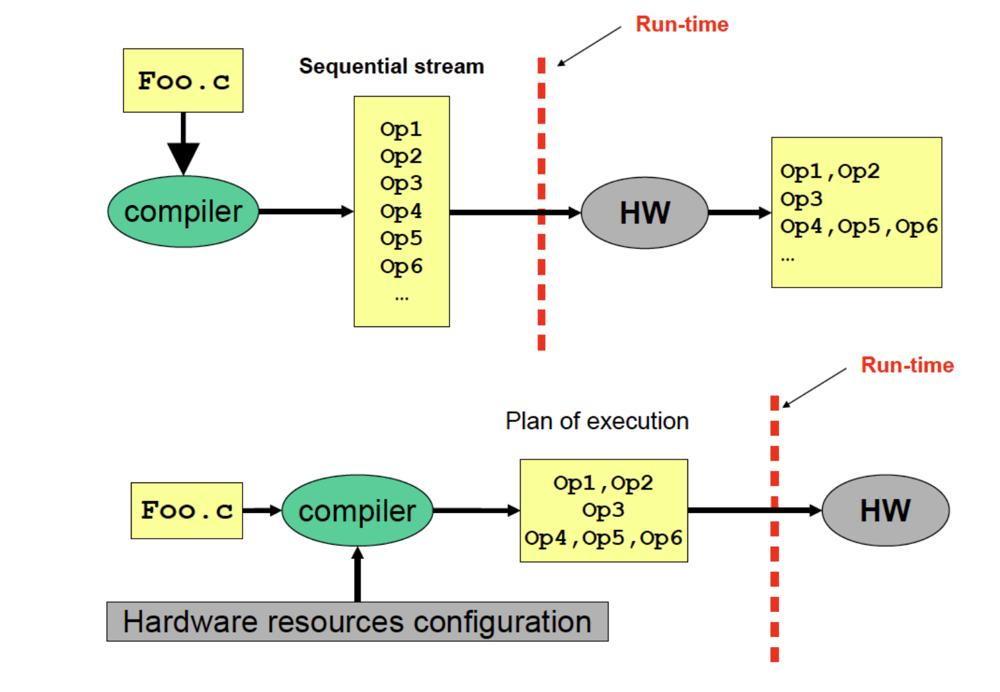 

## Scoreboard Dynamic Scheduling Algorithm

### Basic assumptions

- Consider a **single-issue** processor
- **in-order issue**
- Instruction execution beings as soon as operands are ready whenever not dependent on previous instructions (no RAW hazards)
- There are multiple pipelined function units with variable latencies.
- Execution stage might require multiple cycles, depending on the operation type and latency.
- Memory stage might require multiple cycles access time due to data cache misses.

-> **In-order issue, Out-of-order execution and out-of-order commit**

We distinguish when an instruction **beings execution** and it **completes execution**: between the two times, the instruction is **in execution**

No forwarding

Imprecise exception model

### Basic scheme

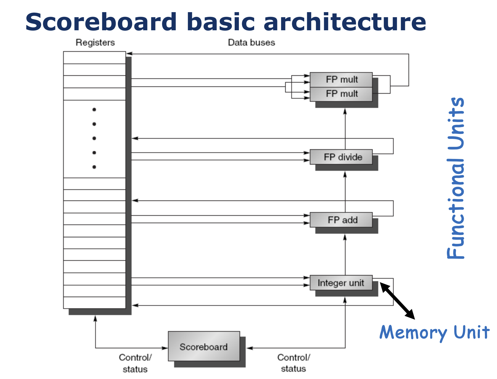 

Scoreboard divides the ID stage in two stages:  
1. Issue - Decode instructions and check for structural hazards
2. Read operands (RR) - wait until not dependent on previous instructions and no data hazards, then read operands.

Scoreboard keep track of dependencies and state of parallel ongoing operations

Instructions **pass through the issue stage in-order**, but they can be stalled or bypass each other in read operand stage (**out-of-order read**)

**Summary:** In-order issue but out-of-order read operands -> out-of-order execution & commit

---

No register renaming (This is compile time technique)  
Out-of-order commit  
-> WAR and WAW hazards can occur

- Solution for WAR:
    - Read register only during Read Operands stage
    - Stall write back until previous register have been read.
- Solution for WAW
  - Detect WAW hazard and stall issue of new instruction until previous instruction which causes WAW completes.

---

Any hazard detection and resolution is centralized in the Scoreboard:  
- Every instruction goes through the Scoreboard, where a record of data dependences is constructed
- The Scoreboard then determines when the instruction can read its operand and begin execution (check for RAW)
- If the Scoreboard decides the instruction cannot execute immediately, it monitors every change and decides when the instruction can execute.
- The scoreboard controls when the instruction can write its result into destination register (check for WAR & WAW)

---

**Keep track of the status of instructions, functional units and registers**

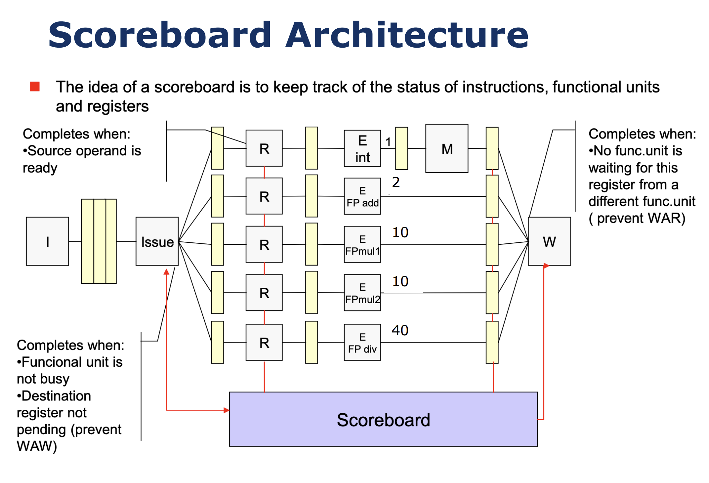 

### Four stages of scoreboard control

1. Issue
    Decode instruction and check for **structural hazards** and WAW hazards.

    - If **a functional unit** for the instruction is available (no structural hazard) and no other active instruction has the same destination register (no WAW hazard) ->  the Scoreboard issues the instruction to the FU and updates its data structure.
    - If either a structural hazard or a WAW hazard exists -> the instruction issue stalls until these hazards are solved.

    Issue阶段要判断对应的FU是否可用，如果不可用则不进入issue阶段

    **注：** Scoreboard是in-order issue，所以当一条指令阻塞在issue之前，后面的指令也不能运行  

    **注：** 对于structural hazards，并不是对应的unit完成了就可以进行下一条，而是需要对应的指令完成后才能进行下一条

2. Read Operands  
   Wait until no RAW hazards -> then read operands.

    A source operand is available if:  
    - No earlier issued active instruction will write it or  
    - A function unit is writing its value in a register

   **RAW hazards** are solved dynamically in this step

3. Execution  
    The FU begins execution upon receiving operands. 

    When the result is ready, it notifies the Scoreboard that execution has been completed.

4. Write result  
    Check for WAR hazards  
    Check for structureal hazards in writing RF and finish execution

    Once the Scoreboard is aware that the FU has completed execution, the Scoreboard checks for WAR hazards.
    - If none, it writes results
    - else, the Scoreboard stalls the completing instruction

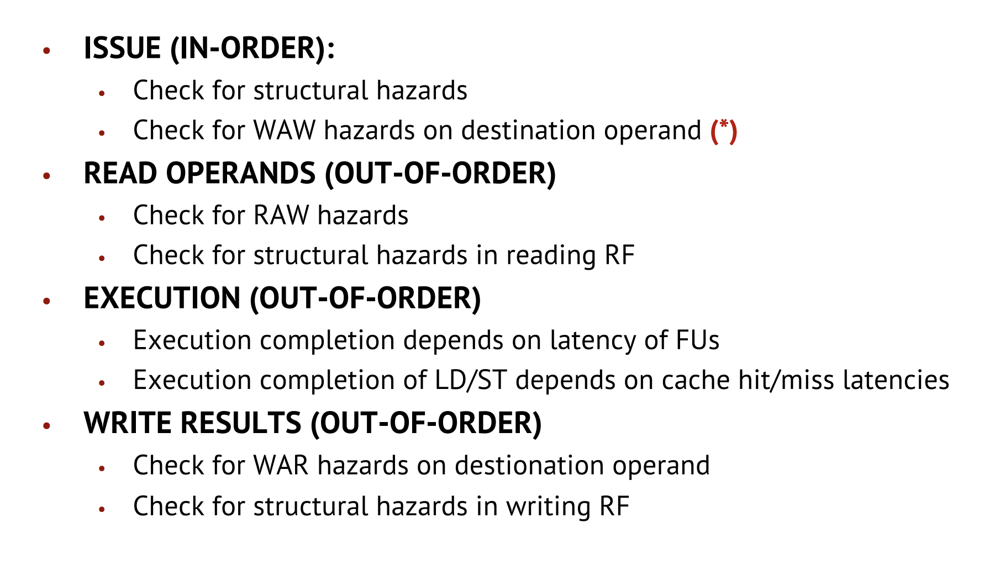 

**Attention:** Scoreboard can be optimized by:
- Check for WAW postponed from ISSUE stage to WRITE stage
- Forwarding

Forwarding是指在结果尚未写回寄存器文件之前，直接从流水线后段将结果传递到需要它的前段阶段以供下一条指令使用  
也就是说对于RAW hazards，前一条指令在完成EX阶段之后下一条指令就可以运行而不用stall到WB阶段之后

## Tomasulo dynamic scheduling algorithm

Same with other dynamic scheduling algorithm  
Tomasulo enables instructions execution behind a stall to processed

The different is:  
Tomasulo introduces the implicit register renaming to avoid WAR & WAW hazards

### Basic concepts

Tomaslo intrduces some FU buffers called "Reservation Stations"(RSs) in fronts of the FUs to keep pending operands

The control logic & RSs are distributed with function units (vs. centralized in scoredboard)

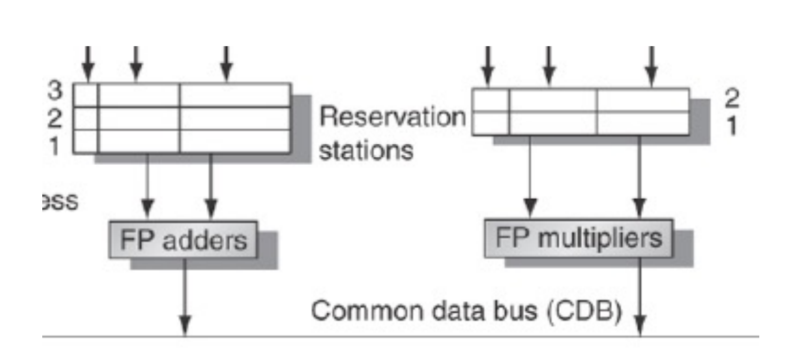 

Registers in instructions are replaced by their values or pointer to reservation stations (RS) to enable implicit register renaming.  
- Avoids WAR, WAW hazards by renaming results by using RS numbers instead of RF numbers
- More reservation stations than register, so can do optimizations compilers can't

The basic idea is:   
Results are passed to FUs from Reservation Stations, not through Registers, over to common data bus that **boardcasts** results to all FUs and to store buffers

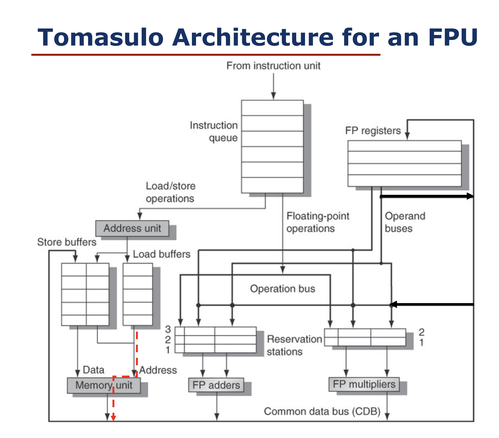 

### Register File and Store Buffers

Each entry in the RF and in the store buffers have a value (V_i) and a Pointer (Q_i) field.  
每个存储在寄存器文件和store buffer的数据都有一个值和一个指针

值表示寄存器或者buffer中的值  
指针并不是传统意义上的指针，而是一个Tag，表示从对应编号的RS获取结果  
如果Q_i为0意味着值已经在register或者buffer里面了（即V_i）

### Tomasulo stage

1. Issue  
    - Renaming register
    - WAR resolution: If I write Rx, read by an instruction K already issued, K knows already the value of Rx read in RS buffer or knows what instruction will write it. So that RF can be linked to I
    - WAW resolution: Since we use in-order issue, the RF can be linked to I.

2. Start Execution  
    - When both operands ready (Check for RAW hazards sloved)
    - When FU available (Check for structural hazards in FU)
    - If, not ready, monitor the Command Data Bus for results.

3. Write result

- When result is available, write it on Common Data Bus and from there into Register File and into all RSs waiting for result.  

1. Issue阶段
    从指令队列中取出一条指令：
    - 找到可用的RS
    - 检查操作数：
      - 如果就绪，存入V字段
      - 如果未就绪，存入Q字段（即等谁来给我值）
    - 目标寄存器也不立即更新，而是记录等待哪个RS的结果

2. Execute阶段
   - 当所有操作数就绪（Q为空，V有值）
     - 指令开始在对应的FU执行

3. Write Result阶段
   - 执行完成后通过commond data bus广播结果
     - 所有等待这个结果的RS/寄存器，更新V并且清空Q
   - 目标寄存器更新值，同时清空Q字段
   - RS被标记为空，可以发射新指令

**注：**  RS的更新是在Write result阶段之后的

## VLIW Architectures

Static scheduling: The compiler issues statically a fixed number of instructions at each clock cycle

Compilers can use sophisticated algorithms for code scheduling to exploit ILP  

- Detect whether instructions can be parallelized given the hardware resource constraints and the data dependencies
- Schedule statically instructions to be executed in parallel, otherwise insert NOPs.

--- 

The single-issue packet represents a wide instruction with multiple independent operations per instruction  
which named **Very Long Instruction Word**

The complier solves statically the structural hazards and data hazards, otherwise the compiler inserts NOPs.

---

The long instruction (bundle) has a fixed set of operations.  
Example: A 4-issue VLIW has a long instruction to contain **up to** 4 operations corresponding to 4 slots.

There is a Shared Multi-ported Register File:  
If the bundle has 4 slots -> we need 2 * 4 = 8 read ports and 4 write ports to read 8 source register per cycle and to write 4 destination register per cycle.

To keep busy the FUs, there must be enough parallelism in the source code to fill in the available 4 operation slots. Otherwise, **NOPs are inserted**

If each slot is assigned to a Functional Unit => the decode unit is a simple decoder and each op is passed to the corresponding FU to be executed.

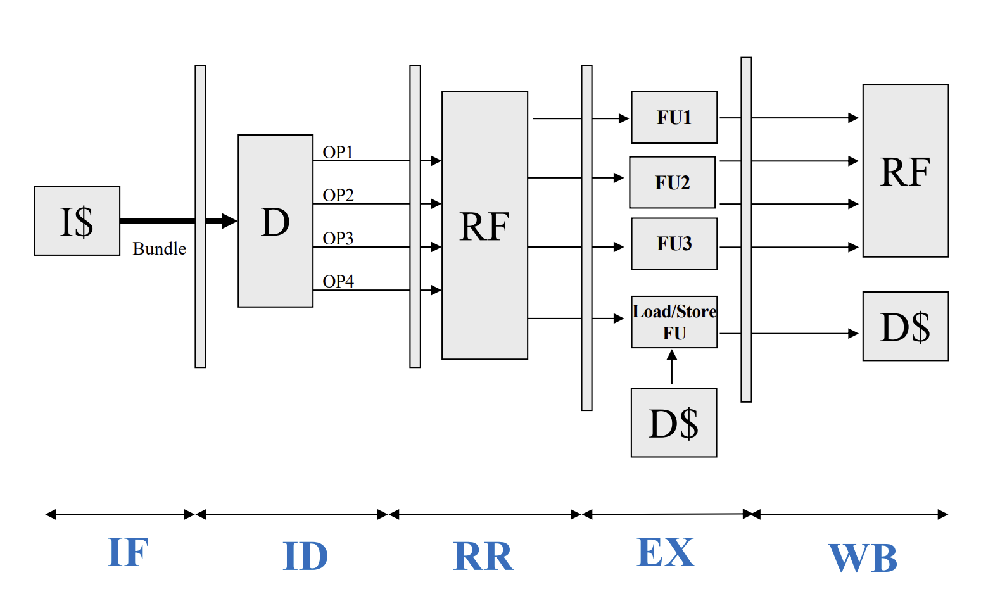 

If there are more parallel FUs than the number of issues (slots) => the architecture must have a dispatch network to redirect each op and the related source operands to the target FU.

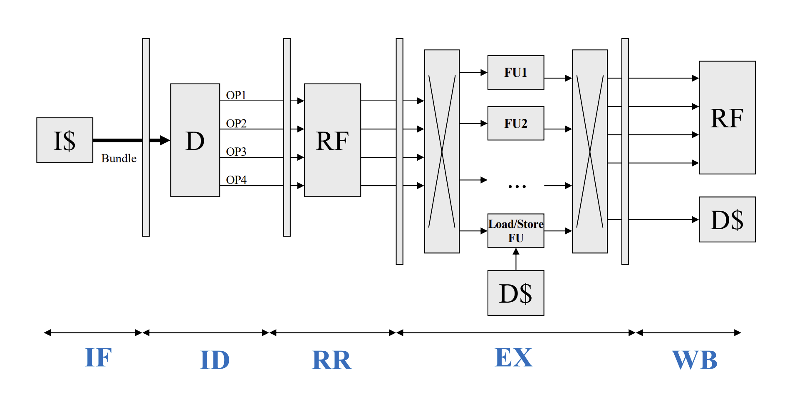 

---

To solve PAW hazards in VLIW processors:  

- The compiler during the scheduling phase reorders statically instructions
- Otherwise, the compiler introduces some NOPs.

Operation latencies and data dependencies must be exposed to the compiler  
For example:
```
I       [C = A * B, ...];   latency 2 cycles
I + 1   [NOP, ...];         inserted by complier
I + 2   [X = C * F, ...];   
```

WAR and WAW hazards are statically solved by the compiler by correctly selecting temporal slots for the operations or by using Register Renaming.

---

To keep in-order execution, the Write Back phase of the parallel ops in a bundle must **occur at the same clock cycle**.

**注：** Ops in a bundle are constrainted to the latency of the longer latency op in the bundle.

---

The compiler at static time does not know the behavior of some dynamic events such as: 

- Data cache misses: Stalls are introduced at runtime
- Branch misprediuctions: Need of flushing at runtime the execution of speculatibe instructions in the pipeline

$$code\ efficiency =  Instruction\ count\ /\ (cycles\ *\ issues)$$

# Multithreading

TLP refers to parallel execution of multiple threads, each potentially executiong on its own processor

Three types of multithreading:  
1. Coarse-grained multithreading:  
    When a thread is stalled, another thread can be executed.

2. Fine-grained multithreading:  
   Switching from one thread to another thread **on each instruction**

3. Simultaneous multithreading:  
   Multiple thread are using the multiple issue slots in a single clock cycle -> exploting TLP and ILP

## Coarse-grained Multithreading

Prons:  
- **Long stall** are hidden by switching to another thread that uses the resouces of the processor

Cons:
- Within each clock, ILP limitation still lead to empty issue slots.
- When there is one stall, it is necessary to empty the pipeline befor starting the new thread.
- The new thread has a pipeline start-up period with some idle cycles remaining and loss of throughput

## Fine-grained Multithreading

Switches between threads on each instruction.  
Execution of multiple thread is interleaved in a round-robin fashion, **skipping any thread that is stalled at that time eliminating fully empty slots**
Suitable for single- and multiple-issue dynamic scheduled processors.

Prons:  
- It can hide both short and long stalls because instructions from other threads are executed when one thread stalls.

cons:  
- It slow down the execution of individual threads, since a thread that is ready to execute without stalls will be delayed by another threads.
- Higher overhead due to more frequent HW context switch

## Simultaneous Multithreading (SMT)

Suitable for multiple-issue dynamic scheduled processors.  
Multiple thread are using the multiple issue slots in a single clock cycle -> exploiting TLP and ILP.  

prons:  
- Sutiable to maximize the use of parallel functional units available in the multiple-issues by different threads.
- Exploit more parallelism than coarse- and fine-grained MT.
- Minimize the number of issue slots that are left unused at the same clock cycle by coarse- and fine-grain MT

cons:  
- In large multiple-issue processors requires complex dynamic control logic to keep busy the multiple slots
- Higher overhead and power consumption
- It is limited by the number of issues available in the processor

# Multiprocessors

## How to connect processors

1. Single bus  
    Single-bus approach imposes constraints on the number of processors connected to it

2. network-connected  

### Cost/Performance Tradeoffs

1. Cost:  
    The network-connected has a smaller initial cost, then the costs scale up more quickly than the bus-connected machine
    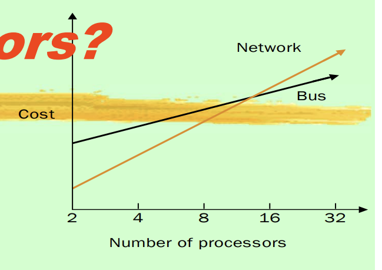 

2. Performance  
   Performance for both machines scales linearly until the bus reaches its limit, then performance is flat no matter how many processors are used.
    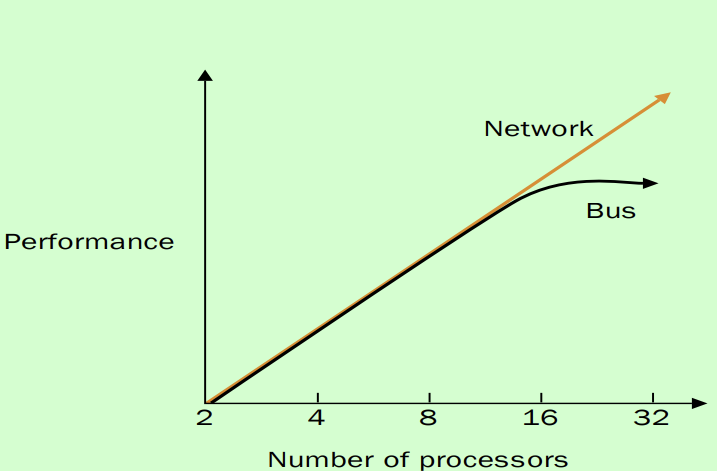 

### Architecture

1. Arch. of Single-Bus Multiprocessors:  
   The connection medium (the bus) is between the processors and memory -> the medium is used on every memory access.
   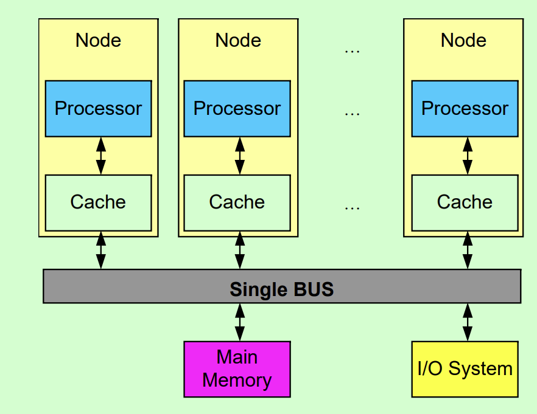

2. Arch. of Network-Connected MPs  
   Memory is attached to each processor, and the connection medium (the network) is between the nodes -> the medium is used only for interprocessor communication.  
   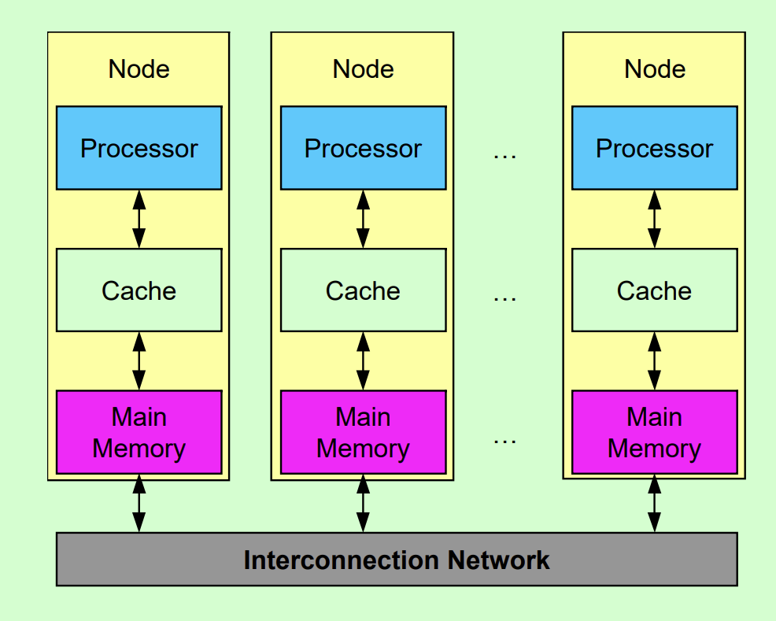

### Memory model

1. Single logically shared address space (shared memory architectures)  
    A memory reference can be made by any processor to any memory location through loads/stores

    - The processors communicate among them through shared variables in memory
    - Communication among threads occurs through a shared address space
    - The shared memory can be centralized or distributed over the node.
    - Shared memory model imposes the cache coherence problem among processors
    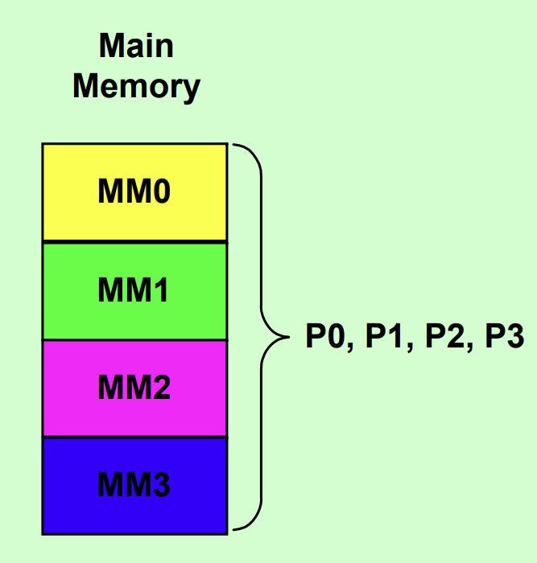

2. Multiple and private address spaces (message passing architectures)  
    The processors communicate among them through send/receive primitives

    - The processors communicate among them through sending/receiving message: message passing protocol
    - The memory of one processor cannot be accessed by another processor without the assistance of software protocols
    - No cache coherence problem among processors  
    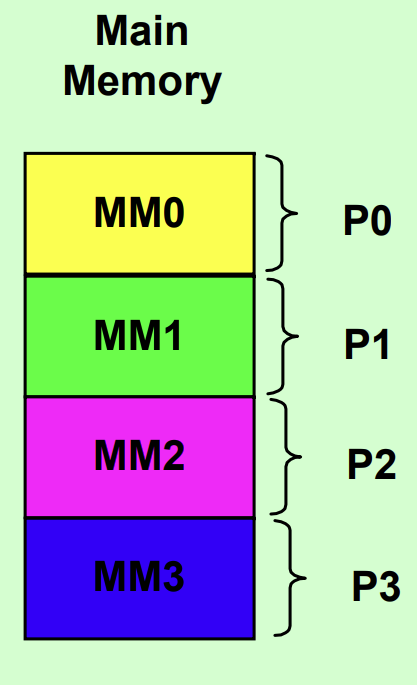

## Distributed Shared Memory (DSM)

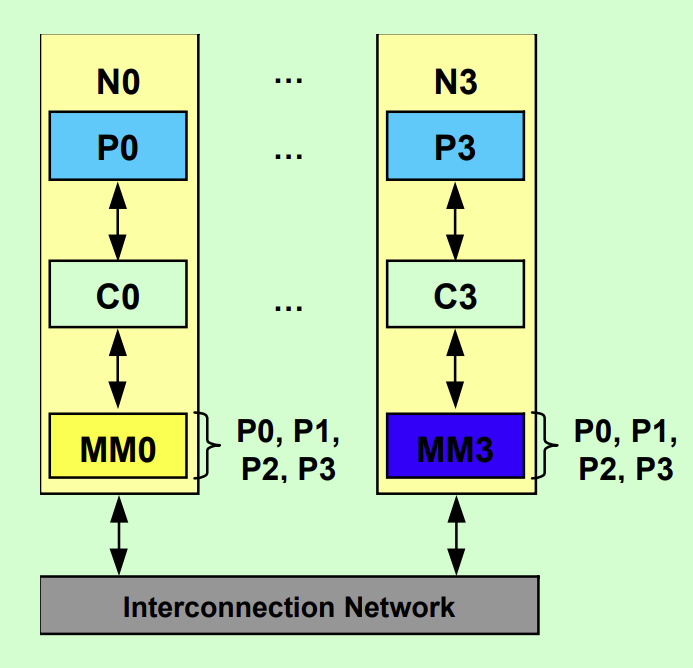

Centralized Memory:  
UMA (Uniform Memory Access): The access time to a memory location is uniform for all the processoes.

Distributed Memory:  
NUMA (Non Uniform Memory Access): The access time to a memory location is non uniform for all the processors: it depends on the location of the data word in memory and the processor location


- Each processor core shares the entire memory space
- Access time to the memory attached to the processor's node will be much faster than the access time to the remote memories

## Pros/Cons of shared memory

pros:  
- implict communication
- low latency
- low overhead when shared data are cached

cons:  
- complex to build in a way that scales well
- requires synchronization operations
- hard to control data placement within caching system

## Pros/Cons of message passing

pros:  
- explicit communication
- easier to control data placement

cons:
- message passing overhead can be quite high
- more complex to program
- introduces question of reception technique

## Cache Coherence

Cache serve to:  
- Increase bandwidth versus bus/memory
- reduce latency of accesses
- valuable for both private data and shared data

The use of multiple copies of same data introduces a new problem: cache coherence

Processors may see different value through their cache  
Processors must have the most recent copy when reading an object, so all processors must get new values after write

A write to a shared data can cause:  
- either to invalidate all other copies
- or to update the shared copies

Key issue to implement a cache coherent protocol in multiprocessors is **tracking the state of any sharing of a data block**

Two classes of protocols: 
- Snooping Protocols
- Directory-Based Protocols

---
### Snooping Protocols

Each core tracks the sharing state of each block
- A cache controller monitors (snoops) on the bus, to see what is being requested by another cache

每个缓存都监听总线上发生的所有事务(snoops), 并根据这些事务的内容更新自己的缓存状态，以保证缓存与主内存以及其他缓存保持一致

- All cache controllers monitor snoop on the bus to determine whether or not to update the state and content of the shared block
- Every cache that has a copy of the shared block, also has a copy of the sharing state of the block
- Send all requests for shared data to all processors
- Require broadcast

Suitable for **Centralized Shared-Memory Architectures**, and in particular for **small scale multiprocessors with single snoop bus**

---
Two types of snooping protocols depending on what happens on a write operation:  
- Write-Invalidate Protocol
- Write-Update (or Write-Broadcast) Protocol

1. Write-Invalidate Protocol  
    - The writing processor issues an invalidation signal over the bus to cause all copies in other to be invalidated **before** changing its local copy
    - The writing processor is then free to update the local data until another processor asks for it
    - All caches on the bus check to see if they have a copy of the data and, if so, they must invalidate the block containing the data
    - This scheme allows multiple readers but only a single writer

    When read miss:  
    - Write-through: Memory always up-to-data
    - Write-back: Snoop in caches to find the most recent copy:  
      - On write: invalidate all other cache copies and memory not up-to-date
      - On next read miss: first write-back to memory, then copy in cache
        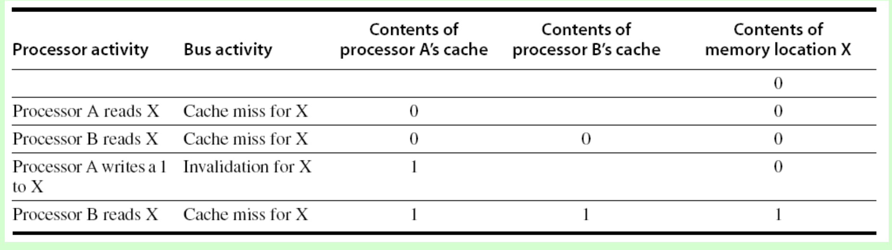
2. Write-Update Protocol

    The write processor broadcasts the new data over the bus; all cache check if they have a copy of the data and, if so, all copies are updated with the new value
---
#### MSI

Write-Invalidate Snooping Protocol, Write-Back Cache

Each cache block can be in one of three states:
- Modified (or Dirty): cache has the only copy, its writeable, and dirty (block cannot be shared anymore) (此缓存行是被修改过的版本，和主内存不一致，只有本处理器拥有该数据副本。必须在换出或共享前写回内存。)
- Shared (or Clean): The block is clean (not modified) and can be read
- Invalid: bloclk contains no valid data

Each block of memory is in one of three states:
- **Shared** in all cache and up-to-data in memory
- **Modified** in exactly one cache
- **uncached** when not in any caches

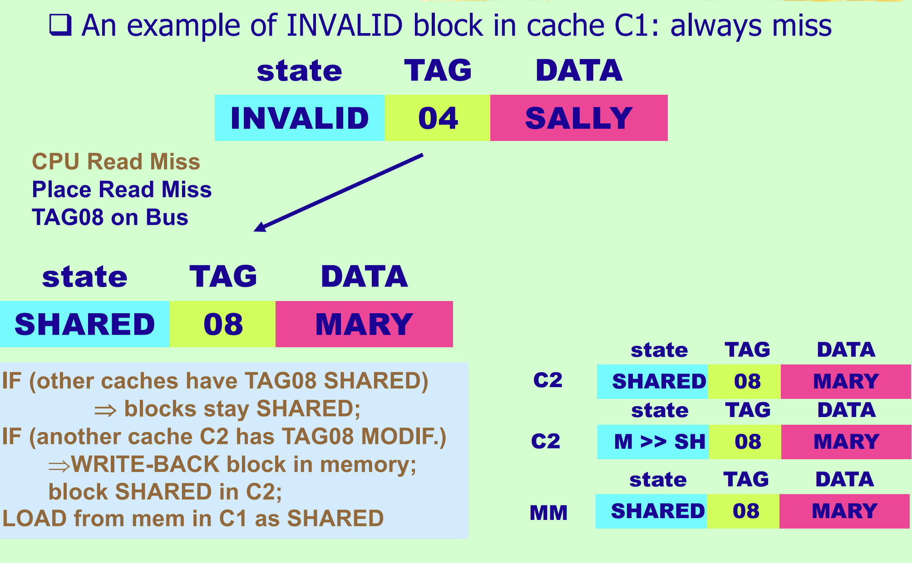
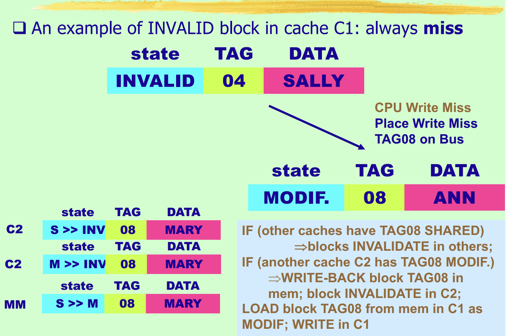

#### MESI

Compare with MSI, there is one more state:  
**Exclusive**: The block is clean and cache has **only copy**

Benefit:  
A write to an Exclusive block does not require to send the invalidation signal on the bus, since no other copies of the block are in other caches.

---

### Directory-Based Protocols  

- The sharing state of a block of physical memory is kept in just one location, call directory
  - Each entry in the directory is associated to each block in the main memory (director size is the number of memory blocks time the number of processors)
- In CSM architectures, there is a single directory associated to the main memory
- In DSM architectures, the directory is distributed on the nodes (one directory for each memory module) to avoid bottlenecks
  - Even if the entries of the dircetory are distributed, the sharing state of a block is stored in a single directory

The physical address space is statically distributed to the nodes:  
- There is a global and fixed mapping of each memory block address to each node
- Given a memory block address, it is assigned its Home node

To avoid boradcast, send point-to-point requests to processors  
Better scalable than snooping protocols

Message-oriented protocol:  
The requests generate messages sent between nodes (point-to-point requests) to maintain coherence and all message must receive explicit answers

---

There are 3 possible coherence states for each cache block in the directory (In the directory):  
- **Uncached**: No processor has a copy of the cache block, block not valid in any cache;
- **Shared**: one or more processors have cache block, and memory is up-to-data
- **Modified**: Only one processor (the owner) has data that has been modified so the memory is out-of-data


The dircetory maintains info:  
- The coherence state of each block: uncached, shared, modified
- Which processors have a copy of the block (unually a bit vector set to 1 if processor has a copy. For example: 1001)
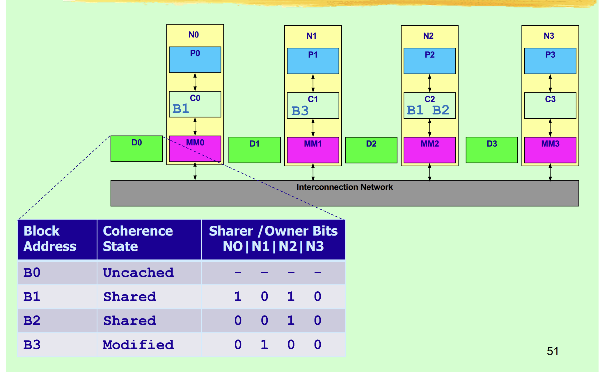

sharer bits:  
- If the block is in shared state, the sharer bits are set to 1 to indicate which processors have a copy of the block
- If the block is in modified state, a single sharer bit is set to 1 to indicate which processors is the owner of the block

Coherence states in cache
---
Each block in the cache can be in three possible coherence states (In the cache):  
- **Modified**: the block is dirty and this processor is the only owner
- **Shared**: The block is valid and up-to-date and it is shared with other processors.
- **Invalid**: bolck contains no valid data

---
Local, Home and Remote Nodes
---
- Home node:  
  The home node is the node where the memory block and the related directory entry reside
- Local node:  
  The local node is the node sending read/write request
- Remote node:
  The remote node is where there is a copy of the memory block, whether shared or modified

The local node can be the home node and the home node can be the local node

The remote node can be the home node and the home node can be the remote node

---

Directory-based protocol must implement the basic operations for managing:  
1. read hit
2. read miss
3. write hit
4. write miss

#### Directory Portocol Messages
---

1. Read hit  
   It doesn't change anything and intra-node communication

---

2. Message: Read Miss  
   - Source: Local cache
   - Destination: Home directory
   - Msg content: Processor P and Address ADD
   - This is Miss request sent by Local cache to the Home directory and to make the related processor as read sharer.

3. Message: Data value reply
   - Source: Home directory
   - Destination: Local cache
   - Msg content: Data
   - Return a data value from the home memory back to the requesting local node. (Read/Write miss response)

    **注：** 如果在home node中对应的memory block是uncached的，即使发送了对应的数据给local node的cache，home node中对应的cache仍然不会有对应的值

4. Message: Write miss
   - Source: Local cache
   - Destination: Home directory
   - Msg content: Processor P and Address ADD
   - This is miss request sent by local cache to the home directory and to make P as the exclusive owner

5. Message: Request to Invalidate
   - Source: Local cache
   - Destination: Home directory
   - Msg Content: Address ADD
   - Request to Home to send invalidate to all remote caches that are caching the block at address ADD

6. Message: Invalidate
   - Source: Home directory
   - Destination: Remote cache
   - Msg Content: Address ADD
   - Invalidate a shared copy of data at address ADD in a remote cache

7. Message: Fetch
   - Occurs to answer to a Read Miss on a modified block
   - Source: Home directory
   - Destination: Remote cache (owner)
   - Msg content: Address ADD
   - Fetch request sent from home directory to the remote cache to get back the most recent copy of the block
   - Then, the owner in the remote cache will send back data to its home directory
   - Block state in remote cache and main directory changes from modified to shared

8. Message: Fetch/Invalidate
   - Occurs to answer to a write miss on a modified block
   - Source: Home directory
   - Destination: Remote cache (owner)
   - Msg content: Address ADD
   - Fetch request sent from home directory to the remote cache to get back the most recent copy of the block
   - Then, the owner in the remote cache will send back data to its home directory
   - Invalidate the block in the remote cache
   - Block state in Home directory stays Modified - but owner is change

9. Message: Data write back
    - In reply to either a fetch or a fetch/invalidate message from home memory
    - Source: Remote cache (owner)
    - Destination: Home directory
    - Msg content: Address ADD and data value Data

