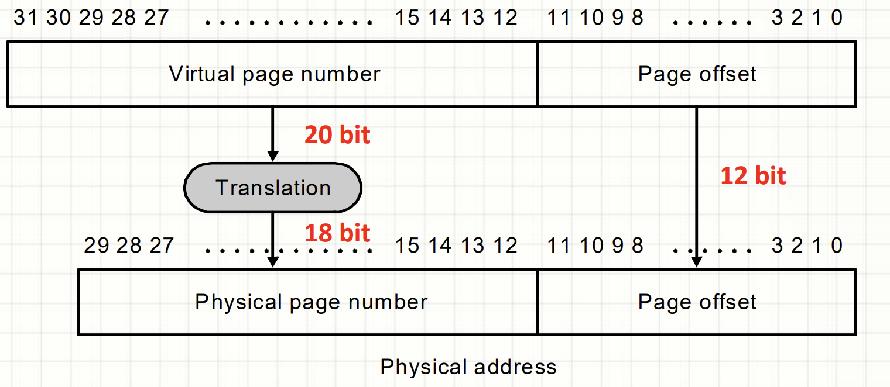

- [Cache](#cache)
  - [Temporal Locality（时间局限性） 和 Spatial Locality（空间局限性）](#temporal-locality时间局限性-和-spatial-locality空间局限性)
  - [Cache memory](#cache-memory)
    - [Cache line](#cache-line)
    - [Cache Hit and Cache Miss](#cache-hit-and-cache-miss)
    - [Unified Cache vs. Separate I$ \& D$ (Harvard architecture)](#unified-cache-vs-separate-i--d-harvard-architecture)
    - [Cache Structure](#cache-structure)
  - [Classifying cache misses](#classifying-cache-misses)
  - [Improving cache performance](#improving-cache-performance)
    - [Reduce the miss rate](#reduce-the-miss-rate)
    - [Reduce the miss penalty](#reduce-the-miss-penalty)
    - [Reduce the hit time](#reduce-the-hit-time)
- [Virtual memory](#virtual-memory)
  - [Page Table](#page-table)
  - [Translation Lookaside Buffer(TLB)](#translation-lookaside-buffertlb)

# Cache

## Temporal Locality（时间局限性） 和 Spatial Locality（空间局限性）
解決内存訪問的方法是利用訪問的局限性

1. Temporal Locality: 
   
   When there is a reference to one memory element, the trend is to refer again to the same memory element soon.

2. Spatial Locality

    When there is a reference to one memory element, the trend is to refer soon at the other memory elements whose addresses are closed by

缓存利用了这两个特性
- Exploit `temporal locality` by keeping the contents ofrecently accessed memory locations.
- Exploit `spatial locality` by fetching blocks of dataaround recently accessed memory locations.

## Cache memory

### Cache line

- The minimum chunk of data that can be copied in the cache is the `block` or `cache line`.
- To exploit the spatial locality, the `block size` must be a `multiple of the word size` in memory.
- Number of cache blocks = Cache Size / Block Size.

---
### Cache Hit and Cache Miss

1. Cache Hit  

    If the requested data is found in one of the cache blocks -> There is a hit in the cache access

2. Cache Miss

    If the requested data is not found in one of the cache blocks -> miss -> access the lower level of the memory hierarchy

    In this case, we need:
    - To stall the CPU
    - To require to block from the main memory
    - To copy(write) the block in cache
    - To repeat the cache access(hit)

---
**Hit Rate, Miss Rate**

$$Hit\ Rate = \frac{\#\ hits}{\# \ memory\ accesses}$$
$$Miss\ Rate = 1 - Hit\ Rate$$

Hit Time: time to access the data in the upper level of the hierarchy

$$Miss\ Time = Hit\ Time + Miss\ Penalty$$
Miss Penalty: is the time needed to access the lower level and to replace the block in the upper level.

AMAT：Average Memory Access Time
$$AMAT = Hit\ Rate * Hit\ Time + Miss\ Rate * Miss\ Time$$
$$AMAT= Hit\ Time + Miss\ Rate * Miss\ Penalty$$

How to improve cache performance?
1. Reduce the hit time
2. Reduce the miss rate
3. reduce the miss penalty

### Unified Cache vs. Separate I$ & D$ (Harvard architecture)

 

Harvard 架构（Harvard Architecture）是一种计算机体系结构，它将指令存储器和数据存储器分开，分别使用不同的总线系统来访问。这一点与更常见的冯·诺依曼结构（Von Neumann Architecture）形成对比，后者使用同一个存储器来存储指令和数据。

$$
AMAT_{Harvard} = \%Instr \cdot (Hit\ Time + Miss\ Rate\ I\$ \cdot Miss\ Penalty) + \%Data \cdot (Hit\ Time + Miss\ Rate\$D \cdot Miss\ Penalty)
$$

Usually: Miss Rate I$ << Miss Rate D$ 

### Cache Structure

Each entry(cache line) in the cache includes:  
1. Vaild bit: to indicate if this position contains vaild data or not. At the bootstrap, all the entries in the cache are marked as INVALID.
2. Cache Tag(s): contains the value that identifies the memory address corresponding to the stored data.
3. Cache Data: contains a copy of data(block or cache line)

---
**Block placement**

Given the address of the block in the main memory, where the block can be placed in the cache

The correspondence depends on the cache structure:
- Direct Mapped Cache
- Fully associative Cache
- n-way Set-Associative Cache
---
**Direct Mapped Cache**  

Each memory location corresponds to one and only one cache location

$$(Block\ Address)_{cache} = (Block\ Address)_{mem}\mod\ (Num.\ of\ Cache\ Blocks) $$

 

Index用来判断cache中对应的地址，Tag用来检测是否Cache Hit(检测是否是我们需要的数据)，Block offset用来读取cache line中具体的某个数据

---

**Fully associative cache**

In a fully associative cache, the memory block can be placed in any position of the cache

-> All the cache blocks must be checked during the search of the block(每次查找cache line时要遍历所有的cache line来找到对应的那个)

$$Number\ of\ blocks\ = Cache\ Size\  /\ Block\ Size $$

 

---

**n-way Set Associative Cache**

Cache composed of sets, each set composed of `n` blocks:

$$Number\ of\ blocks = Cache\ Size\ /\ Block\ size$$
$$Number\ of\ sets = Cache\ Size\ /\ (Block\ Size * n)$$

The memory block can be placed in any block of the set 

-> the search must be done on all the blocks of the set.

$$(Set)_{cache} = (Block\ address)_{mem} \mod\ (Num.\ sets\ in\ cache)$$

 

---

**Increment of associativity**

Advantage:
- Reduction of miss rate

Disadvantage:
- Higher implementation cost
- Increment of hit time

Increasing associativity shrinks index bits, expands tag bits

 

---

**Replacement strategies**

The problem of block replacement:

Easy choice for direct mapped caches.

For Set associative or fully associative caches:
- Random
- LRU(Least Recently Used)
- FIFO

---

**Write-Through and Write-Back**

- Write-Througe:   
    The information is written to both the block in the cache and to the block in the lower-level memory

- Write-Back:  
    The information is written only to the block in cache. The modified cache block is written to the lower-level memory `only` when it is replaced due to a miss.  
    We need a `dirty bit` to recored whether the block is clean or dirty(modified)  
    At the end of write in cache, the cache block becomes dirty(modified) and the main memory will contain a value different with respect to the value in cache —— `main memory and cache are not coherent`

Advantages:

1. Write-Through:
    - Simpler to be implemented, but to be effective it requires a `write buffer` to do not wait for the lower level of the memory hierarchy(to avoid write stall)
    - The read misses are cheaper because they do not require any write to the lower level of memory hierarchy
    - Memory always up to data.

2. Write-Back
    - The block can be written by the processor at the frequency at which the cache, insteal of main memory
    - Multiple writes to the same block require only a single write to the main memory.

---

**Write allocate and No write allocate**

- Write allocate  
    Allocate new cache line in cache then write(double write to cache)  
    Means that you have to do a "read miss" to fill in rest of the cache-line  
    First read cache line from memory, then write corresponsed data.

- No write allocate  
    Simply send write data to lower-level memory. Don't allocate new cache line.

Usually:
- Write-Back cache uses the Write Allocate option
- Write-Through cache uses the No Write Allocate

 

---

**Local and global miss rate**

- Local miss rate

    misses in this cache divided by the `total numberof memory accesses to this cache`: the Miss rateL1 for L1 and the Miss rateL2 for L2

- Global miss rate

    misses in this cache divided by `the total number of memory accesses generated by the CPU`: 
    - For L1, the global miss rate is still just Miss Rate_L1
    - For L2, it is Miss Rate_L1 * Miss Rate_L2

Global miss rate is what really matters: it indicates what fraction of memory accesses from CPU go all the way to main memory

 

## Classifying cache misses

Three major categories of cache misses:

- Compulsory Misses
- Capacity Misses
- Conflict Misses

1. Compulsory Misses(clod start misses or first reference misses):  
    - The first access to a block is not in the cache, so the block must be loaded in the cache from main memory.
    - There are compulsory misses even in an infinite cache: they are independent of the cache size.

2. Capacity Misses
    - If the cache cannot contain all the blocks needed during execution of a program, capacity misses will occur due to blocks being replaced and later retrieved.
    - Capacity misses decrease as capacity increases.

3. Conflict Misses
    - If the block-placement strategy is set associative or direct mapped, conflict misses will occur because a block can be replaced and later retrieved `when other blocks map to the same location in the cache`.
    - Conflict misses decrease as associativity increases.

## Improving cache performance

$$AMAT= Hit\ Time + Miss\ Rate * Miss\ Penalty$$

So, the idea is:
- Reduce the miss rate
- Reduce the miss penalty
- Reduce the hit time

 ### Reduce the miss rate

1. Larger cache size  
    Drawback: Increases hit time, area, power consumpution and cost

2. Larger block size  
    Larger block size will `reduce compulsory misses` taking advantage of `spatial locality`.

    Main drawbacks:
    - Larger blocks increase miss penalty
    - Larger blocks reduce the number of blocks so `increase conflict misses` (and even capacity misses) if the cache is small

3. Higher associativity  
    Higher associativity decreases the conflict misses.  
    (Higher associativity means each cache set contains more cache lines)

    The 2:1 cache rule:  
    Miss Rate Cache Size `N` ~= Miss Rate `2-way` Cache Size `N/2`

4. Victim Cache  
    Victim cache is small fully associative cache used as a buffer to place data discarded from cache to better `exploit temporal locality`.  
    It is checked on a miss to see if it has the required data before going to lower-level memory.  
    If the block is found in Victim cache the victim block and the cache block are swapped.

5. ...

### Reduce the miss penalty

### Reduce the hit time

# Virtual memory

- translate virtual addresses to the physical address(memory mapping)
- The virtual address space is much larger than the limits imposed on the physical address space by the limited amount of main memory in DRAMs
- Many process applications on the machine sharing the main memory

虚拟内存就像cache和memory的关系，main memory被视为硬盘的cache，cache中的block在虚拟内存中叫做page

A `page fault` happens when a virtual page has not been allocated in the main memory and it resides on the disk

 

## Page Table

- The translation mechanism between virtual pages to pysical pages is based on a page table associated to each process: ---Each process needs its own page table
- The page table maps virtual page numbers to physical page numbers
- The page table for each process is located in the main memory  
  —— The location of the page table in main memory is given by the page table register that points to the start address of the page table.
- The virtual page number is used as `index` to access the page table.

 

The page table requires a validity bit to distinguish between pages in memory and pages in disk storage

 

How to make address translation fast

Since the page table is located in main memory, each memory address generated by the CPU requires 2 memory accesses:
- first access to the page table to get the physical address
- second access to get the data.

So, the idea is add a special cache to keep track of recently used translations

## Translation Lookaside Buffer(TLB)

Add a special cache called TLB to speed up the address translation.

 

TLBs are:  
- Small caches: typcially not more than 128 - 256 entries
- Typically, fully associative caches

A TLB miss maybe due to a real TLB miss or to a page fault:
- If it is a real TLB miss: the page exists in main memory and we need to upload in the TLB the page translation from the page table
- If the miss is due to a page fault: the page is not in the main memory and the CPU invokes the OS to activate a Page Fault Handler routine

 
 