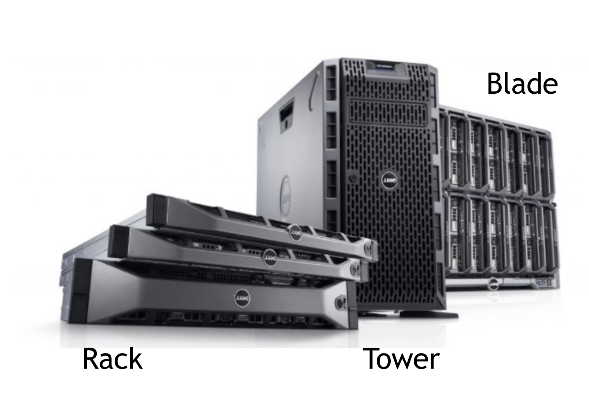

- [Data Center](#data-center)
  - [In-house Data Center](#in-house-data-center)
  - [Co-Location Data Center](#co-location-data-center)
  - [Third-Party Managed Hosting](#third-party-managed-hosting)
- [Cloud Service Models](#cloud-service-models)
- [Warehouse-scale computers](#warehouse-scale-computers)
  - [Traditional data centers](#traditional-data-centers)
  - [Warehouse-scale computers (WSCs)](#warehouse-scale-computers-wscs)
    - [Architecture of WSCs](#architecture-of-wscs)
    - [Cloud Layering: Multi-Tenant Within a WSC](#cloud-layering-multi-tenant-within-a-wsc)
- [Multiple data centers](#multiple-data-centers)
  - [Hierarchical approach](#hierarchical-approach)
    - [Geographic Areas (GAs)](#geographic-areas-gas)
    - [Computing Regions (CRs)](#computing-regions-crs)
    - [Availability Zones (AZs)](#availability-zones-azs)
- [Availability of WSCs and DCs](#availability-of-wscs-and-dcs)
- [Server](#server)
  - [The motherboard](#the-motherboard)
  - [Rack vs Tower vs Blade](#rack-vs-tower-vs-blade)
    - [Tower Server](#tower-server)
    - [Rack Server](#rack-server)
    - [Blade servers](#blade-servers)
  - [Hardware Accelerators](#hardware-accelerators)
    - [GPU](#gpu)
    - [Tensor Processing Unit (TPU)](#tensor-processing-unit-tpu)
    - [Field-Programmable Gate Array (FPGA)](#field-programmable-gate-array-fpga)
- [Disk abstraction](#disk-abstraction)
  - [Reading](#reading)
  - [Writing](#writing)
  - [Deleting](#deleting)
  - [external fragmentation](#external-fragmentation)
- [Hard Disk Drives (HDD)](#hard-disk-drives-hdd)
  - [Four types of delay](#four-types-of-delay)
    - [Rotation Delay](#rotation-delay)
    - [Seek Time](#seek-time)
    - [Transfer Time and Controller Overhead](#transfer-time-and-controller-overhead)
  - [Calulate The I/O Service Time](#calulate-the-io-service-time)
  - [Server Time](#server-time)
  - [Response time](#response-time)
  - [Disk Scheduling](#disk-scheduling)
    - [STTF](#sttf)
    - [SCAN](#scan)
    - [C-SCAN](#c-scan)
    - [C-LOOK](#c-look)

# Data Center

A Data center is dedicated facility used to house an organization's computing resources and associated components.  
Typically include:
- Servers
- Storage system
- Networking equipment
- The infrastructure needed to power, connect, cool and physically secure them

Key characteristics:  
- **High Availability and Redundancy**:  
  Systems such as uninterruptible power supplies, backup generators, multiple network links, and redundant cooling to ensure minimal downtime

- **Environmental Controls**:  
  Heating, ventilation, and air conditioning (HVAC) systems, along with fire suppression, are used to **maintain optimal temperature, humidity, and safety conditions** for IT hardware.

- **Physicaal Security**:  
  Access control measures (ID badges, biometric scanners, CCTV) designed to protect against unauthorized entry

- **Scalablity**:  
  Data centers must accommodate growth over time, either by adding more racks/servers or by planning additional physical space.

要保证高可靠高冗余，环境控制（比如机房温度），物理安全（防止未经允许的人进入机房），可拓展性

## In-house Data Center

内部数据中心（自建数据中心）  
An in-house data center (onpremises data center) is a facility fully owned and operated by an organization on its own property.

前期投入：   
1. 要钱 (Upfront Investment 前期投资)
   - 数据中心所在的地方或者建筑
   - 能源和冷却系统
   - 硬件设备
2. 要人
   - 专业人员
   - 持续培训 (Ongoing Training)

**Advantages**:
1. Full Control  
   这个组织可以客制化硬件存放的位置，安全政策，计划维护而不用考虑外部的限制
2. Tangible Asset  
   公司倒闭了可以卖大楼
3. Customization for Specialized Workloads
   对于特定的用途可以定制化

**Disadvantages**:
1. High Initial Costs  
   要很多钱
2. Risk and Uncertainty  
   公司倒闭跑路了这个数据中心就没了
3. Complex Management  
   一个组织要负责这个数据中心日常运行的所有事项

## Co-Location Data Center

将你自己的设备本身托管给第三方，第三方提供能源冷却安保等服务

Cost Structure:  
- Monthly/Yearly Rental
- Hardware Ownership

**Advantages**:  
- Reduced Capital Expense:
  不要这么多钱
- Some Control
- Scalability

**Disadvantages**:  
- No Real Estata Asset  
  没有房地产资源
- Limited Customization  
  空调功率供电功率第三方说了算
- Potential Access Delays

## Third-Party Managed Hosting

所有东西都由第三方提供

# Cloud Service Models

 

1. Infrastructure as a service (IaaS)
   - Definition:  
        The cloud provider offers virtual machines (VMs), networking and storage;  
        Clients manage operating systems, applications and data
    - Example:  
        AWS EC2, Microsoft Azure Virtual Machines, Google Compute Engine
    - Pros/Cons:  
        High flexibility;  
        But demands substantial system administration skills for OS and application management

2. Platform as a Service (Paas)
    - Definition:  
        Provides a managed environment that include OS, runtime, and databases;  
        Users only handly applications code and data
    - Example:  
        AWS Elastic Beanstalk, Microsoft Azure App Service, Google App Engine
    - Pros/Cons:   
        Streamlines application deployment;  
        But offers less control over underlying system settings and software versions.

3. Software as a Service (Saas)
    - Definition:
        The provider hosts the entire software application;  
        End user simply access it via internet.
    - Example:   
        Microsoft 365, Salesforce, Google Workspace
    - Pros/Cons:  
        Minimal administration overhead;  
        But highly standardized features with limited customization.

# Warehouse-scale computers

The trends toward server-sizde computing and widespread internet services created a new class of computing systems: warehouse-scale computer (WSCs):  
The massive scale of the software infrastructure, data repositories and hardware platform

## Traditional data centers

- typically host a large number relatively small- or medium- sized applications
- each applications is running on a dedicated hardware infrastructure that is de-coupled and protected from other systems in the same facility
- applications tend not to communicate each other

Those data centers host hardware and software for multiple organizational units or even different companies  

Each tenant managed a unique computing environment,  
resulting in a patchwork of hardware, operating systems

 

通常的数据中心一般同时运行很多个种类不同，所属不同的任务

## Warehouse-scale computers (WSCs)

- homogeneity
- single-organization control
- cost efficiency

WSCs **belong to a single organization**， use a **relatively homogeneous hardware** and system software platform, and **share a common system management layer**

- WSCs run a smaller number of very large applications
- The common resource management infrastructure allows significant deployment flexibility

 

### Architecture of WSCs

 

### Cloud Layering: Multi-Tenant Within a WSC

WSC also can be partitioned into smaller logical segments that users rent as virtual machines or containers.  
In doing so, the data center’s uniform hardware underpinnings remain consistent, but portions of the compute, memory, and storage resources are allocated to individual clients. 

# Multiple data centers

- to reduce user latency
- improve serving throughput

A request is typically fully processed within one data center

## Hierarchical approach

### Geographic Areas (GAs)

The world is divided into Geographic Areas (GAs)
- Defined by Geo-political boundaries (or country borders)
- Determined mainly by data residency
- In each GA there are at least 2 computing regions

### Computing Regions (CRs)

- Customers see regions as the finer grain discretization of the infrastructure
- **Latency-defined** perimeter (**2ms latency for the round trip**)
- 100's of miles apart
- Too far for synchronous replication, but ok for disaster recovery

 

### Availability Zones (AZs)

Availability Zones (AZs) are finer grain location within a single computing region.

- **Application-level synchronous** replication among AZs
- 3 AZs in CRs is minimum

 

# Availability of WSCs and DCs

Services provided through WSCs (or DCs) must guarantee high availability, typically aiming for at least 99.99% **uptime** (i.e. one-hour downtime per year)

DC workloads must be designed to gracefully tolerate large numbers of component faults with little or no impact on service level performance and availability

# Server

- Servers are the main processing equipment
- Servers are hosted in individual shelves（架子）and are **the basic building blocks of DCs and WSCs**
- They are interconnected by hieraechies of networks and supported by the shared power and cooling infrastructure

Servers are like ordinary PC, usually more powerful, but with a form factor that allows to fit them into the shelves:
- Rack (支架) (1U or more)
- Blade enclosure format
- Tower

Servers are usually built in a tray or blade enclosure format, housing:
- the motherboard
- chipset
- additional plug-in components

## The motherboard

connecting all the crucial components of the server and enabling them to communicate and work together

It provides sockets and plug-in slots to install CPUs, memory modules (DIMMs)， local storage (such as Flash SSDs or HDDs), and network interface cards (NICs) to satisfy the range of resource requirements.

## Rack vs Tower vs Blade
 

### Tower Server
 

相当于台式机，便于拓展加装需要的功能，相较于其他server功耗和花费都是最低的，由于机箱很大里面组件的密度很小，便于散热

但是占地空间大，只能提供最基础的服务能力，不方便多个设备整合在一起工作

### Rack Server

**Racks are special shelves** that accommondate all the IT equipment and allow their interconnection

- The racks are used to store these rack servers
- Server racks are measured in rack unit **"U"**
- 1U = 44.45mm

**Attention:** IT equipment must conform to specific sizes to fit into the rack shelves  
This standardized width and height allow data centers to stack many servers in a single cabinet, making it a highly space-efficient solution  

Cabling for network and power is typically consolidated at the back for easier management

 

好处：  
方便控制故障，因为可以较简单地找到故障并移除替换对应的rack server  
简化线缆(cable)管理  
Cost-effective

坏处：  
由于较高的component density, 需要额外的cooling system，从而需要更多的power  
由于有很多rack servers，所以维护(maintenance)起来较为困难

It is often convenient to connect the network cables at the top of the rack, such a rack-level switch is appropriately called a Top of Rack (TOR) switch

 ### Blade servers

Blade servers take density to another level. Here, ultra-thin server boards—blades—slot into a shared enclosure that provides pooled power, networking, and sometimes even cooling.

 
 

## Hardware Accelerators

To satisfy the growing compute needs for deep learning, WSCs deploy specialized accelerator hardware: 
- GPUs
- TPU
- FPGAs

### GPU

- Data parallel computations: the same program is executed on many data elements in parallel
- The scientific codes are mapped onto the matrix operations
- High-level languages are required
- Up to 1000x faster than CPU

 

GPUs are configured with a CPU host connected to a PCIe-attached accelerator with multiple GPUs

GPUs within the tray are connected using high-bandwidth interconnects such as NVlink  
Each NVlink lane supports a data rate of 50Gb/s in each direction  
The total number of NVLink lanes increases from 6 lanes in the V100 GPU to 12 lanes in the A100 GPU and 18 for the H100 GPU

---

### Tensor Processing Unit (TPU)

TPUs are proprietary chips engineered to handle tensor operations with high efficiency, often seen in environment focusing on deep learning.

TPUv3 is the first liquid-cooled accelerator in Google's data center

---

### Field-Programmable Gate Array (FPGA)

FPGAs are reprogrammable chips that offer flexibility for niche or rapidly changing tasks;  
Though they are generally not as widespread as GPUs for most data center use cases

 
 

# Disk abstraction

- Disk can be seen by an OS as a collection of data blocks that can be read or written independently
- To allow the ordering/management among them, each block is characterized by a unique numerical address called LBA (Local Block Address)
- Typically, the OS groups blocks into **clusters** to simplify the access to the disk. **Clusters** are the minimal unit that an OS can read from or write to disk
- Typically cluster sizes range from 1 disk sector (4KB) to 128 sectors (64 KB)

Clusters contains:  
- File data: the actual content of the files
- Meta data: the information required to support the file system

Meta data contains:
- File name
- Directory structures and symblic links
- File size and file type
- Creation, modification, last access dates
- Security information (owners, access list, encryption)
- Links to the LBA where the file content can be located on the disk

 

## Reading

 

## Writing

 

Since the file system can only access clusters, the real occupation of space on a disk for a file is always a **multiple of the cluster size**

- a: the actual size on disk
- s: the file size
- c: the cluster size

$$a = \left\lceil \frac{s}{c} \right\rceil \cdot c$$

w = a - s is wasted disk space due to the organization of the file into clusters  
The waste of space is called internal fragmentation of files

## Deleting

Only update the meta-data to say that the blocks where the file was stored are no longer in use by the OS

**Deleting a file never actually deletes the data on the disk**:  
When a new file will be written on the same clusters, the old data will be replaced by the new one

## external fragmentation

 

# Hard Disk Drives (HDD)

 

Hard drives expose a large number of sectors (block)
- Typically 512 or 4096 bytes
- Individual sector writes are atomic
- Multiple sectors writes may be interrupted

 

外圈数字小内圈数字大

## Four types of delay

 

### Rotation Delay

Full rotation delay R = 1 / DiskRPM  
In second Rsec = 60 * R  

$$T_{rotataion\_AVG}\ =\ \frac{Rsec}{2}$$

---

### Seek Time

Time to move the head to a different track  

$$T_{seek\_AVG}\ =\ \frac{T_{seek\_MAX}}{3}$$

---

### Transfer Time and Controller Overhead

Transfer time
- Final phase of the I/O that takes places
- Time that consider that data is either read from or written to the surface
- Includes the time for the head to pass on the sectors and the I/O transfer

Controller overhead  
- Buffer management (data transfer) and interrupt sending time

## Calulate The I/O Service Time

 

Server Time
---
$$T_{I/O} = T_{seek} + T_{rotation} + T_{transfer} + T_{overhead}$$

In many circumstances, this is not the case:  
- files are larger than one block
- they are stored in a contiguous way

Thus, we can measure the **Data Locality** of a disk as the percentage of blocks that do not need seek or rotational latency to be found

$$T_{I/O} = (1 - Data\ Locality)*(T_{seek} + T_{rotation}) + T_{transfer} + T_{overhead}$$

Response time
---
T_queue waiting for resourec + T_I/O

T_queue depends on:  
- queue-length
- resource utilization
- mean and variance of disk service timme
- request arrival distribution

## Disk Scheduling

Key Idea:  
- If there a queue of requests to the disk, they can be reordered to improve performance  
- Estimation of the request length is feasible knowing the position on the disk of the data
- Several scheduling algorithms:
  - Fist come, first serve (FCFS)
  - Shortest seek time first (SSTF)
  - SCAN (elevator algorithm)
  - C-SCAN, C-LOOK

### STTF

Idea: minimize seek time by always selecting the block with the shortest seek time

This method is optimal and can be easily implemented  
But is prone to starvation  
即某些请求长时间得不到处理，出现饥饿现象

### SCAN

1. 磁头从当前柱面开始，朝一个方向移动（例如向外）。

2. 在这个方向上，依次处理所有请求。

3. 移动到最远端（没有更多请求）后，改变方向。

4. 然后开始朝相反方向移动，并继续处理请求。

 

Pro:  
reasonable performance, no starvation

Con:  
average access time is higher for requests at high and low addresses

### C-SCAN

Like SCAN, but only service requests in one direction

**注：** 朝一个方向移动完之后会回到另一个方向的边界上

 

### C-LOOK

C-SCAN的改进，往回走的时候不会到最边上

 