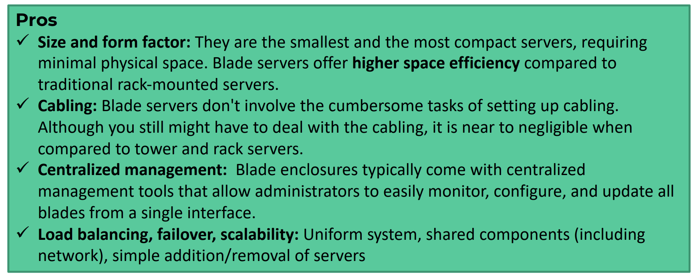
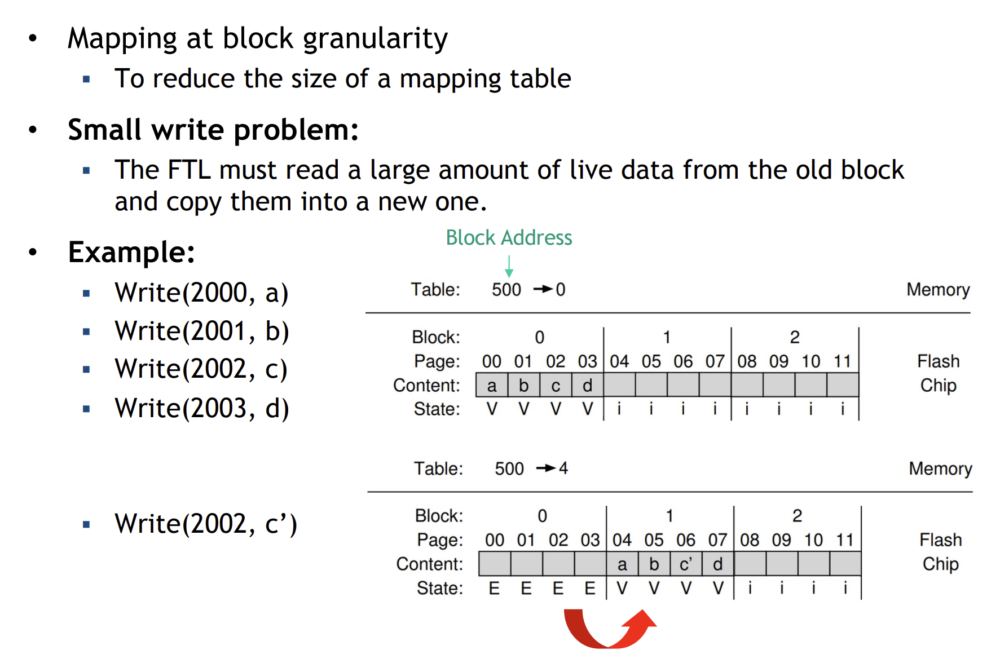
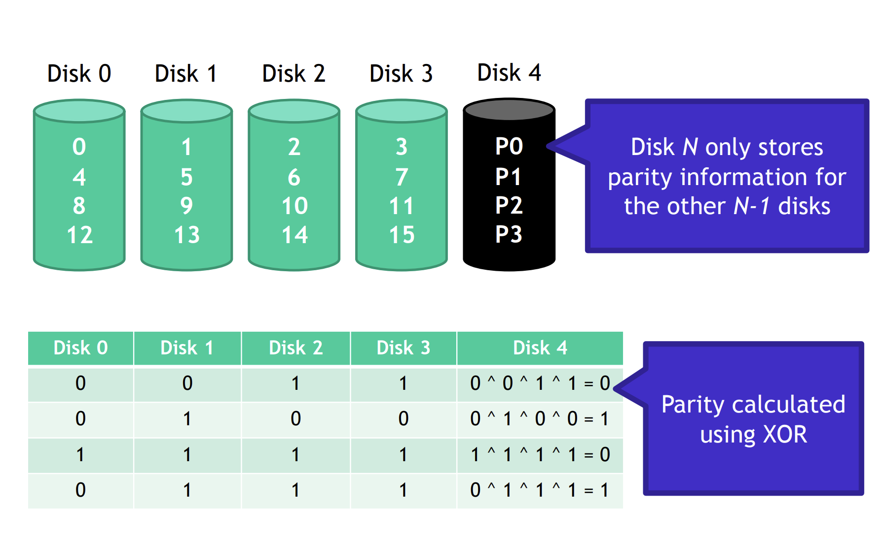

- [Data Center](#data-center)
  - [In-house Data Center](#in-house-data-center)
  - [Co-Location Data Center](#co-location-data-center)
  - [Third-Party Managed Hosting](#third-party-managed-hosting)
- [Cloud Service Models](#cloud-service-models)
- [Warehouse-scale computers](#warehouse-scale-computers)
  - [Traditional data centers](#traditional-data-centers)
  - [Warehouse-scale computers (WSCs)](#warehouse-scale-computers-wscs)
    - [Architecture of WSCs](#architecture-of-wscs)
    - [Cloud Layering: Multi-Tenant Within a WSC](#cloud-layering-multi-tenant-within-a-wsc)
- [Multiple data centers](#multiple-data-centers)
  - [Hierarchical approach](#hierarchical-approach)
    - [Geographic Areas (GAs)](#geographic-areas-gas)
    - [Computing Regions (CRs)](#computing-regions-crs)
    - [Availability Zones (AZs)](#availability-zones-azs)
- [Availability of WSCs and DCs](#availability-of-wscs-and-dcs)
- [Server](#server)
  - [The motherboard](#the-motherboard)
  - [Rack vs Tower vs Blade](#rack-vs-tower-vs-blade)
    - [Tower Server](#tower-server)
    - [Rack Server](#rack-server)
    - [Blade servers](#blade-servers)
  - [Hardware Accelerators](#hardware-accelerators)
    - [GPU](#gpu)
    - [Tensor Processing Unit (TPU)](#tensor-processing-unit-tpu)
    - [Field-Programmable Gate Array (FPGA)](#field-programmable-gate-array-fpga)
- [Disk abstraction](#disk-abstraction)
  - [Reading](#reading)
  - [Writing](#writing)
  - [Deleting](#deleting)
  - [external fragmentation](#external-fragmentation)
- [Hard Disk Drives (HDD)](#hard-disk-drives-hdd)
  - [Four types of delay](#four-types-of-delay)
    - [Rotation Delay](#rotation-delay)
    - [Seek Time](#seek-time)
    - [Transfer Time and Controller Overhead](#transfer-time-and-controller-overhead)
  - [Calulate The I/O Service Time](#calulate-the-io-service-time)
  - [Server Time](#server-time)
  - [Response time](#response-time)
  - [Disk Scheduling](#disk-scheduling)
    - [STTF](#sttf)
    - [SCAN](#scan)
    - [C-SCAN](#c-scan)
    - [C-LOOK](#c-look)
- [Solid State Disk (SSD)](#solid-state-disk-ssd)
  - [Storing bit](#storing-bit)
  - [Internal organization](#internal-organization)
  - [Flash Translation Layer (FTL)](#flash-translation-layer-ftl)
    - [Log-Structured FTL](#log-structured-ftl)
    - [Garbage collection](#garbage-collection)
    - [Mapping Table Size](#mapping-table-size)
  - [Block mapping](#block-mapping)
  - [Hybrid mapping](#hybrid-mapping)
  - [Page mapping plus caching](#page-mapping-plus-caching)
    - [Wear Leveling](#wear-leveling)
- [Redundant Arrays of Independent Disks (RAID)](#redundant-arrays-of-independent-disks-raid)
  - [data striping](#data-striping)
  - [redundancy](#redundancy)
  - [Sequence transfer rate](#sequence-transfer-rate)
  - [Random transfer rate](#random-transfer-rate)
  - [RAID levels](#raid-levels)
    - [RAID 0](#raid-0)
      - [Addressing block](#addressing-block)
      - [Chunk Sizing](#chunk-sizing)
      - [Analysis of RAID0](#analysis-of-raid0)
    - [RAID 1](#raid-1)
      - [RAID 0, 1, 0+1 and 1+0 organizations](#raid-0-1-01-and-10-organizations)
      - [Analysis of RAID 1](#analysis-of-raid-1)
    - [RAID 4](#raid-4)
      - [Read on RAID 4](#read-on-raid-4)
      - [Serial writes on RAID 4](#serial-writes-on-raid-4)
      - [Random writes on RAID 4](#random-writes-on-raid-4)
      - [Summary](#summary)
    - [RAID 5](#raid-5)
      - [Random Writes on RAID 5](#random-writes-on-raid-5)
      - [Analysis of RAID 5](#analysis-of-raid-5)
    - [Comparison of RAID Levels](#comparison-of-raid-levels)
    - [RAID 6](#raid-6)
    - [Characteristics of RAID levels](#characteristics-of-raid-levels)
  - [RAID Disks: Reliability Calculation](#raid-disks-reliability-calculation)
    - [RAID 1 - MTTF](#raid-1---mttf)
    - [RAID 0+1 - MTTF](#raid-01---mttf)
    - [RAID 1+0 - MTTF](#raid-10---mttf)
    - [RAID 4 and RAID 5 - MTTF](#raid-4-and-raid-5---mttf)
    - [RAID 6 - MTTF](#raid-6---mttf)
    - [Summary](#summary-1)
- [Storage System](#storage-system)

# Data Center

A Data center is dedicated facility used to house an organization's computing resources and associated components.  
Typically include:
- Servers
- Storage system
- Networking equipment
- The infrastructure needed to power, connect, cool and physically secure them

Key characteristics:  
- **High Availability and Redundancy**:  
  Systems such as uninterruptible power supplies, backup generators, multiple network links, and redundant cooling to ensure minimal downtime

- **Environmental Controls**:  
  Heating, ventilation, and air conditioning (HVAC) systems, along with fire suppression, are used to **maintain optimal temperature, humidity, and safety conditions** for IT hardware.

- **Physicaal Security**:  
  Access control measures (ID badges, biometric scanners, CCTV) designed to protect against unauthorized entry

- **Scalablity**:  
  Data centers must accommodate growth over time, either by adding more racks/servers or by planning additional physical space.

要保证高可靠高冗余，环境控制（比如机房温度），物理安全（防止未经允许的人进入机房），可拓展性

## In-house Data Center

内部数据中心（自建数据中心）  
An in-house data center (onpremises data center) is a facility fully owned and operated by an organization on its own property.

前期投入：   
1. 要钱 (Upfront Investment 前期投资)
   - 数据中心所在的地方或者建筑
   - 能源和冷却系统
   - 硬件设备
2. 要人
   - 专业人员
   - 持续培训 (Ongoing Training)

**Advantages**:
1. Full Control  
   这个组织可以客制化硬件存放的位置，安全政策，计划维护而不用考虑外部的限制
2. Tangible Asset  
   公司倒闭了可以卖大楼
3. Customization for Specialized Workloads
   对于特定的用途可以定制化

**Disadvantages**:
1. High Initial Costs  
   要很多钱
2. Risk and Uncertainty  
   公司倒闭跑路了这个数据中心就没了
3. Complex Management  
   一个组织要负责这个数据中心日常运行的所有事项

## Co-Location Data Center

将你自己的设备本身托管给第三方，第三方提供能源冷却安保等服务

Cost Structure:  
- Monthly/Yearly Rental
- Hardware Ownership

**Advantages**:  
- Reduced Capital Expense:
  不要这么多钱
- Some Control
- Scalability

**Disadvantages**:  
- No Real Estata Asset  
  没有房地产资源
- Limited Customization  
  空调功率供电功率第三方说了算
- Potential Access Delays

## Third-Party Managed Hosting

所有东西都由第三方提供

# Cloud Service Models

 

1. Infrastructure as a service (IaaS)
   - Definition:  
        The cloud provider offers virtual machines (VMs), networking and storage;  
        Clients manage operating systems, applications and data
    - Example:  
        AWS EC2, Microsoft Azure Virtual Machines, Google Compute Engine
    - Pros/Cons:  
        High flexibility;  
        But demands substantial system administration skills for OS and application management

2. Platform as a Service (Paas)
    - Definition:  
        Provides a managed environment that include OS, runtime, and databases;  
        Users only handly applications code and data
    - Example:  
        AWS Elastic Beanstalk, Microsoft Azure App Service, Google App Engine
    - Pros/Cons:   
        Streamlines application deployment;  
        But offers less control over underlying system settings and software versions.

3. Software as a Service (Saas)
    - Definition:
        The provider hosts the entire software application;  
        End user simply access it via internet.
    - Example:   
        Microsoft 365, Salesforce, Google Workspace
    - Pros/Cons:  
        Minimal administration overhead;  
        But highly standardized features with limited customization.

# Warehouse-scale computers

The trends toward server-sizde computing and widespread internet services created a new class of computing systems: warehouse-scale computer (WSCs):  
The massive scale of the software infrastructure, data repositories and hardware platform

## Traditional data centers

- typically host a large number relatively small- or medium- sized applications
- each applications is running on a dedicated hardware infrastructure that is de-coupled and protected from other systems in the same facility
- applications tend not to communicate each other

Those data centers host hardware and software for multiple organizational units or even different companies  

Each tenant managed a unique computing environment,  
resulting in a patchwork of hardware, operating systems

 

通常的数据中心一般同时运行很多个种类不同，所属不同的任务

## Warehouse-scale computers (WSCs)

- homogeneity
- single-organization control
- cost efficiency

WSCs **belong to a single organization**， use a **relatively homogeneous hardware** and system software platform, and **share a common system management layer**

- WSCs run a smaller number of very large applications
- The common resource management infrastructure allows significant deployment flexibility

 

### Architecture of WSCs

 

### Cloud Layering: Multi-Tenant Within a WSC

WSC also can be partitioned into smaller logical segments that users rent as virtual machines or containers.  
In doing so, the data center’s uniform hardware underpinnings remain consistent, but portions of the compute, memory, and storage resources are allocated to individual clients. 

# Multiple data centers

- to reduce user latency
- improve serving throughput

A request is typically fully processed within one data center

## Hierarchical approach

### Geographic Areas (GAs)

The world is divided into Geographic Areas (GAs)
- Defined by Geo-political boundaries (or country borders)
- Determined mainly by data residency
- In each GA there are at least 2 computing regions

### Computing Regions (CRs)

- Customers see regions as the finer grain discretization of the infrastructure
- **Latency-defined** perimeter (**2ms latency for the round trip**)
- 100's of miles apart
- Too far for synchronous replication, but ok for disaster recovery

 

### Availability Zones (AZs)

Availability Zones (AZs) are finer grain location within a single computing region.

- **Application-level synchronous** replication among AZs
- 3 AZs in CRs is minimum

 

# Availability of WSCs and DCs

Services provided through WSCs (or DCs) must guarantee high availability, typically aiming for at least 99.99% **uptime** (i.e. one-hour downtime per year)

DC workloads must be designed to gracefully tolerate large numbers of component faults with little or no impact on service level performance and availability

# Server

- Servers are the main processing equipment
- Servers are hosted in individual shelves（架子）and are **the basic building blocks of DCs and WSCs**
- They are interconnected by hieraechies of networks and supported by the shared power and cooling infrastructure

Servers are like ordinary PC, usually more powerful, but with a form factor that allows to fit them into the shelves:
- Rack (支架) (1U or more)
- Blade enclosure format
- Tower

Servers are usually built in a tray or blade enclosure format, housing:
- the motherboard
- chipset
- additional plug-in components

## The motherboard

connecting all the crucial components of the server and enabling them to communicate and work together

It provides sockets and plug-in slots to install CPUs, memory modules (DIMMs)， local storage (such as Flash SSDs or HDDs), and network interface cards (NICs) to satisfy the range of resource requirements.

## Rack vs Tower vs Blade
 

### Tower Server
 

相当于台式机，便于拓展加装需要的功能，相较于其他server功耗和花费都是最低的，由于机箱很大里面组件的密度很小，便于散热

但是占地空间大，只能提供最基础的服务能力，不方便多个设备整合在一起工作

### Rack Server

**Racks are special shelves** that accommondate all the IT equipment and allow their interconnection

- The racks are used to store these rack servers
- Server racks are measured in rack unit **"U"**
- 1U = 44.45mm

**Attention:** IT equipment must conform to specific sizes to fit into the rack shelves  
This standardized width and height allow data centers to stack many servers in a single cabinet, making it a highly space-efficient solution  

Cabling for network and power is typically consolidated at the back for easier management

 

好处：  
方便控制故障，因为可以较简单地找到故障并移除替换对应的rack server  
简化线缆(cable)管理  
Cost-effective

坏处：  
由于较高的component density, 需要额外的cooling system，从而需要更多的power  
由于有很多rack servers，所以维护(maintenance)起来较为困难

It is often convenient to connect the network cables at the top of the rack, such a rack-level switch is appropriately called a Top of Rack (TOR) switch

 ### Blade servers

Blade servers take density to another level. Here, ultra-thin server boards—blades—slot into a shared enclosure that provides pooled power, networking, and sometimes even cooling.

 
 

## Hardware Accelerators

To satisfy the growing compute needs for deep learning, WSCs deploy specialized accelerator hardware: 
- GPUs
- TPU
- FPGAs

### GPU

- Data parallel computations: the same program is executed on many data elements in parallel
- The scientific codes are mapped onto the matrix operations
- High-level languages are required
- Up to 1000x faster than CPU

 

GPUs are configured with a CPU host connected to a PCIe-attached accelerator with multiple GPUs

GPUs within the tray are connected using high-bandwidth interconnects such as NVlink  
Each NVlink lane supports a data rate of 50Gb/s in each direction  
The total number of NVLink lanes increases from 6 lanes in the V100 GPU to 12 lanes in the A100 GPU and 18 for the H100 GPU

---

### Tensor Processing Unit (TPU)

TPUs are proprietary chips engineered to handle tensor operations with high efficiency, often seen in environment focusing on deep learning.

TPUv3 is the first liquid-cooled accelerator in Google's data center

---

### Field-Programmable Gate Array (FPGA)

FPGAs are reprogrammable chips that offer flexibility for niche or rapidly changing tasks;  
Though they are generally not as widespread as GPUs for most data center use cases

 
 

# Disk abstraction

- Disk can be seen by an OS as a collection of data blocks that can be read or written independently
- To allow the ordering/management among them, each block is characterized by a unique numerical address called LBA (Local Block Address)
- Typically, the OS groups blocks into **clusters** to simplify the access to the disk. **Clusters** are the minimal unit that an OS can read from or write to disk
- Typically cluster sizes range from 1 disk sector (4KB) to 128 sectors (64 KB)

Clusters contains:  
- File data: the actual content of the files
- Meta data: the information required to support the file system

Meta data contains:
- File name
- Directory structures and symblic links
- File size and file type
- Creation, modification, last access dates
- Security information (owners, access list, encryption)
- Links to the LBA where the file content can be located on the disk

 

## Reading

 

## Writing

 

Since the file system can only access clusters, the real occupation of space on a disk for a file is always a **multiple of the cluster size**

- a: the actual size on disk
- s: the file size
- c: the cluster size

$$a = \left\lceil \frac{s}{c} \right\rceil \cdot c$$

w = a - s is wasted disk space due to the organization of the file into clusters  
The waste of space is called internal fragmentation of files

## Deleting

Only update the meta-data to say that the blocks where the file was stored are no longer in use by the OS

**Deleting a file never actually deletes the data on the disk**:  
When a new file will be written on the same clusters, the old data will be replaced by the new one

## external fragmentation

 

# Hard Disk Drives (HDD)

 

Hard drives expose a large number of sectors (block)
- Typically 512 or 4096 bytes
- Individual sector writes are atomic
- Multiple sectors writes may be interrupted

 

外圈数字小内圈数字大

## Four types of delay

 

### Rotation Delay

Full rotation delay R = 1 / DiskRPM  
In second Rsec = 60 * R  

$$T_{rotataion\_AVG}\ =\ \frac{Rsec}{2}$$

---

### Seek Time

Time to move the head to a different track  

$$T_{seek\_AVG}\ =\ \frac{T_{seek\_MAX}}{3}$$

---

### Transfer Time and Controller Overhead

Transfer time
- Final phase of the I/O that takes places
- Time that consider that data is either read from or written to the surface
- Includes the time for the head to pass on the sectors and the I/O transfer

Controller overhead  
- Buffer management (data transfer) and interrupt sending time

## Calulate The I/O Service Time

 

Server Time
---
$$T_{I/O} = T_{seek} + T_{rotation} + T_{transfer} + T_{overhead}$$

In many circumstances, this is not the case:  
- files are larger than one block
- they are stored in a contiguous way

Thus, we can measure the **Data Locality** of a disk as the percentage of blocks that do not need seek or rotational latency to be found

$$T_{I/O} = (1 - Data\ Locality)*(T_{seek} + T_{rotation}) + T_{transfer} + T_{overhead}$$

Response time
---
T_queue waiting for resourec + T_I/O

T_queue depends on:  
- queue-length
- resource utilization
- mean and variance of disk service timme
- request arrival distribution

## Disk Scheduling

Key Idea:  
- If there a queue of requests to the disk, they can be reordered to improve performance  
- Estimation of the request length is feasible knowing the position on the disk of the data
- Several scheduling algorithms:
  - Fist come, first serve (FCFS)
  - Shortest seek time first (SSTF)
  - SCAN (elevator algorithm)
  - C-SCAN, C-LOOK

### STTF

Idea: minimize seek time by always selecting the block with the shortest seek time

This method is optimal and can be easily implemented  
But is prone to starvation  
即某些请求长时间得不到处理，出现饥饿现象

### SCAN

1. 磁头从当前柱面开始，朝一个方向移动（例如向外）。

2. 在这个方向上，依次处理所有请求。

3. 移动到最远端（没有更多请求）后，改变方向。

4. 然后开始朝相反方向移动，并继续处理请求。

 

Pro:  
reasonable performance, no starvation

Con:  
average access time is higher for requests at high and low addresses

### C-SCAN

Like SCAN, but only service requests in one direction

**注：** 朝一个方向移动完之后会回到另一个方向的边界上

 

### C-LOOK

C-SCAN的改进，往回走的时候不会到最边上

 

# Solid State Disk (SSD)

Solid-state storage device
- No mechanical or moving parts like HDD
- Bulit out of transistors (晶体管)
- Retain informatin despite power loss unlike typical RAM
- A controller is included in the device with one or more solid state memory components
- It uses traditional hard disk drive (HDD) interfaces (protocol and physical connectors) and form factors
- Higher performances than HDD

## Storing bit
 

## Internal organization

- NAND flash is organizaed in to **Pages** and **Blocks**
- A page contain multiple logical block (512B - 4KB) addressed (LBAs)
- A block typically consists of multiple page (e.g. 64) with total capacity of around 128 - 256 KB

 

擦除以block为单位，读写以page为单位

**注：NAND flash memory can not be updated in place**

- Blocks (or Erase Block): smallest unit that can be erased
- Pages: smallest unit that can be read/written

Pages can be in three states:  
- Empty (or EREASED):  
    They donot contain data
- Dirty (or INVALID):  
    They contain data, but this data is no longer in use
- In use (or VALID):  
    The page contains data that can be actually read

 

因为删除是以block为单位的，所以当要删除某个page时需要先把block中未删除的内容存入cache中，然后再删除整个block，最后把新写入的内容和原来未删除的内容写进block中

## Flash Translation Layer (FTL)

Flash Translation Layer (FTL) 是 SSD 中一个重要的软件/固件模块，它的作用是：

将传统块设备接口（如扇区编号）转换为实际闪存芯片的物理地址。

由于 NAND 闪存不能就地更新，FTL 提供了一套机制来模拟出可覆盖的块设备行为。

FLT is an SSD component that make the SSD look as HDD
- Data allocation and address translation 
  - Efficient to reduce write amplification effects
  - Program pages within an erased block in order
- Garbage collection
  - Reuse of pages with old data
- Wear leveling
  - FTL should try to spread writes across the block of the flash ensuring that all of the blocks of the device wear out at roughly the same time

---

### Log-Structured FTL

---

### Garbage collection

Garbage collection is expensive
- Require reading and rewriting of live data
- Ideal garbage collection is reclamation of a block that consists of only dead pages

The cost of Garbage collection depends on the amount of data blocks that have to be migrated

Solutions to alleviate the problem: 
- Add extra flash capacity to delay the cleaning
- Run the garbage collection in the background using less busy periods for the disk

When performing background garbage collection the SSD assumes to know which pages are invalid

---

### Mapping Table Size

The size of page-level mapping table is too large
- With a 1TB SSD with a 4byte entry per 4KB page, 1GB of DRAM is needed for mapping. 

Some approaches to reduce the costs of mapping
- Block-based mapping
  - Coarser grain approach
- Hybrid mapping
  - Multiple tables
- Page mapping plus caching
  - Exploiting Data Locality

Block mapping
---

Hybrid mapping
---

Page mapping plus caching
---

The basica idea is to cache the active part of the page-mapped FTL
- If a given workload only accesses a small set of pages, the translations of those pages will be stored in the FTL memory

High performance without high memory cost if the cache can contain the necessary working set

Cache miss overhead exists

### Wear Leveling

Log structured approach and garbage collection helps in spreading writes.  
However, a block may consist of cold data
- The FTL must periodically read all the live data out of such blocks and re-write it elsewhere

Wear leveling increases the write amplification of the SSD and decreases performance

Each flash block has EW cycle counter
- Maintain |Max(EW cycle) - Min(EW cycle)| < e

# Redundant Arrays of Independent Disks (RAID)

独立磁盘冗余阵列

将多个硬盘组合成一个逻辑磁盘

可以通过硬件方式实现（专门的RAID硬件），也可以通过软件实现（通过编写软件来实现条带化，校验，镜像等操作）

Several independent disks that are considered as a single, large, high-performance logical disk

The data are striped across several disks accessed in parallel:  
- high data transfer rate: large data accesses
- high I/O rate: small but frequent data accesses
- load balancing across the disks

Two orthogonal techniques:
- data striping: to improve performance
- redundancy: to improve reliability

Externally, RAID looks like a single disk:
- data blocks are read/written as usual
- No need for software to explicitly manage multiple disks or perform error checking/recovery

Internally, RAID is a complex computer system
- Disk managed by a dedicated CPU + software
- RAM and non-volatile memory
- Many different configuration options (RAID levels)

N - 磁盘个数  
S - Sequence transfer rate  
R - Random transfer rate  
MTTF - Mean Time To Failure
  - 表示单个设备从开始工作到发生一次故障的平均时间  

MTTDL - Mean Time To Data Loss
  - 整个RAID系统在发生不可恢复数据丢失之前能正常工作的时间

## data striping

**striping**: data are written sequentially (a vector, a file, a table ...) in units (stripe unit: bit, byte, blocks) on multiple disks according to a cyclic algorithm (round robin)

**stripe unit**: dimension of the unit of data that are written on a single disk

**stripe width**: number of disks considered by the striping algorithm

1. **multiple independent I/O requests** will be executed in parallel by several disks decreasing the queue length (and time) of the disks
2. **single multiple-block I/O requests** will be executed by multiple disks in parallel increasing of the transfer rate of a single request

## redundancy

Redundancy: Data duplication or error correcting codes (stored on disks different from ones with data) are computed to tolerate loss due to disk failures

Since write operations must update also the redundant information, their performance is worse than the one of the traditional writes

## Sequence transfer rate

We focus on sequential and random workloads

Sequence transfer rate S

S = transfer_size / time_to_access

## Random transfer rate

Random transfer rate R

## RAID levels

-  RAID 0 striping only
- RAID 1 mirroring only
  - RAID 0+1 (nested levels)
  - RAID 1+0 (nested levels)
- RAID 4 block interleaving - redundancy (parity disk)
- RAID 5 block interleaving - redundancy (parity block distributed)
- RAID 6 greater redundancy (2 failed disks are tolerated)

---

### RAID 0

**Minimum two drives required**

Striping, no redundancy

Data are written on a single logical disk and splitted in several blocks distributed across the disks according to a striping algorithm

Used where performance and capacity, rather than relibability, are the primary concerns

\+ lowest cost  
\+ best write performance  
\- single disk failure will result in data loss

#### Addressing block
---

Disk = logical_block_number % number_of_disk

Offset = logical_block_number / number_of_disk

#### Chunk Sizing
---

#### Analysis of RAID0
---

Capacity: N    
Reliability: 0  
  - MTTDL = MTTF  
Sequential read and write: N * S  
Random read and write: N * R  

---

### RAID 1

Mirroring

**Minimum 2 disk drives**

Key idea: make two copies of all data

\+ high reliability  
\+ fast writes  
\- high cost

Mirrored writes should be atomic
- All copies are written, or none are written

---

#### RAID 0, 1, 0+1 and 1+0 organizations

RAID levels can be combined

RAID x + y (or RAID xy) =>
- n x m disks in total
- Consider m groups of n disks
- Apply RAID x to each group of n disks
- Apply RAID y considering the m groups as single disks

每个小组里面执行RAID x  
每个大组里面执行RAID y

---

#### Analysis of RAID 1

Capacity: N / 2  
Relability: 1 drive can fail, some time more
- If lucky, N / 2 drive can fail without data loss

Sequential write and read: (N / 2) * S  
Random read: N * R  
Random write: (N / 2) * S

---

### RAID 4

**Minimum 3 disk drives**

---
#### Read on RAID 4

Reads (Serial or Random) are not a problem in RAID 4

Parallelization across all non-parity blocks in the strip

---
#### Serial writes on RAID 4

同一个条带的写只需要更新一次parity drive

Serial write has the same performance of read
- Parallelization across all non-parity blocks in the stripe

---
#### Random writes on RAID 4

每次随机写都需要更新parity drive，使得只能串行随机写

Random writes in RAID 4:
- Read the target block and the parity block
- Use subtraction to calculate the new parity block
- Write the target block and parity block

RAID 4 has terrible write performance

---
#### Summary

Capacity: N - 1  
Reliability: 1 drive can fail  
Sequential read and write: (N - 1) * S  
Random read: (N - 1) * R  

Random write: R / 2
  - Write serialize due to the parity drive
  - Each write requires 1 read and 1 write of the parity drive, thus R / 2
  - 读写数据对应的block和读写parity block是可以并行的，所以是分成两个阶段，一个是读数据和parity block一个是写数据和写parity block，所以最后是除2

---
### RAID 5

Rotationg Parity

**Minimum 3 disk drives**

#### Random Writes on RAID 5

由于parity blocks分布在N个disks上，所以一次随机读写的最大并行可以是N块disks  
换个说法就是每个disk上都有数据，随机读的时候可以一起读

但注意，因为每块disk都参与了并行，所以随机写的时候不能像RAID 4随机写的时候把访问数据和访问parity block的这两个操作并联起来  
所以两次读和两次写只能串行处理，最后随机写的速率就要除以4

#### Analysis of RAID 5

Capacity: N - 1  
Reliability: 1 drive can fail  
Sequential read and write: (N - 1) * S
Random read: N * R
Random write: (N * R) / 4

### Comparison of RAID Levels

---

### RAID 6

**Minimum 3 disk drives**

More fault tolerance with respect RAID 5
- 2 concurrent failures are tolerated

High overhead for writes
- Each write required 6 disk accesses due to the need to update both the P and Q parity blocks

---

### Characteristics of RAID levels

## RAID Disks: Reliability Calculation

MTTF - Mean Time To Failure

$$
MTTF_{diskArray} = MTTF_{singleDisk}\ /\ \#Disks
$$

Without any fault tolerance approach, large disk arrays are too instable to be used

RAID0 has no redundancy  
$$
MTTF_{RAID0} = MTTF_{diskArray} = MTTF_{singleDisk}\ /\ \#Disks
$$

RAID levels (>0) uses redundancy to improve reliabilty

When a disk fails, it should be replaced and the information reconstructed on the new disk using the redundant information
- MTTR (Mean Time To Repair) is the time needed for this action

N is the number of disk (#Disks) in the array

### RAID 1 - MTTF

$$
MTTF_{RAID} = (\frac{MTTF_{singleDisk}}{N}) * (\frac{1}{Probability_{2ndCriticalFailureInMTTR}})
$$

$$
Probability_{2ndCriticalFailureInMTTR} = (\frac{1}{MTTF_{singleDisk}}) * MTTR
$$

其中 $\frac{1}{MTTF_{singleDisk}}$ 表示损害磁盘对应的镜像位的failure rate  
$(\frac{1}{MTTF_{singleDisk}}) * MTTR$ 则表示在恢复的时间段MTTR中对应的镜像位failure的概率

---

### RAID 0+1 - MTTF

当条带中某一个disk坏了则整个系统都不用了

比如在这个例子中如果Disk 0坏了，虽然Disk 1还在，但我们仍然认为整个组Disk 0和Disk 1都失效了

因为根据RAID 0的定义，RAID 0是没有冗余的，一个disk错了则整个系统都算崩溃

$$
MTTF_{RAID} = (\frac{MTTF_{singleDisk}}{N}) * (\frac{1}{Probability_{2ndCriticalFailureInMTTR}})
$$

$$
Probability_{2ndCriticalFailureInMTTR} = (\frac{G}{MTTF_{singleDisk}}) * MTTR
$$

---

### RAID 1+0 - MTTF

$$
MTTF_{RAID} = (\frac{MTTF_{singleDisk}}{N}) * (\frac{1}{Probability_{2ndCriticalFailureInMTTR}})
$$

$$
Probability_{2ndCriticalFailureInMTTR} = (\frac{1}{MTTF_{singleDisk}}) * MTTR
$$

---

### RAID 4 and RAID 5 - MTTF

对于RAID 4和RAID 5来说，当一个disk损坏后任何一个其他的disk的损坏都是不可接受的

$$
MTTF_{RAID} = (\frac{MTTF_{singleDisk}}{N}) * (\frac{1}{Probability_{2ndFailureInMTTR}})
$$

$$
Probability_{2ndFailureInMTTR} = (\frac{N - 1}{MTTF_{singleDisk}}) * MTTR
$$

### RAID 6 - MTTF

对于RAID 6来说，在两块盘损坏之后再有一块盘损坏是不可接受的

$$
MTTF_{RAID} = (\frac{MTTF_{singleDisk}}{N}) * (\frac{1}{Probability_{2ndAnd3rdFailureInMTTR}})
$$

$$
Probability_{2ndAnd3rdFailureInMTTR} = Probability_{2ndFailure} * Probability_{3rdFailure}
$$

$$
Probability_{2ndFailure} = (\frac{N - 1}{MTTF_{singleDisk}}) * MTTR
$$

$$
Probability_{3ndFailure} = (\frac{N - 2}{MTTF_{singleDisk}}) * (MTTR / 2)
$$

- **注：** 第一块和第二块盘只要有一块替换好了就可以允许第三块盘损坏，所以MTTR的时间要除2

---

### Summary

# Storage System

- DAS (Direct-attached storage)
  - Storage system directly attached to a server or workstation
  - Visible as disks/volumes by the client OS

- NAS (Network Attached Storage)
  - Storage connected to the network that provides only file-based data storage services (e.g. FTP, Network File System)
  - Visible as File Server to the client OS

- SAN (Storage Area Networks)
  - Remote storage units
  - Connected to servers using a specific networking technology
  - Visible as disks/volumes by the client OS
  - Block level storage

  

