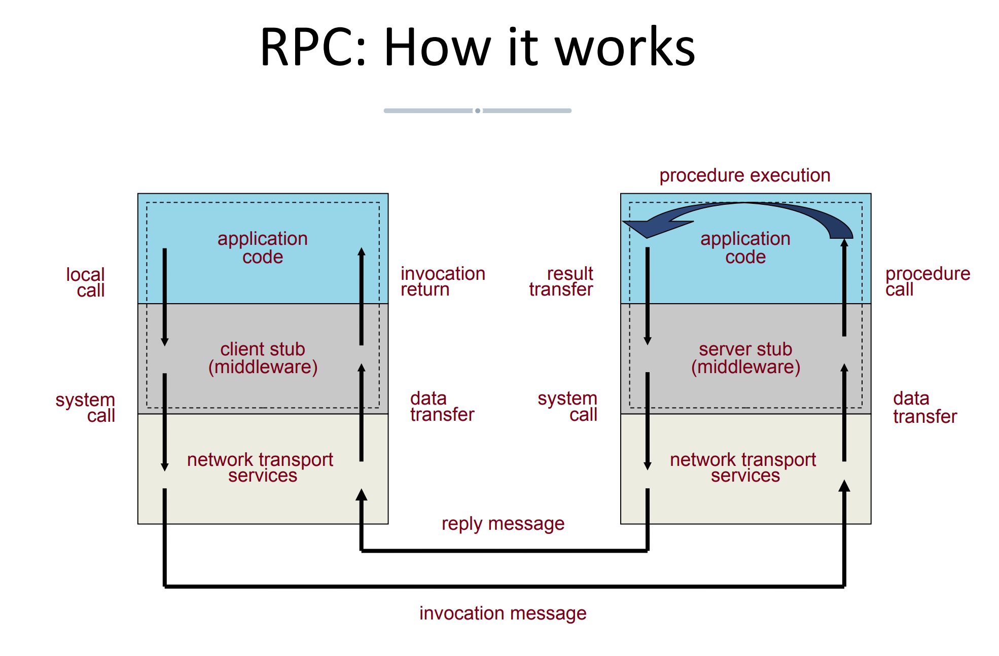
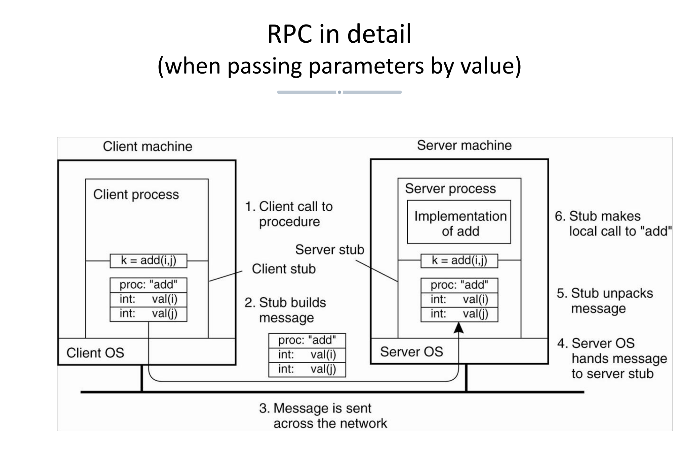
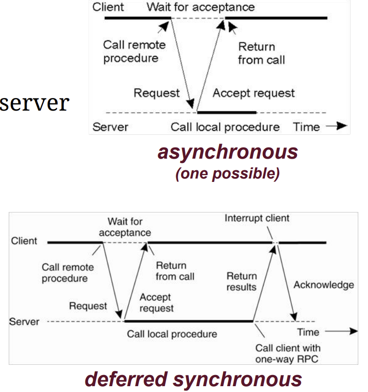
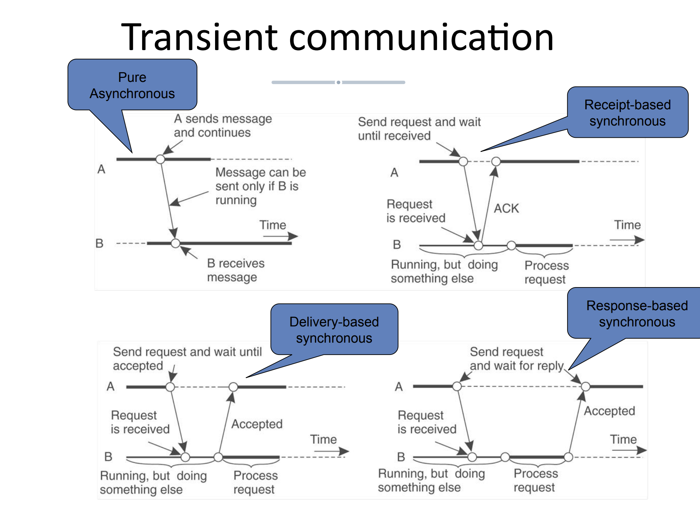

- [Some important word](#some-important-word)
- [RPC (Remote procedure call)](#rpc-remote-procedure-call)
  - [parameter passing: Marshalling(编组) and serialization](#parameter-passing-marshalling编组-and-serialization)
  - [passing parameter by reference is problematic in RPC](#passing-parameter-by-reference-is-problematic-in-rpc)
  - [binding the client to the server](#binding-the-client-to-the-server)
  - [dynamic activation](#dynamic-activation)
  - [lightweight RPC](#lightweight-rpc)
  - [asynchronous RPC](#asynchronous-rpc)
- [RMI (Remote method invocation)](#rmi-remote-method-invocation)
- [Message oriented communication](#message-oriented-communication)
  - [stream sockets](#stream-sockets)
  - [datagram sockets](#datagram-sockets)
  - [message queuing](#message-queuing)
- [publish-subscribe model](#publish-subscribe-model)

# Some important word

serialzation  
mashalling  
stub  
synchronous  
presistent  
transient  

# RPC (Remote procedure call)

## parameter passing: Marshalling(编组) and serialization

Two things need to do:

1. Serialization:
   - Structured data must be flattened in a byte stream
   - Called serialization
2. Marshalling
   - Hosts may use difference data repersentations, so the conversions are needed
   - Called marshalling

Middlware provide automated supported:
- The marshalling and serialization code is automatically generated from and becomes part of the stubs
- Enabled by Interface Definition Language (IDL)

## passing parameter by reference is problematic in RPC

Many languages do not provide a notion of reference, but only of pointer.  
But the problem a pointer is meaningful only within the address space of a process in a machine.  
RPC is runing in multiple machine, thus it is useless in RPC

## binding the client to the server

Two problems:
- Find out where the server process is
- Find out how to establish communication with it

The Sun's solution is introduce a daemon process (portmap) that binds call and servers/ports:
- The servers pick up an available port and tells it to portmap, along with the service identifier
- Clients contact a given portmap and request the port to establish communication

DCE's solution:  
Introduce a directory machine
- servers register service to directory machine.
- Client need not know in advance where the service is, they only need to know where the directory services is

## dynamic activation

Problem:  
server processes may remain active even in absence of requests, wasting resources

Solution:  
introduce another server daemon that:
- fork the process to server the request
- redirects the request if the process is already active
- but the first request is served less efficiently

## lightweight RPC

在本地不同进程中使用RPC这种形式交互

The problem is RPC would lead to wasted resources: no need for TCP/UDP on a single machine

So, Lighteweight RPC: message passing using local facilities
- communication through a private shared memory region (用共享内存通信)
  - Client stub copied the parameters on the shared stack and then performs a system call
  - kernel does a context switch, to excute the procedure in the server
  - results are copied to the stack and another system call + context switch brings execution back to client

Advantage:
  - uses less threads/processes (no need to listen on a channel)
  - only 1 parameter copy instead of 4 (2 * (stub -> kernel + kernel -> stub))

## asynchronous RPC

# RMI (Remote method invocation)

Shares many of core concepts and mechanisms with RPC

The important difference: remote object references can be passed around
- While passing objects by copy is hard since it requires passing around code (the methods)

# Message oriented communication

RPC/RMI:
- supports only point-to-point interaction
- synchronous communication is expensive

Message oriented communication: 
- centered around one-way message/event
- usually asychronous
- supporting presistent communication (消息持久化)
- supporting multi-point interaction

synchronous vs asychronous  

transient vs persistent
- transient: sender and receiver must both be running for the message to be delivered
- persistent: the message is stored in the communication system until is can be delivered

## stream sockets

Each socket is uniquely identified by 4 number: The IP address of the server, its incoming port, the IP address of the client, its outgoing port

## datagram sockets

- client and server both create a socket bound to a port and use it to send and receive datagram
- there is no connection and the same socket can used to send (receive) datagram to (from) multiple hosts

## message queuing

- point to point
- asynchronous communication
- decoupled in time and space

Problem:  
queues are identified by symbolic names
- need for a lookup service to convert queue-level addresses in network addresses
- often pre-deployed static topology/naming

# publish-subscribe model

