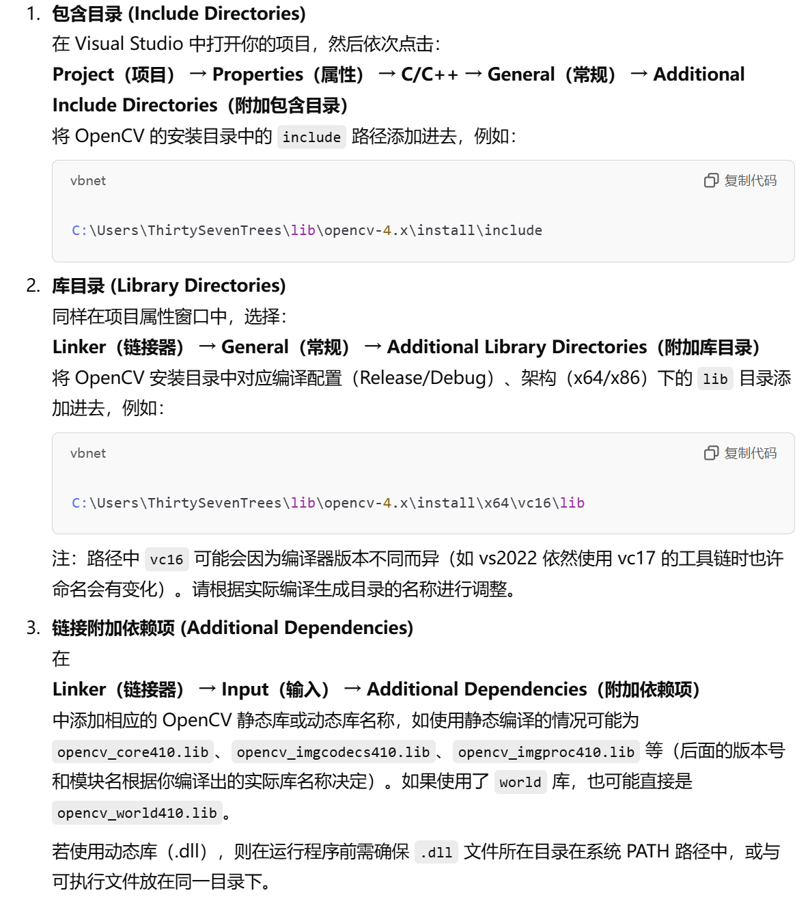

# 1. Opencv静态链接
1. 下载并构建静态库
在源码文件夹中创建`build`文件夹和`install`文件夹。
在`build`文件夹中输入：
```
cmake -DBUILD_SHARED_LIBS=OFF -DCMAKE_INSTALL_PREFIX="C:/Users/ThirtySevenTrees/lib/opencv-4.x/install" ..
# DBUILD_SHARED_LIBS=OFF用于设置生成静态库
```
构建好之后安装用于debug的库
```
cmake --build . --config Debug --target install
```
安装用于release的库
```
cmake --build . --config Release --target install
```
2. Visual studio配置
右键项目选择属性
更改对应设置  

