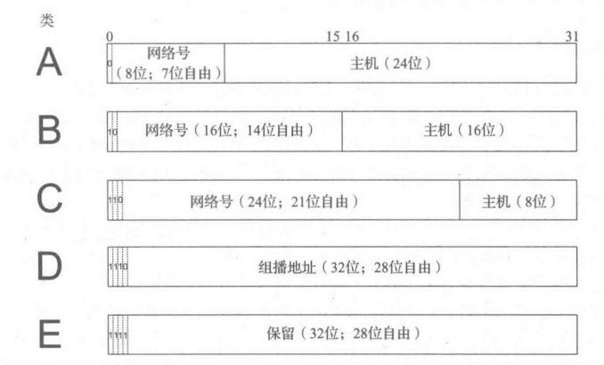
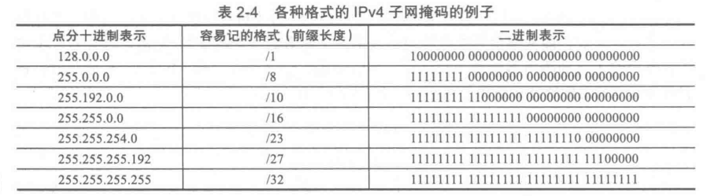
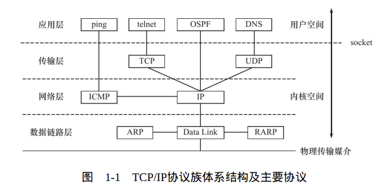
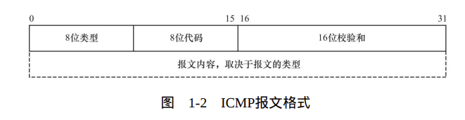
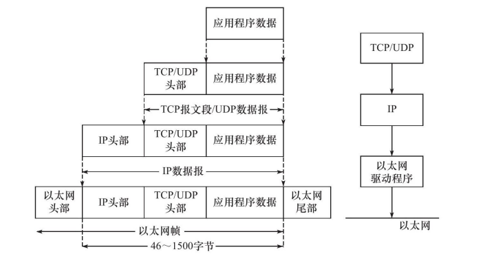
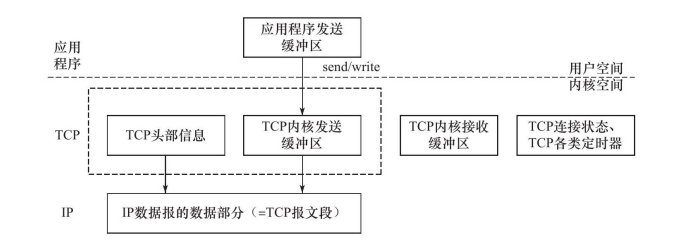
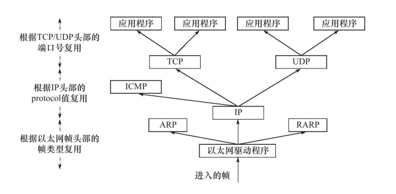

- [计网基础](#计网基础)
  - [IP地址](#ip地址)
    - [分类寻址](#分类寻址)
  - [子网掩码](#子网掩码)
- [1. TCP/IP协议](#1-tcpip协议)
  - [1.1 TCP/IP协议族体系结构以及主要协议](#11-tcpip协议族体系结构以及主要协议)
    - [1.1.1 数据链路层](#111-数据链路层)
    - [1.1.2 网络层](#112-网络层)
    - [1.1.3 传输层](#113-传输层)
    - [1.1.4 应用层](#114-应用层)
  - [1.2 封装](#12-封装)
  - [1.3 分用](#13-分用)

# 计网基础

## IP地址
### 分类寻址
 
A,B,C三类中前面的分类位和网络号是集中分配的，后面的主机位数是由站点决定的。  

## 子网掩码
通常用前缀长度表示（如/1，/8，/32...）表示前缀1的长度  
 
通过将IP地址与掩码使用按位与的操作来确定一个IP地址的网络/子网部分的结束和主机部分的开始。

# 1. TCP/IP协议
## 1.1 TCP/IP协议族体系结构以及主要协议
  

### 1.1.1 数据链路层
 TCP/IP协议族中设计链路层的目的是为IP模块发送和接收IP数据报。
     
 数据链路层两个常用的协议是ARP协议（Address Resolve
Protocol，地址解析协议）和RARP协议（Reverse Address Resolve
Protocol，逆地址解析协议）。它们实现了IP地址和机器物理地址（通
常是MAC地址，以太网、令牌环和802.11无线网络都使用MAC地址）
之间的相互转换。  

网络层使用IP地址寻址一台机器，而数据链路层使用物理地址寻
址一台机器，因此网络层必须先将目标机器的IP地址转化成其物理地
址，才能使用数据链路层提供的服务，这就是ARP协议的用途。

### 1.1.2 网络层

网络层实现数据包的选路和转发。WAN（Wide Area Network，广
域网）通常使用众多分级的路由器来连接分散的主机或LAN（Local
Area Network，局域网），因此，通信的两台主机一般不是直接相连
的，而是通过多个中间节点（路由器）连接的。网络层的任务就是选
择这些中间节点，以确定两台主机之间的通信路径。  
**1. IP协议**  
网络层最核心的协议是IP协议（Internet Protocol，因特网协议）。
IP协议根据数据包的目的IP地址来决定如何投递它。如果数据包不能直
接发送给目标主机，那么IP协议就为它寻找一个合适的下一跳（next
hop）路由器，并将数据包交付给该路由器来转发。多次重复这一过
程，数据包最终到达目标主机，或者由于发送失败而被丢弃。可见，
IP协议使用逐跳（hop by hop）的方式确定通信路径。  
**2.ICMP协议**  
网络层另外一个重要的协议是ICMP协议（Internet Control Message
Protocol，因特网控制报文协议）。它是IP协议的重要补充，主要用于
检测网络连接。
  
8位类型字段用于区分报文类型。它将ICMP报文分为两
大类：一类是差错报文，这类报文主要用来回应网络错误，比如目标
不可到达（类型值为3）和重定向（类型值为5）；另一类是查询报
文，这类报文用来查询网络信息，比如ping程序就是使用ICMP报文查
看目标是否可到达（类型值为8）的。（也就是说我们ping的时候使用的是ICMP协议）。  
工作原理  
1. 当你执行 `ping` 命令时，计算机会向目标主机发送 ICMP Echo Request（回显请求） 数据包。
2. 目标主机收到该请求后，会发送 ICMP Echo Reply（回显应答） 数据包作为响应。
3. 你的计算机接收到应答后，就能计算往返时间（RTT），并统计丢包率，从而判断网络连接情况。

### 1.1.3 传输层
传输层为两台主机上的应用程序提供端到端（end to end）的通
信。与网络层使用的逐跳通信方式不同，传输层只关心通信的起始端
和目的端，而不在乎数据包的中转过程。  

传输层协议主要有三个：TCP协议、UDP协议和SCTP协议。  

**1. TCP**  
TCP协议（Transmission Control Protocol，传输控制协议）为应用
层提供**可靠的、面向连接的和基于流（stream）的**服务。  

TCP协议使用**超时重传、数据确认**等方式来确保数据包被正确地发送至目的端，因此TCP服务是可靠的。  

使用TCP协议通信的双方必须先建立TCP连接，
并在内核中为该连接维持一些必要的数据结构，比如连接的状态、读
写缓冲区，以及诸多定时器等。当通信结束时，双方必须关闭连接以
释放这些内核数据。TCP服务是基于流的。基于流的数据没有边界（长
度）限制，它源源不断地从通信的一端流入另一端。发送端可以逐个
字节地向数据流中写入数据，接收端也可以逐个字节地将它们读出。

**2. UDP**  
UDP协议（User Datagram Protocol，用户数据报协议）则与TCP协
议完全相反，它为应用层提供不可靠、无连接和基于数据报的服
务。“**不可靠**”意味着UDP协议无法保证数据从发送端正确地传送到目
的端。如果数据在中途丢失，或者目的端通过数据校验发现数据错误
而将其丢弃，则UDP协议只是简单地通知应用程序发送失败。  

UDP协议是**无连接的**，即通信双方不保持一个长久的联系，因此
应用程序每次发送数据都要明确指定接收端的地址（IP地址等信
息）。

**基于数据报的服务**，是相对基于流的服务而言的。每个UDP数
据报都有一个长度，接收端必须以该长度为最小单位将其所有内容一
次性读出，否则数据将被截断。

### 1.1.4 应用层
应用层负责处理应用程序的逻辑。数据链路层、网络层和传输层
负责处理网络通信细节。应用层在用户空间实现。

## 1.2 封装
应用程序数据在发送到物理网络上之前，
将沿着协议栈从上往下依次传递。每层协议都将在上层数据的基础上
加上自己的头部信息（有时还包括尾部信息），以实现该层的功能，
这个过程就称为封装。  
  

经过TCP封装后的数据称为TCP报文段（TCP message segment），
或者简称TCP段。  

TCP协议为通信双方维持一个连接，并且
在内核中存储相关数据。这部分数据中的TCP头部信息和TCP内核缓冲
区（发送缓冲区或接收缓冲区）数据一起构成了TCP报文段。

 

当发送端应用程序使用send（或者write）函数向一个TCP连接写入
数据时，内核中的TCP模块首先把这些数据复制到与该连接对应的TCP
内核发送缓冲区中，然后TCP模块调用IP模块提供的服务，传递的参数
包括TCP头部信息和TCP发送缓冲区中的数据，即TCP报文段。  

经过UDP封装后的数据称为UDP数据报（UDP datagram）。UDP
对应用程序数据的封装与TCP类似。不同的是，UDP无须为应用层数据
保存副本，因为它提供的服务是不可靠的。`当一个UDP数据报被成功发送之后，UDP内核缓冲区中的该数据报就被丢弃了。`如果应用程序
检测到该数据报未能被接收端正确接收，并打算重发这个数据报，则
应用程序需要重新从用户空间将该数据报拷贝到UDP内核发送缓冲区
中。  

经过IP封装后的数据称为IP数据报（IP datagram）。IP数据报也包
括头部信息和数据部分，其中数据部分就是一个TCP报文段、UDP数据
报或者ICMP报文。  

经过数据链路层封装的数据称为**帧（frame）**。传输媒介不同，帧
的类型也不同。比如，以太网上传输的是以太网帧（ethernet frame），
而令牌环网络上传输的则是令牌环帧（token ring frame）。  

帧才是最终在物理网络上传送的字节序列。至此，封装过程完成。

## 1.3 分用

当帧到达目的主机时，将沿着协议栈自底向上依次传递。各层协
议依次处理帧中本层负责的头部数据，以获取所需的信息，并最终将
处理后的帧交给目标应用程序。这个过程称为分用
（demultiplexing）。

 