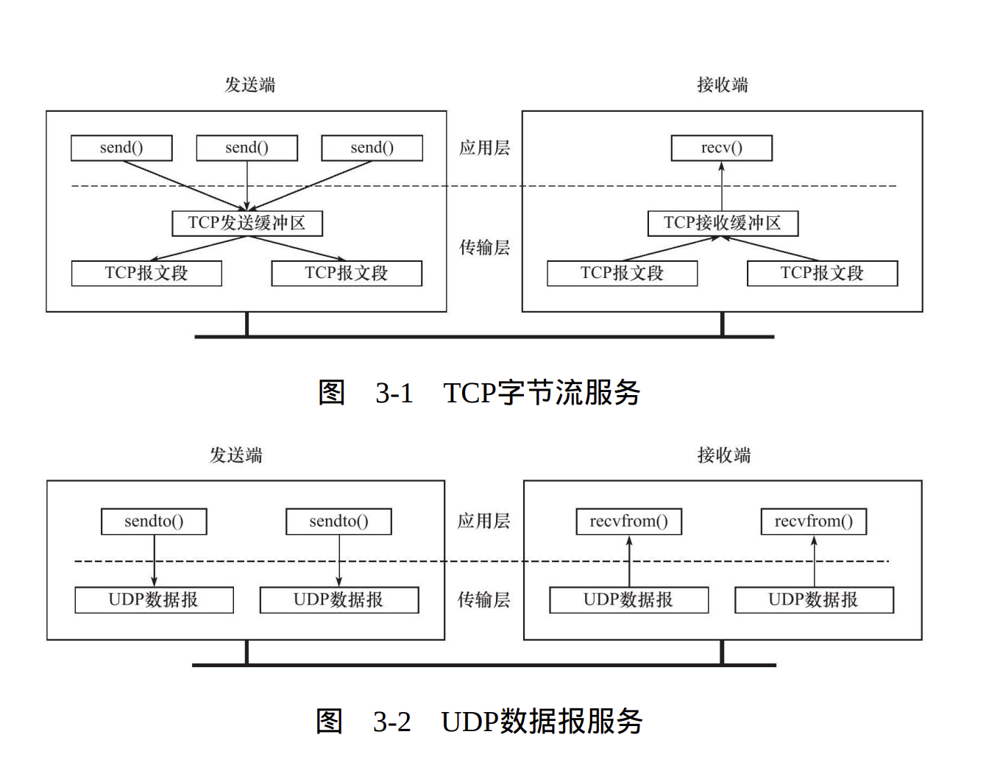

- [计网基础](#计网基础)
  - [IP地址](#ip地址)
    - [分类寻址](#分类寻址)
  - [子网掩码](#子网掩码)
- [1. TCP/IP协议](#1-tcpip协议)
  - [1.1 TCP/IP协议族体系结构以及主要协议](#11-tcpip协议族体系结构以及主要协议)
    - [1.1.1 数据链路层](#111-数据链路层)
    - [1.1.2 网络层](#112-网络层)
    - [1.1.3 传输层](#113-传输层)
    - [1.1.4 应用层](#114-应用层)
  - [1.2 封装](#12-封装)
  - [1.3 分用](#13-分用)
  - [1.4 ARP协议工作原理](#14-arp协议工作原理)
  - [1.5 DNS工作原理](#15-dns工作原理)
  - [1.6 stocket和TCP/IP协议族的关系](#16-stocket和tcpip协议族的关系)
  - [网络层与传输层的联系：IP 与 TCP 的转换](#网络层与传输层的联系ip-与-tcp-的转换)
    - [1. 传输层（TCP）向下交付数据到网络层（IP）](#1-传输层tcp向下交付数据到网络层ip)
      - [示例：数据封装过程](#示例数据封装过程)
    - [2. 网络层（IP）向上传递数据到传输层（TCP）](#2-网络层ip向上传递数据到传输层tcp)
      - [示例：数据解封装过程](#示例数据解封装过程)
    - [3. 总结：IP 和 TCP 的关系](#3-总结ip-和-tcp-的关系)
    - [4. 示例：TCP/IP 数据封装](#4-示例tcpip-数据封装)
    - [5. 结论](#5-结论)
- [2. IP协议详解](#2-ip协议详解)
  - [2.1 IP服务的特点](#21-ip服务的特点)
  - [2.2 IPv4头部地址](#22-ipv4头部地址)
  - [2.3 IP分片](#23-ip分片)
  - [2.4 IP路由](#24-ip路由)
    - [2.4.1 IP模块工作流程](#241-ip模块工作流程)
    - [2.4.2 路由表](#242-路由表)
  - [2.5IP转发](#25ip转发)
  - [2.6 重定向](#26-重定向)
    - [2.6.1 ICMP重定向报文](#261-icmp重定向报文)
- [3. TCP协议详解](#3-tcp协议详解)
  - [3.1 TCP服务的特点](#31-tcp服务的特点)
  - [3.2 TCP头部结构](#32-tcp头部结构)
    - [3.2.1 TCP固定头部结构](#321-tcp固定头部结构)
    - [3.2.2 TCP头部选项](#322-tcp头部选项)
  - [3.3 TCP连接的建立和关闭](#33-tcp连接的建立和关闭)
    - [3.3.1 连接实验](#331-连接实验)
    - [3.3.2 半关闭状态](#332-半关闭状态)
    - [3.3.3 连接超时](#333-连接超时)
  - [3.4 TCP状态转移](#34-tcp状态转移)
    - [3.4.1 TIME\_WAIT状态](#341-time_wait状态)
  - [3.5 复位报文段](#35-复位报文段)
    - [3.5.1 访问不存在的端口](#351-访问不存在的端口)
    - [3.5.2 异常终止连接](#352-异常终止连接)
    - [3.5.3 处理半打开连接](#353-处理半打开连接)
  - [3.6 TCP超时重传](#36-tcp超时重传)
  - [3.7 拥塞控制](#37-拥塞控制)
    - [3.7.1 慢启动和拥塞避免](#371-慢启动和拥塞避免)
    - [3.7.2 快速重传和快速恢复](#372-快速重传和快速恢复)
- [4. Linux网络编程基础API](#4-linux网络编程基础api)
  - [4.1 socket地址API](#41-socket地址api)
    - [4.1.1 主机字节序和网络字节序](#411-主机字节序和网络字节序)
    - [4.1.2 通用socket地址](#412-通用socket地址)
    - [4.1.3 专用socket地址](#413-专用socket地址)
    - [4.1.4 IP地址转换函数](#414-ip地址转换函数)
    - [4.1.5 errno](#415-errno)
  - [4.2 创建socket](#42-创建socket)
  - [4.3 命名socket](#43-命名socket)
  - [4.4 监听socket](#44-监听socket)
  - [4.5 接受连接](#45-接受连接)
  - [4.6 TCP半连接队列和全连接队列](#46-tcp半连接队列和全连接队列)
  - [4.7 发起连接](#47-发起连接)
  - [4.8 关闭连接](#48-关闭连接)

# 计网基础

## IP地址
### 分类寻址
   

A,B,C三类中前面的分类位和网络号是集中分配的，后面的主机位数是由站点决定的。  

## 子网掩码
通常用前缀长度表示（如/1，/8，/32...）表示前缀1的长度  
 

通过将IP地址与掩码使用按位与的操作来确定一个IP地址的网络/子网部分的结束和主机部分的开始。


# 1. TCP/IP协议
## 1.1 TCP/IP协议族体系结构以及主要协议
  

### 1.1.1 数据链路层
 TCP/IP协议族中设计链路层的目的是为IP模块发送和接收IP数据报。
     
 数据链路层两个常用的协议是ARP协议（Address Resolve
Protocol，地址解析协议）和RARP协议（Reverse Address Resolve
Protocol，逆地址解析协议）。它们实现了IP地址和机器物理地址（通
常是MAC地址，以太网、令牌环和802.11无线网络都使用MAC地址）
之间的相互转换。  

网络层使用IP地址寻址一台机器，而数据链路层使用物理地址寻
址一台机器，因此网络层必须先将目标机器的IP地址转化成其物理地
址，才能使用数据链路层提供的服务，这就是ARP协议的用途。

---

### 1.1.2 网络层

网络层实现数据包的选路和转发。WAN（Wide Area Network，广
域网）通常使用众多分级的路由器来连接分散的主机或LAN（Local
Area Network，局域网），因此，通信的两台主机一般不是直接相连
的，而是通过多个中间节点（路由器）连接的。网络层的任务就是选
择这些中间节点，以确定两台主机之间的通信路径。  
**1. IP协议**  
网络层最核心的协议是IP协议（Internet Protocol，因特网协议）。
IP协议根据数据包的目的IP地址来决定如何投递它。如果数据包不能直
接发送给目标主机，那么IP协议就为它寻找一个合适的下一跳（next
hop）路由器，并将数据包交付给该路由器来转发。多次重复这一过
程，数据包最终到达目标主机，或者由于发送失败而被丢弃。可见，
IP协议使用逐跳（hop by hop）的方式确定通信路径。  
**2.ICMP协议**  
网络层另外一个重要的协议是ICMP协议（Internet Control Message
Protocol，因特网控制报文协议）。它是IP协议的重要补充，主要用于
检测网络连接。

  

8位类型字段用于区分报文类型。它将ICMP报文分为两
大类：一类是差错报文，这类报文主要用来回应网络错误，比如目标
不可到达（类型值为3）和重定向（类型值为5）；另一类是查询报
文，这类报文用来查询网络信息，比如ping程序就是使用ICMP报文查
看目标是否可到达（类型值为8）的。（也就是说我们ping的时候使用的是ICMP协议）。  
工作原理  
1. 当你执行 `ping` 命令时，计算机会向目标主机发送 ICMP Echo Request（回显请求） 数据包。
2. 目标主机收到该请求后，会发送 ICMP Echo Reply（回显应答） 数据包作为响应。
3. 你的计算机接收到应答后，就能计算往返时间（RTT），并统计丢包率，从而判断网络连接情况。

---
### 1.1.3 传输层
传输层为两台主机上的应用程序提供端到端（end to end）的通
信。与网络层使用的逐跳通信方式不同，传输层只关心通信的起始端
和目的端，而不在乎数据包的中转过程。  

传输层协议主要有三个：TCP协议、UDP协议和SCTP协议。  

---
**1. TCP**  
TCP协议（Transmission Control Protocol，传输控制协议）为应用
层提供**可靠的、面向连接的和基于流（stream）的**服务。  

TCP协议使用**超时重传、数据确认**等方式来确保数据包被正确地发送至目的端，因此TCP服务是可靠的。  

使用TCP协议通信的双方必须先建立TCP连接，
并在内核中为该连接维持一些必要的数据结构，比如连接的状态、读
写缓冲区，以及诸多定时器等。当通信结束时，双方必须关闭连接以
释放这些内核数据。TCP服务是基于流的。基于流的数据没有边界（长
度）限制，它源源不断地从通信的一端流入另一端。发送端可以逐个
字节地向数据流中写入数据，接收端也可以逐个字节地将它们读出。

---
**2. UDP**  
UDP协议（User Datagram Protocol，用户数据报协议）则与TCP协
议完全相反，它为应用层提供不可靠、无连接和基于数据报的服
务。“**不可靠**”意味着UDP协议无法保证数据从发送端正确地传送到目
的端。如果数据在中途丢失，或者目的端通过数据校验发现数据错误
而将其丢弃，则UDP协议只是简单地通知应用程序发送失败。  

UDP协议是**无连接的**，即通信双方不保持一个长久的联系，因此
应用程序每次发送数据都要明确指定接收端的地址（IP地址等信
息）。

**基于数据报的服务**，是相对基于流的服务而言的。每个UDP数
据报都有一个长度，接收端必须以该长度为最小单位将其所有内容一
次性读出，否则数据将被截断。

---
### 1.1.4 应用层
应用层负责处理应用程序的逻辑。数据链路层、网络层和传输层
负责处理网络通信细节。应用层在用户空间实现。

---
## 1.2 封装
应用程序数据在发送到物理网络上之前，
将沿着协议栈从上往下依次传递。每层协议都将在上层数据的基础上
加上自己的头部信息（有时还包括尾部信息），以实现该层的功能，
这个过程就称为封装。  
  

经过TCP封装后的数据称为TCP报文段（TCP message segment），
或者简称TCP段。  

TCP协议为通信双方维持一个连接，并且
在内核中存储相关数据。这部分数据中的TCP头部信息和TCP内核缓冲
区（发送缓冲区或接收缓冲区）数据一起构成了TCP报文段。

 

当发送端应用程序使用send（或者write）函数向一个TCP连接写入
数据时，内核中的TCP模块首先把这些数据复制到与该连接对应的TCP
内核发送缓冲区中，然后TCP模块调用IP模块提供的服务，传递的参数
包括TCP头部信息和TCP发送缓冲区中的数据，即TCP报文段。  

经过UDP封装后的数据称为UDP数据报（UDP datagram）。UDP
对应用程序数据的封装与TCP类似。不同的是，UDP无须为应用层数据
保存副本，因为它提供的服务是不可靠的。`当一个UDP数据报被成功发送之后，UDP内核缓冲区中的该数据报就被丢弃了。`如果应用程序
检测到该数据报未能被接收端正确接收，并打算重发这个数据报，则
应用程序需要重新从用户空间将该数据报拷贝到UDP内核发送缓冲区
中。  

经过IP封装后的数据称为IP数据报（IP datagram）。IP数据报也包
括头部信息和数据部分，其中数据部分就是一个TCP报文段、UDP数据
报或者ICMP报文。  

经过数据链路层封装的数据称为**帧（frame）**。传输媒介不同，帧
的类型也不同。比如，以太网上传输的是以太网帧（ethernet frame），
而令牌环网络上传输的则是令牌环帧（token ring frame）。  

帧才是最终在物理网络上传送的字节序列。至此，封装过程完成。

## 1.3 分用

当帧到达目的主机时，将沿着协议栈自底向上依次传递。各层协
议依次处理帧中本层负责的头部数据，以获取所需的信息，并最终将
处理后的帧交给目标应用程序。这个过程称为分用
（demultiplexing）。

 

因为IP协议、ARP协议和RARP协议都使用帧传输数据，所以帧的
头部需要提供某个字段（具体情况取决于帧的类型）来区分它们。  

同样，因为ICMP协议、TCP协议和UDP协议都使用IP协议，所以
IP数据报的头部采用16位的协议（protocol）字段来区分它们。  

TCP报文段和UDP数据报则通过其头部中的16位的端口号（port
number）字段来区分上层应用程序。比如DNS协议对应的端口号是
53，HTTP协议（Hyper-Text Transfer Protocol，超文本传送协议）对应
的端口号是80。  

## 1.4 ARP协议工作原理

（Address Resolve
Protocol，地址解析协议）

ARP协议能实现任意网络层地址到任意物理地址的转换，其工作原理
是：主机向自己所在的网络广播一个ARP请求，该请求包含目标机器
的网络地址。此网络上的其他机器都将收到这个请求，但只有被请求
的目标机器会回应一个ARP应答，其中包含自己的物理地址。  

通常，ARP维护一个高速缓存，其中包含经常访问（比如网关地
址）或最近访问的机器的IP地址到物理地址的映射。这样就避免了重
复的ARP请求，提高了发送数据包的速度。

## 1.5 DNS工作原理
我们通常使用机器的域名来访问这台机器，而不直接使用其IP地
址，比如访问因特网上的各种网站。那么如何将机器的域名转换成IP
地址呢？这就需要使用域名查询服务。域名查询服务有很多种实现方
式，比如NIS（Network Information Service，网络信息服务）、DNS和
本地静态文件等。本节主要讨论DNS。  
  
DNS是一套分布式的域名服务系统。每个DNS服务器上都存放着
大量的机器名和IP地址的映射，并且是动态更新的。众多网络客户端
程序都使用DNS协议来向DNS服务器查询目标主机的IP地址。

## 1.6 stocket和TCP/IP协议族的关系

数据链路层、网络层、传输层协议是在内核中实现
的。因此操作系统需要实现一组系统调用，使得应用程序能够访问这
些协议提供的服务。实现这组系统调用的API（Application
Programming Interface，应用程序编程接口）主要有两套：socket和
XTI。XTI现在基本不再使用，本书仅讨论socket。  

## 网络层与传输层的联系：IP 与 TCP 的转换

### 1. 传输层（TCP）向下交付数据到网络层（IP）
当应用程序（如 Web 浏览器）需要传输数据时：

1. **应用层** 发送数据给 **传输层**，传输层使用 TCP 进行可靠传输。
2. **TCP** 将数据分段（Segment），并为每个数据段添加 **TCP 头部**，包括 **源端口、目的端口、序列号、校验和** 等信息。
3. **TCP 数据段** 传递到 **网络层（IP）**，IP 会为其添加 **IP 头部**，包含 **源 IP、目的 IP、协议字段**（用于指示上层协议，如 TCP 或 UDP）。

#### 示例：数据封装过程
```text
应用层数据 -> TCP 头 + 数据 -> IP 头 + TCP 头 + 数据 -> 发送到链路层
```
IP 头的 **协议字段（Protocol）** 指定传输层协议类型：
- TCP：协议号 **6**
- UDP：协议号 **17**

---

### 2. 网络层（IP）向上传递数据到传输层（TCP）
当数据包到达目的主机时：

1. **数据链路层（如以太网）** 接收到数据帧，解析出 **IP 数据包** 交给 **网络层（IP）**。
2. **IP 层** 解析 **IP 头部**，根据 **目标 IP 地址** 判断是否是本机的数据，并检查 **协议字段**（如果是 6，则交给 TCP）。
3. **传输层（TCP）** 解析 **TCP 头部**，根据 **目的端口号** 交付给对应的应用程序（如 HTTP 服务器）。
4. 如果 TCP 需要确认数据的完整性，它会使用 **校验和**，并可能需要 **重传丢失的分段**。

#### 示例：数据解封装过程
```text
链路层帧 -> IP 头 + TCP 头 + 数据 -> 检查 IP 头部 -> TCP 头 + 数据 -> 交给 TCP 处理
```

---

### 3. 总结：IP 和 TCP 的关系
- **TCP 依赖 IP**：TCP 通过 IP 提供的寻址和路由功能，在网络中传输数据。
- **IP 依赖 TCP 或 UDP**：IP 只是一个 **无连接的、不可靠的** 传输机制，它需要传输层（如 TCP）来提供 **可靠传输**。
- **协议封装/解封装**：数据在传输过程中，IP 头和 TCP 头会被 **不断封装和解封装**，确保数据能够正确到达目标应用。

---

### 4. 示例：TCP/IP 数据封装
假设 **应用层（HTTP）** 发送 `GET /index.html` 请求，数据封装过程如下：

```text
[应用层数据] (HTTP 请求)
↓
[传输层] (TCP 头 + HTTP 数据)  # 例如：源端口 50000，目的端口 80
↓
[网络层] (IP 头 + TCP 头 + HTTP 数据)  # 例如：源 IP 192.168.1.1，目的 IP 10.0.0.2
↓
[数据链路层] (MAC 头 + IP 头 + TCP 头 + HTTP 数据)  # 例如：以太网帧
```
当数据到达目标主机后，解封装顺序相反，最终 **TCP 头解析端口号，交给对应应用处理 HTTP 请求**。

---

### 5. 结论
- IP 负责 **寻址和路由**，但不保证数据可靠。
- TCP 依赖 IP 进行数据传输，并提供 **可靠传输机制**（如 **确认应答、超时重传**）。
- 通过 **协议字段**（Protocol）和 **端口号** 进行转换，保证不同协议之间的数据能够正确交付给目标应用。

---

# 2. IP协议详解

IP协议是TCP/IP协议族的核心协议，也是socket网络编程的基础之
一。本章从两个方面较为深入地探讨IP协议：

- IP头部信息。IP头部信息出现在每个IP数据报中，用于指定IP通
信的源端IP地址、目的端IP地址，指导IP分片和重组，以及指定部分
通信行为。

- IP数据报的路由和转发。IP数据报的路由和转发发生在除目标
机器之外的所有主机和路由器上。它们决定数据报是否应该转发以及
如何转发。

## 2.1 IP服务的特点

IP协议是TCP/IP协议族的动力，它为上层协议提供**无状态**、**无连接**、**不可靠**的服务。

- 无状态（stateless）是指IP通信双方不同步传输数据的状态信息，
因此所有IP数据报的发送、传输和接收都是相互独立、没有上下文关
系的。  
这种服务最大的缺点是无法处理乱序和重复的IP数据报。比如
发送端发送出的第N个IP数据报可能比第N+1个IP数据报后到达接收
端，而同一个IP数据报也可能经过不同的路径多次到达接收端。在这
两种情况下，接收端的IP模块无法检测到乱序和重复，因为这些IP数
据报之间没有任何上下文关系。接收端的IP模块只要收到了完整的IP
数据报（如果是IP分片的话，IP模块将先执行重组），就将其数据部
分（TCP报文段、UDP数据报或者ICMP报文）上交给上层协议。那么
从上层协议来看，这些数据就可能是乱序的、重复的。面向连接的协
议，比如TCP协议，则能够自己处理乱序的、重复的报文段，它递交
给上层协议的内容绝对是有序的、正确的。

- 无连接（connectionless）是指IP通信双方都不长久地维持对方的
任何信息。这样，上层协议每次发送数据的时候，都必须明确指定对
方的IP地址。

- 不可靠是指IP协议不能保证IP数据报准确地到达接收端，它只是
承诺尽最大努力（best effort）。很多种情况都能导致IP数据报发送失
败。比如，某个中转路由器发现IP数据报在网络上存活的时间太长
（根据IP数据报头部字段TTL判断，见后文），那么它将丢弃之，并
返回一个ICMP错误消息（超时错误）给发送端。  
无论哪种情况，发送
端的IP模块一旦检测到IP数据报发送失败，就通知上层协议发送失
败，而不会试图重传。因此，使用IP服务的上层协议（比如TCP协
议）需要自己实现数据确认、超时重传等机制以达到可靠传输的目
的。

## 2.2 IPv4头部地址


- 4位版本号（version）指定IP协议的版本。对IPv4来说，其值是4。
其他IPv4协议的扩展版本（如SIP协议和PIP协议），则具有不同的版本
号（它们的头部结构也和图2-1不同）。
<br>
<br>
- 4位头部长度（header length）标识该IP头部有多少个32 bit字（4字
节）。因为4位最大能表示15，所以IP头部最长是60字节。
<br>
<br>
- 8位服务类型（Type Of Service，TOS）包括一个3位的优先权字段
（现在已经被忽略），4位的TOS字段和1位保留字段（必须置0）。4位
的TOS字段分别表示：最小延时，最大吞吐量，最高可靠性和最小费
用。其中最多有一个能置为1，应用程序应该根据实际需要来设置它。
比如像ssh和telnet这样的登录程序需要的是最小延时的服务，而文件传
输程序ftp则需要最大吞吐量的服务。
<br>
<br>
- 16位总长度（total length）是指整个IP数据报的长度，以字节为单
位，因此IP数据报的最大长度为65 535（2
16-1）字节。但由于MTU的
限制，长度超过MTU的数据报都将被分片传输，所以实际传输的IP数
据报（或分片）的长度都远远没有达到最大值。(MTU是在链路层中帧的最大传输单元（见1.2）)
<br>
<br>
- 接下来的3个字段则描述了如何实现分片。（即图中第二行）
- 1. 16位标识（identification）唯一地标识主机发送的每一个数据报。
其初始值由系统随机生成；每发送一个数据报，其值就加1。该值在数
据报分片时被复制到每个分片中，因此同一个数据报的所有分片都具
有相同的标识值。
- 2. 3位标志字段的第一位保留。第二位（Don’t Fragment，DF）表
示“禁止分片”。如果设置了这个位，IP模块将不对数据报进行分片。在
这种情况下，如果IP数据报长度超过MTU的话，IP模块将丢弃该数据
报并返回一个ICMP差错报文。第三位（More Fragment，MF）表示“更
多分片”。除了数据报的最后一个分片外，其他分片都要把它置1。
- 3. 13位分片偏移（fragmentation offset）是分片相对原始IP数据报开
始处（仅指数据部分）的偏移。实际的偏移值是该值左移3位（乘8）
后得到的。由于这个原因，除了最后一个IP分片外，每个IP分片的数据
部分的长度必须是8的整数倍（这样才能保证后面的IP分片拥有一个合
适的偏移值）。
<br>
<br>
- 8位生存时间（Time To Live，TTL）是数据报到达目的地之前允许
经过的路由器跳数。TTL值被发送端设置（常见的值是64）。数据报在
转发过程中每经过一个路由，该值就被路由器减1。当TTL值减为0时，
路由器将丢弃数据报，并向源端发送一个ICMP差错报文。TTL值可以
防止数据报陷入路由循环。
<br>
<br>
- 8位协议（protocol）用来区分上层协议，我们在第1章讨论
过。/etc/protocols文件定义了所有上层协议对应的protocol字段的数值。
其中，ICMP是1，TCP是6，UDP是17。/etc/protocols文件是RFC 1700的
一个子集。
<br>
<br>
- 16位头部校验和（header checksum）由发送端填充，接收端对其
使用CRC算法以检验IP数据报头部（注意，仅检验头部）在传输过程
中是否损坏。
<br>
<br>
- 32位的源端IP地址和目的端IP地址用来标识数据报的发送端和接收
端。一般情况下，这两个地址在整个数据报的传递过程中保持不变，
而不论它中间经过多少个中转路由器。
<br>
<br>
- IPv4最后一个选项字段（option）是可变长的可选信息。这部分最
多包含40字节，因为IP头部最长是60字节（其中还包含前面讨论的20
字节的固定部分）。

## 2.3 IP分片
当IP数据报的长度超过帧的MTU时，它将被分片传
输。分片可能发生在发送端，也可能发生在中转路由器上，而且可能
在传输过程中被多次分片，但只有在最终的目标机器上，这些分片才
会被内核中的IP模块重新组装。

---
**注意：** 在IP网络中，分片可能发生在发送端，也可能发生在中转路由器，其主要原因在于 路径MTU（Path MTU, PMTU）可能在不同的链路上有所不同。具体而言：

1. 发送端并不一定知道完整的路径MTU：  
    - 在IPv4中，默认情况下，发送端不会主动探测整个路径上的最小MTU，而是根据本地接口的MTU来决定是否分片。
    - 但是，网络路径可能会经过多个不同的网络，每个网络的MTU可能不同。例如：
    发送端所在的本地网络可能支持 1500 字节（典型的以太网MTU）。
    但是中转路由器可能连接一个 MTU 只有 1400 字节的链路。
    由于IP数据报在传输时遵循“逐跳转发”（hop-by-hop forwarding），当数据报进入 MTU 更小的网络时，中转路由器必须对其进行分片。
    
2. 路径上的 MTU 可能动态变化：

    网络路径可能包含多种不同的链路技术（如以太网、PPP、无线网络等），它们的MTU各不相同。
    例如，一个数据报可能在 1500 字节 MTU 的链路上传输，但随后经过一个只有 576 字节 MTU 的链路，路由器必须分片，否则数据包无法通过。

3. IPv4 不强制要求 PMTU 发现机制：

    虽然 IPv4 支持 Path MTU Discovery (PMTUD) 机制（通过 ICMP “Fragmentation Needed” 消息通知发送端降低数据包大小），但许多网络会 丢弃 ICMP 消息（出于安全策略或防火墙配置），导致 PMTUD 不能可靠工作。
    由于发送端可能并不知道实际的路径MTU，因此只能基于本地MTU发送较大数据报，而在中转路由器上进行分片。

4. 某些情况下，发送端无法预见后续链路的 MTU 限制：  
   
    在 隧道（Tunneling） 环境下，数据包可能被封装，例如 VPN、GRE、IPsec 隧道等，这些封装会引入额外的头部，导致有效的MTU降低，进而引发分片。
---

IP头部中的如下三个字段给IP的分片和重组提供了足够的信息：数据报标识（16位）、标志（3位）和片偏移（13位）。一个IP数据报的每个分片都
- 有自己的IP头部，
- 它们具有相同的标识值，
- 但具有不同的片偏移。
- 并且除了最后一个分片外，其他分片都将设置MF标志。
- 此外，每个分片的IP头部的总长度字段将被设置为该分片的长度


图2-2中，长度为1501字节的IP数据报被拆分成两个IP分片，第一个IP分片长度为1500字节，第二个IP分片的长度为21字节。每个IP分片都包含IP头部（20字节），且第一个IP分片的IP头部设置了MF标志，而第二个IP分片的IP头部则没有设置该标志，因为它已经是最后一个分片了。  

原始IP数据报中的ICMP头部内容被完整地复制到了第一个IP分片中。`第二个IP分片不包含ICMP头部信息`，因为IP模块重组该ICMP报文的时候只需要一份ICMP头部信息，重复传送这个信息没有任何益处。  

最后，IP层传递给数据链路层的数据可能是一个完整的IP数据报，也可能是一个IP分片，它们统称为IP分组（packet）。

## 2.4 IP路由

IP协议的一个核心任务是数据报的路由，即决定发送数据报到目标机器的路径。为了理解IP路由过程，我们先简要分析IP模块的基本工作流程。

### 2.4.1 IP模块工作流程


**注意：** 在该图的IP模块基本工作流程中，数据报在进入 IP 模块后，首先会判断它是否是发往本机的。如果是发往本机的，则数据报会进入IP输入队列，然后交由上层协议（如 TCP、UDP）处理。但是，图中仍然存在一条指向“计算下一跳路由”的路径，这可能有以下几种情况导致数据继续转发：

1. 处理 IP 头部选项（IP 选项可能要求继续转发）
IP 头部可能包含一些特殊选项，例如：

- “宽松源路由”（Loose Source Routing）：指示数据包必须经过特定的一系列路由节点，但允许它经过其他节点。
- “严格源路由”（Strict Source Routing）：要求数据包严格按照指定的路径传输，而不能经过其他中间节点。
如果 IP 头部包含这些选项，则本机需要解析这些信息，并根据选项的要求可能将数据包继续转发到下一跳，而不是直接交给上层协议处理。

2. 数据包可能是 ICMP 重定向的目标
- 如果数据包是 ICMP 重定向（ICMP Redirect）类型的消息，本机可能需要按照新的路径转发数据，而不是直接处理它。
- 例如，主机在默认网关收到 ICMP 重定向后，可能会重新计算下一跳，而不是由本机终止数据包的处理。
3. 本机可能是某种网络设备（如路由器）
如果设备不仅仅是终端，而是充当路由器的角色，那么它既可以接收数据包，也可以转发某些数据包。例如：

- 某些数据包是发往本机，但本机是 NAT 网关，需要进行地址转换并将其转发到内部网络。
- 本机充当 代理（proxy）或网桥（bridge），可能会根据不同的协议要求对数据进行转发。
4. 隧道（Tunneling）机制
如果本机运行了一些 隧道协议（如 GRE、IPsec、6to4 等），数据包到达本机后，可能需要进行 解封装，然后将其继续转发到目的地，而不是直接交给本机的上层协议。

### 2.4.2 路由表
路由表是一张存储在路由器或主机上的数据表，它用于决定数据包的转发路径。当 IP 数据包到达设备时，设备会查询路由表，以确定应该将数据包转发到哪个下一跳（Next Hop）或直接交给本机处理。

|   **字段**	|   **描述**   |  
|--------------|---------------|
|目标网络（Destination）|	目标 IP 地址或子网，例如 192.168.1.0/24|
|子网掩码（Netmask）|	用于确定目标网络的范围，例如 255.255.255.0|
|下一跳（Next Hop）|	数据包应该被转发到的下一个路由器 IP，例如 192.168.1.1|
|出接口（Interface）|	发送数据包的网络接口，如 eth0 或 wlan0|
|度量值（Metric）|	该路由的优先级，数字越小表示优先级越高|

**路由表的查询过程**  

当设备收到一个数据包时，它会按照以下步骤查询路由表：

1. 匹配精确的目标地址
   - 例如，数据包目的地是 192.168.1.50，首先匹配 192.168.1.0/24 。
2. 查找最优匹配（最长前缀匹配，Longest Prefix Match, LPM）
   - 如果有多个匹配项，选择子网掩码最长的（即最具体的）。
3. 确定下一跳
   - 如果找到匹配路由，查找 Next Hop 并转发数据包。
4. 如果没有匹配，使用默认路由
   - 如果没有明确的匹配项，就使用默认路由（如果存在）。
5. 如果没有默认路由，则丢弃数据包
   - 设备可能返回 ICMP "Destination Unreachable" 错误。

## 2.5IP转发
前文提到，不是发送给本机的IP数据报将由数据报转发子模块来处理。路由器都能执行数据报的转发操作，而主机一般只发送和接收数据报，这是因为主机上/proc/sys/net/ipv4/ip_forward内核参数默认被设置为0。我们可以通过修改它来使能主机的数据报转发功能。  

对于允许IP数据报转发的系统（主机或路由器），数据报转发子模块将对期望转发的数据报执行如下操作：
1. 检查数据报头部的TTL值。如果TTL值已经是0，则丢弃该数据报。
2. 查看数据报头部的严格源路由选择选项。如果该选项被设置，则检测数据报的目标IP地址是否是本机的某个IP地址。如果不是，则发送一个ICMP源站选路失败报文给发送端。
3. 如果有必要，则给源端发送一个ICMP重定向报文，以告诉它一个更合理的下一跳路由器。
4. 将TTL值减1。
5. 处理IP头部选项。
6. 如有必要，则执行IP分片操作。

## 2.6 重定向

ICMP重定向报文也能用于更新路由表，因此本节我们简要讨论ICMP重定向。

### 2.6.1 ICMP重定向报文

  
<br>
ICMP重定向报文的类型值是5，代码字段有4个可选值，用来区分不同的重定向类型。本书仅讨论主机重定向，其代码
值为1。  
<br>
<br>
ICMP重定向报文的数据部分含义很明确，它给接收方提供了如下两个信息:

1. 引起重定向的IP数据报（即图中的原始IP数据报）的源端IP地址。
2. 应该使用的路由器IP地址。

接收主机根据这两个信息就可以断定引起重定向的IP数据报应该使用哪个路由器来转发，并且以此来更新路由表（通常是更新路由表缓冲，而不是直接更改路由表）。

# 3. TCP协议详解
本章从如下四方面来讨论TCP协议：
1. TCP头部信息。TCP头部信息出现在每个TCP报文段中，用于指定通信的源端端口号、目的端端口号，管理TCP连接，控制两个方向的数据流。
2. TCP状态转移过程。TCP连接的任意一端都是一个状态机。在TCP连接从建立到断开的整个过程中，连接两端的状态机将经历不同的状态变迁。
3. TCP数据流。通过分析TCP数据流，我们就可以从网络应用程序外部来了解应用层协议和通信双方交换的应用程序数据。这一部分将讨论两种类型的TCP数据流：交互数据流和成块数据流。TCP数据流中有一种特殊的数据，称为紧急数据，我们也将简单讨论之。
4. TCP数据流的控制。为了保证可靠传输和提高网络通信质量，内核需要对TCP数据流进行控制。这一部分讨论TCP数据流控制的两个方面：超时重传和拥塞控制。

## 3.1 TCP服务的特点
传输层协议主要有两个：TCP协议和UDP协议。TCP协议相对于UDP协议的特点是：面向连接、字节流和可靠传输。   
<br>
使用TCP协议通信的双方必须先建立连接，然后才能开始数据的读写。双方都必须为该连接分配必要的内核资源，以管理连接的状态和连接上数据的传输。TCP连接是全双工的，即双方的数据读写可以通过一个连接进行。完成数据交换之后，通信双方都必须断开连接以释放系统资源。  

TCP协议的这种连接是一对一的，所以基于广播和多播（目标是多个主机地址）的应用程序不能使用TCP服务。而无连接协议UDP则非常适合于广播和多播。  

我们在1.1节中简单介绍过字节流服务和数据报服务的区别。这种区别对应到实际编程中，则体现为通信双方是否必须执行相同次数的读、写操作（当然，这只是表现形式）。当发送端应用程序连续执行多次写操作时，TCP模块先将这些数据放入TCP发送缓冲区中。`当TCP模块真正开始发送数据时，发送缓冲区中这些等待发送的数据可能被封装成一个或多个TCP报文段发出。`因此，TCP模块发送出的TCP报文段的个数和应用程序执行的写操作次数之间没有固定的数量关系。  

当接收端收到一个或多个TCP报文段后，`TCP模块将它们携带的应用程序数据按照TCP报文段的序号（见后文）依次放入TCP接收缓冲区中`，并通知应用程序读取数据。`接收端应用程序可以一次性将TCP接收缓冲区中的数据全部读出，也可以分多次读取`，这取决于用户指定的应用程序读缓冲区的大小。因此，应用程序执行的读操作次数和TCP模块接收到的TCP报文段个数之间也没有固定的数量关系。

综上所述，发送端执行的写操作次数和接收端执行的读操作次数之间没有任何数量关系，这就是字节流的概念：应用程序对数据的发
送和接收是没有边界限制的。UDP则不然。发送端应用程序每执行一次写操作，UDP模块就将其封装成一个UDP数据报并发送之。接收端必须及时针对每一个UDP数据报执行读操作（通过recvfrom系统调用），否则就会丢包（这经常发生在较慢的服务器上）。并且，如果用户没有指定足够的应用程序缓冲区来读取UDP数据，则UDP数据将被截断。

  
  
TCP传输是可靠的。首先，TCP协议采用发送`应答机制`，即发送端发送的每个TCP报文段都必须得到接收方的应答，才认为这个TCP报文段传输成功。其次，TCP协议采用`超时重传机制`，发送端在发送出一个TCP报文段之后启动定时器，如果在定时时间内未收到应答，它将重发该报文段。最后，因为TCP报文段最终是以IP数据报发送的，而IP数据报到达接收端可能乱序、重复，所以TCP协议还会`对接收到的TCP报文段重排、整理，再交付给应用层`。  

## 3.2 TCP头部结构
TCP头部信息出现在每个TCP报文段中，用于指定通信的源端端口，目的端端口，管理TCP连接等，本节详细介绍TCP的头部结构，包
括固定头部结构和头部选项。  

### 3.2.1 TCP固定头部结构
  

1. 16位端口号(65536)（port number）：告知主机该报文段是来自哪里（源端口）以及传给哪个上层协议或应用程序（目的端口）的。进行TCP通
信时，客户端通常使用系统自动选择的临时端口号，而服务器则使用知名服务端口号。1.3节中提到过，所有知名服务使用的端口号都定义在/etc/services文件中。  

2. 32位序号（sequence number）：一次TCP通信（从TCP连接建立到断开）过程中某一个传输方向上的字节流的每个字节的编号。假设主
机A和主机B进行TCP通信，A发送给B的第一个TCP报文段中，序号值被系统初始化为某个随机值ISN（Initial Sequence Number，初始序号值）。那么在该传输方向上（从A到B），后续的TCP报文段中序号值将被系统设置成ISN加上该报文段所携带数据的第一个字节在整个字节流中的偏移。例如，某个TCP报文段传送的数据是字节流中的第1025～2048字节，那么该报文段的序号值就是ISN+1025。另外一个传输方向（从B到A）的TCP报文段的序号值也具有相同的含义。

3. 32位确认号（acknowledgement number）：用作对另一方发送来的TCP报文段的响应。其值是收到的TCP报文段的序号值加1。假设主机A和主机B进行TCP通信，那么A发送出的TCP报文段不仅携带自己的序号，而且包含对B发送来的TCP报文段的确认号。反之，B发送出的TCP报文段也同时携带自己的序号和对A发送来的报文段的确认号。

---
**TCP 32 位确认号（Acknowledgement Number）解析**
TCP（传输控制协议）是面向连接的协议，它通过序号（Sequence Number）和确认号（Acknowledgement Number） 来保证数据可靠传输。

1. 确认号（ACK Number）的定义
在 TCP 头部中，确认号字段（Acknowledgement Number）占 32 位，用于确认接收方已经成功接收的数据。

   - 确认号的值：表示期望收到的下一个字节的序列号。
   - 计算方式：如果主机 A 收到主机 B 发送的数据，数据的 最后一个字节的序列号 + 1 作为返回给 B 的确认号。
2. 确认号的工作机制
假设主机 A 和主机 B 进行 TCP 连接，A 发送数据，B 确认接收并回复：

- 第一步（A → B）：A 发送数据

  - A 发送：带有 Sequence Number = 1000，数据长度为 100 字节。
  - B 接收：成功接收后，计算 确认号 = 1000 + 100 = 1100。
- 第二步（B → A）：B 发送 ACK 确认

  - B 发送 ACK：Acknowledgement Number = 1100，告诉 A 之前的数据已经收到，期待下一个字节的序列号是 1100。
  - A 收到 B 的 ACK 后，知道数据成功传输。
---

4. 4位头部长度（header length）：标识该TCP头部有多少个32bit字（4字节）。因为4位最大能表示15，所以TCP头部最长是60字节。  

5. 6位标志位包含如下几项：

    | **标志位** | **缩写** | **作用** |
    |-----------|---------|---------|
    | 紧急指针 | **URG** | 表示数据有更高优先级，需要立即处理 |
    | 确认位 | **ACK** | 确认收到对方的数据，ACK=1 时确认号有效 |
    | 推送位 | **PSH** | 立即将数据交付给应用层，而不等待缓冲区填满 |
    | 复位位 | **RST** | 强制断开 TCP 连接，通常用于异常情况 |
    | 同步位 | **SYN** | 用于建立连接，三次握手时使用 |
    | 终止位 | **FIN** | 用于断开连接，四次挥手时使用 |

6. 16位窗口大小（window size）：是TCP流量控制的一个手段。这里说的窗口，指的是接收通告窗口（Receiver Window，RWND）。它告
诉对方本端的TCP接收缓冲区还能容纳多少字节的数据，这样对方就可以控制发送数据的速度。

7. 16位校验和（TCP checksum）：由发送端填充，接收端对TCP报文段执行CRC算法以检验TCP报文段在传输过程中是否损坏。注意，这
个校验不仅包括TCP头部，也包括数据部分。这也是TCP可靠传输的一个重要保障。

8. 16位紧急指针（urgent pointer）：是一个正的偏移量。它和序号字段的值相加表示最后一个紧急数据的下一字节的序号。因此，确切地
说，这个字段是紧急指针相对当前序号的偏移，不妨称之为紧急偏移。TCP的紧急指针是发送端向接收端发送紧急数据的方法。我们将在后面讨论TCP紧急数据。

### 3.2.2 TCP头部选项


选项的第一个字段kind说明选项的类型。有的TCP选项没有后面两个字段，仅包含1字节的kind字段。第二个字段length（如果有的话）指定该选项的总长度，该长度包括kind字段和length字段占据的2字节。第三个字段info（如果有的话）是选项的具体信息。常见的TCP选项有7种，如下图所示。


- kind=0是选项表结束选项。
- kind=1是空操作（nop）选项，没有特殊含义，一般用于将TCP选项的总长度填充为4字节的整数倍。
- kind=2是最大报文段长度选项。TCP连接初始化时，通信双方使用该选项来协商最大报文段长度（Max Segment Size，MSS）。TCP模块通常将MSS设置为（MTU-40）字节（减掉的这40字节包括20字节的TCP头部和20字节的IP头部）。这样携带TCP报文段的IP数据报的长度就不会超过MTU（假设TCP头部和IP头部都不包含选项字段，并且这也是一般情况），从而避免本机发生IP分片。对以太网而言，MSS值是1460（1500-40）字节。
- kind=3是窗口扩大因子选项。TCP连接初始化时，通信双方使用该选项来协商接收通告窗口的扩大因子。在TCP的头部中，接收通告窗口大小是用16位表示的，故最大为65 535字节，但实际上TCP模块允许的接收通告窗口大小远不止这个数（为了提高TCP通信的吞吐量）。窗口扩大因子解决了这个问题。假设TCP头部中的接收通告窗口大小是N，窗口扩大因子（移位数）是M，那么TCP报文段的实际接收通告窗口大小是N乘2M，或者说N左移M位。注意，M的取值范围是0～14.和MSS选项一样，窗口扩大因子选项只能出现在同步报文段中，否则将被忽略。

## 3.3 TCP连接的建立和关闭

  

### 3.3.1 连接实验
windows端使用ncat监听12345端口  
```
.\ncat.exe -lvp 12345
```
linux使用nc连接并监听来自windows的通信
```
sudo tcpdump -i eth0 -nt host 192.168.0.146
nc 192.168.0.146 12345
```
在linux上监听结果如下  
(注：172.23.197.6为linux地址，192.168.0.146为windows地址)
linux连接时（三次握手）
```
IP 172.23.197.6.49912 > 192.168.0.146.12345: Flags [S], seq 851791602, win 64240, options [mss 1460,sackOK,TS val 3774026442 ecr 0,nop,wscale 7], length 0
IP 192.168.0.146.12345 > 172.23.197.6.49912: Flags [S.], seq 1652858308, ack 851791603, win 65535, options [mss 65495,nop,wscale 8,sackOK,TS val 19426092 ecr 3774026442], length 0
IP 172.23.197.6.49912 > 192.168.0.146.12345: Flags [.], ack 1, win 502, options [nop,nop,TS val 3774026442 ecr 19426092], length 0
```
在linux输入hello并发送之后
```
IP 172.23.197.6.49912 > 192.168.0.146.12345: Flags [P.], seq 1:7, ack 1, win 502, options [nop,nop,TS val 3774347740 ecr 19426092], length 6
IP 192.168.0.146.12345 > 172.23.197.6.49912: Flags [.], ack 7, win 8195, options [nop,nop,TS val 19747389 ecr 3774347740], length 0
```
在windows上输入hi并发送之后
```
IP 192.168.0.146.12345 > 172.23.197.6.49912: Flags [P.], seq 1:4, ack 7, win 8195, options [nop,nop,TS val 19820653 ecr 3774347740], length 3
IP 172.23.197.6.49912 > 192.168.0.146.12345: Flags [.], ack 4, win 502, options [nop,nop,TS val 3774421004 ecr 19820653], length 0
```
在linux上`ctrl + c`断开连接之后（四次挥手）
```
IP 172.23.197.6.49912 > 192.168.0.146.12345: Flags [F.], seq 7, ack 4, win 502, options [nop,nop,TS val 3774468685 ecr 19820653], length 0
IP 192.168.0.146.12345 > 172.23.197.6.49912: Flags [.], ack 8, win 8195, options [nop,nop,TS val 19868335 ecr 3774468685], length 0
IP 192.168.0.146.12345 > 172.23.197.6.49912: Flags [F.], seq 4, ack 8, win 8195, options [nop,nop,TS val 19868335 ecr 3774468685], length 0
IP 172.23.197.6.49912 > 192.168.0.146.12345: Flags [.], ack 5, win 502, options [nop,nop,TS val 3774468685 ecr 19868335], length 0
```
---
1. 连接
- 连接建立时，第一个TCP报文段包含SYN标志，因此它是一个同步报文段(`Flags[S]`)，即客户端向服务器发起连接请求，该同步报文包含一个ISN值的序列号(`seq`)。  
- 第二个TCP报文段也是同步报文段，表示服务端同意与客户端建立连接。同时发送自己的ISN值的序列号，并对第一个同步报文段进行确认(`ack`)。  
- 第三个TCP报文是客户端对第二个同步报文段的确认。至此，TCP连接就建立起来了。建立TCP连接的这三个步骤就被称为TCP的三次握手。
2. 断开
- 第一个TCP报文包含`FIN`标志，因此它是一个结束报文段，即客户端要求关闭连接。
- 之后服务端向客户端发出报文段来确认服务端发出的结束报文段。
- 紧接着服务端发送自己的结束报文段。
- 最后客户端发送报文段给服务端以确认服务端的结束报文段  

注：实际上第二个仅用于确认的报文段是可以省略的，因为第三个服务端发出的结束报文段也携带了该确认信息。第二个报文段是否出现在连接断开的过程中，取决于TCP的`延迟确认特性`。

一般而言，TCP连接是由客户端发起，并通过三次握手建立（特殊情况是所谓同时打开）的。TCP连接的关闭过程相对复杂一些。可能是客户端执行主动关闭，比如前面的例子；也可能是服务器执行主动关闭，比如服务器程序被中断而强制关闭连接；还可能是同时关闭（和同时打开一样，非常少见）。

### 3.3.2 半关闭状态

TCP连接是全双工的，所以它允许两个方向的数据传输被独立关闭。换言之，通信的一端可以发送结束报文段给对方，告诉它本端已经完成了数据的发送，但允许继续接收来自对方的数据，直到对方也发送结束报文段以关闭连接。TCP连接的这种状态称为半关闭（half close）状态。

  

### 3.3.3 连接超时

如果客户端访问一个距离它很远的服务器，或者由于网络繁忙，导致服务器对于客户端发送出的同步报文段没有应答，此时客户端程序将产生什么样的行为呢？显然，对于提供可靠服务的TCP来说，它必然是先进行重连（可能执行多次），如果重连仍然无效，则通知应用程序连接超时。  

## 3.4 TCP状态转移

 

当客户端执行主动关闭时，它将向服务器发送一个结束报文段，同时连接进入FIN_WAIT_1状态。若此时客户端收到服务器专门用于确
认目的的确认报文段（比如图3-6中的TCP报文段5），则连接转移至FIN_WAIT_2状态。当客户端处于FIN_WAIT_2状态时，服务器处于CLOSE_WAIT状态，这一对状态是可能发生半关闭的状态。此时如果服务器也关闭连接（发送结束报文段），则客户端将给予确认并进入TIME_WAIT状态。

 

### 3.4.1 TIME_WAIT状态

从上图来看，客户端连接在收到服务器的结束报文段（TCP报文段6）之后，并没有直接进入CLOSED状态，而是转移到TIME_WAIT状态。在这个状态，客户端连接要`等待一段长为2MSL（MaximumSegment Life，报文段最大生存时间）的时间`，才能完全关闭。MSL是TCP报文段在网络中的最大生存时间，标准文档RFC 1122的建议值是2min。  

原因有两点：

1. 可靠地终止TCP连接。  
    假设图中用于确认服务器结束报文段6的TCP报文段7丢失，那么服务器将重发结束报文段。因此客户端需要停留在某个状态以处理重复收到的结束报文段（即向服务器发送确认报文段）。否则，客户端将以复位报文段来回应服务器，服务器则认为这是一个错误，因为它期望的是一个像TCP报文段7那样的确认报文段。

2. 保证让迟来的TCP报文段有足够的时间被识别并丢弃。

在Linux系统上，一个TCP端口不能被同时打开多次（两次及以上）。当一个TCP连接处于TIME_WAIT状态时，我们将无法立即使用该连接占用着的端口来建立一个新连接。

## 3.5 复位报文段

在某些特殊条件下，TCP连接的一端会向另一端发送携带RST标志的报文段，即复位报文段，以通知对方关闭连接或重新建立连接。本节讨论产生复位报文段的3种情况。

### 3.5.1 访问不存在的端口

当客户端程序访问一个不存在的端口时，目标主机将给它发送一个复位报文段。  
当客户端程序向服务器的某个端口发起连接，而该端口仍被处于TIME_WAIT状态的连接所占用时，客户端程序也将收到复位报文段。

### 3.5.2 异常终止连接

前面讨论的连接终止方式都是正常的终止方式：数据交换完成之后，一方给另一方发送结束报文段。TCP提供了异常终止一个连接的方法，即给对方发送一个复位报文段。一旦发送了复位报文段，发送端所有排队等待发送的数据都将被丢弃。应用程序可以使用socket选项SO_LINGER来发送复位报文段，以异常终止一个连接。

### 3.5.3 处理半打开连接

考虑下面的情况：服务器（或客户端）关闭或者异常终止了连接，而对方没有接收到结束报文段（比如发生了网络故障），此时，客户端（或服务器）还维持着原来的连接，而服务器（或客户端）即使重启，也已经没有该连接的任何信息了。我们将这种状态称为半打开状态，处于这种状态的连接称为半打开连接。如果客户端（或服务器）往处于半打开状态的连接写入数据，则对方将回应一个复位报文段。

## 3.6 TCP超时重传

异常网络状况下（开始出现超时或丢包），TCP如何控制数据传输以保证其承诺的可靠服务。  

TCP服务必须能够重传超时时间内未收到确认的TCP报文段。为此，TCP模块为每个TCP报文段都维护一个重传定时器，该定时器在TCP报文段第一次被发送时启动。如果超时时间内未收到接收方的应答，TCP模块将重传TCP报文段并重置定时器。至于下次重传的超时时间如何选择，以及最多执行多少次重传，就是TCP的重传策略。

## 3.7 拥塞控制

TCP模块还有一个重要的任务，就是提高网络利用率，降低丢包率，并保证网络资源对每条数据流的公平性。这就是所谓的拥塞控制。

TCP拥塞控制的标准文档是RFC 5681，其中详细介绍了拥塞控制的四个部分：慢启动（slow start）、拥塞避免（congestionavoidance）、快速重传（fast retransmit）和快速恢复（fastrecovery）。

拥塞控制的最终受控变量是发送端向网络一次连续写入（收到其中第一个数据的确认之前）的数据量，我们称为SWND（SendWindow，发送窗口）。

不过，发送端最终以TCP报文段来发送数据，所以SWND限定了发送端能连续发送的TCP报文段数量。这些TCP报文段的最大长度（仅指数据部分）称为SMSS（Sender Maximum Segment Size，发送者最大段大小），其值一般等于MSS。

发送端需要合理地选择SWND的大小。如果SWND太小，会引起明显的网络延迟；反之，如果SWND太大，则容易导致网络拥塞。前文提到，接收方可通过其接收通告窗口（RWND）来控制发送端的SWND。但这显然不够，所以发送端引入了一个称为拥塞窗口（Congestion Window，CWND）的状态变量。实际的SWND值是RWND和CWND中的较小者。  
 

---
### 3.7.1 慢启动和拥塞避免

TCP连接建立好之后，CWND将被设置成初始值IW（InitialWindow），其大小为2～4个SMSS。但新的Linux内核提高了该初始值，以减小传输滞后。此时发送端最多能发送IW字节的数据。此后发送端`每收到接收端的一个确认，其CWND就按下面式子增加`：
```
CWND += min(N, SMSS)
```
其中N是此次确认中包含的之前未被确认的字节数(也就是一次发送的数量)。这样一来，CWND将按照指数形式扩大，这就是所谓的慢启动。慢启动算法的理由是，TCP模块刚开始发送数据时并不知道网络的实际情况，需要用一种试探的方式平滑地增加CWND的大小。  

但是如果不施加其他手段，慢启动必然使得CWND很快膨胀（可见慢启动其实不慢）并最终导致网络拥塞。因此TCP拥塞控制中定义了另一个重要的状态变量：慢启动阈值（slow start threshold size，ssthresh）。当CWND的大小超过该值时，TCP拥塞控制将进入拥塞避免阶段。

拥塞避免算法使得CWND按照线性方式增加，从而减缓其扩大。RFC 5681中提到了如下两种实现方式：

- 每个RTT时间内（而不是每次收到ACK）按上面的式子计算新的CWND，不论该RTT时间内收到多少个ACK。
- 每收到一个对新数据的ACK，就按下式更新CWND。
  ```
  CWND += SMSS * SMSS / CWND
  ```
  **注：** 这个式子可以这样理解，当进入拥塞避免阶段时，假设CWMD = k * SMSS(意思是接收到ACK之前一次能发k条最大的TCP报文)，此时
  SMSS * SMSS / CWND = (1 / k) * SMSS, 也就是说CWND每次增长(1 / k) * SMSS，变成了线性增长。

   

---

以上我们讨论了发送端在未检测到拥塞时所采用的积极避免拥塞的方法。接下来介绍拥塞发生时（可能发生在慢启动阶段或者拥塞避免阶段）拥塞控制的行为。不过我们先要搞清楚发送端是如何判断拥塞已经发生的。发送端判断拥塞发生的依据有如下两个：
1. 传输超时，或者说TCP重传定时器溢出。
2. 接收到重复的确认报文段。

拥塞控制对这两种情况有不同的处理方式。对第一种情况仍然使用慢启动和拥塞避免。对第二种情况则使用快速重传和快速恢复（如果是真的发生拥塞的话）

如果发送端检测到的是第一种情况，则它将进行重传并重新设置ssthresh（慢启动阈值）：
```
ssthresh = max(FlightSize / 2, 2 * SMSS)
```
其中FlightSize是已经发送但未收到确认的字节数。

---
### 3.7.2 快速重传和快速恢复
发送端收到重复的ACK通常发生在以下几种情况：
1. 接收方收到乱序数据
   - 当接收端收到**超出期望序号**的数据包时，它会重传**上一次正确接收的ACK**，即发送重复的ACK。
   - 这通常由网络中的路径变化或分组重新排序导致，而不是数据丢失。
2. 某个数据包丢失
   - 当发送方的某个数据段丢失，但后续数据段成功到达接收方时，接收方会多次发送相同的ACK，以提示发送方该分片丢失。
   - 一般来说，TCP标准使用三次重复ACK（Triple Duplicate ACK）触发快速重传，而不必等待超时（Timeout）。

拥塞控制算法需要判断当收到重复的ACK时，网络是否真的发生了拥塞，或者说TCP报文段是否真的丢失了。具体做法是：发送端如果连续收到3个重复的确认报文段，就认为是拥塞发生了。然后它启用快速重传和快速恢复算法来处理拥塞，过程如下：
1. 当收到第三个重复的ACK时，按照上式计算ssthresh,然后立即重传丢失的报文段，并按照下式设置CWND
   ```
   CWND = ssthresh + 3 * SMSS
   ```
2. 每次收到1个重复的确认时，设置CWND=CWND+SMSS。此时发送端可以发送新的TCP报文段（如果新的CWND允许的话）。
3. 当收到新数据的确认时，设置CWND=ssthresh（ssthresh是新的慢启动门限值，由第一步计算得到）。
 

# 4. Linux网络编程基础API

我们将从如下3个方面讨论Linux网络API：

1. socket地址API。socket最开始的含义是一个IP地址和端口对（ip，port）。它唯一地表示了使用TCP通信的一端。本书称其为socket地址。
2. socket基础API。socket的主要API都定义在sys/socket.h头文件中，包括创建socket、命名socket、监听socket、接受连接、发起连接、读写数据、获取地址信息、检测带外标记，以及读取和设置socket选项。
3. 网络信息API。Linux提供了一套网络信息API，以实现主机名和IP地址之间的转换，以及服务名称和端口号之间的转换。这些API都定义在netdb.h头文件中，我们将讨论其中几个主要的函数。


## 4.1 socket地址API

### 4.1.1 主机字节序和网络字节序

现代CPU的累加器一次都能装载（至少）4字节（这里考虑32位机，下同），即一个整数。那么这4字节在内存中排列的顺序将影响它被累加器装载成的整数的值。这就是字节序问题。字节序分为大端字节序（big endian）和小端字节序（little endian）。大端字节序是指一个整数的高位字节（23～31 bit）存储在内存的低地址处，低位字节（0～7 bit）存储在内存的高地址处。小端字节序则是指整数的高位字节存储在内存的高地址处，而低位字节则存储在内存的低地址处。

- 大端字节序就是高位存在低地址位
- 小段字节序就是高位存在高地址位

现代PC大多采用小端字节序，因此小端字节序又被称为主机字节序。

当格式化的数据（比如32 bit整型数和16 bit短整型数）在两台使用不同字节序的主机之间直接传递时，接收端必然错误地解释之。解决问题的方法是：发送端总是把要发送的数据转化成大端字节序数据后再发送，而接收端知道对方传送过来的数据总是采用大端字节序，所以接收端可以根据自身采用的字节序决定是否对接收到的数据进行转换（小端机转换，大端机不转换）。因此大端字节序也称为网络字节序，它给所有接收数据的主机提供了一个正确解释收到的格式化数据的保证。

需要指出的是，即使是同一台机器上的两个进程（比如一个由C语言编写，另一个由JAVA编写）通信，也要考虑字节序的问题（JAVA虚拟机采用大端字节序）。

Linux提供了如下4个函数来完成主机字节序和网络字节序之间的转换：

```c
#include＜netinet/in.h＞
unsigned long int htonl(unsigned long int hostlong);
unsigned short int htons(unsigned short int hostshort);
unsigned long int ntohl(unsigned long int netlong);
unsigned short int ntohs(unsigned short int netshort);
```

这几个函数的命名很明确,`hton`和`ntoh`表示主机到网络（网络到主机），s和l表示使用的是`short`类型还是`long`类型。

### 4.1.2 通用socket地址

socket网络编程接口中表示socket地址的是结构体sockaddr，其定义如下：
```c
#include＜bits/socket.h＞
struct sockaddr
{
sa_family_t sa_family;
char sa_data[14];
}
```

`sa_family`成员是地址族类型（`sa_family_t`）的变量。地址族类型通常与协议族类型对应。常见的协议族（protocol family，也称domain，见后文）和对应的地址族如下表所示。

|协议族|地址族|描述|
|---------|-----------|------------|
|PF_UNIX|AF_UNIX|UNIX本地域协议族|
|PF_INET|AF_INET|TCP/IPv4协议族|
|PF_INET6|AF_INET6|TCP/IPv6协议族|

宏`PF_*`和`AF_*`都定义在`bits/socket.h`头文件中，且后者与前者有完全相同的值，所以二者通常混用。

`sa_data`成员用于存放`socket`地址值。但是，不同的协议族的地址值具有不同的含义和长度，如下表所示。
|协议族|地址值含义和长度|
|---------|-----------|
|PF_UNIX|文件的路径名，长度可达到108字节|
|PF_INET|16 bit端口号和32 bit IPv4地址，共6字节|
|PF_INET6|16 bit端口号，32 bit流标识，128 bit IPv6地址，32 bit范围ID，共26字节|

由上表可见，14字节的sa_data根本无法完全容纳多数协议族的地址值。因此，Linux定义了下面这个新的通用socket地址结构体：
```c
#include＜bits/socket.h＞
struct sockaddr_storage
{
sa_family_t sa_family;
unsigned long int__ss_align;
char__ss_padding[128-sizeof(__ss_align)];
}
```

这个结构体不仅提供了足够大的空间用于存放地址值，而且是内存对齐的（这是__ss_align成员的作用）。

### 4.1.3 专用socket地址

UNIX本地域协议族
```c
#include＜sys/un.h＞
struct sockaddr_un
{
sa_family_t sin_family;/*地址族：AF_UNIX*/
char sun_path[108];/*文件路径名*/
};
```

TCP/IP
```c
struct sockaddr_in
{
sa_family_t sin_family;/*地址族：AF_INET*/
u_int16_t sin_port;/*端口号，要用网络字节序表示*/
struct in_addr sin_addr;/*IPv4地址结构体，见下面*/
};
struct in_addr
{
u_int32_t s_addr;/*IPv4地址，要用网络字节序表示*/
};


struct sockaddr_in6
{
sa_family_t sin6_family;/*地址族：AF_INET6*/
u_int16_t sin6_port;/*端口号，要用网络字节序表示*/
u_int32_t sin6_flowinfo;/*流信息，应设置为0*/
struct in6_addr sin6_addr;/*IPv6地址结构体，见下面*/
u_int32_t sin6_scope_id;/*scope ID，尚处于实验阶段*/
};
struct in6_addr
{
unsigned char sa_addr[16];/*IPv6地址，要用网络字节序表示*/
};
```

所有专用socket地址（以及sockaddr_storage）类型的变量在实际使用时都需要转化为通用socket地址类型sockaddr（强制转换即可），因为所有socket编程接口使用的地址参数的类型都是sockaddr。

### 4.1.4 IP地址转换函数

通常，人们习惯用可读性好的字符串来表示IP地址，比如用点分十进制字符串表示IPv4地址，以及用十六进制字符串表示IPv6地址。但编程中我们需要先把它们转化为整数（二进制数）方能使用。而记录日志时则相反，我们要把整数表示的IP地址转化为可读的字符串。下面3个函数可用于用点分十进制字符串表示的IPv4地址和用网络字节序整数表示的IPv4地址之间的转换：

```c
#include＜arpa/inet.h＞
in_addr_t inet_addr(const char*strptr);
int inet_aton(const char*cp,struct in_addr*inp);
char* inet_ntoa(struct in_addr in);
```

inet_addr函数将用点分十进制字符串表示的IPv4地址转化为用网络字节序整数表示的IPv4地址。它失败时返回INADDR_NONE。

inet_aton函数完成和inet_addr同样的功能，但是将转化结果存储于参数inp指向的地址结构中。它成功时返回1，失败则返回0。

inet_ntoa函数将用网络字节序整数表示的IPv4地址转化为用点分十进制字符串表示的IPv4地址。但需要注意的是，该函数内部用一个静态变量存储转化结果，函数的返回值指向该静态内存，因此inet_ntoa是不可重入的。

例如下面例子：
```c
int main(){

    struct in_addr addr1, addr2;
    inet_aton("1.2.3.4", &addr1);
    inet_aton("10.194.71.60", &addr2);

    char* szValue1 = inet_ntoa(addr1);
    char* szValue2 = inet_ntoa(addr2);
    
    printf("address 1: %s\n", szValue1);
    printf("address 2: %s\n", szValue2);
    
    return 0;
}
```
输出为：
```
address 1: 10.194.71.60
address 2: 10.194.71.60
```

下面这对更新的函数也能完成和前面3个函数同样的功能，并且它们同时适用于IPv4地址和IPv6地址：
```c
#include＜arpa/inet.h＞
int inet_pton(int af,const char*src,void*dst);
const char*inet_ntop(int af,const void*src,char*dst,socklen_t cnt);
```
inet_pton函数将用字符串表示的IP地址src（用点分十进制字符串表示的IPv4地址或用十六进制字符串表示的IPv6地址）转换成用网络字节序整数表示的IP地址，并把转换结果存储于dst指向的内存中。其中，af参数指定地址族，可以是AF_INET或者AF_INET6。inet_pton成功时返回1，失败则返回0并设置error.

inet_ntop函数进行相反的转换，前三个参数的含义与inet_pton的参数相同，最后一个参数cnt指定目标存储单元的大小。下面的两个宏能帮助我们指定这个大小（分别用于IPv4和IPv6）：
```c
#include＜netinet/in.h＞
#define INET_ADDRSTRLEN 16
#define INET6_ADDRSTRLEN 46
```

### 4.1.5 errno
在`socket`编程中，`errno`是一个全局变量（在多线程环境下通常使用`pthread_errno`或`errno`线程局部变量），用于存储最近一次系统调用失败时的错误码。它主要用于错误处理，帮助开发者分析`socket`相关的错误。  
在 socket 编程中，当某些系统调用失败时，通常返回 -1，同时 errno 会被设置为具体的错误代码。


## 4.2 创建socket

UNIX/Linux的一个哲学是：所有东西都是文件。socket也不例外，它就是可读、可写、可控制、可关闭的文件描述符(`fd`)。下面的socket系统调用可创建一个socket：
```
#include＜sys/types.h＞
#include＜sys/socket.h＞
int socket(int domain, int type, int protocol);
```
domain参数告诉系统使用哪个底层协议族。对TCP/IP协议族而言，该参数应该设置为PF_INET（Protocol Family of Internet，用于IPv4）或PF_INET6（用于IPv6）；对于UNIX本地域协议族而言，该参数应该设置为PF_UNIX。关于socket系统调用支持的所有协议族，请读者自己参考其man手册。  

type参数指定服务类型。服务类型主要有`SOCK_STREAM`服务（流服务）和`SOCK_UGRAM`（数据报）服务。对TCP/IP协议族而言，其值取SOCK_STREAM表示传输层使用TCP协议，取SOCK_DGRAM表示传输层使用UDP协议。  

值得指出的是，自Linux内核版本2.6.17起，type参数可以接受上述服务类型与下面两个重要的标志相与的值(&)：`SOCK_NONBLOCK`和`SOCK_CLOEXEC`。它们分别表示将新创建的socket设为非阻塞的，以及用fork调用创建子进程时在子进程中关闭该socket。在内核版本2.6.17之前的Linux中，文件描述符的这两个属性都需要使用额外的系统调用（比如fcntl）来设置。  

protocol参数是在前两个参数构成的协议集合下，再选择一个具体的协议。不过这个值通常都是唯一的（前两个参数已经完全决定了它的值）。几乎在所有情况下，我们都应该把它设置为0，表示使用默认协议。  

socket系统调用成功时返回一个socket文件描述符(`sockfd`)，失败则返回-1并设置errno。

## 4.3 命名socket

创建socket时，我们给它指定了地址族，但是并未指定使用该地址族中的哪个具体socket地址。将一个socket与socket地址绑定称为给socket命名。
在服务器程序中，我们通常要命名socket，因为只有命名后客户端才能知道该如何连接它。客户端则通常不需要命名socket，而是采用匿名方式，即使用操作系统自动分配的socket地址。命名socket的系统调用是bind，其定义如下：
```c
#include<sys/types.h>
#include<sys/socket.h>
int bind(int sockfd, const struct sockaddr* my_addr, socklen_t addrlen);
```

bind将my_addr所指的socket地址分配给未命名的sockfd文件描述符，addrlen参数指出该socket地址的长度。

bind成功时返回0，失败则返回-1并设置errno。其中两种常见的errno是EACCES和EADDRINUSE，它们的含义分别是：

- EACCES，被绑定的地址是受保护的地址，仅超级用户能够访问。比如普通用户将socket绑定到知名服务端口（端口号为0～1023）上时，bind将返回EACCES错误。
- EADDRINUSE，被绑定的地址正在使用中。比如将socket绑定到一个处于TIME_WAIT状态的socket地址。

## 4.4 监听socket
socket被命名之后，还不能马上接受客户连接，我们需要使用如下系统调用来创建一个监听队列以存放待处理的客户连接：
```c
#include<sys/socket.h>
int listen(int sockfd, int backlog);
```
sockfd参数指定被监听的socket。backlog参数提示内核监听队列的最大长度。监听队列的长度如果超过backlog，服务器将不受理新的客户连接，客户端也将收到ECONNREFUSED错误信息。在内核版本2.2之前的Linux中，backlog参数是指所有处于半连接状态（SYN_RCVD）和完全连接状态（ESTABLISHED）的socket的上限。但自内核版本2.2之后，它只表示处于完全连接状态的socket的上限，处于半连接状态的socket的上限则由/proc/sys/net/ipv4/tcp_max_syn_backlog内核参数定义。backlog参数的典型值是5。  
listen成功时返回0，失败则返回-1并设置errno。  

## 4.5 接受连接
下面的系统调用从listen监听队列中接受一个连接：
```c
#include<sys/types.h>
#include<sys/socket.h>
int accept(int sockfd,struct sockaddr*addr,socklen_t*addrlen);
```

- sockfd参数是执行过listen系统调用的监听socket.
- addr参数用来接收连接的远程socket地址。
- 该socket地址的长度由addrlen指出。

accept成功时返回一个新的连接socket，该socket唯一地标识了被接受的这个连接，服务器可通过读写该socket来与被接受连接对应的客户端通信。accept失败时返回-1并设置errno。

现在考虑如下情况：如果监听队列中处于ESTABLISHED状态的连接对应的客户端出现网络异常（比如掉线），或者提前退出，那么服务器对这个连接执行的accept调用是否成功？

accept只是从监听队列中取出连接，而不论连接处于何种状态（如上面的ESTABLISHED状态和CLOSE_WAIT状态），更不关心任何网络状况的变化。

## 4.6 TCP半连接队列和全连接队列

在 TCP 三次握手的时候，Linux 内核会维护两个队列，分别是：

- 半连接队列，也称SYN队列。
- 全连接队列，也称accept队列。

服务端收到客户端发送的SYN请求后，**内核会把该链接储存到半连接队列**，并向客户端响应SYN + ACK,接着客户端会返回ACK,服务端收到三次握手的ACK后，**内核会把连接从半连接队列移除，然后创建新的完全连接，并将其添加到accept队列，等待进程调用accept函数时把连接取出来。
   

## 4.7 发起连接
如果说服务器通过listen调用来被动接受连接，那么客户端需要通过如下系统调用来主动与服务器建立连接：
```c
#include<sys/types.h>
#include<sys/socket.h>
int connect(int sockfd,const struct sockaddr*serv_addr,socklen_t addrlen);
```
sockfd参数由socket系统调用返回一个socket。serv_addr参数是服务器监听的socket地址，addrlen参数则指定这个地址的长度。

connect成功时返回0。一旦成功建立连接，sockfd就唯一地标识了这个连接，客户端就可以通过读写sockfd来与服务器通信。connect失败则返回-1并设置errno。其中两种常见的errno是ECONNREFUSED和ETIMEDOUT，它们的含义如下：

- ECONNREFUSED，目标端口不存在，连接被拒绝。
- ETIMEDOUT，连接超时。

## 4.8 关闭连接
关闭一个连接实际上就是关闭该连接对应的socket，这可以通过如下关闭普通文件描述符的系统调用来完成：
```c
#include<unistd.h>
int close(int fd)
```
fd参数是待关闭的socket。不过，close系统调用并非总是立即关闭一个连接，而是将fd的引用计数减1。只有当fd的引用计数为0时，才真正关闭连接。多进程程序中，一次fork系统调用默认将使父进程中打开的socket的引用计数加1，因此我们必须在父进程和子进程中都对该socket执行close调用才能将连接关闭。

如果无论如何都要立即终止连接（而不是将socket的引用计数减1），可以使用如下的shutdown系统调用（相对于close来说，它是专门为网络编程设计的）：
```c
#include<sys.socket.h>
int shutdown(int sockfd, int howto);
```
sockfd参数是待关闭的socket。howto参数决定了shutdown的行为:
- `SHUT_RD` 关闭sockfd上读的这一半，应用程序不能再针对socket文件描述符执行读操作，并且该socket接收缓冲区中的数据全部被丢弃。
- `SHUT_RW` 关闭sockfd上写的这一半，sockfd的发送缓冲区会在程序真正关闭连接的时候全部发送出去。这种情况下，连接处于半关闭状态（[3.3.2 半关闭状态](#332-半关闭状态)）。
- `SHUT_RDWR` 同时关闭sockfd上的读和写。

由此可见，shutdown能够分别关闭socket上的读或写，或者都关闭。而close在关闭连接时只能将socket上的读和写同时关闭。  
shutdown成功时返回0，失败则返回-1并设置errno。